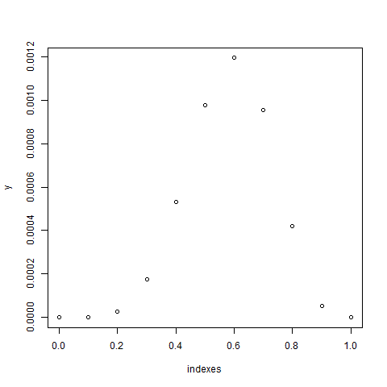

# Likehood function

[Go back](../index.md#estimators-and-likehood)

I do not know much about the likehood function aside
the fact that this is a function that we will maximize
to get the best value for $\hat{\theta}$. This function
is the **product of the density functions**.

<div>
\[
f_{\hat{\theta}}(x) = \begin{cases}
f_{\hat{\theta}}(x) & \text{if X is a continuous random variable} \\
P_{\hat{\theta}}(X=x) & \text{if X is a discrete random variable}
\end{cases}
\]
</div>

Then the likehood function is

<div>
\[
L(x, \hat{\theta}) = \prod f_{\hat{\theta}}(x)
\]
</div>

Explanation

* you are expecting $\hat{\theta}$ to be the parameters
of the distribution
* you got your values in the vector $x$
* you have to test the probabilities of each values
in the distribution generated by $\hat{\theta}$
* we are making the product since the variables
are i.i.d. <span class="tms">
(almost always the case, otherwise it's the usual
condition probabilities)
</span>

<hr class="sl">

## Bernoulli Likehood function

```r
n <- 10
p <- 0.7
# size=1 because we are working on Bernoulli
# and not binomial
x <- rbinom(n = n, size = 1, prob = p)

L_bern <- function(theta, x) {
  return(
    prod(
      dbinom(x = x, size = 1, prob = theta[1])
    )
  )
}

# we want for each probability, to see the
# likehood values
# our indexes are from 0.0 to 1.0
# and our y are the likehood values
y <- NULL
indexes <- seq(from = 0, to = 1, length = 11)
for (i in indexes){
  y <- c(y, L_bern(i, x))
}
# plot (you should add a title, ...)
plot(indexes, y)
```



For this sample, it seems that the value of the parameters
is $0.6$ or around $0.6$. The sample is small (n=10) so
we could have a lot of different results but if you
repeat the experience a lot of times on the same
sample, then it should converge to $0.7$.