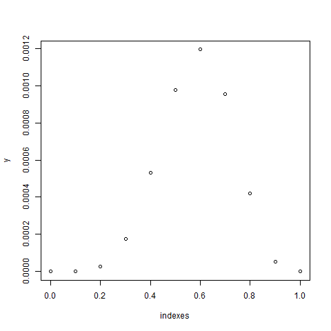

# Likelihood function

[Go back](../index.md#estimators-and-likelihood)

The likelihood function is a function that we will later maximize (MLE), to get the best value for $\hat{\theta}$ (our estimator). This function is the **product of the density functions**.

<div>
\[
f_{\hat{\theta}}(x) = \begin{cases}
f_{\hat{\theta}}(x) & \text{for a continuous random variable} \\
P_{\hat{\theta}}(X=x) & \text{for a discrete random variable}
\end{cases}
\]
</div>

Then the likelihood function is

<div>
\[
L(x, \hat{\theta}) = \prod_i^n f_{\hat{\theta}}(x_i)
\]
</div>

Explanation

* you are expecting $\hat{\theta}$ to be the parameters of the distribution
* you got your values in the vector $x$ (=your sample)
* for each value of $x$: $x_i$, you have to test the probability of having this value in the distribution generated by $\hat{\theta}$
* we are making the product of the probabilities, since the variables are i.i.d. <small>(almost always the case, otherwise it's the usual conditional probabilities)</small>

Another way of seeing the likelihood function is, a function that for each value, is checking how likely it is that, given $\hat\theta$, we have $X_i = x_i$.

<hr class="sr">

## Bernoulli Likelihood function

Let's say we got the sample $(1,0,1,1,0)$ from a Bernoulli distribution $B(p)$ with $p \in [0,1]$.

<div>
\[
L(x, p) = \prod_i^5 \mathbb{P}_p(X = x_i)
= \mathbb{P}_p(X = 1)^3 * \mathbb{P}_p(X = 0)^2
= p^3 * (1-p)^2
\]
</div>

<hr class="sl">

## Bernoulli Likelihood function in R

We are testing 11 values for $p$ since $p \in [0,1]$, and because it may help you understand what we are doing. We are evaluating $L(x, 0),\ ...,\ L(x, 1.0)$ for the generated sample $x$. Then, we are plotting the result.

```r
n <- 10
p <- 0.7 # you are not supposed to known the real value
# size=1 because we are working on Bernoulli
# and not binomial
x <- rbinom(n = n, size = 1, prob = p)

L_bern <- function(theta, x) {
  return(
    prod(
      dbinom(x = x, size = 1, prob = theta[1])
    )
  )
}

# we want for each probability, to see the likelihood values
# our indexes are from 0.0 to 1.0
# and our y are the likelihood values
y <- NULL
indexes <- seq(from = 0, to = 1, length = 11)
for (i in indexes){
  y <- c(y, L_bern(i, x))
}
# plot (you should add a title, ...)
plot(indexes, y)
```



For this sample, it seems that the value of the parameter is $0.6$ or around $0.6$. We are writing $\hat{\theta} = (0.6)$. The sample is small (n=10), so we could have a lot of different results but if you repeat the experience a lot of times on the same sample, then it should converge to $0.7$ (as this is the real value).