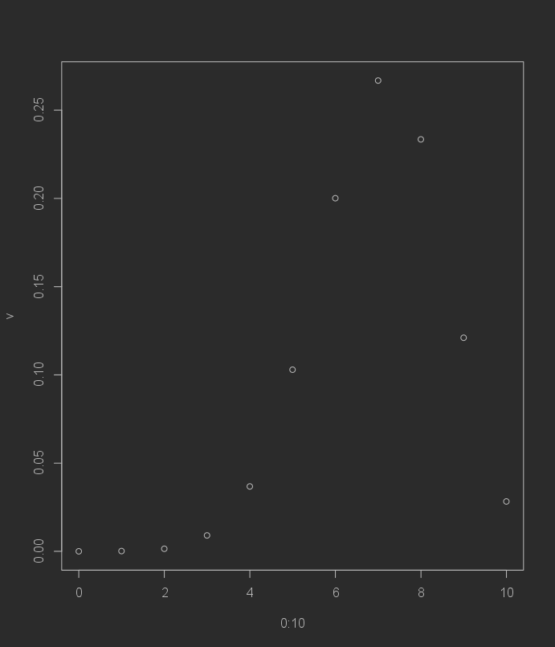

# Simple Example

[Go back](../index.md#tests)

Let's say we generated a sample, following
a Bernoulli distribution $B(0.7)$.

```r
m <- rbinom(n = 10, size = 1, prob = 0.7)
m
# [1] 1 0 1 1 1 0 1 1 0 1
```

<hr class="sl">

## Hypothesis

We are making the bilateral test

* $H_0: \mu = 0.7$
* $H_1: \mu \neq 0.7$

<hr class="sl">

## Looking after $W$

We are looking for the theoretical distribution
if the mean was $0.7$. Another way to put it would be
that we will look for

@
\forall_{k \in [0,n]} \quad P(X = k)
@

We are computing the theoretical values

```r
v <- NULL
for(k in 0:n)
  # we are adding to the vector v (the c() function)
  # the result of P(X = k)
  v <- c(v, choose(n, k) *  0.7^k * 0.3^(n-k))
# plot
plot(0:10, v)
```



We are picking $\alpha = 0.05$ so we must remove
here the $k$ for which the probability
is $\lt 0.05$.

```r
v
# [1] 0.0000059049 0.0001377810 0.0014467005 0.0090016920 0.0367569090
# [6] 0.1029193452 0.2001209490 0.2668279320 0.2334744405 0.1210608210
# [11] 0.0282475249

# which x are greater than 0.05?
# we started from 0 in 0:n so we remove 1
# because R indexes starts from 1 :)
which(v > 0.05) - 1
# [1] 5 6 7 8 9
```

The range the $W$ is $[5,9]$. We didn't look after
$T$ here and that's why for me it is a simple example.

<hr class="sl">

## Result

If the number of successes if within 
$[5,9]$ then at a significance level of $\alpha=0.05$,
we accept $H_0$ so the mean was $0.7$.

```r
# this is a trick to count the number of successes
# since we have 1 + 0 + 1 + ...
sum(m)
# [1] 7
```

Since $7 \in W$ then we accept $H_0$.