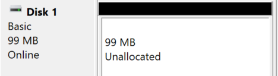

# ✨ Terminology ✨

**Security Groups**: they are used to group users, to apply permissions/GPO to everyone that is a member of this group. A user can be in multiple Groups.

➡️ Some existing groups: Domain Users, Authenticated Users...

**Organizational Units** (OUs): Like groups, you can apply permissions/GPO to an OU.

**Group Policy Objects (GPO)**: policies/rules that are applied on objects. We can use them to enable/disable some Windows features for some users, configure computers, enforce policies... 

➡️ More details in the [Permissions](#permissions) section.

➡️ Changes are distributed using a network share called SYSVOL (`C:\Windows\SYSVOL\sysvol\`). It may take time for the changes to be applied, but the update be forced with `gpupdate /force`.

## Get started

Installation DHCP (graphical)

* Start the **Server Manager**
* Click on "Add roles and features"
* Press Next twice
* In Server Roles, select DHCP Server
* Press Next twice, then Install
* Click on tools > DHCP

Configure your DHCP server

* IPV4 > New Scope
  * Name: Lan1
  * Select a range of addresses
  * You can prevent person from taking some addresses
  * Select a lock duration <small>(ex: 1 day)</small>
* We can reserve an IP address for a specific MAC address
* You can see attributed IPs in "Address leases"

➡️ Use `ipconfig /all` to get the IPv4/MAC address.

**Where to learn?**

* [Introduction to ADDS Structure in Windows Server 2012](https://www.youtube.com/watch?v=lFwek_OuYZ8)

## Main features

##### Manage OUs, Security Groups, and Users

**Add a home folder**

* Right-click on a user > properties
* Go to profile
* You could select a local path, or mount a network drive, for instance, `\\ServerName\\SomeFolder\\%username%`.
* The drive will be shown next to the "C:" drive

➡️ The advantage of using `%username%` is that you can edit multiple users, and the value will be replaced for each one.

Create Security groups

* Right-click on your domain
* New > Group

To add members, either 

* Right-click on the group, and select "Add to a group"
* Right-click on an object, select properties, go to "member of", and add your security group

##### Permissions

Configure permissions on a folder

* Right-click on a folder <small>(for instance, on a mounted drive available to users over the network)</small>
* Select properties then Security
* Edit
* Add or remove Security Groups, OUs, or Users. You can also define the permissions for each group.

➡️ We usually allow access to security group instead of users

Create Group Policy Objects

* Start the Server Manager
* Go to Tools > Group Policy Management
* Find the "Group Policy Object" folder
* Right-click on it > New and create a GPO

A GPO is applied to one or more OUs. It can be applied on the whole domain too. These are shown in "Scope > Location". 

* Drag-and-drop the GPO to the domain/an OU to add it inside location.
* You can add groups in security filtering to only apply the GPO to some group inside the selected locations

➡️ Policies are applied to OUs and nested OUs.

You can also exclude users/objects in the tab "Delegation".

* Click on "Advanced" and add an object to exclude
* Scroll down in the permission, and check "deny" for the line "Apply group policy"

Once created, you can edit the GPO to edit them.

* Right-click on a GPO > Edit
* Search for the setting you want to edit, and enable/disable/configure available rules

➡️ See specific sections or Google to find settings.

##### Configure a network drive

Configure shared folders

* Start the **Server Manager**
* Go to Tools > Computer Management > Disk Manager
* Select the drive, right-click on it, and ensure it's marked as online <small>(or right-click on "offline" and set it to online)</small>

* Right-click > Initialize Disk <small>(if there is no unallocated)</small>
* Right-click on "unallocated" and create a new volume. You can leave the name empty.

➡️ You can share the whole drive by Right-clicking on it > Properties > Sharing > Advanced Sharing, and enabling the sharing. The path that users will use will be shown below "Network Path" <small>(ex: \\\ServerName\DriveName)</small>.

➡️ You can share a folder on an online drive by Right-clicking on it > Properties > Sharing > Share. Add the groups such as `Domain Users` for everyone. The path that users will use will be shown below "Network Path" <small>(ex: \\\ServerName\FolderName)</small>.

Automatically mount a shared folder as a drive (GPO)

By default, a user need to browse a path like `\\ServerName\Path\\To\Folder\` to access some shared folder on a server. It's possible to create a virtual drive that will point to a shared folder using GPO.

* Start the **Server Manager**
* Go to Tools > Group Policy Management
* Right-click on a GPO > Edit <small>(you could create a GPO and apply it on the whole domain, you can filter rules later...)</small>

Go to User Configuration > Preferences > Windows Settings > Drive Maps. Here, you can map a drive to a folder, and only apply the rule to a group/... 

* Right-click > New > Drive Map
* In Location, add the network path, such as `\\ServerName\Data\Maketing\`
* Select a drive letter <small>(ex: M)</small>
* In the "common" tab, select "remove this item when its no longer applied" and select "item-level targeting". Click on "Targeting" and add the security group that will get access to this mapped drive <small>(ex: Marketing)</small>.

➡️ For conditions like "one of multiple groups", you can right-click on the second item, and in item options, select OR.

##### Configure SNMP

Notes to configure SNMP

* Start the **Server Manager**
* Click on "Add roles and features"
* Press Next thrice
* In Features, select SNMP Service

Once installed, open "Services" and find the SNMP service. Right-click on edit, and edit the properties however you want.

##### Configure TCP/IP parameters

Notes to configure TCP/IP parameters

You can either use the Windows Registry, or a group policy. Here are some parameters that you may want to set.

* SynAttackProtect <small>(SYN flood attacks)</small>
* EnableDeadGWDetect <small>(Detect dead gateways)</small>
* EnablePMTUdiscovery <small>(Avoid fragmentation...)</small>
* KeepAliveTime <small>(Timeout for inactive connections)</small>
* TCPMaxPortsExhausted <small>(Prevent from exhausting ports)</small>
* PerformRouterDiscovery <small>(Can simply the configuration but allow attackers to set up rogue routers/... to redirect traffic)</small>
* NoNameReleaseOnDemand <small>(Release the NetBios name when no longer needed to prevent attacker from obtaining information)</small>
* TcpMaxConnectResponseRetransmissions <small>(can help to prevent SYN flood attacks, but may exhaust system resources)</small>

##### Password and Encryption

Notes to set up a password policy

* Start the **Server Manager**
* Go to Tools > Group Policy Management
* Right-click on a GPO > Edit <small>(you could create a GPO and apply it on the whole domain...)</small>

Go to Computer configuration > Policies > Windows Settings > Security Settings > Account Policy.

There, you can enable history, set password length and age <small>(ex: 6 months)</small>, enable complexity requirements, lockout...

Configure BitLocker

**1)** The first part is installing BitLocker on the server:

* Start the Server Manager
* Click on "Add roles and features"
* Press Next thrice
* In Features, select BitLocker

**2)** Then we need to configure it:

* Go to Tools > Group Policy Management
* Right-click on a GPO > Edit <small>(you could create a GPO and apply it on the whole domain, or a GPO only for some OUs...)</small>
* Navigate to "Computer Configuration" > "Policies" > "Administrative Templates" > "Windows Components" > "BitLocker Drive Encryption" 
* ~~Enable the "Turn on BitLocker"~~
* Go Navigate to "Operating system drives"
* Enable the "Require additional authentication at startup"
  * Select "Allow BitLocker without a compatible TPM"
  * Select "Do not allow startup PIN with TPM"
* Enable "Choose how BitLocker-protected operating system drives can be recovered"
  * Select the "Save BitLocker recovery information to AD DS for operating system drives"
* Navigate back to parent
* ~~Configure "Choose drive encryption method and cipher strength" <small>(encryption method, cipher strength...)</small>~~

**3)** On the Windows 10, you need to use a local administrator account, refer to the "Get started" section if needed.

* Open a powershell/CMD as an administrator
* Enter "gpedit.msc"
* Navigate to "Computer Configuration" > "Administrative Templates" > "Windows Components" > "BitLocker Drive Encryption"
* ...
* Restart

Then, right-click on the drive to encrypt, select "Bitlocker", and encrypt it. If prompted for a password when starting the workstation, then something went wrong in your configuration.

## 👻 To-do 👻

Stuff that I found, but never read/used yet.

* Windows Admin Center
* SConfig <small>(relies on PowerShell to manage ADDS)</small>
* Tools (in the top-right corner)
* Azure AD cloud Sync
* GPO (Priority/Unit order)
* Network Unlock
* OU delegate control
* [Security Principals](https://learn.microsoft.com/en-us/windows-server/identity/ad-ds/manage/understand-security-principals)
* IPAM
* SSPR
* Hardening AD ([ref](https://blog.netwrix.fr/2019/05/06/securiser-votre-annuaire-ad-contre-les-attaques-de-malware/))

* [rdr-it.com](https://rdr-it.com/active-directory/)
* [microsoft](https://learn.microsoft.com/en-us/windows-server/identity/ad-ds/active-directory-domain-services)
* [activedirectorypro](https://activedirectorypro.com/blog/)

Notes Kerberos

This is the authentication system in Windows domains, replacing NetNTLM. Users will log in to the Kerberos service and receive a ticket called **Ticket Granting Ticket (TGT)**. They will use this ticket when requesting access to a share/database/... If the request is accepted, Kerberos will give them a **Ticket Granting Service (TGS)** allowing them to access the service. Then, they will use the TGS to log in to the service. No credentials are sent over the network.

Notes about trees and trust

Can create a sub-domain for another place with different policies/...
Subdomain, they inherit the schema. two-way implicit transitive (trust other subdomains) trust.
**Tree**. one way explicit trust (from B to A). Then B is able to use users from A, and give them permissions to access their tree.

