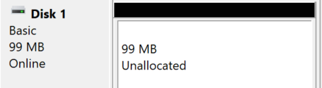

# Active Directory (AD)

Active directory is a centralized database of every network resources:

* 🖥️ Computers, Servers, Printers
* 🧑‍🍼️ Users and Groups
* 🚧️ Permissions to access files/apps/...
* ⚖️️ Policies <small>(ex: password length/...)</small>
* 🏡 Shared folders/drives
* ...

It provides services to manage and authenticate these resources. It's a centralized and highly scalable tool that is used by many large organizations <small>(with many employees, multiple offices/sites...)</small>.

➡️ LDAP is a protocol used to communicate with Active Directory.

**Active Directory Domain Services (ADDS)** is the main service that system admins will interact with. 📌 Because of that, Active directory and ADDS are often used interchangeably.

It's widely used to manage organisation/schools/... They can configure for each user, or groups of users

* 🎯 What files/folders/shared they can access
* 🏡 Which application they can launch
* ...
* 🌿 Basically, their permissions over every resource

🎉 For users, it's convenient, as they log in once, and from any machine over the network and access their files/...

## Forest and domains

A **schema** 🪨 is a definition on an entity, such as a user. It defines its attributes such as `"Firstname"`, `"Lastname"`... A schema can be extended, meaning, we can add new attributes.

An **Object** 💰 is a concrete instance of a schema. For instance, the user "John Doe", the computer "PC-B2006-06", or the printer XXX...

A **domain** 🧵 is a logical group of objects... For instance, the domains `example.com`, `eu.example.com`, and `na.example.com`... `eu` and `na` are subdomains of `example.com`. The tree is called **domain tree** 🕸️.

👉 You should own the domain name to avoid merging problems.

There is at least one **Domain controller** 👑 (DC) on each domain. It's used to manage objects on the domain. They all have their own database to store information about their objects.

A **site** 🏘️ is a group of objects that are physically located in the same place, such as a branch office. We usually have one DC per site, which can mean multiple DC for one domain. The DC is replicated, and this allows faster response time, and reduce network traffic.

A **forest** 🌴  is a collection of one or more domain trees. They share a common schema, along configurations, and global catalogs.

A **global catalog** 📰 stores a copy of the most used attributes of every object, allowing us to search for object across the whole forest.

## Getting started

If starting from scratch, you will create a forest 🌴, with only one domain inside 🧵, for instance, `example.com`. To do so, you will need a computer that will serve as a domain controller 👑.

You will install on this computer **Windows Server** 2019/2022/... As a student, you can get an image for free [on azure website](https://azureforeducation.microsoft.com/devtools).

➡️ If you're using Virtual Box, [see these notes](/tools-and-frameworks/others/virtualization/virtualbox/index.md#active-directory-notes).

After installing the ISO, when starting the machine, the **Server Manager** will automatically open itself. From there, you will be able to install **ADDS** and many other services/tools 📌.

**Where to learn?**

* [Introduction to ADDS Structure in Windows Server 2012](https://www.youtube.com/watch?v=lFwek_OuYZ8)

Before installing ADDS, you should:

Freeze and configure your server IP address

👉 This is a best practice to give a fixed IP address to your domain controller before installing ADDS.

* Control Panel
* Network and Internet
* Network And Sharing Center
* Select your network <small>(ex: Ethernet 2)</small>
* Properties > IPV4 > Properties
    * IP: X.X.X.2
    * Mask: 255.255.255.0
    * Default gateway: X.X.X.1
    * DNS: X.X.X.2

Set your DC name

👉 This is optional too. The DC name can be used to referencing in commands. For instance, you will be able to use the name instead of the IP address.

* Click on "Local Server"
* Click on your computer name (in blue)
* Click on "Change"
* Set the name your want
* Restart

Then, you can process with the installation:

Installation ADDS

* Start the **Server Manager**
* Click on "Add roles and features"
* Press Next twice
* In Server Roles, select ADDS
* Press Next twice, then Install
* Click on the notification icon with a warning (⚠️)
* Click on "Promote this server to a domain controller"

**Select "Add a new forest"** <small>(for your first domain controller/...)</small>

* Give a root domain name (ex: `example.com`)
* Add a "restore password"
* Press "Next" 4 times
* Press "Install"
* Done

**Select "Add a new domain to an existing forest"** <small>(to add a subdomain to an existing forest)</small>

* Click on "Select"
* Enter the `domain\username` of the parent domain. For instance, `example.com\administrator`. Select `example.com`.
* In the "New domain name", you could add `eu`.
* Process with the setup of `eu.example.com`

Installation and configuration of DHCP

One of the first thing you may do is to configure the DHCP server. When computers will connect to active directory, they will be assigned an IP. You can define here the rules to assign IPs. 🌍

* Start the **Server Manager**
* Click on "Add roles and features"
* Press Next twice
* In Server Roles, select DHCP Server
* Press Next twice, then Install
* Click on tools > DHCP

Configure your DHCP server

* IPV4 > New Scope
  * Name: Lan1
  * Select a range of addresses
  * You can prevent person from taking some addresses
  * Select a lock duration <small>(ex: 1 day)</small>
* We can reserve an IP address for a specific MAC address
* You can see attributed IPs in "Address leases"

➡️ Use `ipconfig /all` to get the IPv4/MAC address.

## Manage users and computers

*From the users and computers tool, you can right-click on your domain, then "change domain" to manager a subdomain.*

We use **Organizational Units (OUs)** 📂 to sort the great number of objects within a domain: users, computers, printers, security groups...

They are basically folders. You could have one OU per 

* 🌍 **site**: Paris, New-York, Montreal...
* 🏢 **business unit**: Direction, Marketing, IT...
* ...

🔥 For instance, inside an OU called Paris, you could have OUs for each business unit. You could also do it the other way around too.

📂 Create an OU

* Start the **Server Manager**
* Go to Tools > Active Directory Users and Computers
* Right-click on your domain
* New > Organizational Unit
* Give it a name

📠Delete an OU

* Start the **Server Manager**
* Go to Tools > Active Directory Users and Computers
* Click on View > Advanced features
* Right-click on your OU
* Go to Properties > Object
* Unselect "Protect object from accidental deletion"
* Apply, then close
* Right-click on your OU, and click on delete

Add an user

* Start the **Server Manager**
* Go to Tools > Active Directory Users and Computers
* Right-click on your domain
* New > User
* You must at least fill the "Full name" and the "logon" fields
* Add a password that matches your password policy

Add a workstation

* Start the Workstation
* Go to "Advanced System Settings"
* Switch to the "Computer name" tab
* Click on "Network ID" and follow the steps

➡️ The local computer account that will be created cannot be used by users. The username is `PC_NAME_HERE$` and the password is a randomly generated string of 120 characters.

Once the workstation was added to active directory, you will be able to connect to users account created in active directory. To connect to a specific domain, use `domain\username` such as `example.com\username`.

👉 You can also use `username@domain` or the NetBios name instead of the domain giving us "`example\username`" <small>(set during the ADDS setup)</small>.

Add a Local Administrator to a Workstation

It's a good practice to create a local administrator account in case there are issues with Active Directory or the network, and there is a need to access the computer to fix the problem.

1. Login using an Administrator account
2. Navigate to "Settings" > "Accounts" > "Other users"
3. Click on "Add someone else to this PC"
4. Select "I don't have this person's sign-in information"
5. Select "Add a user without a Microsoft account"
6. Once created, click on the newly created user
7. Click on "Change account type"
8. Select "Administrator"

➡️ If you're not connected to internet, you can skip 4 and 5.

To log in to a local account, use `.\username`.

## Permissions

We usually don't apply permissions on a user, as it is not scalable. Instead, we create groups or apply permissions to OUs.

A **Security Group** 🪅 is a logical group made to grant or deny access to resources for users that are part of this group. A user can be in multiple groups. There are some builtin ones:

* `Domain Users`: every user on the domain
* `Authenticated Users`: every authenticated user on the domain
* ...

You will also create new security groups. We usually create an OU called `groups` with all security groups inside.

Create a Security Group

* Right-click on the OU "groups"
* New > Group

To add members, either

* Right-click on the group, and select "Add to a group"
* Right-click on an object, select properties, go to "member of", and add your security group

 

**Delegate control**

You can delegate the control over an OU to a user, or preferably a group of users. They will be able to do administrative tasks such as:

* 🧑 create, manage, delete user accounts
* 🔑 reset user passwords <small>(ex: helpdesk)</small>
* ...

This can help reduce the workload of the sysadmins and simply processes for HR/Helpdesk/..., but can induce security risks.

A **Group Policy Objects (GPO)** 🦈 is a policy applied on some objects <small>(computers, users, groups, OUs...)</small>. For instance, you may want to deny access to some programs/windows features to some groups of users.

* Start the Server Manager
* Go to Tools > Group Policy Management
* Find the "Group Policy Object" folder
* Right-click on it > New and create a GPO

✍️ Link a GPO

Linking a GPO mean associating the GPO with an object. Simply drag-and-drop the GPO on

* an OU
* a domain
* ...

And they will be linked. A GPO can be linked to multiple objects. When clicking on the GPO, all the links are shown in "Location". You can delete a link from there.

🯠Configure a GPO

After linking the GPO to a target, you may want to filter the scope of the link.

**To apply a GPO only to some groups**

* Click on a GPO
* In the tab "Scope", in "Security filtering"
* You can remove the group "Authenticated users"
* You can add groups for which the policy will be applied

**Apply a GPO to every XXX aside from YYY**

For instance, if you want to apply a policy on every group inside the OU "Paris" aside from the IT group, you can either

* ❌ add every group aside from the IT group in Security filtering, but if there is a new group, you may forget to add it
* 👍 apply the policy on every "authenticated users", and exclude the IT group.

To do that, 

* Navigate to the "Delegation tab"
* Click on "Advanced"
* Add an object to exclude <small>(ex: IT security group)</small>
* Check "deny" for the line "Apply group policy"

🔠Edit a GPO

Right-click on a GPO > Edit. There are two main configuration

* 💻 **Computer configuration**: applied to every computer in the scope, regardless of the user
* 🧑 **User configuration**: apply to every user in the scope, regardless of the computer

You will usually search on Google to find the setting you want. A lot of settings have moved in Windows Server 2022 <small>(it seems)</small>, so you may have to look around a bit.

Notes to set up a password policy

* Start the **Server Manager**
* Go to Tools > Group Policy Management
* Right-click on a GPO > Edit <small>(you could create a GPO and apply it on the whole domain...)</small>

Go to Computer configuration > Policies > Windows Settings > Security Settings > Account Policy.

There, you can enable history, set password length and age <small>(ex: 6 months)</small>, enable complexity requirements, lockout...

 

➡️ Changes are distributed using a network share called SYSVOL (`C:\Windows\SYSVOL\sysvol\`). It may take time for the changes to be applied, but the update be forced with `gpupdate /force`.

🚀 When clicking on a GPO, in the tab "Settings", you can find what settings are changed by a policy.

## Files and folders

#### Mount a network drive 📂

A network drive is a drive on the server, that can be accessed from any workstation. For employees, they won't use the local folders such as "My documents", but these drives instead. For sysadmins, it means that they only have to backup these drives.

⛏️ The first thing you may have to do is to create a new hard drive, that will be shared over the network. Let's call it `E:`.

🗃️ Create a new hard drive

* Start the **Server Manager**
* Go to Tools > Computer Management > Disk Manager
* Select the drive, right-click on it, and ensure it's marked as online <small>(or right-click on "offline" and set it to online)</small>

* Right-click > Initialize Disk <small>(if there is no unallocated)</small>
* Right-click on "unallocated" and create a new volume. You can leave the name empty.

Once created, you can either share the drive or only a folder.

🌠Share a drive

➡️ To share the drive, Right-click on it > Properties > Sharing > Advanced Sharing, and enable the sharing. The path that users will use will be shown below "Network Path" <small>(ex: \\\\\ServerName\DriveName)</small>.

➡️ To share a folder <small>(of an online drive)</small>, Right-click on it > Properties > Sharing > Share. Add groups such as `Domain Users` for everyone. The path will be shown below "Network Path" <small>(ex: \\\\\ServerName\FolderName)</small>.

👉 TL;DR mounted drive/folders will be shown at `\\ServerName` with the servername the name that you defined before installing ADDS.

#### Auto-mounting 🚀

Instead of writing the path to a folder each time, sysadmin create a fake hard drive, such as `F:` which will point to a network folder.

You can do it by creating a GPO. For instance, if you shared a drive called `Data` with a folder `Marketing`, you may configure a GPO so that employees of the marketing unit have a hard drive `M:` pointing to it.

Automatically mounting using a GPO 💘

* Start the **Server Manager**
* Go to Tools > Group Policy Management
* Create a GPO <small>(and configure it...)</small>
* Right-click on a GPO > Edit

Go to User Configuration > Preferences > Windows Settings > Drive Maps. Here, you can map a drive to a folder, and only apply the rule to a group/...

* Right-click > New > Drive Map
* In Location, add the network path, such as `\\ServerName\Data\Maketing\`
* Select a drive letter <small>(ex: M)</small>

You may want to only mount this hard drive for some groups of users, according to how you configured your GPO. You can do that as follows:

* Navigate to the "common" tab
* Select "remove this item when its no longer applied"
* Select "item-level targeting"
  * Click on "Targeting"
  * Add the security group that will get access to this mapped drive <small>(ex: Marketing)</small>

➡️ For conditions like "one of multiple groups" <small>(ex: Both IT and Marketing)</small>, you can right-click on the second item, and in item options, select OR.

 

#### User personal folder (home) 🏡

A home folder is a folder in which the user can put their personal documents. It should be also auto-mounted, for instance, in `U:`...

To create home folders, you need a network drive. Inside, you could create an empty folder called `HOME`.

Define each user home folder

* Go to Tools > Active Directory Users and Computers
* Select every user needing an home folder
* Right-click on one
* Go to profile
* Enter the path `\\ServerName\\SomeFolder\\%username%`, for instance, `\\SerName\\E\\HOME\\%username%`. Note that `%username%` will be replaced by each user username.
* Save and exit

You can go back in the `HOME` folder, and see a folder for each user.

## Permissions on folders

A **security principal** ([doc](https://learn.microsoft.com/en-us/windows-server/identity/ad-ds/manage/understand-security-principals)) 🔒 is an entity that can be authenticated and given access to a resource, such as a folder.

* Users, and groups
* Computers
* Services

It's a term that is often used when talking about access control.

To configure permissions for a folder 🔐

* Right-click on a folder <small>(... on a network drive)</small>
* Select properties then Security
* Edit
* Add or remove Security Groups, OUs, or Users.
* You can also define the permissions for each group.

➡️ With scalability in mind, we usually allow access to security group or OUs, instead of users.

## Forest and trusts

A **trust** 👪 is a relationship between two domains or forest, defining whether each one can access objects of the other.

In a forest, all domains are implicitly trusted by each other. But, forests are not trusting other forest.

There are several types of trusts:

* **One-way trusts** ➡️: given a one-way trust from B to A, B is able to access object from A, but not the other way around.

* **Two-way trusts** 🔁: two one-way trust <small>(from B to A, and from A to B.)</small>

There are other kind of trusts:

* External trust
* Forest trust
* Shortcut trust

👉 Trusts are not something that sysadmins will see often. These are mostly used when there are multiple forests, such as in big companies, or when merging/acquiring a company...

## 👻 To-do 👻

Stuff that I found, but never read/used yet.

* Microsoft System Center Configuration Manager (SCCM)
* SConfig <small>(relies on PowerShell to manage ADDS)</small>
* Namespace
* Change domain (users and computers)
* `gpresult /R` 
* Windows Admin Center 
* Azure AD cloud Sync 
* GPO (Priority/Unit order)

* IPAM
* SSPR
* [rdr-it.com](https://rdr-it.com/active-directory/)
* [microsoft](https://learn.microsoft.com/en-us/windows-server/identity/ad-ds/active-directory-domain-services)
* [activedirectorypro](https://activedirectorypro.com/blog/)
* Active Directory Federation Services
* Active Directory Backup and Recovery
* Active Directory Auditing

