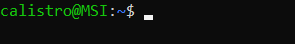

# Knowledge about Linux

[](https://tryhackme.com/room/linuxfundamentalspart1)
[](https://academy.hackthebox.com/course/preview/linux-fundamentals)

<div class="row row-cols-lg-2"><div>

<br>

<p class="text-center">


</p>

Linux is a family of Unix-like operating systems, often called distros, such as Debian, Ubuntu, Fedora, or Arch Linux... They were designed to be free, open-source, light, secure, and performant.

➡️ Each distro has its pro and cons according to what specific usage they were designed for <small>(ex: gaming, security, performance...)</small>.

🐦 **Common distros**: Ubuntu, Debian, Arch Linux, Red Hat, CentOS, Kali Linux, Parrot Linux, Linux Mint, Fedora...

🎠 **Random distros**: [Gentoo](https://www.gentoo.org/), [QubesOS](https://www.qubes-os.org/).
</div><div>

Linux in its simplest form is a **command-line interface** (CLI), commonly referred to as terminal/shell <small>(or console/command prompt)</small>.



Inside the CLI, we can run commands interpreted by a **shell** 🐚.  There are multiple shell languages <small>(sh, csh, tcsh, ksh, bash)</small>, however most Linux distributions are using **bash** <small>(bourne again shell)</small> 🔥.

🏠 Customize your prompt: [Bash Prompt Generator](https://bash-prompt-generator.org/)/[powerline](https://github.com/powerline/powerline).

👉 Note that shell, the CLI, and a terminal are not the same thing, although they are closely related, hence the common misuse.

👉 You can use CTRL+ALT+F1 to swap to "console mode" <small>(from F1, up to F6)</small>, while you can use ALT+F7 to swap back to the "GUI mode".
</div></div>

<hr class="sep-both">

## Commands

[](https://tryhackme.com/room/linuxfundamentalspart1)
[](https://tryhackme.com/room/linuxfundamentalspart2)
[](https://tryhackme.com/room/linux1)
[](https://academy.hackthebox.com/course/preview/linux-fundamentals)

<div class="row row-cols-lg-2"><div>

A command has **a name**, which may be followed by **arguments**, including some usually called **flag**/**switches** (`options`). The difference between both is that a flag starts with a `-` while **operands** do not.

Below are some examples with the command `ls`:

<div class="row row-cols-lg-2"><div>

No arguments.

```shell!
$ ls
```

One operand.

```shell!
$ ls toto.txt
$ ls "toto.txt"
```
</div><div>

Two flags ➡️ One flag.

```shell!
$ ls -l -a
$ ls -la
```

One flag and one operand.

```shell!
$ ls -la toto/
```
</div></div>

🌍 **Browse the manual** (`man`) to learn more about some command

```shell!
$ man ls
```
</div><div>

🤘 Use **tab key to autocomplete** commands/paths

```ps
$ ls /<TAB>
# will display every path starting with "/"
```

A few takeaways:

* 🛣️ you are writing commands right after the `$`
* 👉 press <kbd>ENTER</kbd> to execute a command
* 💥 press <kbd>CTRL-C</kbd> to cancel/kill a command
* ✅ press <kbd>CTRL-D</kbd> to end the input
* 🧓 press <kbd>CTRL-R</kbd> to search in the command history
* 🏎️ press <kbd>CTRL-E</kbd> to move the cursor to the end
* 🧼 press <kbd>CTRL-U</kbd> to remove everything before the cursor
* 🛣️ press <kbd>ALT+B</kbd>/<kbd>CTRL+arrow</kbd> to move between words
* 🚀 Usually, flags can be merged <small>(ex: `-l -a` is the same as `-la`)</small>.
* 🗺️ Most commands have an option "help": `-h`, `-help`, or `--help`
</div></div>

<hr class="sep-both">

## File system

[](https://tryhackme.com/room/linuxfundamentalspart1)
[](https://tryhackme.com/room/linuxfundamentalspart2)
[](https://tryhackme.com/room/linux1)
[](https://academy.hackthebox.com/course/preview/linux-fundamentals)

<div class="row row-cols-lg-2"><div>

A **path** 🛣️ is a suite of one or more folders 📂 that may lead to a regular file 📄. They are separated by a separator which is: `/` <small>(slash)</small>.

```shell!
$ pwd
/usr/home/toto/Documents/
```

➡️ The root folder <small>(similar to C: on Windows)</small> contains every other folder. It's the leading `/` of every path.

➡️ Each user has a home folder with their documents...

🦄 See also: [Linux Filesystem and Files](/operating-systems/linux/env/files/index.md).

</div><div>

#### Absolute and relative paths

A path starting by the root is called absolute path. Otherwise, they are called relative path. There are 3 shortcuts used in relative paths:

* `.` <small>(dot)</small>: will be replaced with the absolute path to the working directory. See the `pwd` command.
* `..` <small>(dot dot)</small>: will be replaced with the parent folder of `.`
* `~` <small>(tilde)</small>: path to user home, same as `$HOME`

```shell!
$ pwd
/home/example
$ ./toto.txt
$ /home/example/toto.txt # same
```

➡️ `root` is its own parent <small>(`/../` is the same as `/`)</small>.

🧪 Following slashes are merged <small>(`///` becomes `/`)</small>.
</div></div>

<hr class="sep-both">

## Users and permissions

[](https://tryhackme.com/room/linuxfundamentalspart2)
[](https://academy.hackthebox.com/course/preview/linux-fundamentals)

<div class="row row-cols-lg-2"><div>

Permissions are assigned on a file/folder, and are applied according to the target 🎯 of the permissions (ownership)

* <kbd>u</kbd>: user, applied to the user (owner)
* <kbd>g</kbd>: group, applied to the main group of the user <small>(ex: students_2022)</small>
* <kbd>o</kbd>: others, applied to everyone else

There are 3 well-known levels of permissions 🔒

* <kbd>r</kbd> (4): can read
* <kbd>w</kbd> (2): can write <small>(=can edit+save, can create)</small>
* <kbd>x</kbd> (1): can execute a script, can move through a folder

Giving us something like: `u=r+w, g=r, o=r`. Instead of letters, we usually use numbers, as it's shorter. We could write `u=6, g=4, o=4` which can be shortened again to `644`.

<br>

#### groups

Each user is part of a group called after their name <small>(e.g. the user `toto` is in the group `toto`)</small>. Use `/etc/group` to see members of each group.
</div><div>

#### Sudo

There is a super-user 🦸, usually called **root**, that has absolute control over the machine 👑. They can delegate their privileges to users called **sudoers**. The command to execute something "as root" is:

```ps
# execute "cat [...]" as administrator
$ sudo cat /etc/shadow
```

➡️ See `man sudo_root`, and `sudo`/`wheel` groups.

#### See permissions using ls

<p></p>


* The first character is the type of the file
* The 3 following letters `rw-` are the permissions of `u`: read+write.
* The 3 following letters `r--` are the permissions of `g`: read.
* The 3 following letters `r--` are the permissions of `o`: read.
* Ignore the `1`
* The following string `listro` is the name of the user `u`
* The following string `listro` is the name of the group `g`
</div></div>

<details class="details-n">
<summary>The 3 not well-known permissions</summary>

<table class="table table-bordered border-dark table-dark bg-transparent mt-4">
<thead>
<tr><th></th><th>SUID bit (on user)</th><th>SGID bit (on group)</th><th>Sticky bit (on others)</th></tr>
</thead>
<tbody>

<tr><td>File</td><td>
This file will be executed using the permissions of its owner.
</td><td>
This file will be executed using the permissions of its group owner.
</td><td></td>
</tr>
<tr><td>Folder</td><td></td><td>
The group of newly created sub-folders will be the same as the folder with the SGID bit.
</td><td>
User can't delete files belonging to another user.
</td></tr>

<tr>
<td></td>
<td>Add: <code>u+s</code> Remove: <code>u-s</code><br>Ex: <code>-rwsr--r--</code> </td>
<td>Add: <code>g+s</code> Remove: <code>g-s</code><br>Ex: <code>-rwxr-sr--</code> </td>
<td>Add: <code>o+t</code> Remove: <code>o-t</code><br>Ex: <code>-rwxrw-rwt</code> </td>
</tr>
</tbody></table>

If you are giving one of these, in a context where you couldn't (such as giving `s` to `u`, while `u` don't have `x`), then the permission would be displayed in uppercase, indicating an error.
</details>

<hr class="sep-both">

## Environment variables

<div class="row row-cols-lg-2"><div>

Environment variables (`Variables d’environnement`) are global variables, mostly used by commands/applications to access information about the system, save configurations...

* **HOME**: path to the current user home
* **USER**: username of the current user
* **LANG**: language of the current user
* **SHELL**: path to the shell
* **PWD**: path to the current folder
* **RANDOM**: return a random value
* **DISPLAY**: [identify display](https://unix.stackexchange.com/questions/16815/what-does-display-0-0-actually-mean)

And, there is **PATH**. This variable is used to store a list of folders. When you write a command on Linux, then **the shell will look for the command's file in the PATH**, starting from the first folder inside.

➡️ On Linux, folders in the PATH are separated with `:`.
</div><div>

Print all environment variables

```shell!
$ env
$ printenv
```

Print the value of one environment variable

```shell!
$ echo $PATH
$ printenv PATH
$ env | grep "^PATH="
```

Set an environment variable

```shell!
$ export VAR_NAME=value
```

Add `/home/toto/bin` to the PATH

```shell!
$ export PATH=/home/toto/bin:$PATH
```

</div></div>

<hr class="sep-both">

## Glob-patterns

<div class="row row-cols-lg-2"><div>

A **glob-pattern** is an expression using **wildcards** (`motifs`), that when evaluated by the shell, will be replaced with a list of files.

For instance, `*.h` will be replaced with every file -- and directory --, ending with `.h`. They are mostly used on commands taking too many filenames, in which you don't want to manually write all of them 😎.

<table class="table table-bordered border-dark table-dark bg-transparent">
<thead>
<tr><th>Wildcards</th><th>Description</th></tr>
</thead>
<tbody>

<tr><td><code>x</code> (a character)</td><td>the character 'x'</td></tr>
<tr><td><code>*</code> (asterisk)</td><td>a possibly empty suite of characters</td></tr>
<tr><td><code>?</code> (question mark)</td><td>one character</td></tr>
<tr><td><code>[abc]</code></td><td>one character which is either a, b, or c.</td></tr>
<tr><td><code>[^abc]</code><br><code>[!abc]</code></td><td>any character which is not a, nor b, nor c.</td></tr>
</tbody></table>

If you write the glob-pattern `a?c`, then it could be `abc`... But if you write `a\?c`, or `a[?]c`, then it will only match `a?c`. This is called "escaping".

👉 Glob-patterns are pretty similar but different to [Regexes](/tools-and-frameworks/knowledge/regex/index.md).
</div><div>

Everything defined in `[]` is called a **charset**. If you want every character between 'a', and 'z', then you could write the charset `[a-z]`. There are pre-defined charsets if needed

* `[[:digit:]]` which is `[0-9]`
* `[[:upper:]]` which is `[A-Z]`
* `[[:lower:]]` which is `[a-z]`
* `[[:space:]]` which is `[ \n\t]`
* `[[:alnum:]]` which is `[a-zA-Z0-9._]`

<table class="table table-bordered border-dark table-dark bg-transparent">
<thead>
<tr><th>GP</th><th>Description</th><th>Examples</th></tr>
</thead>
<tbody>

<tr><td><code>*</code></td><td>

Anything
</td><td>

* &lt;nothing&gt;
* folder
* myFile.txt
</td></tr>

<tr><td><code>???</code></td><td>

match a 3-characters string
</td><td>

abc
</td></tr>

<tr><td><code>toto*</code></td><td>

A word starting with "toto"
</td><td>

* toto
* toto1
</td></tr>

<tr><td><code>[0-9]*</code><br><code>[[:digit:]]*</code></td><td>

a word starting with a digit
</td><td>

0ac
</td></tr>

<tr><td><code>[^ab]*</code><br><code>[!ab]*</code></td><td>

match a string not starting with "a", nor "b"
</td><td>

downloads
</td></tr>
</tbody></table>
</div></div>

<hr class="sep-both">

## Cron jobs

[](https://tryhackme.com/room/linuxfundamentalspart3)
[](https://academy.hackthebox.com/course/preview/linux-fundamentals)

<div class="row row-cols-lg-2"><div>

We can run scheduled tasks on Linux using cron jobs. They are an alternative to [System Timers](/operating-systems/linux/env/boot/index.md).

```shell!
$ crontab -l # list current user jobs
$ sudo crontab -l -u xxx # list user 'xxx' jobs
```

To add a new scheduled task, use `-e`

```shell!
$ crontab -e
```

➡️ See also: `/etc/cron*`, `/var/spool/cron/crontabs/*`.
</div><div>

The format of the file is `schedule /path/to/your/script`. Schedule is made of 5 numbers whitespace-separated.

* minute <small>(0-59)</small>
* hour <small>(0-23)</small>
* day <small>(month, 1-31)</small>
* month <small>(1-12)</small>
* day <small>(week, 0-6)</small>

You can generate a schedule using [crontab.guru](https://crontab.guru/) or [crontab-generator](https://crontab-generator.org/).
</div></div>

<hr class="sep-both">

## 👻 To-do 👻

Stuff that I found, but never read/used yet.

<div class="row row-cols-lg-2"><div>

* ELF
* Solaris
* shift+insert, middle button of the mouse, primary clipboard, most recently selected text
* [linuxhandbook](https://linuxhandbook.com/)
* [linuxhint](https://linuxhint.com/)
* [linuxize](https://linuxize.com/)
* [shell-tips](https://www.shell-tips.com/)
* [howtouselinux](https://www.howtouselinux.com/)
* [linuxconfig](https://linuxconfig.org/)

</div><div>

* [tecmint](https://www.tecmint.com/)
* [linux-audit](https://linux-audit.com/)
* [oreilly](https://www.oreilly.com/library/view/linux-command-line/9780470251287/)
* [tldp](https://tldp.org/guides.html)
* [linuxshelltips](https://www.linuxshelltips.com/)
* [shellhacks](https://www.shellhacks.com)

<details class="details-n">
<summary>Memory Swapping</summary>

* Used for memory managment
* Free inactive memory pages and give it to others
* `mkswap`: set up a swap area
* `swapon`: activate a swap area
</details>
</div></div>