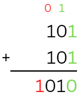

# Linux Architecture 🧪

An experimental set of notes about Linux internals.

<hr class="sep-both">

## Processes and scheduling

*🚢 This section is further developed in the [Multitasking notes](/programming-languages/low-level/c/multitasking/index.md) in C programming.* <small>(**Signals, pipes, sockets, semaphores, mutexes, condition variables...**)</small>

<div class="row row-cols-md-2"><div>

A process is a box with stuff related to the execution of a program:

* 🔑 a pid <small>(process id, unique)</small>
* 💍 a ppid <small>(process id of the parent, -1 if the parent is dead)</small>
* 📄 a code to execute <small>(current instruction, next instruction...)</small>
* 🪸 an environment <small>(file descriptors, parameters, permissions...)</small>
* 🧪 some data <small>(variables, environment variables, stack...)</small>
* ...

When a machine boots up, the kernel process is started, with the pid 0. It starts a **daemon process** called `init` or `systemd` with the pid 1, which is the parent of every process.

👉 A **daemon** is a process that never ends.

👉 Processes are stored in `/proc/`, in a folder named after their PID.

👉 If a parent process dies, their children **won't die**, and will be assigned $-1$ as their PPID.

➡️ Signals are used by processes to communicate. For instance, `CTRL+C` is firing a signal to forcefully kill a foreground process.

<br>

#### Process scheduling

The scheduler job is to to maximize the use of available resources while ensuring that each process receives a fair share of the CPU time.

To the user, it looks like applications are running in parallel, but its pseudo-parallelism. As the scheduler lets each process use the CPU a little bit, they are all running a little, and we won't notice that they are not executed at the same time.

👉 Some scheduling algorithm: round-robin, priority based...
</div><div>

#### Process termination

When a process dies, they are returning a code: $0$ is everything went fine ✅, and not $0$, if an error occurred ❌. You can use `$?` to see the exit code of the last process that died.

```bash!
$ echo $?
```

<br>

#### Sessions

Every process is attached to a session, which can be found with their value for **SID** (Session identifier). Most sessions are attached to a terminal (`/dev/tty`).

Sessions are partitioned into [groups of processes](https://en.wikipedia.org/wiki/Process_group). A signal sent to a group, is dispatched to every process of the group.

If a session dies, then the signal **SIGHUP** is sent to every process.

<br>

#### Foreground and background processes

A foreground process is a process receiving input from the user, while a background process is running but not receiving input.

They can only be one foreground process at a time inside a session. We use background processes to run long task not requiring user input. Background processes

* 😵 can't read, and may not be able to write on the terminal
* 🔕 aren't receiving signals, except **CTRL-Z** (suspend)

To run a command in the background, use `&`:

```ps
$ sleep 10 &
```
</div></div>

<hr class="sep-both">

## Integers arithmetic

<div class="row row-cols-md-2"><div>

We are considering

* **unsigned numbers**: $[0, 2^{n} - 1]$
* **signed numbers**: $]-2^{n-1}, 0] \cup ]0,2^{n-1}-1[$

$n$ is the number of bits that we have to store this value. For instance, it's usually $32$ for an `int`.

With signed numbers, we are using the leading bit <small>(or the trailing bit)</small>, to know the sign: 0 means positive, 1 means negative.

For positive numbers, regardless of whether they are signed or not, we only have to convert them to binary, and store them.
</div><div>

For negative numbers, we need to do an operation called [**Two's complement**](https://en.wikipedia.org/wiki/Two's_complement) (`complément à 2`).

<details class="details-e">
<summary>Two's complement</summary>

**Convert to positive**

1. convert to binary
2. inverse every bit (**Two's complement**)
3. add 1
4. store it

**Convert back to negative**

1. inverse every bit (**Two's complement**)
2. add 1
3. convert back to decimal
</details>

The most common problem that may occur when doing calculations is an **overflow** (`Débordement`). It means that the result is outside the bounds/range of values for the given number. An **overflow may be without any consequences**, meaning we still got the correct result.

<details class="details-e">
<summary>Addition / Subtraction</summary>

Actually, there is no such operation as subtracting, we can only do additions, but there is a trick: $a - b = a + (-b)$, and we can use the **Two's complement** to convert a positive number to a negative number.

<div class="row"><div class="col-md-3">


</div><div class="col-md-9">

To add 5 (101) to 5 (101), you need to do like you would have in grad school.

* $0+0=0$
* $0+1=1+0=0$
* $1+1=0$ with a carry on the next (left-wise), as shown in green.
</div></div>

**Overflow**: there is an overflow if the last two carries (from right-to-left), highlighted in red, are different from one another. That's the case with the example of 5+5, if we only have 3 bits, we can't store a 10, as we need 4 bits. There is also an overflow, but without consequences, if the last two carries are 1.

See [Integer overflow](https://en.wikipedia.org/wiki/Integer_overflow).
</details>
</div></div>

<hr class="sep-both">

## Floating-point arithmetic

<div class="row row-cols-md-2"><div>

A floating-point can be identified by the **Radix point**, which is usually either `.` (dot), or `,` (comma).

The first step is scientific notation. You should have heard of $a * 10^n$, in radix-10, our goal is something similar: $a * 2^n$..

➡️ Not every number can be written using scientific notation

<details class="details-e">
<summary>Encoding floating numbers</summary>

* $e(a)$ is a function that extract the digits after the radix point of $a$ <small>(ex: 1.11 $\to$ 0.11)</small>
* $a_i = \text{your_number}$
* do
    * $a_i = e(a_i) * 2$
    * $r_i = \text{if}\ a_i > 1.0\ \text{then}\ 1\ \text{else}\ 0$
* while $a_i \neq 1.0$

Simply concatenate every $r_i$ to get the floating part representation in base 2. Now, convert the decimal part, and the result is $(a.r)_2$.

For instance, with 5.75

* $a_0 = 0.75 * 2 = 1.5$
* $r_0 = 1$
* $a_1 = 0.5 * 2 = 1.0$
* $r_1 = 1$

As $5 = (101)_2$, and $.75=(.11)\_2$, we have $(5.75)\_{10}=(101.11)_2$.
</details>
</div><div>

[**IEEE754**](https://en.wikipedia.org/wiki/IEEE_754) is the norm modern computers are using to store a floating-point number. 3 integers are needed to do so:

<table class="table table-bordered table-striped border-dark">
<thead>
<tr><th></th><th>float<br>(32 bits)</th><th>double<br>(64 bits)</th></tr>
</thead>
<tbody>

<tr><td>

**S**: the sign, 0=positive, 1=negative
</td><td colspan="2">1 bit</td></tr>

<tr><td>

**E**: exponent bias (`exposant décalé`)
</td><td>8 bits</td><td>11 bits</td></tr>

<tr><td>

**M**: significand, mantissa, or coefficient (`mantisse`)
</td><td>23 bits</td><td>52 bits</td></tr>

<tr><td></td><td>$q = 127$</td><td>$q=1023$</td></tr>
</tbody></table>

To find the numerical value, evaluate $(-1)^S * 1.M * 2^{E - q}$.

<details class="details-e">
<summary>Find S, E, and M</summary>

As we explained before, $(5.75)_{10}=(101.11)_2$. You should have noticed that we have "1.M", so we have to move the radix point by **3 times** to the left, giving us $(101.11)_2 = (1.0111)_2 * 2^3$.

If we are using a float (simple precision).

* $S = 0$, because $5$ is positive
* $E = 130$: you need to solve $E - q = 3$, with $3$ the exponent, and $q=127$ for a float.
* $M = 0111$, as our number is $1.0111$, $M$ is simply a copy of the part after the radix point
</details>
</div></div>