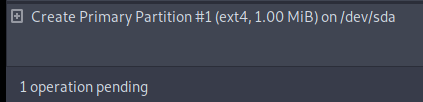

# Files and Filesystem

<div class="row row-cols-lg-2"><div>

Linux follows a hierarchical file system, known as the Filesystem Hierarchy Standard (FHS). The parent of every folder is called the root and corresponds to `/`.

A common Linux philosophy is to think "everything is a file."

* Regular files 🗃️
* Folders/Directories 📂
* Hard Drives <small>(/mnt/)</small> 💾
* Terminals And Devices <small>(/dev/)</small> 🤖
* ...

See the first character of the output of `ls -l`.
</div><div>

Files and Folders starting with <code>.</code> (dot)  are hidden 🤐 <small>(ex: .config)</small>.

Linux supports multiple filesystems. Ext4 is the default one for many Linux distributions and one of the most widely used.
</div></div>

<hr class="sep-both">

## Common folders

[](https://tryhackme.com/room/linuxfundamentalspart2)
[](https://academy.hackthebox.com/course/preview/linux-fundamentals)

<div class="row row-cols-lg-2"><div>

#### User  Home (<code>domicile</code>) 🏡

Each user has their own folder, with their documents...

* The home of `username` is commonly at `/home/username/`
* See the environment variable `$HOME`.
* See the file `/etc/passwd` for the path of each user home
* The home folder of `root` is usually at `/root`

<br>

#### Binaries ⚒️

Folders are used to store commands and binaries.

* `/bin/`: system binaries
* `/usr/bin/`: all users binaries
* `/usr/local/bin/`: user binaries

</div><div>

#### System folders 🏭

System configurations are commonly stored in `/etc/`.

System logs and application logs are usually stored in `/var/log/`.

<br>

#### Other folders 🧑‍💻

* `/mnt`: mounted device/hard drives <small>(D:, USB...)</small>
* `/tmp`: a trash folder cleaned on reboot
</div></div>

<hr class="sep-both">

## Common files

[](https://tryhackme.com/room/linuxfundamentalspart2)
[](https://academy.hackthebox.com/course/preview/linux-fundamentals)

<div class="row row-cols-lg-2"><div>

#### Empty file 🧭

The file `/dev/null` is a sort of "trash file" in which everything you write inside is deleted. It's useful when redirecting error output.

<br>

#### Configuration files 🏭

* `/etc/passwd`: username, their UID, their GID, their home folder
* `/etc/shadow` <small>(root)</small>: users and their hashed password
* `/etc/group`: list of groups and their GID
* `/etc/hosts` <small>(root)</small>: map a domain to an IP, can be edited manually
* `/etc/resolv.conf`: automatically filled when selecting a network card. It contains DNS settings and other related settings.
</div><div>

#### /etc/sudoers

The file `/etc/sudoers` is a system configuration file defining which commands a user can run as another user, usually root.

For instance, to run any command as `root` without a password:

```ps
username ALL=(ALL) NOPASSWD:ALL 
```

Here, `tar` can be run as `user2` without a password:

```ps
username ALL=(user2) NOPASSWD:/bin/tar
```
</div></div>

<hr class="sep-both">

## Partitions

[](https://academy.hackthebox.com/course/preview/linux-fundamentals)

<div class="row row-cols-lg-2"><div>

Partitions are a way to divide a physical storage device, such as a hard drive. They allow us to isolate and enforce individual restrictions.

Partitions are mounted at specific mount points within the FHS. The root partition is often mounted at `/`. We often have separate partitions for folders such as `/home`, `/tmp`, or `/var`.

The file `/etc/fstab` defines the partitions to create at system startup. The `/proc/mounts` contains all mounted partitions right now.

```shell!
$ cat /etc/fstab
/dev/sda1 / ext4 defaults    0 2
...
$ cat /proc/mounts
/dev/sda1 / ext4 rw,relatime 0 0
...
```

</div><div>

**Related commands** 🔥

* Create a filesystem 🆕: `mkfs` <small>(`mkfs.ext4`...)</small>
* Devices list 📃: `fdisk`, `lsblk`
* Devices data 📌: `sudo blkid`, `df -h`
* List partitions 📚: `parted`, `gparted`, `lvs` <small>(`virtual`)</small>
* Create partition 🆕: `fdisk`, `parted`, `gparted`
* Edit partition ✍️: `fdisk`, `parted`, `gparted`
* Delete partition 🚮: `fdisk`, `parted`, `gparted`

The `mount` command is used to mount a partition:

```shell!
$ sudo mount /path/to/source /path/to/dest
$ sudo mount -t loop rootfs.ext4 # mounted at /mnt/rootfs.ext4/
```
</div></div>

<hr class="sep-both">

## Edit a filesystem

<div class="row row-cols-lg-2"><div>

A filesystem may be stored in a file, such as `rootfs.ext4` for an EXT4 filesystem. It could be a backup or something similar.

You can use tools such as `mount` or `debugfs` to inspect the filesystem contents and edit them.

To create an empty filesystem for testing:

```shell!
$ dd if=/dev/zero of=rootfs.ext4 bs=1M count=200 # 200 MB
$ mkfs.ext4 rootfs.ext4                          # format
$ e2fsck -f rootfs.ext4                          # check fs
```

#### mount

The most common is to use `mount`. It unpacks the filesystem allowing us to use any commands we want:

```shell!
$ sudo mkdir /mnt/tmp_rootfs        # create mount point 
$ sudo mount -o loop rootfs.ext4 /mnt/tmp_rootfs # mount
[do your changes]
$ sudo umount /mnt/tmp_rootfs       # unmount
```

️➡️  We can use `chroot` to change the root directory for commands.
</div><div>

#### DebugFS

Debugfs is a tool that you can use to edit a filesystem without having to extract it <small>(using `mount`/`umount`)</small>.

```shell!
$ debugfs xxx.ext4 [...]    # open fs as read-only
$ debugfs -w xxx.ext4 [...] # open fs as read-write
$ debugfs -f file.cmd [...] # run commands in file
$ debugfs
debugfs> open -w xxx.ext4   # open fs as...
debugfs> ls                 # ls current folder on fs 
debugfs> cd /path/to/dest   # navigate in fs 
debugfs> mkdir folder       # create folder in fs
debugfs> rm file_or_folder  # remove ... in fs
debugfs> # copy local file to fs
debugfs> # ⚠️ The right value cannot be a path.
debugfs> write /local/path/to/file filename
debugfs> # copy file on fs to host
debugfs> dump filename /local/path/to/file 
debugfs> # filename links to /path/to/...
debugfs> symlink filename /path/to/linked/file
debugfs> q                 # quit
```
</div></div>

<hr class="sep-both">

## GParted

<div class="row row-cols-lg-2"><div>

Gnome Partition Editor (GParted) is a graphical front-end to the `parted` command. It allows us to create, edit, resize, or delete partitions.

```shell!
$ sudo apt-get install gparted
$ sudo gparted
```

1. In the top-right corner, select a disk.
2. Right-click on an existing partition or on the unallocated disk space.
3. You can select operations such as `new` to create a new partition.
</div><div>

Each planned operation is pending until confirmation:



You can apply them using either:

* `Edit > Apply All Operations`
* `Right-click on pending operations > Apply All Operations`
</div></div>

<hr class="sep-both">

## 👻 To-do 👻

Stuff that I found, but never read/used yet.

<div class="row row-cols-lg-2"><div>

* `sync` command
* `.local/share/Trash`
* `.config`
</div><div>
</div></div>