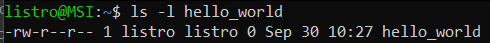

# Knowledge about Linux

<div class="row row-cols-md-2"><div>

Most "commands" in books/... are written like `$ xxx`, but `$` IS NOT a part of the command; this is a token that indicates where we can execute the command. It could be `#`, `sh >`...

```shell
$ command_working_everywhere
# command_requiring_elevated_privileges
sh > command_at_least_working_in_sh
bash > command_at_least_working_in_bash
```
</div><div>

<b>Open a terminal</b>

> * Look for "Terminal" in your Applications
> * Or, use the shortcut `CTRL+SHIFT+T`

<b>Increase/Decrease Zoom</b>

> Use `CTRL +`, and `CTRL -` to increase/decrease zoom

<b>Console mode</b> 🤕 - beginner killer

> You can use CTRL+ALT+F1 to swap to console mode <small>(from F1, up to F6)</small>, while you can use ALT+F7 to swap back 🤤.

<b>Paste something</b>

> Usually, the scroll button will paste any copied content.
</div></div>

> There is no "echo" when writing a password, so don't be confused when you are writing one.

<hr class="sr">

## Commands

<details class="details-e">
<summary>Quoting in bash</summary>

<div class="row row-cols-md-2"><div>

Quotes are not mandatory unless there are some specials characters, such as a space in a path, for instance

```bash
$ ls /Documents/my bookmarks/ # Will not work
$ ls "/Documents/my bookmarks/" # 👌
$ ls '/Documents/my bookmarks/' # 👌
$ ls /Documents/my\ bookmarks/ # 👌
```
</div><div>

The main difference between single and double quotes, is that variables, and nested commands, will still be executed when using double quotes.

```bash
$ echo "$toto" # echo the value inside $toto
$ echo '$toto' # echo "$toto" 
```
</div></div>
</details>

<details class="details-e">
<summary>Exit codes, nested commands, and operators <code>; && ||</code></summary>

<div class="row row-cols-md-2"><div>

Commands (processes) are returning a code:

* $0$: everything went fine
* Not $0$: an error occurred

The exit code of the last command is stored in `$?`

```bash
$ echo $?
```

You can execute a command inside another command <small>(nested)</small>

```bash
$ ls `echo ~` # ls ~
$ ls $(echo ~) # ls ~
```

</div><div>

You can run multiple commands in one go

```bash
$ ls toto; ls tata
```

With the operator `&&`, the next command is only executed if the previous one successfully ended (code=0)

```bash
$ ls toto && ls tata
```

With the operator `||`, every following command is executed until one is successful (code=0)

```bash
$ ls toto && ls tata
```
</div></div>
</details>

<hr class="sr">

## Permissions, and users

<div class="row row-cols-md-2"><div>
</div><div>

You may have noticed a number next to every kind of permission. This is because permissions are coded on 3 bits, which means that they can take 8 values <small>(000, 001, 010...)</small>.

* `0`: nothing <small>(000)</small>
* `1`: can execute <small>(001=1=x)</small>
* `2`: can write <small>(010=2=w)</small>
* `3`: can execute, and write <small>(1+2=x+w)</small>
* `4`: can read <small>(100=4=r)</small>
* `5`: can read, and execute <small>(4+1=r+x)</small>
* `6`: can read, and write <small>(4+2=r+w)</small>
* `7`: can read, write, and execute <small>(4+2+1=r+w+x)</small>

**Why?** We are usually using numbers instead of letters, because it's shorter. The syntax can be shortened to `u=6, g=4, o=4`, and because the order `ugo` is fixed, we can shorten it again to `644`. **This shortened version is the most used one** <small>(in commands, verbally...)</small>.
</div></div>

<div class="row row-cols-md-2"><div>

<details class="details-e">
<summary>Practical knowledge: <code>ls -l</code> to see permissions</summary>



* The first character is the type of the file
* The 3 following letters `rw-` are the permissions of `u`: read+write.
* The 3 following letters `r--` are the permissions of `g`: read.
* The 3 following letters `r--` are the permissions of `o`: read.
* Ignore `1`
* The following string `listro` is the name of the user `u`
* The following string `listro` is the name of the group `g`
</details>
</div></div>

<details class="details-e">
<summary>The 3 not well-known permissions</summary>

<table class="table table-bordered table-striped border-dark mt-4">
<thead>
<tr><th></th><th>SUID bit (on user)</th><th>SGID bit (on group)</th><th>Sticky bit (on others)</th></tr>
</thead>
<tbody>

<tr><td>File</td><td>
This file will be executed using the permissions of its owner.
</td><td>
This file will be executed using the permissions of its group owner.
</td><td></td>
</tr>
<tr><td>Folder</td><td></td><td>
The group of newly created sub-folders will be the same as the folder with the SGID bit.
</td><td>
Use can't delete files belonging to another user.
</td></tr>

<tr>
<td></td>
<td>Add: <code>u+s</code> Remove: <code>u-s</code><br>Ex: <code>-rwsr--r--</code> </td>
<td>Add: <code>g+s</code> Remove: <code>g-s</code><br>Ex: <code>-rwsr-sr--</code> </td>
<td>Add: <code>o+t</code> Remove: <code>o-t</code><br>Ex: <code>-rwxrw-rwt</code> </td>
</tr>
</tbody></table>

If you are giving one of these, in a context where you couldn't (such as giving `s` to `u`, while `u` don't have `x`), then the permission would be displayed in uppercase, indicating an error.
</details>

<hr class="sl">

## Paths

* `/etc` (folder): "commonplace location to store system files that are used by your operating system"
* `/dev/null` (file): an empty file, a sort of trash file in which everything you write inside is deleted.
* `/etc/shadow` (file): username, and their hashed password
* `/etc/gshadow` (file), and `/etc/group`: groups
* `/var/log/` (folder): log files
* `/mnt` (folder): mounted device/hard drives (D:, USB...)
* `/tmp` (folder): a trash folder cleaned on reboot

XXX

* **Remember** that if you have spaces in your paths, then you must either quote them, or use `\` before any space.
* If you met a crazy guy that named something starting with a `-`, then you need to use `--` before the weird filename. For instance: `cp -- -filename`.

<hr class="sep-both">

## Special files and folders

<div class="row row-cols-md-2"><div>

#### Special folders

**user home** (<code>domicile</code>) 🏡: each user has is own folder, with their documents... A common path: <code>/home/toto/</code>.

See the environment variable `$HOME` and the file `/etc/passwd`.

<br>

**Binaries** ⚒️: folders used to store commands... There are `/bin/`, `/usr/bin/`, and `/usr/local/bin/`.
</div><div>

#### Special files

**hidden files** 🤐: Any file starting with <code>.</code> (dot), such as <code>.config</code>.

<br>

</div></div>

<hr class="sl">

## Glob-patterns, and regex

<details class="details-e mt-4">
<summary>Glob-patterns</summary>

<div class="row row-cols-md-2"><div>

A **glob-pattern** is an expression using **wildcards** (`motifs`), that when evaluated by the shell, will be replaced with a list of files. 

For instance, `*.h` will be replaced with every file -- and directory --, ending with `.h`. They are mostly used on commands taking many filenames, in which you don't want to manually have to write all of them 😎.

<table class="table table-bordered table-striped border-dark">
<thead>
<tr><th>Wildcards</th><th>Description</th></tr>
</thead>
<tbody>

<tr><td><code>x</code> (a character)</td><td>the character 'x'</td></tr>
<tr><td><code>*</code> (asterisk)</td><td>a possibly empty suite of characters</td></tr>
<tr><td><code>?</code> (question mark)</td><td>one character</td></tr>
<tr><td><code>[abc]</code></td><td>one character which is either a, b, or c.</td></tr>
<tr><td><code>[^abc]</code><br><code>[!abc]</code></td><td>any character which is not a, nor b, nor c.</td></tr>
</tbody></table>
</div><div>

<table class="table table-bordered table-striped border-dark">
<thead>
<tr><th>GP</th><th>Description</th><th>Examples</th></tr>
</thead>
<tbody>

<tr><td><code>*</code></td><td>

Anything
</td><td>

* &lt;nothing&gt;
* folder
* myFile.txt
</td></tr>

<tr><td><code>???</code></td><td>

match a 3-characters string
</td><td>

abc
</td></tr>

<tr><td><code>toto*</code></td><td>

A word starting with "toto"
</td><td>

* toto
* toto1
</td></tr>

<tr><td><code>[0-9]*</code><br><code>[[:digit:]]*</code></td><td>

a word starting with a digit
</td><td>

0ac
</td></tr>

<tr><td><code>[^ab]*</code><br><code>[!ab]*</code></td><td>

match a string not starting with "a", nor "b"
</td><td>

downloads
</td></tr>
</tbody></table>

</div></div>
</details>

<details class="details-e">
<summary>Regular expressions</summary>

<div class="row row-cols-md-2"><div>

**Regular expressions** (`expressions régulières`), commonly referred to as **regex**, are an enhanced version of glob-patterns used by tools such as `grep`, `sed`, and most, if not all, programming language.

* Every glob-pattern exists too in regexes
* But, `?` is now replaced with `.`

And, some new tokens were introduced

<table class="table table-bordered table-striped border-dark">
<thead>
<tr><th></th><th>Description</th></tr>
</thead>
<tbody>

<tr><td><code>x?</code></td><td>an optional character 'x'</td></tr>
<tr><td><code>x+</code></td><td>at least x times this character</td></tr>
<tr><td><code>^x</code></td><td>lines starting with x</td></tr>
<tr><td><code>[abc]</code></td><td>lines ending with x</td></tr>
<tr><td><code>(x|y)</code></td><td>either x or y</td></tr>
<tr><td><nobr><code>x{n,m}</code></nobr><br><nobr><code>x{n,}</code></nobr><br><nobr><code>x{,m}</code></nobr><br><nobr><code>x{n}</code></nobr></td><td>at least $n$ times x, up to $m$ times, leave either empty if no limit.<br>The last one means "exactly $n$" times.</td></tr>
<tr><td><code>(ab)+</code></td><td>at least one time 'ab'</td></tr>
</tbody></table>
</div><div>

Use [regex101](https://regex101.com/)/[regexr](https://regexr.com/), or similar websites to test your regexes.

* <kbd>sed</kbd>: find, and replace matching text with some other text
* <kbd>grep</kbd>: find matching text, or files having the matching text
* <kbd>awk</kbd>: sort of `grep`
* Many programming languages

<hr>

Something to note with regexes is the notion of **groups**. You can write some expression, and wrap it into escaped parenthesis `\(some_part_of_my_regex\)`. By doing so, you created a group, that may be later referred to as `$1`/`\1` if this was the first one. This is useful to extract some parts of the matching result.

* <kbd>sed</kbd>
* Many programming languages

<hr>

You can [train your skills in the 'catregex' room on TryHackMe](https://tryhackme.com/room/catregex).
</div></div>
</details>

<div class="row row-cols-md-2"><div>

If you want to use a pattern as a character, meaning that you don't want it to be interpreted as a pattern, then you need to escape it.

For instance, if you write the glob-pattern `a?c`, then it could be `abc`... But if you write `a\?c`, or `a[?]c`, then it will only match `a?c`.
</div><div>

Everything defined in `[]` is called a **charset**. If you want every character between 'a', and 'z', then you could write the charset `[a-z]`. There are pre-defined charsets if needed

* `[[:digit:]]` which is `[0-9]`
* `[[:upper:]]` which is `[A-Z]`
* `[[:lower:]]` which is `[a-z]`
* `[[:space:]]` which is `[ \n\t]`
* `[[:alnum:]]` which is `[a-zA-Z0-9._]`

Regex introduced **metacharacter** which are shortcut to these charsets: `\d` <small>(digit)</small>, `\w` <small>(alnum)</small>, `\s` <small>(whitespace...)</small>.... They also have their negative: `\D` <small>(non-digit)</small>, `\W` <small>(non-alnum: !#...)</small>, `\s` <small>(not whitespace/...)</small>.
</div></div>

<hr class="sr">

## Processes

<div class="row row-cols-md-2"><div>

Processes (`processus`) are a sort of box with

* a code to execute
* an environment (file descriptors, parameters, permissions...)
* some data (stack, variables...)

Each process is assigned a **PID** (process identifier). When a machine is starting, the first process (pid=0) is launched, and start the **systemd daemon**, which is the parent of every process.

> A **daemon** is a process that never ends. They are called **services** on Windows. They are usually ending with **d**.

> Processes are stored in `/proc/`, in a folder corresponding to their PID. 
</div><div>

No-one can create a process. A new process is "created" by duplicating an existing process, using a function called `fork()` hence we say **forking a process** instead of creating a process. 

When a process dies, they are returning a code: $0$ is everything went fine, and not $0$, if an error occurred. You can use `$?` to see the exit code of the last process that died.

```bash
$ echo $?
```

As every process is forked from another, they have a reference to their parent called PPID (Parent PID). If a parent process dies, the forked children **won't die**, and will be assigned $-1$ as their PPID.
</div></div>

<div class="row row-cols-md-2"><div>

<details class="details-e">
<summary>Scheduling (<code>Ordonnancement</code>)</summary>

Visually, you would see two processes such as `firefox`, and a file explorer running at the same time. They are not actually running in parallel, but something called pseudo-parallelism. 

The scheduler (`ordonnanceur/gouverneur`) is allowing each process to run a little, and because they are all running a little, you won't see that they are not executed at the same time.
</details>
</div><div>

<details class="details-e">
<summary>Signals</summary>

Signals are used for communication, both between processes, or between a user and a process. There are **34** signals, but a programmer may override the code executed when a process is receiving a signal.

* <kbd>CTRL+C</kbd> (SIGINT=exit): exit process
* <kbd>CTRL+Z</kbd> (SIGSTOP=suspend): terminate an action <small>(ex: waiting for input)</small>
* SIGKILL: kill a process, no cleanup
* SIGTERM: soft kill a process, allow cleanup

> **Note**: <kbd>CTRL+D</kbd> is NOT a signal.
</details>
</div></div>

<div class="row row-cols-md-2"><div>
<details class="details-e">
<summary>Sessions</summary>

Every process is attached to a session, which can be found with their value for **SID** (Session identifier). Most sessions are attached to a terminal (`/dev/tty`). 

Sessions are partitioned into [groups of processes](https://en.wikipedia.org/wiki/Process_group). A signal sent to a group, is dispatched to every process of the group.

If a session dies, then the signal **SIGHUP** is sent to every process.
</details>
</div><div>

<details class="details-e">
<summary>Foreground, and background processes</summary>

In every terminal, there is a session running, which means at least one group of processes. There are two "slots" in a session

* **foreground**: only one group may be at the foreground
* **background**: every other group will be there

The main difference, is that background processes

* can't read, and write<sup>1</sup> on the terminal
* aren't receiving signals, except **CTRL-Z** (suspend)

<sup>1</sup> In some shells, or actually in most shells, this feature is enabled by default, but it can be disabled by editing an environment variable (but, I forgot which one sadly).
</details>
</div></div>

<details class="details-e">
<summary>Commands</summary>

* <kbd>&</kbd>: run a command (process) in the background
* <kbd>ps</kbd>: list process
* <kbd>kill</kbd>: send a signal to a process
* <kbd>fg</kbd>: bring a process back to the foreground
* <kbd>bg</kbd>: bring a process to the background
* <kbd>top</kbd>: list all process, and their memory usage <small>(same as the task manager on Windows)</small>
</details>

<hr class="sl">

## Calculations

<div class="row row-cols-md-2 mx-0"><div>

You may want to do some stuff involving calculations. The shell won't interpret any calculations, so you must use `$[calculation]` to evaluate something.

```bash
four=$[3+1]
# same
four=$((3+1))
```
</div><div>

Example of increasing a variable by one.

```bash
i=0
while [ $i -lt 5 ]; do
   i=$[i+1] 
done
```
</div></div>

<hr class="sr">

## Input, output, pipes, and redirections

Each command has 1️⃣ one input (0), and 2️⃣ two outputs: standard (1), and error (2).

<div class="row row-cols-md-2"><div>

**Pipe** (`tube`)

It's possible for a command output, to be used as the next command input using a pipe: **his_output | is_my_input**.

The command `wc -l` is used to count the number of lines in a text. The text could be a file, or some input. We want to find out how many files named "toto" were found with `find` using `wc`.

```bash
$ find . -name toto
./mem/mv/all_toto_copy/toto
./mem/mv/all_toto/toto
[...]
./mem/mv/toto
$ find . -name toto | wc -l
57 # find returned 57 lines
```
</div><div>

**Redirections**

We can redirect output to a file. For instance, if a result takes a long time, or you need to do multiple operations on it, you will usually store it, and work on the file. We are doing this using `>`.

```bash
$ echo "Hello, World" > myFile
```

The operator `>` is truncating (=emptying) the file, if you want to append something, use `>>`.

```bash
$ echo "Hello, World" >> myFile
```

You can also load some input from a file, but I don't have any useful examples for now. The command below is giving the content of `original.txt` to the command `tee` which is outputting the content.

```bash
$ tee < original.txt
Hello, World
```

Another very useful usage of redirections, is redirecting errors, meanwhile non-errors message will still be shown.

```bash
$ ls /error 2> onl_errors_will_be_stored_here
$ ls /error 2> /dev/null # redirect to the "trash"
```

Sometimes, you may even want to print errors on the standard output.

```bash
$ ls /error 2>&1
```
</div></div>

<hr class="sep-both">

## 👻 To-do 👻

Stuff that I found, but never read/used yet.

<div class="row row-cols-md-2"><div>

* OSS Course
* [gentoo](https://www.gentoo.org/)
* [linux-securite](https://wonderfall.space/linux-securite/)
* ELF
* Cron `cron` process to schedule tasks, with crontab/crontab -l / Automated tasks in Linux / https://crontab-generator.org/ / https://crontab.guru/ / edit `crontab -e` / https://www.crontabs.org/
* [tcsh](https://www.ibm.com/docs/en/zos/2.3.0?topic=shells-writing-tcsh-shell-scripts)
* [ArchTitus](https://github.com/ChrisTitusTech/ArchTitus)
* [yoctoproject](https://www.yoctoproject.org/)

<details class="details-e">
<summary>Services</summary>

`systemctl /bin/systemctl` allows us to interact with the systemd process/daemon.

```bash
sudo systemctl stop xxx.service 
sudo vim /etc/systemd/system/xxx.service 
sudo systemctl status xxx.service 
sudo systemctl daemon-reload
sudo systemctl start xxx.service
sudo systemctl status xxx.service
```

```ini
[Unit]
Description="Some nice description here"

[Service]
ExecStart=/usr/local/bin/nodemon /home/bye/index.js
WorkingDirectory=/home/bye/
Restart=always
RestartSec=10
StandardOutput=syslog
StandardError=syslog
; examples
SyslogIdentifier=byebye
Environment=NODE_ENV=production

[Install]
WantedBy=multi-user.target
```
</details>

</div><div>

* [linuxhandbook](https://linuxhandbook.com/)
* [linuxhint](https://linuxhint.com/)
* [linuxize](https://linuxize.com/)
* [shell-tips](https://www.shell-tips.com/)
* [howtouselinux](https://www.howtouselinux.com/)
* [linuxconfig](https://linuxconfig.org/)
* [tecmint](https://www.tecmint.com/)
* [linux-audit](https://linux-audit.com/)
* [oreilly](https://www.oreilly.com/library/view/linux-command-line/9780470251287/)
* [tldp](https://tldp.org/guides.html)
* [linuxshelltips](https://www.linuxshelltips.com/)
* [shellhacks](https://www.shellhacks.com)
</div></div>