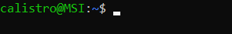

# Operating System (Linux)

This course is a gathering of general knowledge shared between most, if not all, Linux distributions (distros) such as Debian, Ubuntu, Fedora, or Arch Linux... Most of them are free, open-source, light, secure, and performant. As the source code is public, anyone can improve it, modify it, and know how the underlying system is doing its job, or a list it was supposed to be like that. The Operating System (OS) is the one connecting the hardware and the applications running on your computer.

> **Note**: Linux is actually the name of the Kernel, while GNU/Linux is the operating system. In this course, Linux distributions will be referred to as distros, and GNU/Linux, will be referred to as Linux, as Wikipedia does. Let's keep things simple, and tidy.

<hr class="sl">

## Terminal

<div class="row row-cols-md-2"><div>

Linux in its simplest form is a **terminal** <small>(console or `invite de commande` on Windows)</small>. Inside a terminal, we can run commands interpreted by a **shell**. There are multiple shell languages that we can use <small>(sh, csh, tcsh, ksh, bash)</small>, but **most Linux distributions are using bash** <small>(bourne again shell)</small>, an improved version of sh.



Most "commands" in books/... are written like `$ xxx`, but **`$` IS NOT A PART OF THE COMMAND**; this is a token that indicates **where** we can execute the command. It could be `#`, `sh >`...

```shell
$ command_working_everywhere
# command_requiring_elevated_privileges
sh > command_at_least_working_in_sh
bash > command_at_least_working_in_bash
```
</div><div>

**Open a terminal**

> * Look for "Terminal" in your Applications
> * Or, use the shortcut `CTRL+SHIFT+T`

**Increase/Decrease Zoom**

> Use `CTRL +`, and `CTRL -` to increase/decrease zoom

**Console mode** 🤕 - beginner killer

> You can use CTRL+ALT+F1 to swap to console mode <small>(from F1, up to F6)</small>, while you can use ALT+F7 to swap back 🤤.

**Paste something**

> Usually, the scroll button will paste any copied content.
</div></div>

> There is no "echo" when writing a password, so don't be confused when you are writing one.

<hr class="sr">

## Commands

<div class="row row-cols-md-2"><div>

A command is **a name**, which may be followed by **arguments**, including some usually called **flag**/**switches** (`options`). The difference between both is that a flag starts with a `-`.

* you are writing commands right after the `$`
* press <kbd>ENTER</kbd> to execute a command
* press <kbd>CTRL-C</kbd> to cancel/kill a command
* press <kbd>CTRL-D</kbd> to end the input
* Usually, flags can be merged <small>(ex: `-l -a` is the same as `-la`)</small>.
* Most commands have an option "help": `-h`, `-help`, or `--help`

</div><div>

```bash
$ ls
$ ls toto.txt
$ ls "toto.txt"
$ ls -l -a
$ ls -la
$ ls -la toto/
```

**There is some documentation for most commands.**

```bash
$ man ls
```

**Use tab key to autocomplete commands/paths**

```bash
$ ls /<TAB>
# will display every path starting with "/"
```
</div></div>

<details class="details-e">
<summary>Quoting in bash</summary>

<div class="row row-cols-md-2"><div>

Quotes are not mandatory unless there are some specials characters, such as a space in a path, for instance

```bash
$ ls /Documents/my bookmarks/ # Will not work
$ ls "/Documents/my bookmarks/" # 👌
$ ls '/Documents/my bookmarks/' # 👌
$ ls /Documents/my\ bookmarks/ # 👌
```
</div><div>

The main difference between single and double quotes, is that variables, and nested commands, will still be executed when using double quotes.

```bash
$ echo "$toto" # echo the value inside $toto
$ echo '$toto' # echo "$toto" 
```
</div></div>
</details>

<details class="details-e">
<summary>Exit codes, nested commands, and operators <code>; && ||</code></summary>

<div class="row row-cols-md-2"><div>

Commands (processes) are returning a code:

* $0$: everything went fine
* Not $0$: an error occurred

The exit code of the last command is stored in `$?`

```bash
$ echo $?
```

You can execute a command inside another command <small>(nested)</small>

```bash
$ ls `echo ~` # ls ~
$ ls $(echo ~) # ls ~
```

</div><div>

You can run multiple commands in one go

```bash
$ ls toto; ls tata
```

With the operator `&&`, the next command is only executed if the previous one successfully ended (code=0)

```bash
$ ls toto && ls tata
```

With the operator `||`, every following command is executed until one is successful (code=0)

```bash
$ ls toto && ls tata
```
</div></div>
</details>

<hr class="sl">

## Text Editors

<div class="row row-cols-md-2"><div>

Text editors, or file editors, are tools allowing you to view, and edit a file. If you have a graphical interface, you may use the usual tools: vscode, sublime text, JetBrains' IDEs, emacs... But, if you only have a terminal, the most used are

* `vim` <small>(there is a course on this website)</small>, or `neovim`
* `nano`
* `emacs` <small>(vim > emacs, change my mind 😒)</small>
</div><div>

I think nano is the easiest to learn.

* **Open a file in nano**: `nano file.txt` <small>(created if it does not exist)</small>
* **Save a file in nano**: `CTRL+S`
* **Quit nano**: `CTRL+X`

If you only need to see the contents of a file, then you can use the commands `cat`, `less`, `head`, and `tail`.
</div></div>

<hr class="sr">

## Permissions, and users

<div class="row row-cols-md-2"><div>

There are 3 well-known levels of permissions

* <kbd>r</kbd> (4): can read
* <kbd>w</kbd> (2): can write <small>(=can edit+save, can create)</small>
* <kbd>x</kbd> (1): can execute a script, can move through a repository

Permissions are assigned on a file/folder, and are applied according to the target of the permissions (ownership)

* <kbd>u</kbd>: user, applied to the user (owner)
* <kbd>g</kbd>: group, applied to the main group of the user <small>(ex: students_2022)</small>
* <kbd>o</kbd>: others, applied to everyone else

Permissions are something is `u=r+w, g=r, o=r`, which means that user can read+write, group can read, and others can read too.
</div><div>

You may have noticed a number next to every kind of permission. This is because permissions are coded on 3 bits, which means that they can take 8 values <small>(000, 001, 010...)</small>.

* `0`: nothing <small>(000)</small>
* `1`: can execute <small>(001=1=x)</small>
* `2`: can write <small>(010=2=w)</small>
* `3`: can execute, and write <small>(1+2=x+w)</small>
* `4`: can read <small>(100=4=r)</small>
* `5`: can read, and execute <small>(4+1=r+x)</small>
* `6`: can read, and write <small>(4+2=r+w)</small>
* `7`: can read, write, and execute <small>(4+2+1=r+w+x)</small>

**Why?** We are usually using numbers instead of letters, because it's shorter. The syntax can be shortened to `u=6, g=4, o=4`, and because the order `ugo` is fixed, we can shorten it again to `644`. **This shortened version is the most used one** <small>(in commands, verbally...)</small>.
</div></div>

<details class="details-e">
<summary>Root / Administrator</summary>

There is a super-user, usually called root, that has absolute control over the machine. `root` can delegate this power to others by making them a part of the "sudoers" group. The command to do an action using elevated privileges is different according to the Linux distribution, but the command **sudo** is the most well-known one (check `man sudo_root`).


**Notice the # before every command**: in some tutorials, including ours, you will see a `#` instead of the usual `$` before a command needing elevated privileges.
</details>

<div class="row row-cols-md-2"><div>

<details class="details-e">
<summary>Commands</summary>

* <kbd>ls -l</kbd>: to view the permissions of a file/folder
* <kbd>stat</kbd>: to view the permissions of a file/folder
* <kbd>chmod</kbd>: to change the permissions of a file/folder
* <kbd>umask</kbd>: to change the default permissions when a file/folder is created
* <kbd>chown</kbd>: to change the owner of a file/folder
</details>
</div><div>

<details class="details-e">
<summary>Practical knowledge: <code>ls -l</code> to see permissions</summary>


* Ignore the first `-` for now
* The 3 following letters `rw-` are the permissions of `u`: read+write.
* The 3 following letters `r--` are the permissions of `g`: read.
* The 3 following letters `r--` are the permissions of `o`: read.
* Ignore `1`
* The following string `listro` is the name of the user `u`
* The following string `listro` is the name of the group `g`
</details>
</div></div>

<details class="details-e">
<summary>The 3 not well-known permissions</summary>

<table class="table table-bordered table-striped border-dark mt-4">
<thead>
<tr><th></th><th>SUID bit (on user)</th><th>SGID bit (on group)</th><th>Sticky bit (on others)</th></tr>
</thead>
<tbody>

<tr><td>File</td><td>
This file will be executed using the permissions of its owner.
</td><td>
This file will be executed using the permissions of its group owner.
</td><td></td>
</tr>
<tr><td>Folder</td><td></td><td>
The group of newly created sub-folders will be the same as the folder with the SGID bit.
</td><td>
Use can't delete files belonging to another user.
</td></tr>

<tr>
<td></td>
<td>Add: <code>u+s</code> Remove: <code>u-s</code><br>Ex: <code>-rwsr--r--</code> </td>
<td>Add: <code>g+s</code> Remove: <code>g-s</code><br>Ex: <code>-rwsr-sr--</code> </td>
<td>Add: <code>o+t</code> Remove: <code>o-t</code><br>Ex: <code>-rwxrw-rwt</code> </td>
</tr>
</tbody></table>

If you are giving one of these, in a context where you couldn't (such as giving `s` to `u`, while `u` don't have `x`), then the permission would be displayed in uppercase, indicating an error.
</details>

<hr class="sl">

## Paths

A **path** (`chemin`) is a suite of one or more folders (`dossier/catalogue`) that may lead to a file (`fichier`).

<details class="details-e">
<summary>Notions: Path, Separator, root, home...</summary><br>

<table class="table table-bordered table-striped border-dark">
<thead>
<tr><th>Notion</th><th>Windows</th><th>Linux</th></tr>
</thead>
<tbody>

<tr><td><b>A path</b> (<code>chemin</code>)
</td><td><code>C:\Users\toto\Documents\</code></td><td><code>/usr/home/toto/Documents/</code></td></tr>

<tr><td><b>Separator</b><br>
Something that is separating folders in a path.
</td><td><code>\</code> (backslash)</td><td><code>/</code> (slash)</td></tr>

<tr><td><b>root</b> (<code>racine</code>)<br>
The folder is containing every other folder.
</td><td><code>C:\</code></td><td><code>/</code></td></tr>

<tr><td><b>(user) home</b> (<code>domicile</code>)<br>
The folder with every file belonging to "user".
</td><td><code>C:\Users\toto\</code></td><td><p><code>/usr/toto/home/</code></p>

* The path to the home is stored inside `$HOME`
* The home of every user is recorded in `/etc/passwd`
</td></tr>

<tr><td><b>hidden files</b> (<code>fichiers cachés</code>)<br>
Files that are not visible by default.
</td><td>❌ manually defined<td>Any file starting with <code>.</code> (dot), such as <code>.config</code></td></tr>

<tr><td><b>"Program files"</b><br>
Folders used to store programs/commands.
</td>
<td>
<code>C:\Program Files\</code><br>
<code>C:\Program Files (x86)\</code><br>
<code>%appdata%</code>
</td>
<td>
<code>/bin/</code><br>
<code>/usr/bin/</code><br>
<code>/usr/local/bin/</code>
</td>
</tr>
</tbody>
</table>
</details>

<details class="details-e">
<summary>Absolute and relative paths</summary>

* A path starting by the root is called **absolute path** (`chemin absolu`).
* A path that is not absolute, is called **relative path** (`chemin relatif`). We can create such paths using shortcuts:

<table class="table table-bordered table-striped border-dark">
<thead>
<tr><th>Shortcut</th><th>Description</th><th>Example</th></tr>
</thead>
<tbody>

<tr><td><kbd>.</kbd> (dot)</td><td>Path to <b>current</b> folder<br><small>(=output of <code>pwd</code>)</small></td><td>

If the current folder is `/usr/toto/home/`, then `./toto.txt` is an alias for `/usr/toto/home/toto.txt`.
</td></tr>
<tr><td><kbd>..</kbd> (2 dots)</td><td><b>Parent</b> folder of the current folder.</td><td>

If the current folder is `/usr/toto/home/`, then `..` is an alias for `/usr/toto/`.

* `root` is its own parent (`/../` is the same as `/`)

</td></tr>
<tr><td><kbd>~</kbd> (tilde)</td><td>Path to user <b>home</b></td><td>

If the home of the current user is `/usr/user/home/`, then `~` would mean the exact same path.
</td></tr>
</tbody></table>
</details>

<div class="row row-cols-md-2"><div>
<details class="details-e">
<summary>Notable Linux files/folders</summary>

* `/etc` (folder): "commonplace location to store system files that are used by your operating system"
* `/dev/null` (file): an empty file, a sort of trash file in which everything you write inside is deleted.
* `/etc/shadow` (file): username, and their hashed password
* `/etc/gshadow` (file), and `/etc/group`: groups
* `/var/log/` (folder): log files
* `/mnt` (folder): mounted device/hard drives (D:, USB...)
* `/tmp` (folder): a trash folder cleaned on reboot
</details>
</div><div>
<details class="details-e">
<summary>Regular, and non-regular files</summary>

In `ls -l` output, the first character indicates the kind of file.

```none
-rw-r--r--
```

* `d`: a folder
* `s`: a symbolic link
* `-`: a regular file (`fichier normal/régulier`)
* There is also `b`, `c`...
</details>
</div></div>

<div class="row row-cols-md-2"><div>
<details class="details-e">
<summary>Notes</summary>

* Following slashes are merged into one <small>(ex: `///` is the same as `/`)</small>
* "Everything is a file": hard drive (/mnt/), a terminal (/dev/), a command (/bin/)...
* **Remember** that if you have spaces in your paths, then you must either quote them, or use `\` before any space.
* If you met a crazy guy that named something starting with a `-`, then you need to use `--` before the weird filename. For instance: `cp -- -filename`.
</details>
</div><div>
<details class="details-e">
<summary>Commands</summary>

* <kbd>pwd</kbd>: see the path of the current folder
* <kbd>cd</kbd>: move to another folder
* <kbd>ls</kbd>: to list every file/folder in a directory
* <kbd>ls -a</kbd>: to list every file, including hidden files, in a directory
</details>
</div></div>

<hr class="sr">

## Environment variables

<div class="row row-cols-md-2"><div>

Environment variables (`Variables d’environnement`) are variables globally, mostly used by commands/applications to access information about the system, save configurations... There are a few well-known ones

* **HOME**: path to the current user home
* **USER**: username of the current user
* **LANG**: language of the current user
* **SHELL**: path to the shell
* **PWD**: path to the current folder
* **RANDOM**: return a random value
* **DISPLAY**: [identify display](https://unix.stackexchange.com/questions/16815/what-does-display-0-0-actually-mean)

And, there is **PATH**. This variable is used to store a list of folders. When you write a command on Linux, then **the Shell will look for the command's file in the PATH**, starting from the first folder, up to the last folder.

* On Windows, folders are separated with `;`
* On Linux, folders are separated with `:`

</div><div>

Print all environment variables

```bash
$ env
$ printenv
```

Print the value of one environment variable

```bash
$ echo $PATH
$ printenv PATH
$ env | grep "^PATH="
```

Set an environment variable

```bash
$ export VAR_NAME=value
```

Add `/home/toto/bin` to the PATH

```bash
$ export PATH=/home/toto/bin:$PATH
```

</div></div>

<hr class="sl">

## Glob-patterns, and regex

<details class="details-e mt-4">
<summary>Glob-patterns</summary>

<div class="row row-cols-md-2"><div>

A **glob-pattern** is an expression using **wildcards** (`motifs`), that when evaluated by the shell, will be replaced with a list of files. 

For instance, `*.h` will be replaced with every file -- and directory --, ending with `.h`. They are mostly used on commands taking many filenames, in which you don't want to manually have to write all of them 😎.

<table class="table table-bordered table-striped border-dark">
<thead>
<tr><th>Wildcards</th><th>Description</th></tr>
</thead>
<tbody>

<tr><td><code>x</code> (a character)</td><td>the character 'x'</td></tr>
<tr><td><code>*</code> (asterisk)</td><td>a possibly empty suite of characters</td></tr>
<tr><td><code>?</code> (question mark)</td><td>one character</td></tr>
<tr><td><code>[abc]</code></td><td>one character which is either a, b, or c.</td></tr>
<tr><td><code>[^abc]</code><br><code>[!abc]</code></td><td>any character which is not a, nor b, nor c.</td></tr>
</tbody></table>
</div><div>

<table class="table table-bordered table-striped border-dark">
<thead>
<tr><th>GP</th><th>Description</th><th>Examples</th></tr>
</thead>
<tbody>

<tr><td><code>*</code></td><td>

Anything
</td><td>

* &lt;nothing&gt;
* folder
* myFile.txt
</td></tr>

<tr><td><code>???</code></td><td>

match a 3-characters string
</td><td>

abc
</td></tr>

<tr><td><code>toto*</code></td><td>

A word starting with "toto"
</td><td>

* toto
* toto1
</td></tr>

<tr><td><code>[0-9]*</code><br><code>[[:digit:]]*</code></td><td>

a word starting with a digit
</td><td>

0ac
</td></tr>

<tr><td><code>[^ab]*</code><br><code>[!ab]*</code></td><td>

match a string not starting with "a", nor "b"
</td><td>

downloads
</td></tr>
</tbody></table>

</div></div>
</details>

<details class="details-e">
<summary>Regular expressions</summary>

<div class="row row-cols-md-2"><div>

**Regular expressions** (`expressions régulières`), commonly referred to as **regex**, are an enhanced version of glob-patterns used by tools such as `grep`, `sed`, and most, if not all, programming language.

* Every glob-pattern exists too in regexes
* But, `?` is now replaced with `.`

And, some new tokens were introduced

<table class="table table-bordered table-striped border-dark">
<thead>
<tr><th></th><th>Description</th></tr>
</thead>
<tbody>

<tr><td><code>x?</code></td><td>an optional character 'x'</td></tr>
<tr><td><code>x+</code></td><td>at least x times this character</td></tr>
<tr><td><code>^x</code></td><td>lines starting with x</td></tr>
<tr><td><code>[abc]</code></td><td>lines ending with x</td></tr>
<tr><td><code>(x|y)</code></td><td>either x or y</td></tr>
<tr><td><nobr><code>x{n,m}</code></nobr><br><nobr><code>x{n,}</code></nobr><br><nobr><code>x{,m}</code></nobr><br><nobr><code>x{n}</code></nobr></td><td>at least $n$ times x, up to $m$ times, leave either empty if no limit.<br>The last one means "exactly $n$" times.</td></tr>
<tr><td><code>(ab)+</code></td><td>at least one time 'ab'</td></tr>
</tbody></table>
</div><div>

Use [regex101](https://regex101.com/)/[regexr](https://regexr.com/), or similar websites to test your regexes.

* <kbd>sed</kbd>: find, and replace matching text with some other text
* <kbd>grep</kbd>: find matching text, or files having the matching text
* <kbd>awk</kbd>: sort of `grep`
* Many programming languages

<hr>

Something to note with regexes is the notion of **groups**. You can write some expression, and wrap it into escaped parenthesis `\(some_part_of_my_regex\)`. By doing so, you created a group, that may be later referred to as `$1`/`\1` if this was the first one. This is useful to extract some parts of the matching result.

* <kbd>sed</kbd>
* Many programming languages

<hr>

You can [train your skills in the 'catregex' room on TryHackMe](https://tryhackme.com/room/catregex).
</div></div>
</details>

<div class="row row-cols-md-2"><div>

If you want to use a pattern as a character, meaning that you don't want it to be interpreted as a pattern, then you need to escape it.

For instance, if you write the glob-pattern `a?c`, then it could be `abc`... But if you write `a\?c`, or `a[?]c`, then it will only match `a?c`.
</div><div>

Everything defined in `[]` is called a **charset**. If you want every character between 'a', and 'z', then you could write the charset `[a-z]`. There are pre-defined charsets if needed

* `[[:digit:]]` which is `[0-9]`
* `[[:upper:]]` which is `[A-Z]`
* `[[:lower:]]` which is `[a-z]`
* `[[:space:]]` which is `[ \n\t]`
* `[[:alnum:]]` which is `[a-zA-Z0-9._]`

Regex introduced **metacharacter** which are shortcut to these charsets: `\d` <small>(digit)</small>, `\w` <small>(alnum)</small>, `\s` <small>(whitespace...)</small>.... They also have their negative: `\D` <small>(non-digit)</small>, `\W` <small>(non-alnum: !#...)</small>, `\s` <small>(not whitespace/...)</small>.
</div></div>

<hr class="sr">

## Processes

<div class="row row-cols-md-2"><div>

Processes (`processus`) are a sort of box with

* a code to execute
* an environment (file descriptors, parameters, permissions...)
* some data (stack, variables...)

Each process is assigned a **PID** (process identifier). When a machine is starting, the first process (pid=0) is launched, and start the **systemd daemon**, which is the parent of every process.

> A **daemon** is a process that never ends. They are called **services** on Windows. They are usually ending with **d**.

> Processes are stored in `/proc/`, in a folder corresponding to their PID. 
</div><div>

No-one can create a process. A new process is "created" by duplicating an existing process, using a function called `fork()` hence we say **forking a process** instead of creating a process. 

When a process dies, they are returning a code: $0$ is everything went fine, and not $0$, if an error occurred. You can use `$?` to see the exit code of the last process that died.

```bash
$ echo $?
```

As every process is forked from another, they have a reference to their parent called PPID (Parent PID). If a parent process dies, the forked children **won't die**, and will be assigned $-1$ as their PPID.
</div></div>

<div class="row row-cols-md-2"><div>

<details class="details-e">
<summary>Scheduling (<code>Ordonnancement</code>)</summary>

Visually, you would see two processes such as `firefox`, and a file explorer running at the same time. They are not actually running in parallel, but something called pseudo-parallelism. 

The scheduler (`ordonnanceur/gouverneur`) is allowing each process to run a little, and because they are all running a little, you won't see that they are not executed at the same time.
</details>
</div><div>

<details class="details-e">
<summary>Signals</summary>

Signals are used for communication, both between processes, or between a user and a process. There are **34** signals, but a programmer may override the code executed when a process is receiving a signal.

* <kbd>CTRL+C</kbd> (SIGINT=exit): exit process
* <kbd>CTRL+Z</kbd> (SIGSTOP=suspend): terminate an action <small>(ex: waiting for input)</small>
* SIGKILL: kill a process, no cleanup
* SIGTERM: soft kill a process, allow cleanup

> **Note**: <kbd>CTRL+D</kbd> is NOT a signal.
</details>
</div></div>

<div class="row row-cols-md-2"><div>
<details class="details-e">
<summary>Sessions</summary>

Every process is attached to a session, which can be found with their value for **SID** (Session identifier). Most sessions are attached to a terminal (`/dev/tty`). 

Sessions are partitioned into [groups of processes](https://en.wikipedia.org/wiki/Process_group). A signal sent to a group, is dispatched to every process of the group.

If a session dies, then the signal **SIGHUP** is sent to every process.
</details>
</div><div>

<details class="details-e">
<summary>Foreground, and background processes</summary>

In every terminal, there is a session running, which means at least one group of processes. There are two "slots" in a session

* **foreground**: only one group may be at the foreground
* **background**: every other group will be there

The main difference, is that background processes

* can't read, and write<sup>1</sup> on the terminal
* aren't receiving signals, except **CTRL-Z** (suspend)

<sup>1</sup> In some shells, or actually in most shells, this feature is enabled by default, but it can be disabled by editing an environment variable (but, I forgot which one sadly).
</details>
</div></div>

<details class="details-e">
<summary>Commands</summary>

* <kbd>&</kbd>: run a command (process) in the background
* <kbd>ps</kbd>: list process
* <kbd>kill</kbd>: send a signal to a process
* <kbd>fg</kbd>: bring a process back to the foreground
* <kbd>bg</kbd>: bring a process to the background
* <kbd>top</kbd>: list all process, and their memory usage <small>(same as the task manager on Windows)</small>
</details>

<hr class="sl">

## Calculations

<div class="row row-cols-md-2 mx-0"><div>

You may want to do some stuff involving calculations. The shell won't interpret any calculations, so you must use `$[calculation]` to evaluate something.

```bash
four=$[3+1]
# same
four=$((3+1))
```
</div><div>

Example of increasing a variable by one.

```bash
i=0
while [ $i -lt 5 ]; do
   i=$[i+1] 
done
```
</div></div>

<hr class="sr">

## Input, output, pipes, and redirections

Each command has 1️⃣ one input (0), and 2️⃣ two outputs: standard (1), and error (2).

<div class="row row-cols-md-2"><div>

**Pipe** (`tube`)

It's possible for a command output, to be used as the next command input using a pipe: **his_output | is_my_input**.

The command `wc -l` is used to count the number of lines in a text. The text could be a file, or some input. We want to find out how many files named "toto" were found with `find` using `wc`.

```bash
$ find . -name toto
./mem/mv/all_toto_copy/toto
./mem/mv/all_toto/toto
[...]
./mem/mv/toto
$ find . -name toto | wc -l
57 # find returned 57 lines
```
</div><div>

**Redirections**

We can redirect output to a file. For instance, if a result takes a long time, or you need to do multiple operations on it, you will usually store it, and work on the file. We are doing this using `>`.

```bash
$ echo "Hello, World" > myFile
```

The operator `>` is truncating (=emptying) the file, if you want to append something, use `>>`.

```bash
$ echo "Hello, World" >> myFile
```

You can also load some input from a file, but I don't have any useful examples for now. The command below is giving the content of `original.txt` to the command `tee` which is outputting the content.

```bash
$ tee < original.txt
Hello, World
```

Another very useful usage of redirections, is redirecting errors, meanwhile non-errors message will still be shown.

```bash
$ ls /error 2> onl_errors_will_be_stored_here
$ ls /error 2> /dev/null # redirect to the "trash"
```

Sometimes, you may even want to print errors on the standard output.

```bash
$ ls /error 2>&1
```
</div></div>

<hr class="sep-both">

## Integers arithmetic

<div class="row row-cols-md-2"><div>

We are considering

* **unsigned numbers**: $[0, 2^{n} - 1]$
* **signed numbers**: $]-2^{n-1}, 0] \cup ]0,2^{n-1}-1[$

$n$ is the number of bits that we have to store this value. For instance, it's usually $32$ for an `int`.

With signed numbers, we are using the leading bit <small>(or the trailing bit)</small>, to know the sign: 0 means positive, 1 means negative.

For positive numbers, regardless of whether they are signed or not, we only have to convert them to binary, and store them.
</div><div>

For negative numbers, we need to do an operation called [**Two's complement**](https://en.wikipedia.org/wiki/Two's_complement) (`complément à 2`).

<details class="details-e">
<summary>Two's complement</summary>

**Convert to positive**

1. convert to binary
2. inverse every bit (**Two's complement**)
3. add 1
4. store it

**Convert back to negative**

1. inverse every bit (**Two's complement**)
2. add 1
3. convert back to decimal
</details>

The most common problem that may occur when doing calculations is an **overflow** (`Débordement`). It means that the result is outside the bounds/range of values for the given number. An **overflow may be without any consequences**, meaning that the right result was returned.

<details class="details-e">
<summary>Addition / Subtraction</summary>

Actually, there is no such operation as subtracting, we can only do additions, but there is a trick: $a - b = a + (-b)$, and we can use the **Two's complement** to convert a positive number to a negative number.

<div class="row"><div class="col-md-3">


</div><div class="col-md-9">

To add 5 (101) to 5 (101), you need to do like you would have in grad school.

* $0+0=0$
* $0+1=1+0=0$
* $1+1=0$ with a carry on the next (left-wise), as shown in green.
</div></div>

**Overflow**: there is an overflow if the last two carries (from right-to-left), highlighted in red, are different from one another. That's the case with the example of 5+5, if we only have 3 bits, we can't store a 10, as we need 4 bits. There is also an overflow, but without consequences, if the last two carries are 1.

See [Integer overflow](https://en.wikipedia.org/wiki/Integer_overflow).
</details>
</div></div>

<hr class="sep-both">

## Floating-point arithmetic

<div class="row row-cols-md-2"><div>

A floating-point can be identified by the **Radix point**, which is usually either `.` (dot), or `,` (comma).

The first step is scientific notation. You should have heard of $a * 10^n$, in radix-10, our goal is something similar: $a * 2^n$..

➡️ Not every number can be written using scientific notation

<details class="details-e">
<summary>Encoding floating numbers</summary>

* $e(a)$ is a function that extract the digits after the radix point of $a$ <small>(ex: 1.11 $\to$ 0.11)</small>
* $a_i = \text{your_number}$
* do
    * $a_i = e(a_i) * 2$
    * $r_i = \text{if}\ a_i > 1.0\ \text{then}\ 1\ \text{else}\ 0$
* while $a_i \neq 1.0$

Simply concatenate every $r_i$ to get the floating part representation in base 2. Now, convert the decimal part, and the result is $(a.r)_2$.

For instance, with 5.75

* $a_0 = 0.75 * 2 = 1.5$
* $r_0 = 1$
* $a_1 = 0.5 * 2 = 1.0$
* $r_1 = 1$

As $5 = (101)_2$, and $.75=(.11)\_2$, we have $(5.75)\_{10}=(101.11)_2$.
</details>
</div><div>

[**IEEE754**](https://en.wikipedia.org/wiki/IEEE_754) is the norm modern computers are using to store a floating-point number. 3 integers are needed to do so:

<table class="table table-bordered table-striped border-dark">
<thead>
<tr><th></th><th>float<br>(32 bits)</th><th>double<br>(64 bits)</th></tr>
</thead>
<tbody>

<tr><td>

**S**: the sign, 0=positive, 1=negative
</td><td colspan="2">1 bit</td></tr>

<tr><td>

**E**: exponent bias (`exposant décalé`)
</td><td>8 bits</td><td>11 bits</td></tr>

<tr><td>

**M**: significand, mantissa, or coefficient (`mantisse`)
</td><td>23 bits</td><td>52 bits</td></tr>

<tr><td></td><td>$q = 127$</td><td>$q=1023$</td></tr>
</tbody></table>

To find the numerical value, evaluate $(-1)^S * 1.M * 2^{E - q}$.

<details class="details-e">
<summary>Find S, E, and M</summary>

As we explained before, $(5.75)_{10}=(101.11)_2$. You should have noticed that we have "1.M", so we have to move the radix point by **3 times** to the left, giving us $(101.11)_2 = (1.0111)_2 * 2^3$.

If we are using a float (simple precision).

* $S = 0$, because $5$ is positive
* $E = 130$: you need to solve $E - q = 3$, with $3$ the exponent, and $q=127$ for a float.
* $M = 0111$, as our number is $1.0111$, $M$ is simply a copy of the part after the radix point
</details>
</div></div>

<hr class="sep-both">

## 👻 To-do 👻

Stuff that I found, but never read/used yet.

<div class="row row-cols-md-2"><div>

* OSS Course
* [gentoo](https://www.gentoo.org/)
* [linux-securite](https://wonderfall.space/linux-securite/)
* what is the difference between [snap](https://snapcraft.io/)/package/dpkg...
* ELF
* Cron `cron` process to schedule tasks, with crontab/crontab -l / Automated tasks in Linux / https://crontab-generator.org/ / https://crontab.guru/ / edit `crontab -e` / https://www.crontabs.org/
* [tcsh](https://www.ibm.com/docs/en/zos/2.3.0?topic=shells-writing-tcsh-shell-scripts)
* [ArchTitus](https://github.com/ChrisTitusTech/ArchTitus)
* [yoctoproject](https://www.yoctoproject.org/)

<details class="details-e">
<summary>Services</summary>

`systemctl /bin/systemctl` allows us to interact with the systemd process/daemon.

```bash
sudo systemctl stop xxx.service 
sudo vim /etc/systemd/system/xxx.service 
sudo systemctl status xxx.service 
sudo systemctl daemon-reload
sudo systemctl start xxx.service
sudo systemctl status xxx.service
```

```ini
[Unit]
Description="Some nice description here"

[Service]
ExecStart=/usr/local/bin/nodemon /home/bye/index.js
WorkingDirectory=/home/bye/
Restart=always
RestartSec=10
StandardOutput=syslog
StandardError=syslog
; examples
SyslogIdentifier=byebye
Environment=NODE_ENV=production

[Install]
WantedBy=multi-user.target
```
</details>

</div><div>

* [linuxhandbook](https://linuxhandbook.com/)
* [linuxhint](https://linuxhint.com/)
* [linuxize](https://linuxize.com/)
* [shell-tips](https://www.shell-tips.com/)
* [howtouselinux](https://www.howtouselinux.com/)
* [linuxconfig](https://linuxconfig.org/)
* [tecmint](https://www.tecmint.com/)
* [linux-audit](https://linux-audit.com/)
* [oreilly](https://www.oreilly.com/library/view/linux-command-line/9780470251287/)
* [tldp](https://tldp.org/guides.html)
* [linuxshelltips](https://www.linuxshelltips.com/)
* [shellhacks](https://www.shellhacks.com)
</div></div>