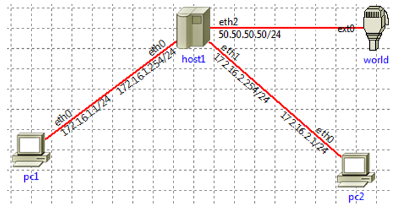

# Networking

We call a network of devices "internet", and what we refer to (THE) "Internet" are many small networks all joined together. Networking is someone complex, as it involves a lot of things: devices <small>(Routers, Hub/Switches...)</small>, Protocols <small>(TCP/UDP/ICMP/ARP/DNS...)</small>, Ports, Network interfaces, models <small>(OSI, TCP/IP)</small>, and addresses <small>(IPV4/IPV6/MAC...)</small>.

<details class="details-n">
<summary>Imunes - free open-source network emulator</summary>
<div class="row row-cols-md-2"><div>

[**imunes**](http://imunes.net/) is a free open-source network emulator in which you can create nodes (hosts, switches, routers...), connect them, add rules (see iptables), and send requests from one computer to another, mostly to test your network configuration.

```bash
$ sudo imunes &
```

You may have multiple sessions.

```bash
$ imunes image -l # list
$ imunes -b -e <id> # kill
```

> There are a lot of newer (and better?) alternatives...
</div><div>

Using the graphical interface

* <kbd>experiment | execute</kbd>: run simulation
* <kbd>experiment | terminate</kbd>: terminate simulation
* <kbd>double-click on a host</kbd>: open a terminal on the host
* <kbd>right-click on a node | configure</kbd>: setup rules <small>(routing, ARP)</small>
  * enable "custom startup config"
  * enable "editor | create | fill default"
  * then use your head

You can run a command on a machine from the terminal with

```bash
$ sudo himage <hostname>@<id> <command>
```
</div></div>
</details>

<hr class="sl">

## LAN, and WAN networks

<div class="row row-cols-md-2"><div>

**Wide area network** (WAN, `réseau mondial/étendu`) is every network outside your LAN network.

**Local Area Network** (LAN, `réseau domestique`) is a network established within a limited area, such as your home.

**Router**: a device usually connecting a LAN network, with a WAN network. It does "routing", meaning selecting the route/path that packets will take to arrive at the destination.

**Hub/Switch**: a device which can be connected to usually at least 4, and up to 64 devices, using Ethernet. They are receiving packets from others hosts, and they handle the delivery of packets while ensuring that they are received in the right order, and are not corrupted.

<details class="details-n">
<summary><b>Ethernet</b>: a cable to connect a device to a Hub/Switch.</summary>

Instead of connecting nodes/devices to each other, they all are connected to a switch/hub using Ethernet (norm IEE 802.3). They are using a technique called "Carrier sensitive multiple access with collision detection", or **CSMA/CP** in short, to handle collisions.

If both the switch and the machine try to send a message at the same time, then both messages are colluding, and are destroyed
  * each other signal that they will re-send the message
  * each network card has its own delay before sending a message again
  * the machine/switch sends the message first, and there is hopefully no problem this time
</details>
</div><div>

**Network topologies** are different ways of connecting devices in a network.

* **Star Topology**: all devices are connected to a central networking device such as a switch or hub

* **Bus Topology**: a single cable "backbone cable", and all devices connect to the cable. If a lot of packets are sent, the cable most likely be saturated.

* **Ring/Token Topology**: each computer is connected to another one, forming a loop. Packets are only moving in one direction, meaning that sometimes packets will do a whole loop (not efficient). If a computer/cable is faulty, then the loop is broken.
</div></div>

<hr class="sr">

## Network interface

<div class="row row-cols-md-2"><div>

A **network interface** is the connection between your machine and the network. It's most likely done by a network card. From the machine point of view, a virtual representation of a network interface was introduced, called a virtual network interface.

For instance, if you are using Ethernet, then you will most likely have a virtual interface called `eth0` <small>(or ethSomething)</small>.

If you are using a VPN, you may see virtual network interfaces such as `tun0` <small>(or tunSomething)</small>.
</div><div>

For applications on a local machine to communicate with each other, there is a special virtual network called **localhost** (127.0.0.1), which is associated with the virtual network interface  **lo** (loopback), allowing local applications to locally transfer data over this virtual network.

> As a machine may have multiple network cards, or a network card may be connected to multiple networks, you have to determine which interface will be used for each communication.
</div></div>

<hr class="sr">

## Ports

<div class="row row-cols-md-2"><div>

A port is something virtual associated with a protocol. By using that, we know that if a message enters the port XXX, then it's using the protocol YYY. 

* There are 65535 <small>(or in short $2^{16}$)</small> available ports
* The first 1024 ports are called "standard ports"

> The protocol used by a port is not set in stone! For security-related concerns, they are usually changed, and ports are also protected by something called a firewall, to hopefully prevent unauthorized users to know which protocol is run by each port. Ports may be closed too.
</div><div>

There are TCP ports, and UDP ports. The former ports are the most well-known ones. Here is the list of [TCP/UDP ports](https://en.wikipedia.org/wiki/List_of_TCP_and_UDP_port_numbers).

* **21**: FTP
* **22**: SSH, SFTP, SCP
* 23: telnet
* 25: SMTP
* **80**: HTTP
* 137: NetBios
* **443**: HTTPS
</div></div>

<hr class="sl">

## MAC address

<div class="row row-cols-md-2"><div>

A **media access control address (MAC address)** is a **unique (physical) address** associated with the network card (`carte réseau`) which the machine uses to connect itself to the internet.

* Can be [spoofed](https://en.wikipedia.org/wiki/MAC_spoofing) <small>(some hacker can usurp your MAC)</small>
* The IP identifies our machine within a network, but if we move to another network, then we will receive a new IP address. That's why we need something that does not change, such as the MAC address.

</div><div>

This is a 6-bytes-long address such as `ff:ff:ff:ff:ff:ff` with 12 hexadecimal characters, separated by a colon.

* The first 6 characters are identifying the vendor/manufacturer. This is called a [OUI](http://standards-oui.ieee.org/oui/oui.txt) <small>(Organizationally unique identifier)</small>.
* The last 6 characters are the unique address
</div></div>

<hr class="sr">

## IPV4 addresses

Internet Protocol version 4 (**IPV4**) addresses are **32-bits long addresses**.

<details class="details-e">
<summary>Dot-decimal notation (<code>Notation décimale pointée</code>, DDN)</summary>

<div class="row row-cols-md-2"><div>

This is the most-known representation of an IPV4 address. We are splitting ours **32 bits** into **4 groups of 8 bits** called **bytes**/octets (`octet`), we are converting them to decimal, and separated with a **dot**.

* Starting with a binary IP <small>(ex: `0101100010[...]01`)</small>
* We are ending with **n.n.n.n** <small>(with each $n \in \[0,\ 255]$)</small>
* Example: `127.0.0.1`

</div><div class="align-self-center">

Given this IP (binary): `01001101001000011110000100000000`

* Split into 4 blocs: `01001101`, `00100001`, `11100001`, and `00000000`
* We convert each bloc: `77`, `33`, `225`, and `0`
* We separate them with a dot: `77.33.225.0`
* [Online tool to convert bin to IP](https://www.browserling.com/tools/bin-to-ip)
</div></div>
</details>

<details class="details-e">
<summary>id_net, id_host, and network address</summary>

<div class="row row-cols-md-2"><div>

The bits in the IP address are actually separated into 2 parts

* **id_net**: a fixed part for every address in a network, that is used to identify the network
* **id_host**: every remaining bit. Pointing to a host in a network, but if there are only null bits (0), then this is the **address of the network**.

You can't guess the number of fixed bits, either it is given by an organism <small>(such as your ISP)</small>, or you are given something called the netmask which is explained a bit further.
</div><div>

Example: is xxx a network address?

We consider the IP `01001101001000011110000100000000` (`77.33.225.0`). We are told that the fixed part is 17 bits long.

* id_net: `01001101001000011` (17 bits)
* id_host: `110000100000000` (32-17=15 bits)

The id_host has non-null bits, so it's not a network address.
</div></div>
</details>

<details class="details-e">
<summary>Classless Inter-Domain Routing (CIDR)</summary>
<div class="row row-cols-md-2"><div>

It is a way to write/share an IP address along the number of bits of the fixed part. The syntax is `IP/n`, such as `192.168.0.0/12`.

* `IP` is the network address
* `n` is the number of fixed bits

> Traditionally, before CIDR, n could only be 8, 16, or 24. They were called A-class, B-class, and C-class networks, used respectively by big, medium, and small-scale organizations. Unfortunately, there was a very fast shortage of B-class networks, which leads to CIDR which has a flexible network size.
</div><div>

We have the address `01001101001000011110000100000000` (`77.33.225.0`). We were told that there are 24 fixed bits.

* We are extracting 24 bits from the address: `010011010010000111100001`
* We are filling the missing bits with `0` (32-24=8): `01001101001000011110000100000000`
* We are converting the bits to DDN: `77.33.225.0`
* We are adding `/24`: `77.33.225.0/24`

The CIDR notation is `77.33.225.0/24`.
</div></div>
</details>

<details class="details-e">
<summary>netmask (<code>Masque de sous-réseau</code>)</summary>

<div class="row row-cols-md-2"><div>

This IP address is called a mask, as it was not created to be assigned to a machine, but to find the number of fixed bits in another IP address.

* We are writing $n$ <small>(=number of fixed bits)</small> non-null bits (1)
* We are filling the remaining bits with null bits (0)

If we know that `77.33.225.0` has 24 fixed bits, then we will write 24 times "1", and 8 <small>(32-24)</small> times "0", giving us `11111111111111111111111100000000` which is `255.255.255.0`.
</div><div>

It's even easier to find the netmask. <small>Example with `77.33.128.0/17`.</small>

* Calculate $\frac{n}{8}$ (<small>$\frac{17}{8}$ gives us $q=2$, $r=1$</small>)
* Calculate $c=255-2^{8-r} + 1$ (<small>$c=255-2^{8-1}=128$</small>)
* The result is
  * $q$ times $255$ <small>(2 times $255$)</small>
  * 1 time $c$ <small>(1 times $128$)</small>
  * and $\min(4-q-1, 0)$ times $0$  <small>(1 times $0$)</small>
* <small>Giving us $255.255.128.0$</small>
</div></div>
</details>

<details class="details-e">
<summary>broadcast mask (<code>Masque de diffusion</code>)</summary>

<div class="row row-cols-md-2"><div>

This mask is used to send a message to EVERY machine in the network. 

We are simply filling the **id_host** with non-null bits (1).
</div><div>

Given the IP `77.33.225.0/24`,

* id_net: `010011010010000111100001` (extract 24 bits)
* id_host: `11111111` (fill last 8 bits with 1)

Giving us `01001101001000011110000111111111` which is `77.33.225.255`.
</div></div>
</details>

<div class="row row-cols-md-2"><div>

<details class="details-e">
<summary>Reserved/Private IP addresses</summary>

There are 3 ranges of IPV4 addresses that are said private/reserved for internal use

* `10.0.0.0/8`
* `172.16.0.0/12`
* `192.168.0.0/16`
</details>
</div><div>
</div></div>

<details class="details-e">
<summary>Subnetwork, subnet, subnetting: divide your network</summary>

<div class="row row-cols-md-2"><div>

Dividing a network into subnetworks/subnet (`sous-réseaux`), is called **subnetting**. For instance, given a network address, you may split it into $n$ subnetworks. In such case

* each network will have its own netmask, and broadcast address <small>(the "minus 2" when counting IPs)</small>
* it means that each network will have $2^{32-n} - 2$ addresses, with $n$ the number of fixed bits

The process is a bit complicated to explain 😢, please read the example too. Your current network address has $N$ fixed bits. Let's say you want to divide your network so that there are $x$ subnetworks.

* Find the lowest $n$ solving $2^n \ge x$
* If $N + n \ge 32$, then you can't
* Each network will have $2^{(32−N-n)}−2$ IP addresses
* Each network is made by permutations of the newly added $n$ bits
</div><div>

Example: Given $172.16.254.0/23$, we have $N = 23$, and we want to divide our network in $x=2$. Currently, your network can host $2^{32-23} - 2 = 512 - 2 = 510$. Dividing the network won't give us $255$ per subnet...

* $2^{1} \ge 2$ giving us $n=1$
* $22 + 1 \le 32$, so we can split our network in two
* Each network will have $2^{(32−23-1)}−2 = 254$ IP addresses
* $172.16.254.0/23$ will be split in
  * $172.16.254.0/24$ <small>(the 24th bit is 0)</small>
  * $172.16.255.0/24$ <small>(the 24th bit is 1)</small>

> **Subnets** are a logical way of dividing a network, while **network segments** are a physical way of doing so.
</div></div>
</details>

<hr class="sl">

## IPV6 addresses

<div class="row row-cols-md-2"><div>

The Internet Protocol version 6 (**IPV6**) address is a **128-bit long address**. It was introduced because of the shortage of IPV4. It's also more efficient due to new technologies.

It looks like this: `2002:6963:6961:2046:616c:636f:6e20:3c33`, which is 8 blocks of 16 bits, separated with `:`. Because it's somewhat long, there are a few rules to shorten it

* Any leading $0$ in a block can be removed <small>(`0014 -> 14`)</small>
* A whole block of $0$ can be replaced with one $0$ <small>(`0000 -> 0`)</small>
* **One**, and only one suite of null-groups, may be merged in `::` <small>(`...:0000:0000:... -> ...::...`)</small>
</div><div>

There are 8 kinds of IPV6 addresses

| Type/Name                        | Prefix (128 bits) | IPV6 notation            |
|----------------------------------|-------------------|--------------------------|
| Unspecified (`non spécifié`)     | 0...0             | ::/128                   |
| LoopBack (=localhost)            | 0...01            | ::1/128                  |
| Multicast (=broadcast)           | 111111110...0     | ff00::/8                 |
| Multicast (using ARP)            |                   | ff02::/8                 |
| Link-local Unicast (subnet only) | 1111111110...0    | ff80::/10                |
| Unique local Unicast (private)   | 11111101...0      | ffd0:://8<br>ffc0::/7    |
| Global Unicast (Internet)        | ...               | 2001..<br>2002...<br>... |
</div></div>

<hr class="sr">

## OSI model

The Open Systems Interconnection (**OSI**) model is a standardized representation of how we could send a message between two machines. It's made of **7 layers** (`couche`): Physical, Data Link, Network, Transport, Session, Presentation, and Application. Although it's newer than the TCP/IP model, the latter remains the most widely used one as it is more compact.

<div class="row"><div class="col-md-7">

When a computer sends a message, it will be sent starting a layer, and go down. When a computer receives a message, it will go up every layer in reverse order.

* **Layer 7 - Application**: programs are exchanging data <small>(HTTP, SSH, SMTP...)</small>
* **Layer 6 - Presentation**: Standardize, encrypt, compress <small>(SSL, TLS...)</small>
* **Layer 5 - Session**: Try to establish a connection <small>(RPC, PAP...)</small>
* **Layer 4 - Transport**: select a protocol <small>(TCP, UDP...)</small>
* **Layer 3 - Network** (`Réseau`, Router): create a packet <small>(IP, NAT, ICMP...)</small>
* **Layer 2 - Data Link** (`Liaison`, Switch): resolve MAC <small>(ARP, ETH...)</small>
* **Layer 1 - Physical** (HUB): binary to signals <small>(links, USB...)</small>
</div><div class="col-md-5">

Each time a `data` go down to be sent, a header is added. This process is called **encapsulation**. 

When a message is received, each header will be removed when going up. This process is called **de-encapsulation**.

The data being sent is named differently according to the headers that were added

* **Level 5 to 7**: data
* **Level 4**: segments (TCP), or datagrams (UDP)
* **Level 3**: packets
* **Level 2**: frames <small>(packets without an IP)</small>
* **Level 1**: stream (bits)
</div></div>

<hr class="sl">

## TCP/IP model

The TCP/IP model was introduced before the OSI model but remains the most used because it's more compact. It's made of 4 layers

* **Layer 4 - Application**: Layers 5 to 7 of OSI
* **Layer 3 - Transport**: Layers 4 of OSI <small>(socket, port...)</small>
* **Layer 2 - Internet**: Layers 3 of OSI <small>(IP, ETH...)</small>
* **Layer 1 - Physical**: Layers 1, and 2 of OSI <small>(Wi-Fi, ADsr, ETH...)</small>

Some are splitting "Layer 1" back into two layers, but it's not in the RFC1122 standard.

<hr class="sr">

## Protocols

<div class="row row-cols-md-2"><div>

**Protocol Data Unit (PDU)**: this is the format that is used to transfer data. This is made of the **headers** of the protocol, followed by the data which is called **Payload** (`charge`).
</div><div>

**Maximum Transmission Unit (MTU)**

To avoid data loss, each interface has a maximum size for a packet. The MTU of `lo` is usually 65536ko, while for others, it's something more like 1500ko <small>(default value)</small>. If a packet is bigger than the MTU, then it will be **fragmented** (`fragmenté`) into smaller packets.

<details class="details-e">
<summary>Example of a packet being fragmented (handled by IP)</summary>

**State of the network**: A is linked to R1 (MTU=1500), R1 is linked to R2 (MTU=1000), and R2 is linked to B (MTU=1500).

* A send 1200 ko to B
* **A to R1**: not fragmented
* **R1 to R2**: we need to split the packet into 2. Each packet will have its own headers, which means that the two packets will be bigger than the original one.
* **R2 to B**: Actually, we don't know what will happen here
  * R2 may merge packets before sending them
  * or, R2 may send two packets, and B will merge them

</details>

</div></div>

* TCP (6)
* UDP (17)
* ICMP (1)

<details class="details-n mt-4">
<summary>IP: internet protocol</summary>
<div class="row row-cols-md-2"><div>

The IP protocol is using this header


* **version**: 4 (IPV4), or 6 (IPV6)
* **IHL**: a quarter of the length of the header, which is usually 20 bytes <small>(so, the IHL would be 5)</small>.
* **TPL**: the size of the entire packet in bytes
* **Fragment ID**: identifier of the packet. Fragmented packets have the same fragment ID.
</div><div>

* **FLAG**:
  * 010 (DF): do not fragment
  * 001 (MF): more fragments are coming
  * 100 (X): reserved
* **Fragment Offset**: index of this package payload in the un-fragmented data. This is the sum of the length of previously fragmented packet payloads. This value is in **bytes** <small>(TPL divided by 8)</small>. For instance, the first fragment would have 0.
* **TTL**: decrease by one each time the packet transit by a host. The packet is destroyed if the TTL reaches 0. This is used to prevent looping.
* **Protocol**: which protocol was used <small>(1=ICMP, 6=TCP, 17=UDP...)</small>. [See the list of IP protocol numbers](https://en.wikipedia.org/wiki/List_of_IP_protocol_numbers).

The size of the payload is **TPL-IHL**.

To check if two packets are fragments, they MUST have

* the same source, destination, id, and protocol
* every packet aside from the last one has the flag MF <small>(flag[+])</small>, while the last has the flag DF <small>(flag[none])</small>.

</div></div>
</details>

> One thing to note, is that for instance in UDP, there is no "IP address" in the header. You should remember that UDP is working at a layer above (Layer 4) the one adding such information (Layer 3). And, as written before, each layer is adding its header, so still for UDP, you would have the header of IP followed by the header of UDP...

<hr class="sl">

## Routing table

<div class="row row-cols-md-2"><div>

When a machine wants to send a packet to another one, the **routing table** will be used to determine

* if we can send the packet directly to the destination
* or, which machine can we ask to do the delivery


You can relate this table to a (switch) case statement that exists in many programming languages.

* The IP will try each destination. The GenMask (Netmask) will be used to get the **network address**. Then, if the IP is within the network range, then we will use this destination.
* If no destination is found, then `0.0.0.0` , will be used. It's leading to what we call the **Default Gateway**, which is usually ending with either ".1" or ".254".
</div><div>

Once you found a destination, the **gateway** indicates how you can reach it. If the gateway is `0.0.0.0`, then it means that you can directly send the packet (LAN). Otherwise, you have to send the packet to the IP stored in the field "gateway".

Another thing that you should take note of is **Iface**, which is the network interface that will be used to send the packet.
</div></div>

<hr class="sr">

## Network filters

<div class="row row-cols-md-2"><div>

Network filters are behaviors applied to a packet matching predefined rules. This section will highly refer to the command `iptables`. 

This command is using tables, the most widely used are **filter packets** (filter), and **network address translation** (NAT). Each table is made of sets of **chains** which are statements "`<expression> <action>`"

* `expression`: is a condition, that if false, will trigger action
* `action`: an action on the packet (filter/NAT), or another chain
</div><div>

<details class="details-e">
<summary>Table "filter"</summary>

This table is used to accept, or drop a packet. There are 3 chains, according to what packets are doing

* **FORWARD**: packets are transiting/passing by this machine
* **INPUT**: packets that have this machine for destination
* **OUTPUT**: packets that have been emitted from this machine

And you have actions such as **ACCEPT/DENY/DROP/...** to drop a packet. 

For instance, this command will DROP any packet using the protocol TCP, on the port 22, which has our machine as the destination, emitted by `172.16.1.1`.

```bash
$ sudo iptables -t filter -A INPUT -s 172.16.1.1 -p tcp --dport 22 -j DROP
```
</details>

<details class="details-e">
<summary>Table "NAT"</summary>

This table is used to modify the IP_SRC, or IP_DEST, usually referred to as translating, mostly to allow machines to communicate with each other, without being aware of which machine they are communicating with.



In the schema above, host1 wants to allow PC1, and PC2 to communicate, but doesn't want PC2 to know that messages are from PC1. When host1 receives a message from PC1, it will replace PC1 address (source) with its own address, and send it to PC2. When receiving a reply from PC2, it will replace its address (dest) with PC1 address, and send the reply to PC1. 

Another case, is that if a machine inside your network is sending a message to the outside world, instead of exposing your machines' IP addresses, you could only expose your host IP address by using NAT. 

There are 3 chains

* **POSTROUTING**: change source (action: SNAT)
* **PREROUTING**: change destination (action: DNAT)
* **OUTPUT**: applied on locally generated packets

For instance, this command will hide the IP addresses of pc1, and pc2, using host1 IP address (50.50.50.50), when they are sending a packet to the world using the network interface "eth2".

```bash
$ sudo iptables -t NAT -A POSTROUTING -o eth2 -j SNAT --to-source 50.50.50.50
```
</details>
</div></div>

<hr class="sep-both">

## 👻 To-do 👻

Stuff that I found, but never read/used yet.

<div class="row row-cols-md-2"><div>

Websites

* [ccna](https://cisco.goffinet.org/ccna/)
* [faidherbe](https://www.faidherbe.org/tutoriel/)
* [Request-response](https://en.wikipedia.org/wiki/Request%E2%80%93response)

Notes about Virtual Private Network (VPNs)

* Create a secure tunnel allowing devices on different networks to communicate.
* PPP (internal VPNs using public/private key)
* PPTP use PPP, Point-to-Point Tunneling Protocol, allow leave network
* IPSec Internet Protocol Security (IPsec) encrypts data using the existing Internet Protocol (IP) framework.

Notes about ...

* VLAN (Virtual Local Area Network)

Other

* point to point network
</div><div>

Notes about protocols

* ISO/OSI. 
  * Session (divide up the data sent into smaller chunks of data=packets) 
  * Network (OSPF=Open Shortest Path First) and RIP (Routing Information Protocol). Shortest number of devices, reliable (packet loss?), faster physical connection (fibre/...).
* Port-forwarding
* IPV6 EUI64

Notes about devices

* Router: Layer3 (use IP)
* Switch: Layer2 (use MAC)
* Switch: Layer3 (use MAC/IP): can do routing

Notes about security

* Access Control List (ACL): rules determining which traffic is allowed/not allowed.
* Streaming network telemetry (modern SNMP?)
* Network Access Control (used with SNMP?)
</div></div>