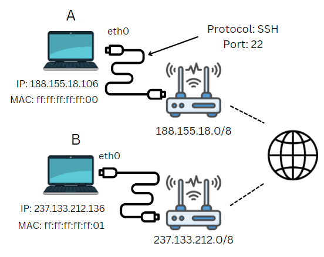

# Networking

A network is a net of devices connected to each other, such as all the devices connected to your internet box 💻.

These devices need to communicate <small>(securely!)</small> between each other ✉️.

Some elements that are involved, shown in the simplified schema:

* **IP Address** 🌍: each network device has an IP address. This allows us to find **where** a machine is. Example: `188.155.18.0`.

* **MAC Address** 🏠: an IP address is not fixed. If a network device is connected to another network, they will have a new IP address. A MAC address is a **unique identifier** to find **who** is this device.

* **Network interface** 📶: this is the logical representation of the network card used to connect to the network. Example: `eth0`.

* **Protocol** 🔐: we define a common language for messages, so that both devices can understand each other. Example: `SSH`.

* **Port** 🐊: this is where <small>(logically)</small> a machine expect a message in a pre-defined protocol. For instance, if a machine receives a message on port `22`, they will expect the protocol to be `SSH`...

## Protocols

Most protocols were sending data as plaintext 🔓. Later, protocols were enhanced with SSL/TLS, adding encryption. Such protocols are usually ending with a **S** such as `HTTP` that became `HTTPS`.

**Layer 7: Application Layer** 🧑

* [File transfer](_protocols/file-transfer.md): FTP, SFTP, SCP
* [Mail transfer](_protocols/mail-transfer.md): SMTP, POP3, IMAP
* [Web requests](_protocols/web-requests.md): HTTP, HTTPS
* [Remote shell access](_protocols/remote-shell.md): SSH, telnet
* [Domain resolution](_protocols/dns.md): DNS
* [Network file system](_protocols/file-system.md): NFS, Samba

**Layer 6: Presentation Layer** 🔒

* none

**Layer 5: Session Layer** 📶

* [RPC](_protocols/rpc.md)

**Layer 4: Transport Layer** 📫

* TCP
* UDP

**Layer 3: Network Layer** 🌍

* ICMP
* IP

**Layer 2: Data Link Layer** 🔢

* ARP

**Layer 1: Physical Layer** 💺

* none

## 👻 To-do 👻

Stuff that I found, but never read/used yet.

* [Old](_old.md)
* [Old - Protocols](../protocols/index.md)
* [Old - Commands](../commands/linux/index.md)
* [Old - Security](../security/index.md)

Network

* E/W = between two apps
* N/S = with the internet
* Firewall => NGFW AMP Duo Email ISE Umbrella Enpoint Web Workload Services
* Cloud FW/SASE
* segmentation

