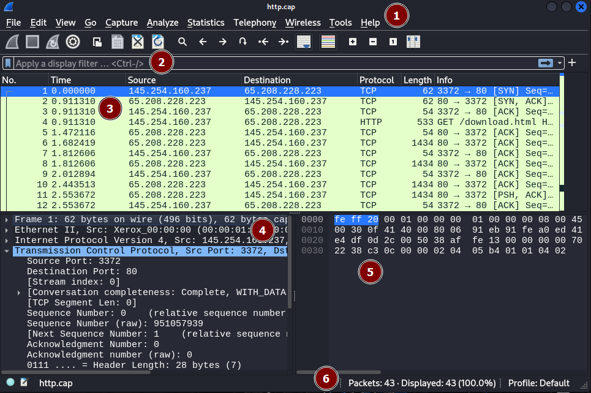

# Wireshark

[Wireshark](https://www.wireshark.org/download.html) is a well-known and popular GUI for packet analysis. When starting wireshark, select an interface to capture traffic. You can also load a saved capture (`.pcap`, `.pcapng`).

* [Documentation](https://www.wireshark.org/docs/)
* [Sample captures](https://wiki.wireshark.org/SampleCaptures)

There is a CLI version called [tshark](/operating-systems/networking/commands/index.md#command-tshark) and a TUI version called [termshark](/operating-systems/networking/commands/index.md#command-termshark).

If packets are encrypted, you need the private key. You can load it at: `Edit > Preferences > Protocols > TLS > RSA Key list > +`. Set the keyfile, while you might also set the server IP and port.

➡️ Protocols such as SSH, RDP, HTTPS, etc.

## Wireshark Basic Overview

Wireshark interface after opening a capture/capturing packets:

The GUI can be divided into the following sections:

1. **Menu Bar** 🌾: refer to [useful menus](#useful-menus)

2. **Display Filter** 🥅: filters applied to the packet list

3. **Packet List** 🗃️: list of captured packets

4. **Packet Details** 📚: Double-click on a packet to see its details. They are divided in dropdowns for each [OSI layer](/operating-systems/networking/_knowledge/index.md#osi-model) in the reverse order. Usually, the last dropdown is the one that you will want to inspect.

5. **Packet Bytes** 👽: nothing of interest?

6. **Capture Summary** ✍️: total number of packets

## Common Features

### Display Filter

To find interesting packets, you can apply filters on the packet list. Check out the bookmark icon to find saved filtering rules.

Additional insight on filtering rules:

* `ip.src == some_IP`, or `ip.dest == some_IP`
* `ip.addr == some_IP`
* `tcp.port == some_port`, or `udp.port == some_port`
* You also have options for each protocol, use autocompletion
  * arp: `arp.opcode == 1`...
  * http: `http.request.method == GET`, `http contains "User-Agent"`...
  * ftp: `ftp.request.command` <small>(port 21)</small> and `ftp-data` <small>(port 20)</small>
  * ...
* You can enter a protocol to only see this one <small>(ex: `arp`)</small>
* You can use operators such as `==, !=, >, <, ...` and logical operators such as `&&, ||, !`. You can also use the text version: `eq, ne, lt, gt, and, or, not...`. [Refer to the documentation](https://www.wireshark.org/docs/wsug_html_chunked/ChWorkBuildDisplayFilterSection.html) + [wiki](https://gitlab.com/wireshark/wireshark/-/wikis/CaptureFilters).

#### Follow Stream

Right-click on a packet and select `Follow > TCP Stream`. This will apply the filter `tcp.stream eq <stream_id>` with a stream being a set of packets forming a conversation and open a window allowing us to easily view the message exchanged.

In the bottom right corner of the newly opened window, you can navigate through the streams using arrows.

#### Useful menus

* **Download HTTP file**: File > Export Objects > HTTP
* **Replace MAC with hostname**: View > Name Resolution > Resolve Physical Addresses
* **Copy [...]**: When inspecting a packet, right-click on a field, and go to "Copy" to copy the value/... Use CTRL+C for the whole line.
* **Protocol stats**: Statistics > Protocol Hierarchy
* **Stats per IP**: Statistics > Endpoints

## 👻 To-do 👻

Stuff that I found, but never read/used yet.

Right-click on a packet > Follow TCP Stream, and you will see in a human-readable way the data exchanged.

* [wireshark](https://unit42.paloaltonetworks.com/wireshark-workshop-videos/)
* Port scanning: look for packets matching the scan (ex: SYN=1;ACK=0)
* `tshark -Y`, `tshark -r xxx.pcapng -T fields -e data.txt`

