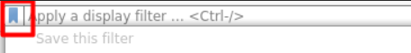

# Wireshark

[Wireshark](https://www.wireshark.org/download.html) is a well-known and popular GUI for packet analysis. When starting wireshark, select an interface to capture traffic. You can also load a saved capture (`.pcap`, `.pcapng`).

* [Documentation](https://www.wireshark.org/docs/)
* [Sample captures](https://wiki.wireshark.org/SampleCaptures)

 

### Filters

To find the interesting line, you can apply filters. Check out the bookmark icon to find saved filtering rules.

* `ip.src == some_IP`, or `ip.dest == some_IP`
* `ip.addr == some_IP`
* `tcp.port == some_port`, or `udp.port == some_port`
* You also have options for each protocol, use autocompletion
  * arp: `arp.opcode == 1`...
  * http: `http.request.method == GET`...
  * ...
* You can enter a protocol to only see this one <small>(ex: `arp`)</small>
* You can use operators such as `==, !=, >, <, ...` and logical operators such as `&&, ||, !`. You can also use the text version: `eq, ne, lt, gt, and, or, not...`. [Refer to the documentation](https://www.wireshark.org/docs/wsug_html_chunked/ChWorkBuildDisplayFilterSection.html) + [wiki](https://gitlab.com/wireshark/wireshark/-/wikis/CaptureFilters).

#### Packets

Double-click on a packet to see details. They are divided in dropdowns for each [OSI layer](/operating-systems/networking/_knowledge/index.md#osi-model).

Usually, the last dropdown is the one that you will want to inspect.

➡️ Right-click on a field and go to filter, to see how to add a rule filtering this field in your search bar.

 

#### Useful menus

* **Download HTTP file**: File > Export Objects > HTTP
* **Replace MAC with hostname**: View > Name Resolution > Resolve Physical Addresses
* **Copy [...]**: When inspecting a packet, right-click on a field, and go to "Copy" to copy the value/... Use CTRL+C for the whole line.
* **Protocol stats**: Statistics > Protocol Hierarchy
* **Stats per IP**: Statistics > Endpoints

If packets are encrypted, you need the private key. You can load it at: `Edit > Preferences > Protocols > TLS > RSA Key list > +`

## 👻 To-do 👻

Stuff that I found, but never read/used yet.

Right-click on a packet > Follow TCP Stream, and you will see in a human-readable way the data exchanged.

* [wireshark](https://unit42.paloaltonetworks.com/wireshark-workshop-videos/)
* Port scanning: look for packets matching the scan (ex: SYN=1;ACK=0)
* `tshark -Y 'http contains "User-Agent"'`
* `tshark -r xxx.pcapng -T fields -e data.txt`

