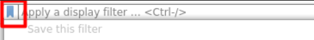

# Wireshark

[Wireshark](https://www.wireshark.org/download.html) is a well-known and popular GUI for packet analysis. When starting wireshark, select an interface to capture traffic. You can also load a saved capture (`.pcap`, `.pcapng`).

### Filters

To find the interesting line, you can apply filters. Check out the bookmark icon to find saved filtering rules.

* `ip.src == some_IP`, or `ip.dest == some_IP`
* `ip.addr == some_IP`
* `tcp.port == some_port`, or `udp.port == some_port`
* You also have options for each protocol, use autocompletion
  * arp: `arp.opcode == 1`...
  * http: `http.request.method == GET`...
  * ...
* You can enter a protocol to only see this one <small>(ex: `arp`)</small>
* You can use operators such as `==, !=, >, <, ...` and logical operators such as `&&, ||, !`. You can also use the text version: `eq, ne, lt, gt, and, or, not...`. [Refer to the documentation](https://www.wireshark.org/docs/wsug_html_chunked/ChWorkBuildDisplayFilterSection.html) + [wiki](https://gitlab.com/wireshark/wireshark/-/wikis/CaptureFilters).

...

## 👻 To-do 👻

Stuff that I found, but never read/used yet.

Once you find something interesting, right-click on it > Follow TCP Stream, and you will see in a human-readable way the data exchanged.

Use File > Export > HTTP to GET download files.

* [wireshark](https://unit42.paloaltonetworks.com/wireshark-workshop-videos/)
* [THM/startup](https://tryhackme.com/room/startup): `wireshark xxx.pcapng`.

