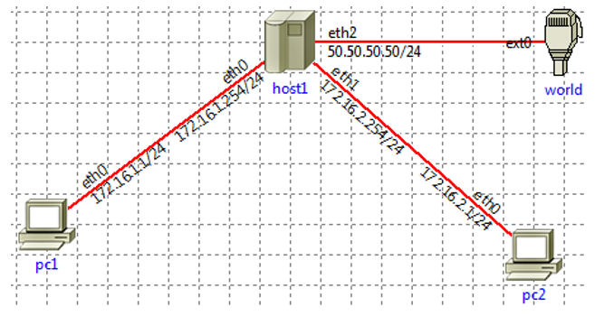

# Gateway

[Go back](../index.md#networking-devices)

<div class="row row-cols-lg-2"><div>

A gateway is a device that serves connecting two or more networks. It's mostly used to connect networking using different protocols or technologies.

➡️ Extremely rarely, a Gateway may be called "Jumpoint".
</div><div>

A gateway can:

* 👮 filter incoming/outgoing traffic
* ⛔ block traffic
* 🌫️ translate addresses/hide the sender
* 💵 Prioritize traffic
* ...
</div></div>

<hr class="sep-both">

## Network rules

<div class="row row-cols-lg-2"><div>

Network filters are behaviors applied to a packet matching predefined rules. This section will highly refer to the command `iptables`.

This command is using tables, the most widely used are **filter packets** (filter), and **network address translation** (NAT). Each table is made of sets of **chains** which are statements "`<expression> <action>`"

* `expression`: is a condition, that if false, will trigger action
* `action`: an action on the packet (filter/NAT), or another chain
</div><div>

<details class="details-e">
<summary>Table "filter"</summary>

This table is used to accept, or drop a packet. There are 3 chains, according to what packets are doing

* **FORWARD**: packets are transiting/passing by this machine
* **INPUT**: packets that have this machine for destination
* **OUTPUT**: packets that have been emitted from this machine

And you have actions such as **ACCEPT/DENY/DROP/...** to drop a packet.

For instance, this command will DROP any packet using the protocol TCP, on the port 22, which has our machine as the destination, emitted by `172.16.1.1`.

```bash
$ sudo iptables -t filter -A INPUT -s 172.16.1.1 -p tcp --dport 22 -j DROP
```
</details>

<details class="details-e">
<summary>Table "NAT"</summary>

This table is used to modify the IP_SRC, or IP_DEST, usually referred to as translating, mostly to allow machines to communicate with each other, without being aware of which machine they are communicating with.



In the schema above, host1 wants to allow PC1, and PC2 to communicate, but doesn't want PC2 to know that messages are from PC1. When host1 receives a message from PC1, it will replace PC1 address (source) with its own address, and send it to PC2. When receiving a reply from PC2, it will replace its address (dest) with PC1 address, and send the reply to PC1.

Another case, is that if a machine inside your network is sending a message to the outside world, instead of exposing your machine IP address, you could only expose your host IP address by using NAT.

There are 3 chains

* **POSTROUTING**: change source (action: SNAT)
* **PREROUTING**: change destination (action: DNAT)
* **OUTPUT**: applied on locally generated packets

For instance, this command will hide the IP addresses of pc1, and pc2, using host1 IP address (50.50.50.50), when they are sending a packet to the world using the network interface "eth2".

```bash
$ sudo iptables -t NAT -A POSTROUTING -o eth2 -j SNAT --to-source 50.50.50.50
```
</details>
</div></div>