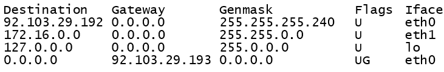

# Routers

[Go back](../index.md#networking-devices)

A router is a device usually connecting a LAN network with a WAN network, while more generically, it connects two networks. 

A router is a type of [Gateway](gateway.md) with the main purpose of delivering data, unlike a gateway which focuses on connecting networks.

It routes packets, meaning, it selects the best path to send traffic. This choice is determined by algorithms such as:

* 💨 Open Shortest Path First (OSPF)
* ☠️ Routing Information Protocol (RIP)
* 🌿 Border Gateway Protocol (BGP)
* ...

These algorithms are using information such as the shortest number of devices to reach the target (hops), the reliability of the path <small>(are packet often lost?)</small>, the network speed <small>(fibre?)</small>...

## Routing table

A router will use a routing table to determine

* if we can send the packet directly to the destination
* or, which machine can we delegate the delivery

**Destination** is a range of IPs. It must be used with **GenMask** (NetMask) to identify what's the range. A destination of `0.0.0.0` with the GenMark `0.0.0.0` means every IP. It's used as a default rule.

⚠️️ The order of rules is important, the first matching one is used.

**Gateway**: if the IP is within a destination, the message is sent to the gateway. If the gateway is `0.0.0.0`, then it means that the device is directly connect to the machine.

Gateways associated with the default rule are usually IP addresses ending with `.1` or `.254`, while it's not mandatory.

The notion of "gateway" used in routing table, is not necessarily a Gateway device. It could be a Router...

 

**IFace** is the interface used to send the packet.

