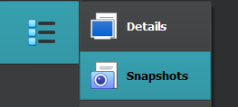

# VirtualBox

<div class="row row-cols-lg-2"><div>

VirtualBox is a popular free virtualization software.

* [Download VirtualBox](https://www.virtualbox.org/)

➡️ I strongly advise using version 7+, because, as far as I'm concerned, I have fewer problems in the newer version.
</div><div>

* ✨ You can create shared folders between host and VM
* ✨ You can copy/paste to/from the VM
* 🏪 You can take snapshots
* 🪲 There are many bugs/the UX is pretty bad
* 🔥 You can configure many things
* 👎 Lack of ways to import/export VMs from/to VMWare
</div></div>

<hr class="sep-both">

## Additional setup

<div class="row row-cols-lg-2"><div>

#### VB Guest Additions

You may need to install Virtual Box Guest Additions later

* Start the machine
* Select <kbd>Device > Insert Guest Additions CD...</kbd>
* Install the software on the CD
* Restart
</div><div>

#### VB Extension pack

You may need to install Virtual Box Extension pack later

* <kbd>Help > About Virtual Box</kbd> to find your version
* [Download Virtual Box Extension pack](https://download.virtualbox.org/virtualbox/) <small>(version/xxx.vbox-extpack)</small>
* File > Tools > Extension Pack Manager > Install

</div></div>

<hr class="sep-both">

## Common features

➡️ On Windows, the "host" key is CTRL (Right).

<div class="row row-cols-lg-2"><div>

#### CTRL+ALT+DEL

* In the menubar: <kbd>Input > Keyboard > Insert CTRL-ALT-DEL</kbd>.
* Use the shortcut: <kbd>HOST + DEL</kbd>

#### Take a snapshot

Click on the menu icon next to your VM,  and select "Snapshot".

<div class="text-center">


</div>

➡️ To avoid problems, you should do it when the VM is off.

➡️ If the machine is started, you can also use the menu <kbd>Machine > Take Snapshot...</kbd> for the menubar.
</div><div>

#### Shared clipboard/folder

Right-click on a machine, and open Settings. 

* In General > Advanced, you can enable the bidirectional clipboard
* In Shared folders, you can create shared folders

➡️ On Windows VMs, you need to install VB Guest Additions.

#### Resize the screen to fit yours

* In the menubar: <kbd>View > Seamless mode</kbd>.
* Use the shortcut: <kbd>HOST + L</kbd>

➡️ For Windows VMs, you need to install VB Guest Additions.

#### VBoxManage

You can use VBoxManage to control VirtualBox from the command line. On Windows, use CMD and not PowerShell.

```ps
# list hard drives
$ "C:\Program Files\Oracle\VirtualBox\VBoxManage" list hdds
```
</div></div>

<hr class="sep-both">

## Active directory notes

<div class="row row-cols-lg-2"><div>

#### Install Windows Server ISO

* Click on new, select the ISO
* Select unattended
* Start the machine
* Process as usual with the setup...
* Power off the machine
* Remove CD <small>(Settings>Storage>CD, the disk icon on the right)</small>

Go to Tools > Network. Create or select an adapter.

* DHCP server must be disabled
* Take note of the gateway address <small>(for later, ex: `X.X.X.1`)</small>

On your VM with your VM

* Click on Settings > Network
* Go to the "Adapter2" tab
* Enable the adapter
* Select "Host-only adapter"
* Select your adapter
</div><div>

#### Random notes

➡️ If the VM crashes often, try reducing the size of the screen. It may be related to your computer overheating and closing it.

➡️ The NAT adapter can mess with some things like when adding a child domain. You should disable it <small>(if applicable/temporarily)</small>.
</div></div>

<hr class="sep-both">

## Random notes

<div class="row row-cols-lg-2"><div>

#### Bug: no automatic mouse integration

By default, you can freely use your mouse between your host and your virtual machine. But, I have a bug 🪲 when restarting a machine closed using "save instance state" in which my mouse is not detected anymore.

➡️ A "patch" is to lock your session before closing the VM.
</div><div>

#### Bug: bidirectional clipboard not working

➡️ Try restarting the VM.
</div></div>