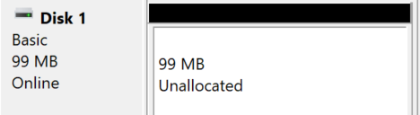

# Active Directory Domain Services (ADDS)

Active Directory Domain Services (ADDS) is a tool to help sysadmin to manage organisation/schools/...

* 🖥️ Manage Computers, Servers, Printers
* 🧑‍🍼️ Manage Users and Groups
* 🚧️ Manage Permissions to access files/apps/...
* ⚖️️ Manage Policies <small>(ex: password length/...)</small>

With ADDS, you log in once, from any machine, and got access to everything that you were giving access to

* 📂 Your files/folders and shared files/folders
* 🖨️ Printers
* ✉️ Applications <small>(emails, vpn...)</small>
* ...

## ✨ Terminology ✨

**Domain Controller** (DC): servers from which you can manage the organisation using ADDS. Any Windows server on which ADDS is installed is a Domain Controller.

**Domain**: for instance, `xxx.com`. You don't need to own it <small>(in a real-world install, you should)</small>. When users will log in to the server, they will use `server/username`.

➡️ The `server` usually is `xxx.com` or `xxx` (alias).

**Objects**: users, computers, printers, shared folders, groups, organization units...

**Security Groups**: they are used to group users, to apply permissions/GPO to everyone that is a member of this group. A user can be in multiple Groups.

**Organizational Units** (OUs): folders used to group object in a similar structure than the organization. You could have one OU per site <small>(ex: Laval, Montreal)</small> and for each site, one OU per service <small>(ex: Direction, Marketing, IT...)</small>. Like groups, you can apply permissions/GPO to an OU.

**Group Policy Objects (GPO)**: policies/rules that are applied on objects. We can use them to enable/disable some Windows features for some users, to configure user workstations...

➡️ More details in the [Permissions](#permissions) section.

## Get started

You must have an image with **Windows Server** 2019/2022. As a student, you can get one for free [here](https://azureforeducation.microsoft.com/devtools).

Notes for Virtual Box

* Click on new, select the ISO
* Select unattended
* Start the machine
* Process as usual with the setup...
* Power off the machine
* Remove CD <small>(Settings>Storage>CD, the disk icon on the right)</small>

Go to Tools > Network. Create or select a adapter.

* DHCP server must be disabled
* Note the gateway is (ex: `X.X.X.1`)

On your VM with your VM

* Click on Settings > Network
* Adapter2
* Enable it
* Select "Host-only adapter"
* Select your adapter

Configure your Server IP Address

* Control Panel
* Network and Internet
* Network And Sharing Center
* Select your network <small>(ex: Ethernet 2)</small>
* Properties > IPV4 > Properties
  * IP: X.X.X.2
  * Mask: 255.255.255.0
  * Default gateway: X.X.X.1
  * DNS: X.X.X.2

Set your DC name

* Click on "Local Server"
* Click on your computer name (in blue)
* Click on "Change"
* Set the name your want
* Restart

Installation ADDS (graphical)

* Start the **Server Manager**
* Click on "Add roles and features"
* Press Next twice
* In Server Roles, select ADDS
* Press Next twice, then Install
* Click on the notification icon with a warning (⚠️)
* Click on "Promote this server to a domain controller"

**Add a forest**

* Give a root domain name (ex: `XXX.com`)
* Add a "restore password"
* Press "Next" 4 times
* Press "Install"

Installation DHCP (graphical)

* Start the **Server Manager**
* Click on "Add roles and features"
* Press Next twice
* In Server Roles, select DHCP Server
* Press Next twice, then Install
* Click on tools > DHCP

Configure your DHCP server

* IPV4 > New Scope
  * Name: Lan1
  * Select a range of addresses
  * You can prevent person from taking some addresses
  * Select a lock duration <small>(ex: 1 day)</small>
* We can reserve an IP address for a specific MAC address
* You can see attributed IPs in "Address leases"

➡️ Use `ipconfig /all` to get the IPv4/MAC address.

**Where to learn?**

* [Introduction to ADDS Structure in Windows Server 2012](https://www.youtube.com/watch?v=lFwek_OuYZ8)

## Main features

##### Manage OUs, Security Groups, and Users

* Start the Server Manager
* Go to Tools > Active Directory Users and Computers

Create an OU

* Right-click on your domain
* New > Organizational Unit
* Give it a name

Delete an OU

* Click on View > Advanced features
* Right-click on your OU
* Go to Properties > Object
* Unselect "Protect object from accidental deletion"
* Apply, then close
* Right-click on your OU, and click on delete

Manager Users

**Create users**

* Right-click on your domain
* New > User
* You must at least add a "Full name" and a "logon"
* Add a password that matches your password policy

**Add a home folder**

* Right-click on a user > properties
* Go to profile
* You could select a local path, or mount a network drive, for instance, `\\ServerName\\SomeFolder\\%username%`.
* The drive will be shown next to the "C:" drive

➡️ The advantage of using `%username%` is that you can edit multiple users, and the value will be replaced for each one.

Create Security groups

* Right-click on your domain
* New > Group

To add members, either 

* Right-click on the group, and select "Add to a group"
* Right-click on an object, select properties, go to "member of", and add your security group

##### Permissions

Configure permissions on a folder

* Right-click on a folder <small>(for instance, on a mounted drive available to users over the network)</small>
* Select properties then Security
* Edit
* Add or remove Security Groups, OUs, or Users. You can also define the permissions for each group.

➡️ We usually allow access to security group instead of users

Create Group Policy Objects

* Start the Server Manager
* Go to Tools > Group Policy Management
* Find the "Group Policy Object" folder
* Right-click on it > New and create a GPO

A GPO is applied to one or more OUs. It can be applied on the whole domain too. These are shown in "Scope > Location". 

* Drag-and-drop the GPO to the domain/an OU to add it inside location.
* You can add groups in security filtering to only apply the GPO to some group inside the selected locations

You can also exclude users/objects in the tab "Delegation".

* Click on "Advanced" and add an object to exclude
* Scroll down in the permission, and check "deny" for the line "Apply group policy"

Once created, you can edit the GPO to edit them.

* Right-click on a GPO > Edit
* Search for the setting you want to edit, and enable/disable/configure available rules

➡️ See specific sections or Google to find settings.

##### Configure a network drive

Configure shared folders

* Start the **Server Manager**
* Go to Tools > Computer Management > Disk Manager
* Select the drive, right-click on it, and ensure it's marked as online <small>(or right-click on "offline" and set it to online)</small>

* Right-click > Initialize Disk <small>(if there is no unallocated)</small>
* Right-click on "unallocated" and create a new volume. You can leave the name empty.

➡️ You can share the whole drive by Right-clicking on it > Properties > Sharing > Advanced Sharing, and enabling the sharing. The path that users will use will be shown below "Network Path" <small>(ex: \\\ServerName\DriveName)</small>.

➡️ You can share a folder on an online drive by Right-clicking on it > Properties > Sharing > Share. Add the groups such as `Domain Users` for everyone. The path that users will use will be shown below "Network Path" <small>(ex: \\\ServerName\FolderName)</small>.

Automatically mount a shared folder as a drive (GPO)

By default, a user need to browse a path like `\\ServerName\Path\\To\Folder\` to access some shared folder on a server. It's possible to create a virtual drive that will point to a shared folder using GPO.

* Start the **Server Manager**
* Go to Tools > Group Policy Management
* Right-click on a GPO > Edit <small>(you could create a GPO and apply it on the whole domain, you can filter rules later...)</small>

Go to User Configuration > Preferences > Windows Settings > Drive Maps. Here, you can map a drive to a folder, and only apply the rule to a group/... 

* Right-click > New > Drive Map
* In Location, add the network path, such as `\\ServerName\Data\Maketing\`
* Select a drive letter <small>(ex: M)</small>
* In the "common" tab, select "remove this item when its no longer applied" and select "item-level targeting". Click on "Targeting" and add the security group that will get access to this mapped drive <small>(ex: Marketing)</small>.

➡️ For conditions like "one of multiple groups", you can right-click on the second item, and in item options, select OR.

##### Configure SNMP

Notes to configure SNMP

* Start the **Server Manager**
* Click on "Add roles and features"
* Press Next thrice
* In Features, select SNMP Service

Once installed, open "Services" and find the SNMP service. Right-click on edit, and edit the properties however you want.

##### Configure TCP/IP parameters

Notes to configure TCP/IP parameters

You can either use the Windows Registry, or a group policy. Here are some parameters that you may want to set.

* SynAttackProtect <small>(SYN flood attacks)</small>
* EnableDeadGWDetect <small>(Detect dead gateways)</small>
* EnablePMTUdiscovery <small>(Avoid fragmentation...)</small>
* KeepAliveTime <small>(Timeout for inactive connections)</small>
* TCPMaxPortsExhausted <small>(Prevent from exhausting ports)</small>
* PerformRouterDiscovery <small>(Can simply the configuration but allow attackers to set up rogue routers/... to redirect traffic)</small>
* NoNameReleaseOnDemand <small>(Release the NetBios name when no longer needed to prevent attacker from obtaining information)</small>
* TcpMaxConnectResponseRetransmissions <small>(can help to prevent SYN flood attacks, but may exhaust system resources)</small>

##### Set up a password policy

Notes to set up a password policy

* Start the **Server Manager**
* Go to Tools > Group Policy Management
* Right-click on a GPO > Edit <small>(you could create a GPO and apply it on the whole domain...)</small>

Go to Computer configuration > Policies > Windows Settings > Security Settings > Account Policy.

There, you can enable history, set password length and age <small>(ex: 6 months)</small>, enable complexity requirements, lockout...

## 👻 To-do 👻

Stuff that I found, but never read/used yet.

* [old.md](_old.md)
* Windows Admin Center
* SConfig <small>(relies on PowerShell to manage ADDS)</small>
* [???](https://www.youtube.com/watch?v=hxgz7MR7MGQ)
* Tools (in the top-right corner)
* Azure AD cloud Sync

* [rdr-it.com](https://rdr-it.com/active-directory/)
* [microsoft](https://learn.microsoft.com/en-us/windows-server/identity/ad-ds/active-directory-domain-services)

