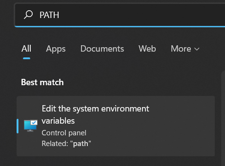
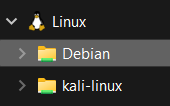

# Windows For Developers

<div class="row row-cols-lg-2"><div>

Windows is commonly used by developers 🍃. While it is less convenient than Linux in some ways, there are some ways to make it suitable for developing software and everything else 🐊.

* [WSL](#windows-subsystem-for-linux-wsl) is commonly used to get a Linux console environment
* [Cygwin](#cygwin) or mingw are commonly used to get a Linux console environment or to get `.exe` versions of Linux commands.
* [VSCode](/tools-and-frameworks/editors/gui/vscode/index.md) or [JetBrains](/tools-and-frameworks/editors/gui/jetbrains/_general/index.md) are commonly used as editors to write code
* [WAMP](/operating-systems/cloud/webservers/apache/wamp.md) is often used to emulate a web server for web development
* [Virtual Box](/operating-systems/others/virtualization/virtualbox/index.md) or [VMWare](/operating-systems/others/virtualization/vmware/index.md) are often used to emulate Linux
* ...
</div><div>

While not specific to Windows, these are often used instead of the Linux command:

* [FileZilla](#file-transfer-protocol-ftp) mostly for FTP
* [Putty MobaXTerm...](#secure-shell-ssh) mostly for SSH, FTP...
* ...

➡️ For articles on Windows, check out the [Windows Club](https://www.thewindowsclub.com/).
</div></div>

<hr class="sep-both">

## Basic knowledge

<div class="row row-cols-lg-2"><div>

#### Window Path

On Linux, when we write a command such as `make`, it will look for it in each folder in the `PATH` and execute the binary if found.

There is the same on Windows. The shortest way to find the menu we are looking for is by writing PATH in the search bar.

<div class="text-center">


</div>

From it, select environment variables then edit `Path` in User variables.
</div><div>
</div></div>

<hr class="sep-both">

## Windows Subsystem for Linux (WSL)

<div class="row row-cols-lg-2"><div>

[Windows Subsystem for Linux (WSL)](https://learn.microsoft.com/en-us/windows/wsl/) is a system that allows us to access a Linux CLI interface. It's basically a [docker](/operating-systems/others/containers/docker/index.md).

[Follow the installation instructions here](https://learn.microsoft.com/en-us/windows/wsl/setup/environment). Basically, open a PowerShell or a CMD as an admin and install any WSL as follows:

```ps
PS> wsl -l -o
Ubuntu                                 Ubuntu
Debian                                 Debian GNU/Linux
...
PS> wsl --install Debian
PS> bash # pop a bash shell
```

You can start it as you would with any program too.

💡 You can also download them from the Microsoft Store. Doing so will enable auto-updates for you.

❌ WSL doesn't natively support graphical apps and some commands.

<br>

#### Access WSL files from Windows

You can use the file explorer:

<div class="text-center">


</div>

> You can also enter the PATH `\\wsl.localhost\` or `\\wsl$`.
</div><div>

#### Graphical interfaces with XMing

[XMing](http://www.straightrunning.com/XmingNotes/) is a low-quality graphical tool. Install it and [XMing fonts](http://www.straightrunning.com/XmingNotes/) <small>(scroll to "public domain" to find the download links)</small>. To run graphical apps, you will mostly use `-c` to the commands that support it.

```shell!
$ subl -c          # sublime text
$ emacs -c         # emacs
$ ./idea.sh -c     # IntelliJ
```

<br>

#### Common usage of WSL

Most of the time, we integrate WSL within our code environment 🚀. For instance, when pressing the compile/run button from your IDE, it will compile/run the code using the WSL.

* [IntelliJ and WSL](https://www.jetbrains.com/help/idea/how-to-use-wsl-development-environment-in-product.html) (Java IDE)
* [CLion and WSL](https://www.jetbrains.com/help/clion/how-to-use-wsl-development-environment-in-product.html) (C/C++ IDE)
* [VSCode C/C++ and WSL](https://code.visualstudio.com/docs/cpp/config-wsl)
* ...
</div></div>

<hr class="sep-both">

## Cygwin

<div class="row row-cols-lg-2"><div>

[Cygwin](https://www.cygwin.com/) is a collection of Unix tools ported to Windows 🐲. It also includes a CLI such as WSL aside from the fact that it only allows us to run installed commands <small>(e.g. there is no APT command...)</small>.

1. [Download Cygwin Installer/Updater](https://www.cygwin.com/install.html)
2. Run it, press next
3. Install from the internet, Next, Next, Next, Next
4. Pick a mirror in the list, Next
5. In view, select full
6. From this point, select the commands that you want by replacing "Skip" <small>(in the column "New")</small> with a version of the command.
7. Complete the installation
</div><div>

Commands are stored in `C:/cygwin64/bin`. It should have been added to your path so that you can call, for instance, `make` or `make.exe` from any Windows terminal.

```ps
$ make -v
# GNU Make 4.3
# ...
```

➡️ See also: [apt-cyg](https://github.com/transcode-open/apt-cyg) <small>(2.9k ⭐, 2017 🪦)</small>.
</div></div>

<hr class="sep-both">

## Protocols

<div class="row row-cols-lg-2"><div>

#### Secure Shell (SSH)

Some tools:

* [Putty](https://putty.org/) <small>(GUI)</small>
* [mobaxterm](https://mobaxterm.mobatek.net/) <small>(GUI)</small>
* [xshell](https://www.xshell.com/en/xshell/) <small>(👻)</small>
* [mRemoteNG](https://github.com/mRemoteNG/mRemoteNG) <small>(👻)</small>
* [GitSCM](https://git-scm.com/) <small>(CLI providing SSH among many others)</small>
* ...
</div><div>

#### File Transfer Protocol (FTP)

[FileZilla](https://filezilla-project.org/) is commonly used. To add a target server, use the "Site Manager" menu. Drag/Drop files to upload/download them.

* [WinSCP](https://winscp.net/eng/index.php) <small>(👻)</small>
* [CuteFTP](https://www.globalscape.com/cuteftp) <small>(👻)</small>
* [GitSCM](https://git-scm.com/) <small>(CLI providing SCP among many others)</small>
* ...
</div></div>

<hr class="sep-both">

## InnoSetup

<div class="row row-cols-lg-2"><div>

[InnoSetup](https://github.com/jrsoftware/issrc) is a tool for creating modern Windows installers. You can download it [here](https://jrsoftware.org/isdl.php) 🍬. Simply install and run the software.

Use the `Create a new file using the Script wizard` wizard. It will generate a `.iss` with the configuration to generate the installer.

#### Target folder

Ex: All files will be stored in the `app` folder.

```diff
-Source: "a\path\to\app\*"; DestDir: "{app}"; Flags: ignoreversion recursesubdirs createallsubdirs
+Source: "a\path\to\app\*"; DestDir: "{app}\app"; Flags: ignoreversion recursesubdirs createallsubdirs
```
</div><div>

#### CLI options

```ps
PS> file.exe /SILENT      # Only show the progress bar
PS> file.exe /VERYSILENT  # No installer visible
# Add custom options
PS> file.exe /VERYSILENT /MERGETASKS="desktopicon,postinstall"
```
</div></div>

<hr class="sep-both">

## 👻 To-do 👻

Stuff that I found, but never read/used yet.

<div class="row row-cols-lg-2"><div>

* [mingw](https://sourceforge.net/projects/mingw/)
* [winpty](https://github.com/rprichard/winpty)
* [msys2](https://www.msys2.org/)
* [Pengwin](https://github.com/WhitewaterFoundry/Pengwin) <small>(wlinux)</small>
* [vcxsrv](https://sourceforge.net/projects/vcxsrv/)
* [chocolatey](https://chocolatey.org/)
* [autohotkey](https://www.autohotkey.com/)
* [voidtools](https://www.voidtools.com/)
* [cyberduck](https://cyberduck.io/)

SysInternals

* [procmon](https://learn.microsoft.com/en-us/sysinternals/downloads/procmon) (admin required, see _image)
* [strings](https://learn.microsoft.com/en-us/sysinternals/downloads/strings): similar to Linux strings.
* [tpcView](https://learn.microsoft.com/en-us/sysinternals/downloads/tcpview): Windows tcpdump
* SysInternals Suite: tools. Can be installed or loaded remotely (`\\live.sysinternals.com\tools\xxx.exe`)
* ProcMon > Process Monitor Filter > Process Name is xxx.exe then Include
* [Noriben](https://github.com/Rurik/Noriben) wrapper to procmon but may miss some stuff
</div><div>

```ps
C:\> IEX((new-object net.webclient).DownloadString('https://chocolatey.org/install.ps1'))
C:\> choco upgrade chocolatey
C:\> choco install docker-desktop
C:\> choco install python vscode git wsl2 openssh openvpn microsoft-windows-terminal WSL2
C:\> Add-MpPreference -ExclusionPath "C:\Users\xxx\AppData\Local\Temp\chocolatey\"
```
</div></div>