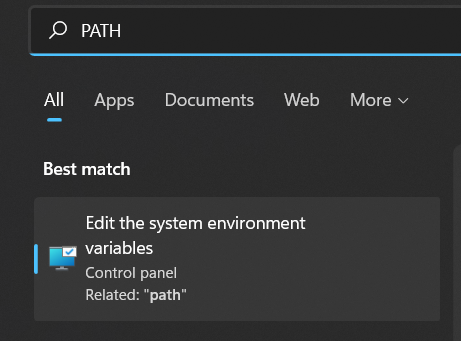

# Linux on Windows

Knowledge related to using Linux on Windows.

> If you are having some problems, you may [find something in the Windows club](https://www.thewindowsclub.com/).

<hr class="sl">

## Windows Subsystem for Linux (WSL)

<div class="row row-cols-md-2"><div>

Windows Subsystem for Linux lets developers run a GNU/Linux environment including most command-line tools, utilities, and applications, directly on Windows [according to the Windows Subsystem for Linux Documentation](https://learn.microsoft.com/en-us/windows/wsl/).

1. Click on the search icon/search for a program
2. Look for PowerShell
3. Right-click on it > "Run as administrator"


</div><div>

4. Enter `wsl --install` to install Ubuntu
5. You can install `debian`, `kali-linux`... See `wsl --list --online`.
6. You will most likely have to reboot

Once, you did, in the search bar / search for a program, 

7. Search for `WSL`, or `debian` if you installed Debian...
8. Wait for a few seconds
9. Enter a username, and a password <small>(there is no echo, you won't see your password)</small>

On Windows, you can browse your WSL files in the Linux section of your file explorer


> You can also enter the PATH `\\wsl.localhost\`, or `\\wsl$`.
</div></div>

> There are a lot of downsides to a WSL, such as the lack of a graphical user interface, or some commands not working, including many of the network-related commands such as "ping".

<div class="row row-cols-md-2"><div>

<details class="details-e">
<summary>Add a low-quality graphical user interface (GUI)</summary>

It will be a low-quality interface, but it's still an option for some software. You need to install [XMing](http://www.straightrunning.com/XmingNotes/), and [XMing fonts](http://www.straightrunning.com/XmingNotes/). **Scroll to "public domain" to find the download links**. Then, every time you need to use `-c` (graphical version), start XMing first. For instance

```bash
$ sudo apt-get update
# editor: sublime text
$ sudo apt-get install sublime-text
$ subl -c
# editor: emacs
$ sudo apt-get install emacs
$ emacs -c
# editor: IntelliJ
# ... get the tar.gz on their Website, tar xvf idea.tar.gz
# inside the bin folder, run the .sh
$ ./idea.sh -c
```
</details>
</div><div>

<details class="details-e">
<summary>Instead of adding a GUI, use WSL in your GUI</summary>

Instead of adding a low-quality graphical user interface, it would be better to use WSL directly in your text editor (VSCode...), or directly in your IDE (IntelliJ...).

* [IntelliJ](https://www.jetbrains.com/help/idea/how-to-use-wsl-development-environment-in-product.html) can use a Java installed on a WSL, detect installed WSLs, and create a project on one of them.
* [Configure CLion](https://www.jetbrains.com/help/clion/how-to-use-wsl-development-environment-in-product.html) to use a WSL C Compiler, which make functions such as `fork()` available
* [Get started using VSCode with WSL](https://learn.microsoft.com/en-us/windows/wsl/tutorials/wsl-vscode), or this for [C/C++, and WSL](https://code.visualstudio.com/docs/cpp/config-wsl)
</details>
</div></div>

<hr class="sr">

## Cygwin

<div class="row row-cols-md-2"><div>

Cygwin is "a large collection of GNU and Open Source tools which provide functionality similar to a Linux distribution on Windows" according to the [Cygwin Project website](https://www.cygwin.com/). 

This is basically a collection of .exe for most, if not all, Linux commands. This will allow you, if you want, to call Linux commands in PowerShell.

You will also have a Cygwin console, in which you can run your commands, but **you can only install new commands using the installer**.
</div><div>

1. [Download Cygwin Installer/Updater](https://www.cygwin.com/install.html)
2. Run it, press next
3. Install from the internet, Next, Next, Next, Next
4. Pick a mirror in the list, Next
5. In view, select full

Now, you have to pick the **commands** you want, which means replacing "Skip" <small>(in the column "New")</small> with a version of the command. You should use the search bar. You may install `vim`, `wget`/`curl`, and `make` to compile Makefiles.

6. Finish the installation
7. Now, you should open a new terminal on Windows (ex: PowerShell, cmd, ...) and write a command

```bash
$ make -v
# GNU Make 4.3
# ...
```

<details class="details-e">
<summary>What to do if the command is 'not found'?</summary>

* You may have to restart your IDE (if you are using one), or your computer.
* If this is still not working, check that `C:/cygwin64/bin` is in the PATH.
</details>

</div></div>

<hr class="sl">

## FTP (file transfer protocol)

<div class="row row-cols-md-2"><div>

You will most likely have to transfer files to a server. You may use the graphical interface provided by [FileZilla](https://filezilla-project.org/).

Once connected,

* **Upload**: simply drag and drop a file into a folder on your server.

* **Download**: simply drag and drop a file into a folder on your computer.
</div><div>

Add a server

* File > Site Manager...
* New
* You will most likely use SFTP
    * Host is the IP of your server
    * Port is usually 22, you can leave it empty
    * Enter your username
    * Connect

</div></div>

> There is also [WinSCP](https://winscp.net/eng/index.php) if you want to use FTP/SCP. <br>
> There is also [CuteFTP](https://www.globalscape.com/cuteftp). <br>
> You may directly use the scp command without any interface, if you install GitSCM (see SSH).

<hr class="sr">

## SSH (Secure Shell)

<div class="row row-cols-md-2"><div>

Here are two graphical interfaces

* [Putty](https://putty.org/)
* [mobaxterm](https://mobaxterm.mobatek.net/)
* [xshell](https://www.xshell.com/en/xshell/)
* [mRemoteNG](https://github.com/mRemoteNG/mRemoteNG) (support RDP too)

</div><div>

Otherwise, if ssh is not installed on your computer, you can install it using [GitSCM](https://git-scm.com/), which will also install scp, and some other commands you might need.
</div></div>

<hr class="sl">

## Environment variables

<div class="row row-cols-md-2 mt-4"><div>

The shortest way to find the menu we are looking for is by writing PATH in the search bar.



</div><div class="align-self-center">


<br>

Click on a line, such as `Path`, then Edit. You can add entries to the Path!
</div></div>

<hr class="sep-both">

## 👻 To-do 👻

Stuff that I found, but never read/used yet.

<div class="row row-cols-md-2"><div>

* [winpty](https://github.com/rprichard/winpty)
* `wsl --update`, `wsl --shutdown`, `wsl -l -v`
</div><div>
</div></div>