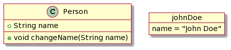

# Oriented-Object programming

<div class="row row-cols-md-2"><div>

Object-Oriented Programming (**OOP**) 🧸 is a paradigm emphasizing the use of **objects** to encapsulate both data and code.

It often means a lot more code to write, but it's supposed to improve reusability and modularity. OOP does not apply to all problems.

At the very least, it can make the code easier to implement and maintain, especially in teams, as we can break the code into small junks and code them, roughly one at a time.
</div><div>

Some common concepts are:

* Encapsulation
* Inheritance
* Polymorphism
* Abstraction
* Open recursion
</div></div>

<hr class="sep-both">

## Classes and objects

<div class="row row-cols-md-2"><div>

A **class** can be seen as a **template**/blueprint 🖨️ to create objects. It defines an **abstract** concept, such as a person or an animal... while an **object** is **concrete**, for instance, the person "John Doe" 🪆.



🗺️ The process of creating an object from a class is called **Instantiation**. Objects are commonly called instances.

#### Attributes

A class has properties called **attributes** that are used to store data. For instance, each person has a name.

```java
class Person {
    public String name;
}
```

#### Methods

A class also has **methods** which are functions that can access attributes or other methods usually by using `this`/`self`/....

```java
class Person {
    [...]
    
    public void changeName(String name) {
        this.name = name; // set the attribute "name" to...
    }
}
```

➡️ In some languages, `this`/... is optional when implicit.
</div><div>

#### Constructors

We are usually constructors to instantiate a new object, which usually means initializing the attributes. A constructor is a [method](#methods).

```java
class Person {
    public String name;
    
    public Person(String name) {
        this.name = name; // init attribute "name"
    }
}
```

Instantiation is done by calling the constructor. Some languages use the `new` keyword, some don't.

```java
Person johnDoe = new Person("John Doe");
// johnDoe.name is equal to "John Doe"
```

#### Members

Attributes and methods are usually called members. There are two categories of members: **instance members** and **class members**.

The former are the usual members. The latter are members of the class, meaning that 

* every instance has the same value for an attribute

```java
public static final String DEFAULT_NAME = "John DOE"; // java
```

* we don't need an instance to access a member

```java
String defaultName = Person.DEFAULT_NAME;
```
</div></div>

<hr class="sep-both">

## Access control

<div class="row row-cols-md-2"><div>

Classes, methods, attributes, and many other concepts have some form of access control commonly done using a visibility modifier.

For instance, **C#** has a modifier called `internal` only allows some classes in the same "output file" <small>(assembly file)</small> to use this class. 

```cs!
internal class XXX {} // same assembly only
```
</div><div>

Common modifiers are:

* **Java**: `private`, `protected`, `public`, `<none>` <small>(package-private)</small>
* **C++**: `private`, `protected`, `public`
* **PHP**: `private`, `protected`, `public`
* **C#**: `private`, `protected`, `public`, `internal`
* ...

➡️ Python devs are using naming conventions to determine the visibility, while in Ruby, modifiers are present but not enforced...
</div></div>

<hr class="sep-both">

## Inheritance

<div class="row row-cols-md-2"><div>

Inheritance allows classes to be based on another class. They will inherit [attributes](#attributes) and [methods](#methods), and may be able to:

* ✍️ Add new methods and attributes
* 📝 Change the behavior of existing methods (**override**)

The **ancestor** is usually called:

* parent
* superclass
* base class

The **inheritor** is usually called

* child/heir
* subclass
* derived class

👉 Most languages have a root class, such as `Object` in Java.

👉 Many languages forbid multiple inheritance <small>(multiple parents)</small>.
</div><div>

#### Polymorphism

Polymorphism refers to the ability to treat objects of child classes as objects of their parent class.

```java
class A {}           // A is a parent class of B and C
class B extends A {} // B is a child class of A
class C extends A {} // C is a child class of A
// usual behavior of a child class
B b = new B();       // Stores as B
b.someMethodInA();   // Calls B's method (if overridden)
b.someMethodInB();   // Calls B's method
```

As B and C inherit from A, they can be stored in a variable of type `A`.

```java
A a = new B();       // Stores as A
a.someMethodInA();   // Calls B's method (if overridden)
```

**Liskov substitution principle** refers to the fact that regardless of the child class we use, the program should work as expected.

```
A a = new B(); // if it works with B, then it works with C
```
</div></div>

<hr class="sep-both">

## 👻 To-do 👻

Stuff that I found, but never read/used yet.

<div class="row row-cols-md-2"><div>
</div><div>
</div></div>