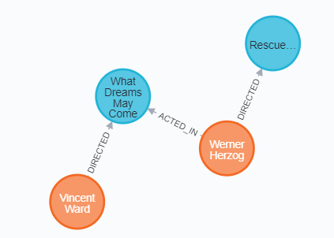

# Cypher

Cypher is a language close to the SQL language, as you got clauses and the syntax is quite similar. It's used by Neo4J in their graph database, **and you will need an account to try it out**. You can either use their sandbox, and your database will be hosted in the cloud, or you can host locally your database.

* Create an account
  * [use their online database](https://neo4j.com/sandbox/)
  * OR [install Neo4J Desktop](https://neo4j.com/download/)
* create a new project (a group of databases)
* create a new database
* then start your database

In this course, I will use [this database](https://github.com/memorize-code/memorize-references/raw/main/info/nosql/movies.cypher), created by my teacher, [Stefania Dumbrava](http://web4.ensiie.fr/~stefania.dumbrava/) .

<hr class="sl">

## Core concept

<div class="row mt-3 mx-0"><div class="col-md-4">


</div><div class="align-self-center col-md-8">

This is what a query result will look like. You got

* **4 nodes**, each node is like a tuple in a SQL database, they have properties called **attributes**
* **3 edges**, they are the relation between the nodes, you may have a lot of them between two nodes and in a lot of directions

The whole result is what we call a **graph**.
</div></div>

<hr class="sr">

## Nodes

<div class="row row-cols-md-2 mx-0"><div class="align-self-center">

**Nodes** are represented with something inside two parentheses. It's made of 3 elements, and all three are optional. The syntax is

```none
(ref:label{})
```

</div><div>

* **ref**: used to reference this node later in the query
* **label**: tags that you may give to a node. Useful when looking at nodes having a tag. Nodes can have multiple tags.
* **{}**: you may give **attributes** and their value here in JSON (`{ attribute:value, ... }`)
  * if you are selecting a node, this is like a WHERE in SQL
  * otherwise, you will use this to add/update properties of a node
</div></div>

<details class="details-e">
<summary>Examples</summary>

* `()`: every node
* `(m)`: store every node in m
* `(:Movie)`: every node having the label "Movie"
* `(m:Movie)`: store nodes having the label "Movie" inside m
* `(m:Movie{released:2008})`: store movies released in 2008 in m
* `(:Movie{released:2008})`: only movies released in 2008
* `(:{released:2008})`: nodes having released = 2008
* `(r:{released:2008})`: store nodes having released = 2008 in r
</details>

> **Pro tip**: you can use `.` to get an attribute from a node.

<hr class="sl">

## Edges

<div class="row row-cols-md-2 mx-0"><div class="align-self-center">

**Edges** are represented with something inside two brackets. It's made of 3 elements, and all three are optional. The syntax is

```none
[ref:label{}]
```

* **ref**: same as for node
* **label**: same as for node, you may add multiples labels by separating them with `|`
* **{}**: same as for node
</div><div>

But, aside from representing the edge, we also need to be able to represent the link between nodes using this edge.

* `node--node` : anonymous edge without direction
* `node-->node` : anonymous edge with direction
* `node<--node` : anonymous edge with direction
* `node-edge-node` : edge without direction
* `node-edge->node` : edge with direction
* `node<-edge-node` : edge with direction

You will replace `node` following the format in the previous section, and `edge` with the format in this section. An edge is "anonymous", because we are not adding "edge" (`[ref:label{}]`) in the pattern.
</div></div>

<details class="details-e">
<summary>Examples</summary>

* `()--()`: every two nodes linked together
* `()-->()`: every two nodes, with one having an arrow going to the other
* `(:Movie)--(p)`: store in p, nodes linked with nodes "Movie"
* `(:Movie)<-[:ACTED_IN]-(p)`: store in p, nodes that "ACTED_IN" a Movie
* `(p)-[:ACTED_IN]->(:Movie)`: same
* `()-[a:ACTED_IN]-()`: store in a, every edge labeled "ACTED_IN"
</details>

<hr class="sr">

## Simple request

<div class="row row-cols-md-2 mx-0"><div>

```cypher
MATCH graph
RETURN something
```

* A **graph** is nodes and edges, use the syntax of the previous sections
* Something may be 
  * a value, a reference, or a graph
  * some JSON
</div><div class="align-self-center">

<div>

* **Clauses names are not case-sensitive** (uppercase, lowercase, mix of both)
* You can put everything on the same line
* You can make multiple requests in one call, by separating requests with a `;` <small>(=no `;` for the last one)</small>
</div>

* Comments are made with `//` or `/* ... */`
* Concatenate strings with `+`
</div></div>

<details class="details-e">
<summary>Examples</summary>

* `MATCH (n) RETURN n`: return every node
* `MATCH (m:Movie) RETURN m`: return every node labeled "Movie"
* `MATCH (m:Movie) RETURN m.title`: return the title of every node labeled "Movie"
* `MATCH (m:Movie) RETURN {title:m.title, desc: m.tagline}`: ... as JSON
* `MATCH (m:Movie) RETURN m.title, m.tagline`: ... as a Table
* `MATCH (:Movie)<-[:ACTED_IN]-(p) RETURN p`: nodes that acted in a movie
</details>

<hr class="sl">

## Cypher basic clauses

The order of the clauses in a request is `MATCH > WHERE > RETURN > ORDER BY > SKIP > LIMIT`.

<details class="details-e">
<summary>MATCH (<code>SQL FROM/WHERE</code>)</summary>

As we saw, you call `MATCH` with a graph.

```cypher
MATCH (m:Movie) RETURN m
MATCH m = (:Movie) RETURN m
MATCH g = (:Movie)-[]-() RETURN g
// as a where, but you can only use EQUALS (only released in 2008)
MATCH (m:Movie{released: 2008}) RETURN m
// catesian product
MATCH (m), (p) RETURN m, p
```

> **Pro tip**: You can chain matches if needed.
</details>

<details class="details-e">
<summary>WHERE (<code>SQL WHERE</code>)</summary>

It's working like in SQL. The where will filter the nodes that do not match the condition in the where. Where is taking a boolean, and you can chain conditions with `AND/OR/NOT/IS/XOR`.

* `=, !=, <>, >, <, >=, <=, ...`
* ex: `ref.attribute <> 5`
* `attribute IN [value, value]`
* `attribut =~ "regex"`
* `attribute STARTS WITH, ENDS WITH, CONTAINS`
* `ref:label`: true if ref got this label, false else
* `exists(ref.attribute)`: check if "attribute" exists
* `type(edge) == 'name'`: test if an edge got this name
* you can write an edge in the WHERE like you did in the match

The match can help you simplify complex where clauses, so don't hesitate to use it, as follows

```cypher
// released after 2000
MATCH (m) WHERE m:Movie AND exists(m.released) AND m.released > 2000 RETURN m
// could be simplied to
MATCH (m:Movie) WHERE exists(m.released) AND m.released > 2000 RETURN m

// match every node that PRODUCED a movie, and the movie
MATCH (p)-[:PRODUCED]->(m:Movie) RETURN p, m
// version using where
MATCH (p)--(m) WHERE (p)-[:PRODUCED]->(m:Movie) RETURN p, m
```
</details>

<details class="details-e">
<summary>RETURN (<code>SQL SELECT</code>)</summary>

```cypher
MATCH (m:Movie) RETURN m // node
MATCH (m:Movie) RETURN DISTINCT m // no duplicates results
MATCH (m:Movie) RETURN m.title, m.released // table with title+released
MATCH (m:Movie) RETURN {title: m.title, year: m.released} // JSON
MATCH (m:Movie) RETURN m.title AS title, m.released AS year // rename
```
</details>

<details class="details-e">
<summary>ORDER BY (<code>SQL ORDER BY</code>)</summary>

```cypher
MATCH (m:Movie) RETURN m.title ORDER BY m.title // ASC
MATCH (m:Movie) RETURN m.title ORDER BY m.title ASC
MATCH (m:Movie) RETURN m.title ORDER BY m.title DESC
```
</details>

<details class="details-e">
<summary>LIMIT AND SKIP (<code>SQL LIMIT</code>)</summary>

`SKIP` is used to skip results, while `LIMIT` is used to limit the number of results.

```cypher
// return the oldest movies
MATCH (m:Movie) RETURN m ORDER BY m.released 
SKIP 10 // skip the first 10 results
LIMIT 3 // return only 3 results
```
</details>

<hr class="sr">

## Cypher advanced clauses

<details class="details-e">
<summary>WITH (<code>No equivalent in SQL</code>)</summary>

`WITH` is allowing you to update what you matched, and prepare things for the next matches. You can use WHERE, ORDER BY, LIMIT, etc. inside a WITH!

```cypher
// what's the average released year for the movies in the database?
MATCH (m:Movie) RETURN ROUND(AVG(m.released))
// using a WITH
MATCH (m:Movie) WITH ROUND(AVG(m.released)) as avg RETURN avg
// and now, let's say we want the movies released in avg (=1998)
MATCH (m:Movie) WITH ROUND(AVG(m.released)) as avg 
MATCH (m{released: avg})
RETURN m
```
</details>

<details class="details-e">
<summary>OPTIONAL MATCH (<code>No equivalent in SQL</code>)</summary>

This clause is after the MATCH, before the WHERE. You can try to match something, but if there is no match, then the variable will be null.

```cypher
// for each film, we want to know who acted_in, if someone
// acted in (otherwise, it will be null)
MATCH (a:Movie)
OPTIONAL MATCH (a)<-[r:ACTED_IN]-()
RETURN a.title, r
```
</details>

<hr class="sl">

## Create-Update-Delete

<details class="details-e">
<summary>CREATE (<code>SQL INSERT</code>)</summary>

Simply give the graph you want to create.

```cypher
CREATE (:Movie{title: "My movie", released: 2021})
// create from something existing
MATCH (m:Movie{title: "My movie"}) CREATE (m)<-[:ACTED_IN]-(:ShowbizPerson{name: "me"})
```
</details>

<details class="details-e">
<summary>UPDATE (<code>SQL UPDATE</code>)</summary>

As we did in SQL, simply "`SELECT`" and update your selection with `SET`.

```cypher
MATCH (p:ShowbizPerson{name: "me"})
SET p.name = "My name", p.born = 2021
// same as
MATCH (p:ShowbizPerson{name: "me"})
SET p.name = "My name" SET p.born = 2021
```
</details>

<details class="details-e">
<summary>REMOVE/DELETE (<code>SQL DELETE/ALTER/DROP</code>)</summary>

```cypher
// REMOVE an attribute
MATCH (p:ShowbizPerson{name: "My name"}) REMOVE p.born RETURN p

// DELETE an edge
MATCH (:ShowbizPerson{name: "My name"})-[r]-() DELETE r

// DETACH DELETE a node
// DETACH = delete incident edges, optional if they were already deleted
// DELETE = delete the node
MATCH (p:ShowbizPerson{name: "My name"}) DETACH DELETE (p)
```
</details>

<hr class="sr">

## Functions

We already saw some functions such as `type`, or `ROUND/AVG`, you got the complete list in the [documentation](https://neo4j.com/docs/cypher-manual/current/functions/), but it's good to know these

* `keys(node)`: names of the attributes of a node
* `properties(node)`: attributes and values of a node
* `labels(node)`: returns the labels of a node
* `nodes(graph)`: returns the nodes in a graph
* `relationships(graph)`: returns all the edges of a graph
* `id(node)`: ID of a node

And some useful aggregates functions

* `COUNT(something)`: number of results
* `MIN(something)`, `MAX(something)`, `SUM(something)`, `AVG(something)`: like in SQL

<hr class="sl">

## Lists

If needed, Cypher got support for lists, allowing you to do a lot of things as you could do in Python.

<div class="row row-cols-md-2 mx-0"><div>

* `range(min,max)`: returns a list of values [min, max]
* `head(list)`: return the first element
* `tail(list)`: remove the list without the head
* `size(list)`: size of a list
* `reverse(list)`: reverse a list
</div><div>

* `[x in range(0,5)|x]`: returns [0,1,2,3,4,5]
* `[x in range(0,5) WHERE x+2<5 |x^2]`: returns [0,1,4]
  * only 0,1,2 are passing the criteria `x+2<5`
  * then we are evaluating each value as `x^2`

</div></div>

<details class="details-e">
<summary>Indexes of your list ✨</summary>

* `list[0]`: first element
* `list[-1]`: last element
* `list[1..3]`: list of `list[1]`+`list[2]`
* `list[..3]`: list of `list[0]`+`list[1]`+`list[2]`
* `list[0..]`: list of `list[0]`+`list[1]`+...
</details>

Example

```cypher
// almost copied from the documentation
// return the list of the release dates for the movies linked to "Keanu Reeves"
MATCH (a:ShowbizPerson {name: 'Keanu Reeves'})
RETURN [(a)-->(b) WHERE b:Movie | b.released] AS years
````

<hr class="sr">

## Exercises

<details class="details-s">
<summary>Which movies Meg Ryan acted in?</summary>

```cypher
MATCH (:ShowbizPerson{name: "Meg Ryan"})-[:ACTED_IN]->(m:Movie)
RETURN DISTINCT m.title
```
</details>

<details class="details-s">
<summary>Who directed the movie The Matrix?</summary>

```cypher
MATCH (:Movie{title: "The Matrix"})-[:DIRECTED]-(s:ShowbizPerson)
RETURN s.name
```
</details>

<details class="details-s">
<summary>Movies release between 1990-2000 (included)?</summary>

```cypher
MATCH (m:Movie)
WHERE m.released>=1990 AND m.released<=2000
RETURN m.title
```
</details>

<details class="details-s">
<summary>Which actor played in a movie with Tom Cruise?</summary>

```cypher
MATCH (s:ShowbizPerson)-[:ACTED_IN]->(:Movie)<-[:ACTED_IN]-(:ShowbizPerson{name: "Tom Cruise"})
RETURN DISTINCT s.name
```

We added DISTINCT because an actor may have played in a movie with Tom Cruise more than once.
</details>

<details class="details-s">
<summary>Who both wrote and produced the same movie?</summary>

```cypher
MATCH (w:ShowbizPerson)-[:WROTE]->(:Movie)<-[:PRODUCED]-(p:ShowbizPerson)
WHERE w.name = p.name
RETURN DISTINCT w.name
```

or

```cypher
MATCH (w:ShowbizPerson)-[:WROTE]->(:Movie)<-[:PRODUCED]-(w)
RETURN DISTINCT w.name
````

or

```cypher
MATCH (w:ShowbizPerson)-[:WROTE]->(:Movie)
MATCH (w)-[:PRODUCED]->(:Movie)
RETURN DISTINCT w.name
```

</details>

<details class="details-s">
<summary>How many wrote or produced a movie?</summary>

```cypher
MATCH (p:ShowbizPerson)-[r:WROTE|PRODUCED]->(:Movie)
RETURN DISTINCT COUNT(p)
```
</details>

<details class="details-s">
<summary>Give the persons directly linked with "Kevin Bacon".</summary>

```cypher
MATCH (:ShowbizPerson{name: "Kevin Bacon"})--(p:ShowbizPerson)
RETURN DISTINCT p
```

An alternative answer, by my teacher (too hard 😭)

```cypher
MATCH p=shortestPath((:ShowbizPerson{name:"Kevin Bacon"})-[*1..2]-(c))
WHERE c.name <> "Kevin Bacon"
WITH collect(c.name) AS names
RETURN names
```
</details>

<details class="details-s">
<summary>Give the persons indirectly linked with "Kevin Bacon".</summary>

```cypher
MATCH (:ShowbizPerson{name: "Kevin Bacon"})--()--(p:ShowbizPerson)
RETURN DISTINCT p.name
```

An alternative answer, by my teacher (too hard 😭)

```cypher
MATCH p=shortestPath((:b{name:"Kevin Bacon"})-[*1..2]-(c))
WHERE c.name <> "Kevin Bacon"
WITH collect(c.name) AS names
MATCH (a) WHERE NOT a.name in names
WITH collect(a.name) AS cnames
RETURN cnames
```
</details>

<hr class="sl">

## Source

* Teaching at the ENSIIE
* <https://en.wikipedia.org/wiki/Cypher_(query_language)>