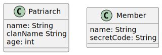
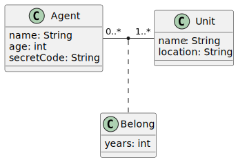

# From database diagram to relational representation

<div class="row row-cols-md-2"><div>

#### Rule 1: a class translates to a relation

The class below:

<div class="text-center">


</div>

Correspond to the relation:

```php!
Patriarch(name: String, #clanName: String, age: int)
Member(name: String, #secretCode: String)
```

<br>

#### Rule 2: n..* to m..* relationships

The association `Leads` below:

<div class="text-center">


</div>

Correspond to the relation:

```php!
Leads(#clanName=>Patriarch.clanName, #secretCode=>Member.secretCode, years: int)
```

And the constraint <small>(as there is a 1..*)</small>:

```php!
clanName IN Leads
```

➡️ Alternatives syntax are `#clanName=>Patriarch(clanName)`/...

<br>

#### Rule 3: * to 0..1 or 1 relationships

...
</div><div>

...
</div></div>