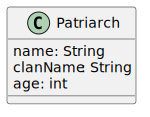

# From database diagram to relational representation

<div class="row row-cols-md-2"><div>

#### Rule 1: a class translates to a relation

The class below:

<div class="text-center">


</div>

Correspond to the relation:

```php!
Patriarch(name: String, #clanName: String, age: int)
```
</div><div>

...
</div></div>