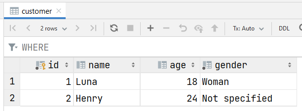
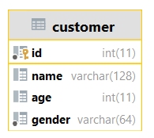

# Relational databases

Relational databases are storing data into **tables** and **columns**. Tables are linked together using (foreign) **keys**. You can view a relational database as an Excel table.

The [Structured Query Language (SQL)](../sql/index.md) is the most used language to query and manage relational databases.

Relational databases are managed by a **Database Management System** (DBMS) or RDBMS for Relational DBMS.

* 💵 Oracle
* 🍰 PostgreSQL
* 🐈 MariaDB
* 🍃 MySQL
* 🦐 SQLite
* 🐭 Microsoft SQL  Server (MSSQL)
* ...

➡️ You may try a few of them online at [sqliteonline](https://sqliteonline.com/). When installing a [WAMP Server](/operating-systems/webservers/apache/wamp.md), you will install a database (MariaDB or MySQL).

## Terminology

A **record/tuple/row** 💵 is an entry in a table, such as `(1, Luna, 18, 'Woman')` or `(2, Henry, 24, 'Not specified')`.

An **attribute/variable** 🛻 is a column in a table, such as `id`, `name`, `age`... Attributes have a type, and may have constraints <small>(such as Not Null...)</small>.

A **key** 🔑 is a set of one or more attributes used to identify a row. Keys must be unique, and every row must have a key.

* Primary key <small>(set of attributes, must be unique and not null)</small>
* Foreign key <small>(a key taking values from another key in another table)</small>
* Artificial key <small>(incrementing (+=1) each time we are adding a row)</small>

The attribute `id` is an artificial key. In another table, we can use this number to reference the associated customer.

➡️  It's common to pre- or post-fix columns such as `id` (ex: `c_id`) if there are many columns with the same name, or for other reasons.

## 👻 To-do 👻

Stuff that I found, but never read/used yet.

* CRUD/ACID
* Data lake
* Data warehouse
* ETL tools

