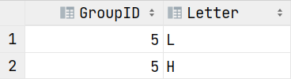
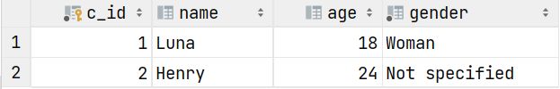

# Structured Query Language

You can see a DML request, as a request returning a table. You will define in **SELECT** the attributes of your table, in **FROM** where the tuples are selected, and in **WHERE** some restrictions on the tuples selected.

<details class="details-e">
<summary>Select (<code>Projection</code>)</summary>

<div class="row mx-0 row-cols-md-2"><div>

If I'm using `Select name FROM customer`, I will get a table with **a column "name"** and the tuples will be the values for "name" in customer <small>(I should escape name, otherwise this may not work in every DBMS)</small>.

```sql
-- Select every attribute of a table
SELECT * FROM customer;
SELECT id, name, age, gender FROM customer;

-- no duplicate results (each line once)
SELECT DISTINCT name, gender FROM customer;

-- name is renamed as 'Customer name'
SELECT name as 'Customer name', id FROM customer;
-- escape name
SELECT `name`, id FROM customer;

SELECT 5 FROM customer; -- 5 in every row
SELECT 5, name FROM customer; -- (5, name) in every row
SELECT age + 1 FROM customer; -- simple calculation
```
</div><div>

```sql
-- a bit complex as we are using both renaming
-- and escape (name)
SELECT id as 'c_id', `name`, age FROM customer;
```

Output: 

```sql
-- a stupid request with
-- 5 in the first column
-- and the first letter of the name in the 2nd column
SELECT DISTINCT 5 as 'GroupID',
                LEFT(name, 1) as 'Letter'
FROM customer;
```

Output: 

</div></div></details>

<details class="details-e">
<summary>From</summary>

You are using columns in select. But they are coming from somewhere... That's where the `FROM` comes in handy. Pick the table <small>(for more than one, see JOINT clauses)</small> you want to select columns (and their values) from.

```sql
-- the basic 🤓
SELECT * FROM customer;
-- prefix (used later, ONLY WHEN NEEDED)
SELECT customer.* FROM customer;
SELECT c.* FROM customer c;
SELECT c.name FROM customer c;

-- this is the cartesian product, you will get
-- count_lines(c1) * count_lines(c2) records
-- LEARN ABOUT JOINTURES LATER
SELECT * FROM customer c1, customer c2;
```
</details>

<details class="details-e">
<summary>Where (<code>Restriction</code>)</summary>

Most likely the most complex one. You can filter your result using this clause.

```sql
-- you can use > >= = <> (same as !=) < <=
SELECT name FROM customer WHERE name <> 'Luna'; -- Henry
SELECT name FROM customer WHERE name = 'Luna'; -- Luna

-- && and || are working too, but we are using AND and OR
Select name FROM customer WHERE name = 'Luna' OR gender <> 'Woman'; -- Both
Select name FROM customer WHERE name = 'Luna' AND gender <> 'Woman'; -- None

SELECT name FROM customer WHERE name IN ('Luna'); -- Luna
SELECT name FROM customer WHERE name IN ('Luna', 'Henry'); -- Both
SELECT name FROM customer WHERE name NOT IN ('Luna');

SELECT name FROM customer WHERE name IS NULL; -- none
SELECT name FROM customer WHERE name IS NOT NULL; -- Both

-- age in [18,24], same as age >= 18 AND age <= 24
SELECT name FROM customer WHERE age BETWEEN 18 AND 24;
```

You can use **patterns** too, with `_` an unknown character, and `%` a string of unknown characters that may be empty. **BEWARE, patterns aren't case-sensitive** (=`I` is the same as `i`).

```sql
-- any character followed by una
SELECT name FROM customer WHERE name LIKE '_una';
-- Ending with una
SELECT name FROM customer WHERE name LIKE '%una';
-- Starting with Lun
SELECT name FROM customer WHERE name LIKE 'Lun%';
```

And you can use a nested request

```sql
-- you will use the variable c in the nested request.
-- if the request return one row, then EXISTS is true
SELECT name FROM customer c WHERE EXISTS (SELECT NULL);
SELECT name FROM customer c WHERE NOT EXISTS (SELECT NULL);

-- same as previously, but the set is generated with a request
SELECT name FROM customer WHERE name IN (SELECT NULL)
SELECT name FROM customer WHERE name NOT IN (SELECT NULL)

-- the attribute is greater than every value returned in the nested request
-- the nested request must return exactly one attribute
SELECT name FROM customer c WHERE name >= ALL (SELECT NULL, NULL);
-- at least one
SELECT name FROM customer c WHERE name >= ANY (SELECT NULL)
```
</details>

A summary is needed 🧐, here you go ✨🚀.

| Select | From | Where |
| --- | --- | --- | 
| one attribute | one table | >, >=, <, <=, =, !=, <> |
| multiples attributes (,) | multiples tables = **cartesian product**| IN, NOT IN <small>(set)</small> |
| all (*) | multiples tables = see JOINT (later) | IS/IS NOT <small>(NULL/...)</small> |
| no duplicates (DISTINCT) | prefix a column | BETWEEN min and max |
| rename (... as ...) | | LIKE 'pattern' | 
| a value | | EXISTS/NOT EXISTS <small>(request)</small> |
| a function | | IN/NOT IN <small>(request)</small> |
| | | ALL/ANY |

> SQL is pretty flexible (in a way). Every value can be replaced with a request returning one column and one row. A table, can be replaced with a request too. This example is simply showing that you can use requests almost everywhere 😎✨.
> ```sql
> -- dumb example
> SELECT (SELECT 5) as 'five' FROM (SELECT 5) s WHERE 5 = (SELECT 5) 
> ```

<hr class="sl">

## DML (Data Manipulation) - Useful stuff

<details class="details-e">
<summary>UNION/INTERSECT/EXCEPT <i class="small">on two sets of results</i></summary>

You can make the union, the intersection, or the difference of two requests' results, **but they must have the same number of selected elements** in SELECT. **TRICK**: We usually use `NULL` (or a value) if the two queries do not have the same number of selected element.</small>.

```sql
SELECT name, age FROM customer c
UNION -- you could use INTERSECT or EXCEPT 
SELECT name, NULL FROM customer c;
-- 4 rows
-- Luna (18)
-- Henry (24)
-- Luna (null)
-- Henry (null)
```

> **Note**: ORDER, or LIMIT can only be applied on the whole request.
</details>

<details class="details-e">
<summary>Calculations <i class="small">(on all tuples, on groups of tuples)</i></summary>

You can **only** make calculations in **SELECT**, or in a new clause **HAVING** <small>(NOT in the WHERE, but you may use a nested request)</small>.

```sql
-- the most used ones
SELECT SUM(age) FROM customer; -- 18+24
SELECT AVG(age) FROM customer; -- (18+24)/2
SELECT MIN(age) FROM customer; -- 18
SELECT MAX(age) FROM customer; -- 24
SELECT COUNT(*) FROM customer; -- 2 = number of tuples
-- you may add DISTINCT (no duplicates)
-- or ALL (default, allow duplicates)
SELECT COUNT(DISTINCT age) FROM customer; -- 2 (no duplicates ages)
SELECT SUM(DISTINCT age) FROM customer; -- 18 + 24
SELECT SUM(ALL age) FROM customer; -- same as SUM(age)
```

The clause **HAVING** is only working on groups <small>(ex: group by name, and check the average age per record having this name)</small>. You may create groups of one element by making groups on the primary key as the primary key is unique.

```sql
-- this request is returning the sum of age PER GENDER
SELECT gender, SUM(age) FROM customer 
GROUP BY gender -- Woman(18), Not specified (24)

-- same but we are ONLY KEEPING GROUPS for which the SUM is greater (or equals) than 20
SELECT gender, SUM(age) FROM customer 
GROUP BY gender HAVING SUM(age) >= 20 -- Not specified (24)

-- better (' and ` are not needed if there are no spaces)
SELECT gender, SUM(age) as 'Sum of age' FROM customer 
GROUP BY gender HAVING `Sum of age` >= 20
```
</details>

<details class="details-e">
<summary>Conditional select</summary>

```sql
SELECT
	-- concatenate Ms/Mr/none and the name
    CONCAT((CASE gender
                WHEN 'Woman' THEN 'Ms. '
                WHEN 'Man' THEN 'Mr. '
                ELSE '' -- default
        END), name) as 'Name'
FROM customer
-- Ms. Luna
-- Henry
```

An alternate form, useless here, but you can change the "=" with something else...

```sql
SELECT
    CONCAT((CASE WHEN gender = 'Woman' THEN 'Ms. '
                WHEN gender = 'Man' THEN 'Mr. '
                ELSE '' -- default
        END), name) as 'Name'
FROM customer
```
</details>

<hr class="sr">

## DML (Data Manipulation) - Joint clause

The last time we tried to use two tables, we got the cartesian product, **which is what you will get if the joint clause fails**. This clause will try to merge the tables in the FROM. Given the two following tables Customer2 ("A") and Purchase ("B")




<details class="details-e">
<summary>NATURAL JOIN (<code>Jointure Naturelle</code>, <small>>=SQL-92</small>)</summary>

Cartesian product based on the columns having the **same name**.

```sql
-- name of every customer that made of purchase
SELECT * FROM customer2 NATURAL JOIN purchase
-- result: [(1, 'Luna', ..., '1', '2021-10-23'), (1, 'Luna', ..., '2', '2021-10-23')]
```

> **Beware of Natural Join!!!** You may have missed the fact that you got the column 'name' (example) in both tables making your result different from what you were expecting (it happens, really...).
</details>

<details class="details-e">
<summary>NATURAL JOIN before? <small>(<=SQL-89)</small></summary>

We were making a cartesian product, before filtering the results in the where.

```sql
SELECT * FROM customer2 c, purchase p
WHERE c.c_id = p.c_id
```
</details>

<details class="details-e">
<summary>JOIN on an attribute (<code>Jointure sur un attribut</code>)</summary>

This is called **Equi-join**. This idea is the same as for NATURAL JOIN, but you are picking the columns this time.

* **Equi-join (attributes)**, <small>>=SQL-92</small>

```sql
SELECT * FROM customer2 JOIN purchase USING (c_id)
-- merge the column c_id available in both table
-- sort of better NATURAL JOIN as you are picking columns
-- you may use ',' to add conditions in 'USING'
```

* **Equi-join (criteria)**

```sql
SELECT c.*, p_id, `date` FROM customer2 c JOIN purchase p ON c.c_id = p.c_id
-- same result, we should use using in this case so this is more wordy than usual
-- you may use 'AND' to add conditions in 'JOIN ON'
```
</details>

<details class="details-e">
<summary>OUTER JOIN (<code>Jointure externe</code>)</summary>

Until now, the row "(2, Henry, ...)" was never shown, because there was no "c_id=2" in purchases. You can show such records using OUTER JOIN.

```sql
SELECT * FROM customer2 c LEFT OUTER JOIN purchase p
	ON c.c_id = p.c_id -- p.c_id can be null 
SELECT * FROM customer2 c RIGHT OUTER JOIN purchase p
	ON c.c_id = p.c_id -- c.c_id can be null 
SELECT * FROM customer2 c FULL OUTER JOIN purchase p
	ON c.c_id = p.c_id -- either c.c_id or p.c_id can be null 
```
</details>

> You may note that you can chain jointures, for instance
> 
> ```sql
>  /* ... */ FROM A NATURAL JOIN B NATURAL JOIN B /* ... */
> -- not tested recently 😖
> FROM (TABLE_A NATURAL JOIN TABLE_B) b JOIN TABLE_C ON /* ... */
> ```

<hr class="sl">

## DDL (Data Definition)

<details class="details-e">
<summary>Databases</summary>

```sql
-- list databases
SHOW DATABASES

-- alter
ALTER DATABASE db_name CHARACTER SET utf8mb4

-- delete
DROP DATABASE db_name
```
</details>

<details class="details-e">
<summary>Tables</summary>

<details class="details-e mt-3">
<summary>Attributes and constraints</summary>

<div class="row mx-0 row-cols-md-2"><div>

These are the most used of the predefined constraints.

* You can create your **own constraints** using `constraint nale check (bool_expression)` (named constraint) or `check (bool_expression)` (unammed constraint).

<hr>

A **table should always have a primary key** <small>(artificial key, or foreign key)</small>! A primary key can be made of multiple attributes (ex: id_user, and id_purchase), and in such case, the key **as a whole** must be unique, and not null, but a part of the key (meaning each attribute) may be null, or not unique.

```sql
-- considering (id_user, id_purchase, item_name) with key(id_user, id_purchase)
(5, 12, "Book") -- ok
(5, 13, "Computer") -- ok
(5, 12, "Phone") -- NOT OK, duplicate key
```

</div><div>

<details class="details-e">
<summary>FOREIGN KEY</summary>

If a record in a table is referencing another record in another table, a good way of doing that is for the referencing table to reference the **primary key** of the other table, as it is unique for each record. That's what you can do with **FOREIGN KEY**. But, if you are deleting, or updating, the referenced record's primary key, then by default the request will fail, as this would break things with the referencing record. You may change this default behavior:

```sql
-- if referenced deleted, delete referencing
FOREIGN KEY (attribute1) REFERENCES some_table(attribute1) ON DELETE CASCADE,
-- default: block request
FOREIGN KEY (attribute1) REFERENCES some_table(attribute1) ON DELETE RESTRICT,

-- if referenced updated, update referencing
FOREIGN KEY (attribute1) REFERENCES some_table(attribute1) ON UPDATE CASCADE,
-- default: block request
FOREIGN KEY (attribute1) REFERENCES some_table(attribute1) ON UPDATE RESTRICT
```
</details>

* Constraints

```sql
-- custom constraints
-- 1) applied on an attribute
attribute date check (attribute > '2000-01-01'),
-- 2) applied on the table
constraint example check (LENGTH(fullname) > 5),
check (id_user IN (/* some request */))
```
</div></div>
</details>

```sql
ALTER TABLE a_table
    -- rename
    RENAME new_name
    RENAME COLUMN a_column TO new_name;
    -- add
    ADD a_column a_type a_default_value
    ADD CONSTRAINT name CHECK ...
    -- add/drop default value
    ALTER column_name DROP DEFAULT
    ALTER column_name SET DEFAULT
    -- drop 
    DROP COLUMN column_name
    DROP CONSTRAINT constraint_name
;
```

<details class="details-e">
<summary>TIP: Transfer data from one table to another</summary>

```sql
ALTER TABLE a_table rename tmp_name;

-- create another table
CREATE TABLE a_table(...);

-- copy values in the new table
INSERT INTO a_table(...) SELECT ... from tmp_name;

-- cleanup
DROP TABLE tmp_name;
```
</details>

```sql
DROP TABLE a_table;
```
</details>

<hr class="sr">

## DCL (Data control)

<details class="details-e">
<summary>Create and delete user</summary>

```sql
DROP USER username
DROP USER username CASCADE -- drop schema too
```

* `DELETE USER username@'%'`.
</details>

<details class="details-e">
<summary>Manage privileges (<code>permissions</code>)</summary>

<div class="row mx-0 row-cols-md-2"><div>

You can grant permissions to each user, or grant permission to a role, and grant the role to each user. There are tons of privileges, so you should refer to the documentation of your DBMS.

```sql
GRANT xxx, yyy ON sometable TO someuser
GRANT xxx, yyy ON *.* TO someuser
GRANT xxx, yyy ON *.* TO PUBLIC -- everyone
GRANT ALL PRIVILEGES ON *.* TO someuser -- all privileges

REVOKE xxx ON *.* TO someuser
```

A user can grant his privileges to another user, if his privileges were given WITH GRANT OPTION. If the giver lose his privileges, then the receiver may lose his privileges unless he was also given the privilege by someone else.

```sql
GRANT xxx ON yyy TO zzz WITH GRANT OPTION
```
</div><div>

Once created, you can grant privileges to a role, as you would for a user.

```sql
CREATE Role role_name
CREATE Role role_name with admin user -- role managed by an admin
```

**Note** : you can only grant privileges on one table at once, and to one user by request.

<table class="table table-bordered table-striped border-dark">
<thead><tr><th colspan="2">Some privileges</th></tr></thead>
<tbody>
<tr><td>SELECT</td><td>DELETE</td></tr>
<tr><td>UPDATE</td><td>UPDATE(ATTRIBUTE)</td></tr>
<tr><td>INSERT</td><td>CREATE</td></tr>
<tr><td>ALTER</td><td>DROP</td></tr>
<tr><td>EXECUTE</td><td>...</td></tr>
</tbody>

</table>
</div></div>
</details>

<hr class="sl">

## Advanced concepts

<details class="details-e">
<summary>Transactions</summary>

Sometimes, you need to chain the queries in order to keep the database coherent. Every query in the transaction will be executed before another transaction (or query) is proceeded.

```sql
-- sequential
set transaction serializable
```

The transaction "ends" when you use either COMMIT or ROLLBACK. You can also use transactions to only allow some kind of changes (ex : read only).

```sql
-- select
set transaction read only /*code*/
set transaction read committed /*code*/
-- update/insert/delete...
set transaction read write /*code/
```
</details>

<details class="details-e">
<summary>Views</summary>

Views are virtual tables, that may be used to make things easier to access complex tables, or to prevent users from accessing some attributes in a table. Basically, **a view is a virtual table created from a SQL request**.

```sql
-- create
CREATE VIEW nomVue [Attributs] AS requêteSQL
-- check delete/update before creating view
CREATE VIEW nomVue [ Attributs ] AS requêteSQL WITH CHECK OPTION
-- delete
DROP VIEW nom_vue
```
</details>

<hr class="sr">

## CheatSheet and conventions

* **Conventions**

**Avoid** using **reserved keywords**, and **spaces**, **use lowercase** and **snake case**, when **naming** something. Naming is quite important in a DBMS, more than ever, as names will last long.

Do not prefix/postfix attributes such as "id", prefix it in complex requests. Prefix foreign keys with the whole name of the referenced table.

As always, give relevant names to indexes, views, and constraints.

<hr class="sl">

## Sources

* <https://en.wikipedia.org/wiki/Join_(SQL)>
* [Naming conventions](https://launchbylunch.com/posts/2014/Feb/16/sql-naming-conventions/)

French

* <https://sql.sh/>
* <https://fxjollois.github.io/cours-sql/> (quite good 🤓🚀)