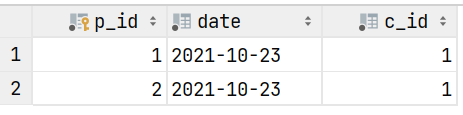

# SQL FROM Clause

<div class="row row-cols-md-2"><div>

The FROM clause specify which tables we are selecting data from.

* From the table "customer"

```sql!
[...] FROM customer [...]
```

* From the cartesian product of "c1" and "c2".

```sql!
[...] FROM c1, c2  [...]
```
</div><div>

In many scenario, you will select more than one table. If these tables share attributes with the same name, we need to prefix them.

```sql!
SELECT xxx.* FROM xxx [...]; -- table prefixed
SELECT x.* FROM xxx x [...]; -- alias prefixed
```

For instance:

```sql!
SELECT c.id, p.id FROM Customer c NATURAL JOIN Purchase p;
```
</div></div>

<hr class="sep-both">

## Multiple tables

<div class="row row-cols-md-2"><div>

Let's say we want to join these customer, and purchase below.





If the join fails, the cartesian product is done instead. Join can be chained and mixed.

<br>

#### NATURAL JOIN

Cartesian product based on the columns having the **same name**.

```sql!
SELECT p_id, name FROM customer NATURAL JOIN purchase
```

The `c_id` column is the only one present in both tables. The result is `[(1, 'Luna'), (2, 'Luna')]`.

🔥️ Because the join is not explicit, you may have unexpected results.
</div><div>

#### JOIN on an attribute

The **Equi-join** is an explicit NATURAL JOIN. The second form can be used when column have different names.

```sql!
-- can be used on multiple column with ","
[...] FROM customer JOIN purchase USING (c_id)
[...] FROM customer c JOIN purchase p ON c.c_id = p.c_id
```

<br>

#### OUTER JOIN

Until now, the row "(2, Henry, ...)" was never shown, because there was no "c_id=2" in purchases. You can show such records using OUTER JOIN.

```sql!
/* p.c_id can be null */
[...] FROM customer c LEFT OUTER JOIN purchase p ON c.c_id = p.c_id
/* c.c_id can be null */
[...] FROM customer c RIGHT OUTER JOIN purchase p ON c.c_id = p.c_id
/* both can be null */
[...] FROM customer c FULL OUTER JOIN purchase p ON c.c_id = p.c_id
```
</div></div>