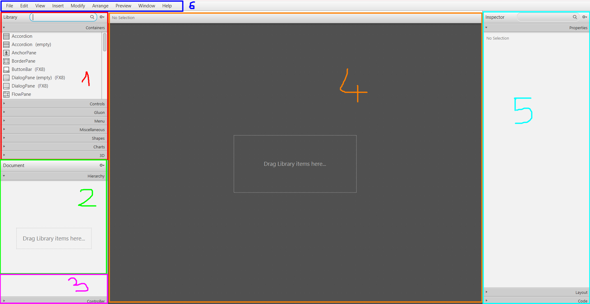

# JavaFX

<div class="row row-cols-md-2"><div>

[JavaFX](https://openjfx.io/) is an open-source java library to create graphical interfaces.

JavaFX views are stored `.fxml` files usually created using [Scene Builder](https://gluonhq.com/products/scene-builder/) 🛝 which is a `WYSIWYG` editor <small>(What You See Is What You Get)</small>.

* [Official installation instructions](https://openjfx.io/openjfx-docs/) 🚀
* [Official Javadoc](https://openjfx.io/javadoc/20/) 🌿
* [My notes to install JavaFX and Scene Builder](_sub/install.md)
</div><div>

**Common errors** 🔥:

* `Graphics pipeline error`: you are missing OS-specific files. For instance, `javafx-base-xx-win.jar` on Windows.

* `JavaFX runtime component missing`: you are missing a vm option, refer to `--module-path` and `--add-modules`.

* `Can't load FXML error`: the controller do not fit your FXML <small>(duplicate IDs, mismatched type...)</small>
</div></div>

<hr class="sep-both">

## Main

<div class="row row-cols-md-2"><div>

JavaFX Main class must extend `Application`. This code below create a `Scene` with a Label showing `Hello, World!`.

```java
import javafx.application.Application;
import javafx.scene.Parent;
import javafx.scene.Scene;
import javafx.scene.control.Label;
import javafx.stage.Stage;

public class MainUI extends Application {
    public static void main(String[] args) {
        launch(args);
    }

    @Override
    public void start(Stage primaryStage) {
        Parent root = new Label("Hello, World!");
        Scene scene = new Scene(root, 800, 600);
        primaryStage.setScene(scene);
        primaryStage.show();
    }
}

```
</div><div>

#### Load FXML

Instead of creating `root` from the code, we usually load a [FXML](#fxml). This code may raise an `IOException` that must be handled!

```java
// import javafx.fxml.FXMLLoader;
// import java.net.URL;
URL resource = MainUI.class.getResource("/main.fxml");
FXMLLoader loader = new FXMLLoader(resource);
Parent root = loader.load();
```

<br>

#### Load Controller

If you associated a [controller](#controller) to the FXML. You can get it back and call the `init` method <small>(or whatever method you defined)</small> using:

```
XXXController controller = loader.getController();
controller.init(primaryStage);
```
</div></div>

<hr class="sep-both">

## Components

<div class="row row-cols-md-2"><div>


Components can be **layout** managers or **views**. It means you can put a layout inside a layout, or a view otherwise.

**Layout** managers to organize components within the screen, such as:

* 🐼 [BorderPane](https://openjfx.io/javadoc/20/javafx.graphics/javafx/scene/layout/BorderPane.html): view split in five <small>(North, South, East, West, Center)</small>
* 📚 [VBox](https://openjfx.io/javadoc/20/javafx.graphics/javafx/scene/layout/VBox.html): items one below the other
* 🚸 [HBox](https://openjfx.io/javadoc/20/javafx.graphics/javafx/scene/layout/HBox.html): items one next to the other
* ❄️ [Pane](https://openjfx.io/javadoc/20/javafx.graphics/javafx/scene/layout/Pane.html): place components arbitrarily, not responsive
* 🗃️ [FlowPane](https://openjfx.io/javadoc/20/javafx.graphics/javafx/scene/layout/FlowPane.html): each component takes its preferred size
* 🖍️ [GridPane](https://openjfx.io/javadoc/20/javafx.graphics/javafx/scene/layout/GridPane.html): a table <small>(with cells, rows, and columns)</small>
* ...

Menus are handled separately. See `MenuBar`, `Menu`, and `MenuItem`. Use `ContextMenu` to customize the left-click menu.
</div><div>

Some commonly used **views** are:

* `Label`: a text

* `ImageView`: an image <small>(use Tooltip to display a text on hover)</small>

* `Button`: a button

* `TextField`/`PasswordField`: input fields

* `TextFlow`: a group of Labels. Used to show a text with some labels having different size/colors/...

* ...
</div></div>

<hr class="sep-both">

## FXML

<div class="row row-cols-md-2"><div>

FXML files are [XML](/programming-languages/others/data/xml.md) files with a syntax specific to JavaFX ☕. A starter FXML file using a [BorderPane](https://openjfx.io/javadoc/20/javafx.graphics/javafx/scene/layout/BorderPane.html) as the **root** could be:

```xml!
<?xml version="1.0" encoding="UTF-8"?>
<?import javafx.scene.layout.BorderPane?>
<BorderPane prefHeight="600" prefWidth="800" xmlns="http://javafx.com/javafx/18" xmlns:fx="http://javafx.com/fxml/1">
</BorderPane>
```

➡️ You usually don't edit the FXML manually, and use [SceneBuilder](#scenebuilder) instead. Some exceptions are copy-paste and buggy views.
</div><div>
</div></div>

<hr class="sep-both">

## SceneBuilder

<div class="row row-cols-md-2"><div>

[Scene Builder](https://gluonhq.com/products/scene-builder/) is a Java editor to edit [FXML](#fxml) files. 


</div><div>

1. **Library** 📚: a searchable list of [components](#components). You can drag and drop then inside "2" or "4".
2. **Hierarchy** 🗃️: the tree representation of your XML. You can rename/move/duplicate/delete components from there.
3. **Controller** 🚸: you can bind a [controller](#controller) here
4. **Scene** 🖍️: you can preview your interface here. You can move components within the interface from here too.
5. **Inspector** 👮‍♀️: when selecting a component <small>(in "2" or "4")</small>, you will be able to edit its properties here. <small>(ex: change the background color)</small>
6. **MenuBar** 📂: the `Preview` menu is quite handy

The inspector is subdivided in 3 sections:

* **Properties**: set a value/text, check/uncheck, show/hide, css...
* **Layout**: to set margins, padding, size, alignment...
* **Code**: to add a `fxid` or link a method from a [controller](#controller)
</div></div>

<hr class="sep-both">

## Controller

<div class="row row-cols-md-2"><div>

Each [FXML](#fxml) file can have up to one controller. A controller is a class linking a [view](#components) with the code. Add `fx:controller` to the root element of the FXML, either manually or using [SceneBuilder](#scenebuilder).

```xml!
<XXX ... fx:controller="xxx.XXXController" ...>
```

```java
package xxx;

public class XXXController {
}
```

<br>

#### Calling a method when an event occurs 🎉

First, declare the method in your controller:

```java
// all 4 are the SAME
@FXML private void onEventName(ActionEvent actionEvent) {}
@FXML private void onEventName() {}
public void onEventName(ActionEvent actionEvent) {}
public void onEventName() {}
```

Inside SceneBuilder, navigate to <kbd>Inspector > Code</kbd>. You can make a event such as `onAction` <small>(click)</small> call a method <small>(e.g. onEventName)</small>.

</div><div>

#### Access a view from the code 📚

We may have to access a component from the code. For instance, to change a Label when the user clicks on a button. Navigate to the `Code` section of the `Inspector`. Give an ID to the target.

```xml!
<Label fx:id="xxx" ... />
```

Inside the controller, add an attribute matching the given ID:

```java
// both are the SAME
@FXML private BorderPane xxx;
public BorderPane xxx;
```

Then, inside every method **aside from the constructor**, your FXML attributes will be initialized with the associated component.

We usually add a method called `init` for post-JavaFX initializations:

```java
public class XXXController {    
    public XXXController() {} // xxx is null
    public void init() {} // xxx won't be null
}
```
</div></div>

<hr class="sep-both">

## Style 🍔

<div class="row row-cols-md-2"><div>

#### Icon next to a text

Drag-and-Drop an image inside a Button/Label/... Select the label, and in the inspector, navigate to Properties:

* Use `Graphic Text Gap` to add gab between the image and the text
* Use `Content Display` to move the image around. You can select `GRAPHIC_ONLY` or `TEXT_ONLY` to only show one of them.

<br>

#### Horizontal spacing

You can manually edit the FXML and add this between two views:

```xml!
<HBox HBox.hgrow="ALWAYS" />
```
</div><div>
</div></div>

<hr class="sep-both">

## 👻 To-do 👻

Stuff that I found, but never read/used yet.

<div class="row row-cols-md-2"><div>

* School project
* [eden](https://github.com/lgs-games/eden)
</div><div>

<details class="details-n">
<summary>Localization</summary>

Right after the input field "Text" in properties, on a same line, you can make a little cogs appear. This cogs allow you to make localized strings, that you will use later to make your application in many languages.

* `%key` (enter a key)
* create a file `i18n_en.properties`
* add `key=the translation here for key`
* you may create as many files as you want
* in your code, you will have to add this line (see next part)

```java
FXMLLoader loader = new FXMLLoader(resource);
loader.setResources(ResourceBundle.getBundle("i18n", locale));
// ...
```
</details>
</div></div>