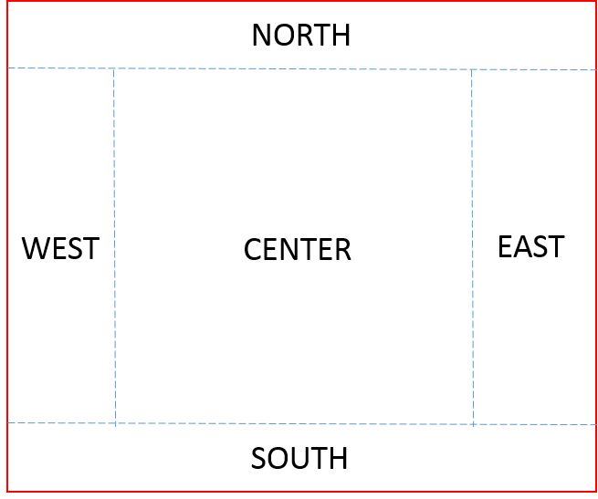

# BorderLayout

[Go back](../../../_old/graphic/swing#layout-manager)

This is the most well-know layout in Java. The container is divided into 5 sections



The 

* NORTH/SOUTH: will take all the width, but the minimum height
* EAST/WEST: will take all the height, but the minimum width
* CENTER: take the remaining space

Of course, none are required.

```java
jcomponent.setLayout(new BorderLayout());
jcomponent.add(component1, BorderLayout.NORTH);
jcomponent.add(component2, BorderLayout.SOUTH);
jcomponent.add(component3, BorderLayout.CENTER); // default if no option
jcomponent.add(component4, BorderLayout.EAST);
jcomponent.add(component5, BorderLayout.WEST);
```