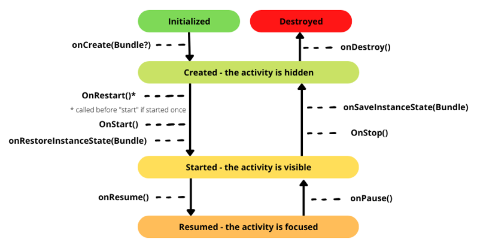

# Android

<div class="row row-cols-md-2"><div>

Android is an operating system developed by Google. [Native android applications](../../_general/index.md) are developed in [Kotlin](/programming-languages/high-level/kotlin/index.md) mostly using [Android Studio](../tools/and/index.md).

* [Android Courses](https://developer.android.com/courses/) + [CodeLabs](https://codelabs.developers.google.com/?cat=Android) (official, free)
* [Android Docs](https://developer.android.com/docs)
* [Android Teach](https://developer.android.com/teach#lecture-slides-and-code-samples) (slides...)
* [Android Guides](https://developer.android.com/guide) and [Android UI](https://developer.android.com/develop/ui)
* [Material Design](https://mui.com/material-ui/) (Google UI Guidelines)

➡️ Google recommends using Kotlin over Java since 2019.
</div><div>

Android projects are managed by [Gradle](/tools-and-frameworks/others/build/gradle/index.md). It's used to:

* 🌍 manage dependencies <small>(import a library...)</small>
* ⚒️ compile the code
* 🗃️ generate the APK <small>(Android Package)</small> installed on devices
</div></div>

<hr class="sep-both">

## Android Framework

<div class="row row-cols-md-2"><div>

#### Application

Basically, an android application is an **Application**. Most of the time, we use the default implementation simply loading the main "activity".

#### Activities and fragments

Android apps are made of **activities**. An activity typically corresponds to a specific task or user interaction such as displaying a login screen.

Activities can have one unique view or they can have multiple views through **fragments**. A fragment is a modular reusable UI component.

**Example** 🔥: an activity for a checkout process could swap between a shipping information and a payment method fragment. Otherwise, you could have one activity for shipping and one for payment.
</div><div>

#### View and ViewGroups

A **view** is a visual element such as a Button. They are grouped in containers called **ViewGroups** to apply styles on multiple views or create responsive screens <small>(i.g., adapting to the size of the screen)</small>.

#### AndroidManifest.xml

The Android Manifest define things like:

* 🏠 the first activity executed when starting the application
* 🔐 the permissions required by the application
* 🗃️ the activities, services, and other components...
* ...
</div></div>

<hr class="sep-both">

## Activities

<div class="row row-cols-md-2"><div>

Every activity is associated with **one** [view](../views/index.md). If this view uses a fragment view, then we can change the fragment displayed in it, effectively allowing us to display multiple views in one activity.

* 👉 Activities must be declared in AndroidManifest.xml
* 👉 The first screen is usually called "MainActivity"
* 👉 Activities are associated with a View <small>(ex: R.layout.activity_main)</small>

A short version to declare an activity:

```kotlin
class MainActivity : AppCompatActivity(R.layout.activity_main) {
}
```
</div><div>

The extended and most commonly used version is:

```kotlin
import androidx.appcompat.app.AppCompatActivity
import android.os.Bundle

class MainActivity : AppCompatActivity() {
    override fun onCreate(savedInstanceState: Bundle?) {
        super.onCreate(savedInstanceState)
        // Load the associated View
        // See View to configure the view (listeners...)
        setContentView(R.layout.activity_main)
    }
}
```
</div></div>

<hr class="sep-both">

## Android Application

<div class="row row-cols-md-2"><div>

When an Android application is started, it instantiates the `Application` class and loads the main activity. The implementation by default is enough. But you may need to extend it when you need to:

* 👉 run code only once <small>(in an Activity, the code will be run when we navigate between application, when we rotate the screen...)</small>

For instance, to run the code to create notification channels, if you want to send notifications.

* 👉 listening for changes on the Application level

<details class="details-n">
<summary>Ex: app foreground/background</summary>

```diff
-class MainApplication : Application() {
+class MainApplication : Application(), DefaultLifecycleObserver {

    override fun onCreate() {
        super<Application>.onCreate()
+        ProcessLifecycleOwner.get().lifecycle.addObserver(this)
    }

+    override fun onStart(owner: LifecycleOwner) {
+        // App in the foreground
+    }

+    override fun onStop(owner: LifecycleOwner) {
+        //App in the background
+    }
}
```
</details>

</div><div>

```kotlin
class MainApplication : Application() {
    override fun onCreate() {
        super.onCreate()
    }
}
```

In your AndroidManifest.xml, look for the tag "application", and add an attribute "android:name" pointing to your newly created file.

```
<application
        ...
        android:name=".MainApplication"
        />
```
</div></div>

<hr class="sep-both">

## Activity life-cycle


<div class="row row-cols-md-2 mt-4"><div class="align-self-center">

Android activities' lifecycle is a bit complex. To summarize,

* 👉 **onCreate** is where you will configure the view
* 👉 Before presenting the activity, **onStart** is called. If the user press "home"/the activity isn't visible anymore, **onStop** is called.
* 👉 Before the user can interact with the activity, **onResume** is called. If the user isn't able to interact with the activity anymore, **onPause** is called. The activity is still be visible.

As for **onDestroy**, it is called

* when the user closes the app
* when the system terminates the app <small>(to free up memory...)</small>
* when it's easier to kill and recreate the app
    * 🔤 the language changed
    * ⚠️ the rotation changed <small>(don't forget to enable rotation on the phone, especially on emulated devices, as it's disabled by default)</small>
</div><div>




**Note**: **onPause** must be lightweight, otherwise it will delay the other application from showing up in the front screen <small>(ex: a call)</small>.

**Note** (2): A bundle is a **small, in-memory**, dictionary. It's passed to onCreate, if the app was recreated. See [onRestoreInstanceState](https://developer.android.com/reference/android/app/Activity#onRestoreInstanceState(android.os.Bundle)) and [onSaveInstanceState](https://developer.android.com/reference/android/app/Activity#onSaveInstanceState(android.os.Bundle)) too, if you want to use it to store/load data.
</div></div>

<hr class="sep-both">

## 👻 To-do 👻

Stuff that I found, but never read/used yet.

<div class="row row-cols-md-2"><div>

* [_general](../__old/_knowledge/index.md)
* [_activities](../__old/activities/index.md)
* [_views](../__old/views/index.md)
* [_viewmodel](../__old/viewmodel/index.md)
* [_core](../__old/core/index.md)
* [_internet](../__old/internet/index.md)
</div><div>

* views and viewgroups (a visual element and containers)
* services (independent processes)
* intents (communication between components)
* content providers (manage app data, enable data sharing)
* context (app env info, access to resources)
* broadcast receivers (listen for events)
* AndroidManifest.xml (metadata, perms, components)
* src directory
* resources directory
</div></div>