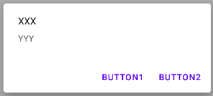

# 📧 Dialogs 📧

<div class="row row-cols-md-2"><div>

Dialogs are made of a title (optional), a message, and some buttons (accept/close). Clicking on any button will close the popup.



```kotlin
// ➡️ Replace "this" with "requireContext()" in a Fragment
MaterialAlertDialogBuilder(this)
    .setTitle("XXX")
    .setMessage("YYY")
    .setNegativeButton("Button1") { _, _ ->
        // execute some code when Button1 is pressed
    }
    .setPositiveButton("Button2") { _, _ ->
        // execute some code when Button2 is pressed
    }
    .show()
```
</div><div>

#### Non-cancelable dialogs

It may be worth noting that users can close the dialog by using the "back" arrow, which was removed on newer devices. To prevent this:

```diff
MaterialAlertDialogBuilder(this)
    [...]
+    .setCancelable(false)
    .show()
```
</div></div>