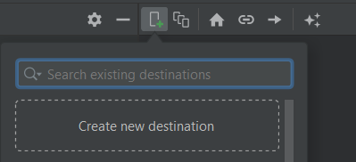

# Navigation Management

<div class="row row-cols-md-2"><div>

Navigation management refers to the implementation of how users navigate through different screens, which include:

* 🐔 navigation between activities
* 🥚 navigation between fragments
* 🍃 navigation to another app
* ...
</div><div>

This usually involves a few classes:

* **Intents** ✈️: to start an activity
* **Navigation Component** 🚀: to navigate between fragments

It worth noting that navigation involves what we call the **back stack** which may lead to unexpected behaviors if not handled.
</div></div>

<hr class="sep-both">

## Application back stack

<div class="row row-cols-md-2"><div>

Android activities are pilled up in something called the "back stack". In older devices, users can use the "back arrow" to go back to a previous activity. The current intent is popped out, and the previous activity is started again. If there are none, then the app is terminated.


</div><div>

It's always the activity at the top that is shown to the user.

At the end of the example, we got two instances of "MainActivity". It's important to consider if this behavior is acceptable or not. If not, you should pass flags to your Intent using [Intent#addFlags](https://developer.android.com/reference/android/content/Intent.html#flags).

👉 For instance, if the user logs out, he should not be able to press "back", and go back to the "connected area".

* Manual "back" <small>(pop out current)</small>

```javascript
intent.addFlags(Intent.FLAG_ACTIVITY_CLEAR_TOP)
```
</div></div>

<hr class="sep-both">

## Navigate/open another activity

<div class="row row-cols-md-2"><div>

An [**intent**](https://developer.android.com/guide/components/intents-filters) is an object representing some action to be performed, such as navigating to another activity. There are two kinds of intent


* **Explicit**: ask specifically for something <small>(ex: start the Activity XXX)</small>
* **Implicit**: request another application/the system <small>(ex: open link)</small>

```kotlin
// create an intent
val intent = Intent(SOME_PARAMETERS)
// optional, you can pass parameters
intent.putExtra("param", "a value")
// start
startActivity(intent)
```

If you passed parameters, in the new Activity, use

```kotlin
val param = intent?.extras?.getString("param")
```
</div><div>

#### Explicit intent

Ex: to navigate to "MainActivity"

```kotlin
// this = a context
val intent = Intent(this, MainActivity::class.java)
```

#### Implicit intent

[There are a lot of them here](https://developer.android.com/reference/android/content/Intent).

<details class="details-e">
<summary>Open a link/mail/phone</summary>

Open a URL (`https:`), a mail (`mailto:`), or a telephone (`tel:`). For instance, given a URL, it will try to open it in a browser...

```kotlin
val intent = Intent(Intent.ACTION_VIEW, Uri.parse("???"))
```
</details>

<details class="details-e">
<summary>Share something</summary>

```kotlin
val intent = ShareCompat.IntentBuilder.from(this)
        .setText("...")
        .setType("text/plain")
        .intent
```
</details>

<details class="details-e">
<summary>Send an email</summary>

```kotlin
val intent = Intent(Intent.ACTION_SEND)
    .setType("text/plain")
    .putExtra(Intent.EXTRA_SUBJECT, "xxx")
    .putExtra(Intent.EXTRA_TEXT, "yyy")
    .putExtra(Intent.EXTRA_EMAIL, "a@b.c")
```
</details>

<details class="details-e">
<summary>⚠️ How to properly run an implicit intent ⚠️</summary>

What if you try to open a link in a browser, but the user uninstalled every browser? It will fail. You have to handle errors!

* Option 1: check if the startActivity fails

```kotlin
try {
    startActivity(intent)
} catch (ex: ActivityNotFoundException) {
    // use a toast / ...
}
```

* Option 2: check before starting the intent

```kotlin
if (packageManager.resolveActivity(intent, 0) != null) {
    startActivity(intent)
}
```
</details>
</div></div>

<hr class="sep-both">

## Fragments

<div class="row row-cols-md-2"><div>

* 👉 The navigation is done with a [Navigation Component](../views/index.md#-navigation-component-)

```diff
- val param = intent?.extras?.getString("param")
+ val param = requireActivity().intent?.extras?.getString("param")
+ val param = activity?.intent?.extras?.getString("param")
```

* Use `requireContext()` to get a Context
* Use `context` to get a Context <small>(@Nullable)</small>

```diff
- val intent = Intent(this, MainActivity::class.java)
+ val intent = Intent(requireContext(), MainActivity::class.java)
+ val intent = Intent(context!!, MainActivity::class.java)
```
</div><div>

* Use `viewLifecycleOwner` to get a LifecycleOwner

```diff
- myLiveData.observe(this) {}
+ myLiveData.observe(viewLifecycleOwner) {}
```
</div></div>

<hr class="sep-both">

## 🧭 Navigation Component 🧭 

<div class="row row-cols-md-2"><div>

The [navigation component](https://developer.android.com/guide/navigation/navigation-getting-started) is a Jetpack component to handle the navigation between fragments.

```gradle
dependencies {
  implementation "androidx.navigation:navigation-fragment-ktx:2.5.3"
  implementation "androidx.navigation:navigation-ui-ktx:2.5.3"
}
```

<br>

#### Create a navigation graph

From the resource manager, go to "navigation", then add a new navigation. For instance, "example_navigation". The generated **example_navigation.xml** is the following

```xml
<?xml version="1.0" encoding="utf-8"?>
<navigation xmlns:android="http://schemas.android.com/apk/res/android"
    xmlns:app="http://schemas.android.com/apk/res-auto"
    android:id="@+id/example_navigation">
</navigation>
```

<br>

#### Add destinations

<div class="row row-cols-md-2"><div>

Switch to the Design View. Create or import your Fragments by clicking on the phone with the plus/add icon.
</div><div>


</div></div>

➡️ To change the "home" fragment, select a fragment, and click on the home icon. The home fragment is the one loaded by default.
</div><div>

#### Create a NavHost

Now, you need to create a container. This container will host your navigation graph. It will load the default fragment, and show another fragment when prompted.

```xml
<androidx.fragment.app.FragmentContainerView
  android:id="@+id/nav_host_fragment"
  android:name="androidx.navigation.fragment.NavHostFragment"

  app:defaultNavHost="true"
  app:navGraph="@navigation/example_navigation" />
```

➡️On old devices, there is an arrow to go "back". If defaultNavHost is set to true, then "back" will go back to the previous fragment.

#### Navigation

Inside **example_navigation.xml**, each fragment should have an Id.

```kotlin
findNavController().navigate(R.id.DESTINATION_ID)
```

You can also create an action (=link), by linking two destinations. Then, use the action's Id

```kotlin
findNavController().navigate(R.id.action_xxx_to_yyy)
```

#### Additional notes

<p></p>

<details class="details-e">
<summary>Setup the navbar to follow a NavHost</summary>

This will set the "label" of a fragment <small>(see the navigation file)</small> as the title of the screen. Moreover, this will add a button "back" to go back to the previous fragment.


```kotlin
class MainActivity : AppCompatActivity() {
    private lateinit var navController: NavController

    override fun onCreate(savedInstanceState: Bundle?) {
        super.onCreate(savedInstanceState)
        setContentView(R.layout.activity_main)

        val navHostFragment = supportFragmentManager.findFragmentById(R.id.nav_host_fragment) as NavHostFragment
        navController = navHostFragment.navController
        // show the label in the menu bar
        // and the icon "back" when needed
        setupActionBarWithNavController(navController)
    }

    // pressing "back" in the menu, will go back
    override fun onSupportNavigateUp(): Boolean {
        return navController.navigateUp() || super.onSupportNavigateUp()
    }
}
```
</details>

<details class="details-e">
<summary>Pass arguments to another fragment</summary>

For that, you must create an action. Then, click on the screen that must receive the parameter. In the section, add arguments.

```kotlin
findNavController().navigate(R.id.action_first_to_second, Bundle().apply {
  // Ex: passing a string
  putString("key", "value")
})
```

in the fragment receiving the arguments, use

```kotlin
val value = arguments?.getString("key")
```

👉 The problem with that, is that there is no verification of the argument being passed or stuff like that. So, we use **SafeArgs** when we want to do things safely.

```gradle
// At the top of your build.gradle
buildscript {
    dependencies {
        classpath "androidx.navigation:navigation-safe-args-gradle-plugin:2.5.3"
    }
}

// after plugin { ... }
apply plugin: 'androidx.navigation.safeargs.kotlin'
```

SafeArgs will generate a class **XXXDirections** with XXX the name of the current class.

```diff
-findNavController().navigate(R.id.action_first_to_second, Bundle().apply {
-  putString("key", "value")
-})
+val destination = FirstDirections.actionFirstToSecond(key = "value")
+findNavController().navigate(destination)
```

Again, SafeArgs will generate a class **XXXArgs** with XXX the name of the current class.

```diff
-val value = arguments?.getString("key")
+val args by navArgs<XXXArgs>()
+val value = args.key
```
</details>

<details class="details-e">
<summary>Navigation back stack</summary>

The idea is the same as for [Activities](../activities/index.md#application-back-stack), but **each Activity has a back stack of fragments**.

* Remove every fragment until the previous one is either null or a fragment with the Id "**DESTINATION_ID**".

```diff
<action
+  app:popUpTo="@id/DESTINATION_ID"
  />
```

* Remove every fragment until the previous one is either null or the fragment BEFORE a fragment with the Id "**DESTINATION_ID**".

```diff
<action
  app:popUpTo="@id/first"
+  app:popUpToInclusive="true"
  />
```

* You can call methods from the code too

```kotlin
findNavController().popBackStack()
```
</details>

</div></div>