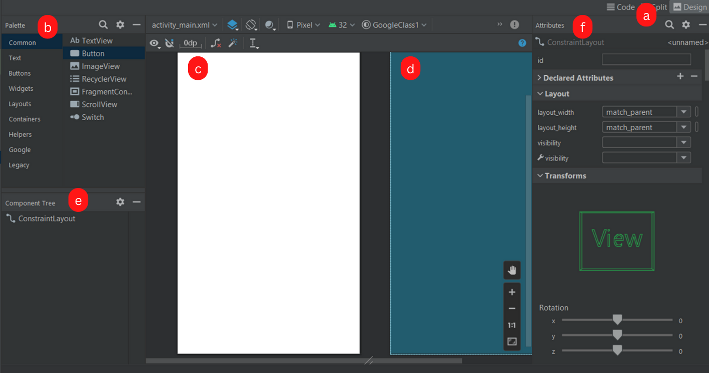
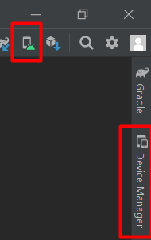

# Android Studio

Android Studio is an IDE developed by Google based on [IntelliJ IDEA](/tools-and-frameworks/editors/jetbrains/idea/index.md) and hence sharing [common features](/tools-and-frameworks/editors/jetbrains/_general/index.md) of IDEs developed by JetBrains. It was specifically adapted for Android Projects using Kotlin or Java.

There are a few life-saving shortcuts

* <kbd>CTRL+P</kbd>: in `method(<here>)`, show the arguments of a method
* <kbd>CTRL+SPACE</kbd>: manually trigger autocompletion <small>(then use <kbd>TAB</kbd>)</small>
* <kbd>SHIFT+SHIFT</kbd>: search for a method/class/setting...
* <kbd>ALT+ENTER</kbd>/**hover something** highlighted in red, yellow, gray... to see quick fixes/details.

**Configure in-editor documentation**

To see the documentation of a method, use <kbd>CTRL+Q</kbd> or hover a method. By default, you won't see anything interesting.

* Navigate to the source of any Android class. As a reminder, you can use <kbd>CTRL+(MOUSE LEFT)</kbd> like in VSCode/...
* Click on "Download sources"
* Done

## Layout Editor

Instead of editing the XML manually, you will usually use the Design mode.

<ol style="list-style-type: lower-alpha">
<li><b>Mode</b>: you can switch to the XML/Layout editor here</li>
<li><b>Palette</b>: views that you can drag and drop to the design view</li>
<li><b>Design view</b>: what the user will see</li>
<li><b>BluePrint view</b>: Design View, but with hidden elements too</li>
<li><b>Component tree</b>: list of all views of your screen</li>
<li><b>Attributes</b>: edit the properties of a view</li>

</ol>

**TIP**: you should rely on <kbd>CTRL+F</kbd> to search for attributes, or by clicking on the search icon at the top of the "Attributes" window.

**TIP**: you will most likely have a time when you want to replace a view with another view. In the component tree, right-click on a view, and use "convert view". You could also manually get the job done by directly editing the `.xml`.

## 📱 Random features 📱

#### Gradle

In the Project tab, at the bottom, you got a section "Gradle Scripts". You will have to edit the second `build.gradle (Module: XXX)`.

Inside `dependencies {}`, you will add new libraries. You need to click on "sync" (when prompted) each time you add a new dependency.

 

#### app/manifests/AndroidManifest.xml

This is a file that describes

* What is the main activity <small>(~=screen)</small>?
* What activities <small>(~=screens)</small> you defined?
* What are the permissions that your application needs?
* If your application defines services <small>(~=tasks)</small>?
* ...

 

#### app/java/com.xxx.yyy

This is where your classes will be stored.

 

#### app/res

This is where the resources of your application will be stored.

* Drawables <small>(images, icons...)</small>
* Layouts <small>(the layout of each screen)</small>
* Menu
* Values <small>(translations, colors/themes...)</small>
* XML <small>(preferences...)</small>

#### Resources Manager

You can manage them from the **Resources Manager**

* From the Left side, right under "project"
* with View > Tools Windows > Resources Manager

 

#### Device Emulator

The device emulator allows you to create a virtual device or connect yours. You may (or most likely will) use

* **Device File Explorer**: device's file system
* **Layout Inspector**: running app layout
* **App inspection**: to see workers/tasks/...
* **Logcat**: to see logged messages

**Note**: you may have to refresh the virtual file system manually if you don't see recent changes.

**Note (2)**: on virtual devices, use "..." to manually change settings (location...).

## 👻 To-do 👻

Stuff that I found, but never read/used yet.

* Action on Save: Optimize imports

