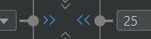

# Views

<div class="row row-cols-lg-2"><div>

Each activity or fragment is associated with **one** layout file. It's an [XML](/programming-languages/others/data/xml.md) file stored in **app/res/layout**. Inside there is a [layout](#layouts) with children [views](#views) defining the appearance of the user interface.

```xml!
<?xml version="1.0" encoding="utf-8"?>
<XXXLayout xmlns:android="http://schemas.android.com/apk/res/android"
             xmlns:app="http://schemas.android.com/apk/res-auto"
             xmlns:tools="http://schemas.android.com/tools"
             android:layout_width="match_parent"
             android:layout_height="match_parent"
             tools:context=".MainActivity" >
  <!-- NESTED TAGS -->
</XXXLayout>
```
</div><div>

`XXXLayout` is called the `root`. `<XXXLayout>...</XXXLayout>` is called a tag. They can have attributes such as `<XXX attribute='value'>` and may contain nested tags, which could be [views](#views) or [layouts](#layouts).

<p class="text-center">A few things to know</p>

⚒️ `tools:context` points to the associated Fragment/Activity in YOUR code, so you must give it an appropriate value.

✨ `xmlns:` are very important. You can't use `android:` if you didn't add the matching `xmlns:android`. They are added to the **root**.

🚀 Layouts are usually populated using the [Layout Editor](../tools/and/index.md) as doing so manually can be complicated.
</div></div>

<hr class="sep-both">

## Layouts

<div class="row row-cols-lg-2"><div>

Layouts are a category of **ViewGroups**. They are [Views](#views) with predefined settings to arrange children views.
For instance, a `GridLayout` will arrange its nested views in a grid-like format.

They are also convenient to apply a style. For instance, to add some margin to the left, you may group elements in a layout, and apply the margin to the layout instead of each view.

#### LinearLayout: Horizontal/Vertical

[Documentation](https://developer.android.com/develop/ui/views/layout/linear)

```xml!
<LinearLayout
    ...
    android:orientation="vertical"
    android:orientation="horizontal"
    >
      <!-- optional weight (responsive width/height) -->
      <XXXView
           android:layout_weight="1"
           />
</LinearLayout>
```

#### FrameLayout: a layout with only one child.

[Documentation](https://developer.android.com/reference/android/widget/FrameLayout)

```xml!
<FrameLayout ...>
  <!-- usually a recycler view, or a fragment container -->
</FrameLayout>
```
</div><div>


#### ConstraintLayout: a flexible way to design views

[Documentation](https://developer.android.com/develop/ui/views/layout/constraint-layout)

```js!
implementation 'androidx.constraintlayout:constraintlayout:2.1.4'
```

A constraint layout is rendering elements relatively to another component <small>(which could be the screen)</small>. You will set margins which are the gap with the other component.


On a screen of 226px, if you define that the component should have a margin-left of 140, and a margin-right of 26. The component will be centered within the 60 remaining px called **free space**.

To change the behavior of how the free space is handled, simply edit the layout width/height OR you can use a shortcut by clicking on arrows such as ">>" right where you added margins.


</div></div>

<hr class="sep-both">

## Views

<div class="row row-cols-lg-2"><div>

In Android, every component such as an Image is called a **View**. Every view must have at least these two attributes

* **android:layout_width**: wrap, match_parent, a fixed width
* **android:layout_height**: wrap, match_parent, a fixed height

And these attributes are available on any View

* **android:padding**: internal gap <small>(ex: 10dp)</small>
* **android:layout_margin**: external gap <small>(ex: 10dp)</small>
* **android:visibility**: View.VISIBLE / View.INVISIBLE / View.GONE

##### TextView: display a text

[TextView extends View](https://developer.android.com/reference/android/widget/TextView).

```xml!
<TextView
    android:text="Shown in the app"
    tools:text="Shown in the DesignView"
    />
```

##### Button: a button

[Button extends TextView](https://developer.android.com/reference/android/widget/Button).
</div><div>

##### ImageView: display an image

[ImageView extends View](https://developer.android.com/reference/android/widget/ImageView)

```xml!
<!-- scaleType="centerCrop" is used for 9patches scaling -->
<ImageView 
    tools:srcCompat="YOUR_IMAGE"
    android:scaleType="centerCrop"
    />
```

##### EditText: an input field

[EditText extends TextView](https://developer.android.com/reference/android/widget/EditText). See also [InputType](https://developer.android.com/develop/ui/views/touch-and-input/keyboard-input/style) and [Autofill](https://developer.android.com/guide/topics/text/autofill-optimize).

```xml!
<EditText
    android:inputType="text"
    android:autofillHints="username"
    android:hint="Placeholder in the app"
    tools:hint="Placeholder in the DesignView"
    />
```

##### Switch: check or uncheck

[Switch extends Button](https://developer.android.com/reference/android/widget/Switch) <small>(indirectly)</small> and [SwitchCompat](https://developer.android.com/reference/androidx/appcompat/widget/SwitchCompat).

```xml!
<Switch android:checked="true" />
<!-- ✅ better -->
<androidx.appcompat.widget.SwitchCompat
    android:checked="true" />
```
</div></div>


<hr class="sep-both">

## 🔗 Get access to a view from the code 🖇️

<div class="row row-cols-lg-2"><div>

You can then use `findViewById(some_id)` to get a view.

```diff
<SomeViewHere
+        android:id="@+id/someUniqIdHere"
```

```kotlin
// ➡️ In Activity#onCreate
val x = findViewById<SomeViewHere>(R.id.someUniqIdHere)
// ➡️ In Fragment#onViewCreated
val x = view.findViewById<SomeViewHere>(R.id.someUniqIdHere)
val x = requireView().findViewById<SomeViewHere>(R.id.someUniqIdHere)
```

#### TextView

```kotlin
var t = findViewById<TextView>(...)
t.text = "Some text"
t.setText(R.string.some_string)
```

#### Button

```kotlin
val b = findViewById<Button>(...)
b.setOnClickListener {
    println("Clicked on myButton")
}
```
</div><div>

#### ImageView

```kotlin
var i = findViewById<ImageView>(...)
// set image from the code
i.setImageResource(R.drawable.some_drawable_here)
```

#### EditText

```kotlin
val e = findViewById<EditText>(...)
// handle key events
e.setOnKeyListener { v, keyCode, keyEvent ->
    if (keyCode == KeyEvent.KEYCODE_A) {
        return@setOnKeyListener true
    }
    return@setOnKeyListener false
}
```

#### Switch/SwitchCompact

```kotlin
var s = findViewById<SwitchCompact>(...)
if(s.isChecked) {}
```
</div></div>

<hr class="sep-both">

## 🔥 Accessibility 🔥

<div class="row row-cols-lg-2"><div>

If something is only here to decorate the screen, you should mark it as not important for accessibility.

```xml!
<ImageView
  android:importantForAccessibility="no" />
```
</div><div>

For images, if they are important for accessibility, you should provide a content description. ⚠️If the image is modified from the code, the content description should be updated.

```xml!
<ImageView
  android:contentDescription="Describe this image" />
```
</div></div>

<hr class="sep-both">

## ✨ View Binding ✨

<div class="row row-cols-lg-2"><div>

ViewBinding is a new alternative to `findViewById`.

Ids declared in **activity_main.xml** will be available via a generated class called **ActivityMainBinding** <small>(matching the XML filename)</small>.

First, add the viewBinding build feature.

```diff
android {
    ...

+    buildFeatures {
+        viewBinding = true
+    }
}
```

</div><div>

Assume that we have an XML file with

```xml!
<SomeViewHere
    android:id="@+id/someUniqIdHere"
    ...
/>
```

This is how you could adapt your previous code with `findViewById`.

<details class="details-e">
<summary>Ex: activity_main.xml in an Activity</summary>

```diff
class MainActivity : AppCompatActivity() {
+    private lateinit var binding: ActivityMainBinding

    override fun onCreate(savedInstanceState: Bundle?) {
        super.onCreate(savedInstanceState)
+        binding = ActivityMainBinding.inflate(layoutInflater)

-        setContentView(R.layout.activity_main)
+        setContentView(binding.root)

-        val x = findViewById<SomeViewHere>(R.id.someUniqIdHere)
+        val x = binding.someUniqIdHere
    }
}
```
</details>

<details class="details-e">
<summary>Ex: fragment_blank.xml in a Fragment</summary>

```diff
class BlankFragment : Fragment() {
+    private lateinit var binding: FragmentBlankBinding

    override fun onCreateView(...): View? {
-        return inflater.inflate(R.layout.fragment_blank, container, false)
+        binding = FragmentBlankBinding.inflate(layoutInflater, container, false)
+        return binding.root
    }

    override fun onViewCreated(view: View, savedInstanceState: Bundle?) {
        super.onViewCreated(view, savedInstanceState)
+        val x = binding.someUniqIdHere
    }
}
```
</details>
</div></div>

<hr class="sep-both">

## 🎨 Material Design 🎨

<div class="row row-cols-lg-2"><div>

Material design is a library of pre-made components. Google recommends using Material UI components as much as possible.

* [See Material 2 Documentation](https://m2.material.io/) <small>(currently widely used)</small>
* [See Material 3 Documentation](https://m3.material.io/) <small>(released in late 2022)</small>

Material design provides both

* 👉 Guidelines (padding, sizes...) to make a nice UI
* 👉 Pre-made Components <small>(padding, sizes...)</small>
</div><div>

Manually edit the XML and replace AndroidX classes with MaterialUI classes. Aside from the name of the class, and new attributes being available, nothing much will change.

[See the list here + detailed instructions](https://github.com/material-components/material-components-android/tree/master/docs/components)

* `EditText` <math xmlns="http://www.w3.org/1998/Math/MathML"><mo accent="false" stretchy="false">&#x2192;</mo></math> `TextInputLayout+TextInputEditText`
* `SwitchCompat` <math xmlns="http://www.w3.org/1998/Math/MathML"><mo accent="false" stretchy="false">&#x2192;</mo></math> `SwitchMaterial`
* ...
</div></div>

<hr class="sep-both">

## ⚡ Data Binding ⚡

<div class="row row-cols-lg-2"><div>

DataBinding is an extension of [ViewBinding](#-view-binding-). It allows us to directly connect the data and the view directly inside the XML.

With [LiveData](../data/index.md#livedata), the view is automatically updated when the data has changed, allowing us to get rid of observers.

```diff
android {
    ...
    buildFeatures {
        viewBinding = true
+        dataBinding = true
    }
}
```

#### Prepare your XML

DataBinding is a bit hard to set up. You need to edit your XML first. To wrap your root inside a tag **layout**. You don't have to move **xmlns:** attributes, or change anything else.

```xml!
<?xml version="1.0" encoding="utf-8"?>
<layout>
<data>
</data>

<!-- Your previous root here (unchanged) -->
</layout>
```

➡️ Indents will be messed up. Right-click on the file > Reformat code, keep everything checked, and run it by pressing "ok".

<br>

#### Adapt the code


The code is the same as ViewBinding, with a minor change.

<details class="details-e">
<summary>Ex: activity_main.xml in an Activity</summary>

```diff
class MainActivity : AppCompatActivity() {
    private lateinit var binding: ActivityMainBinding

    override fun onCreate(savedInstanceState: Bundle?) {
        super.onCreate(savedInstanceState)
-        binding = ActivityMainBinding.inflate(layoutInflater)
+        binding = DataBindingUtil.setContentView(this, R.layout.activity_main)

        setContentView(binding.root)

        val x = binding.someUniqIdHere
    }
}
```
</details>

<details class="details-e">
<summary>Ex: fragment_blank.xml in a Fragment</summary>

```diff
class BlankFragment : Fragment() {
    private lateinit var binding: FragmentBlankBinding

    override fun onCreateView(...): View? {
-        binding = FragmentBlankBinding.inflate(layoutInflater, container, false)
+        binding = DataBindingUtil.inflate(inflater, R.layout.fragment_blank, container, false)
        return binding.root
    }

    override fun onViewCreated(view: View, savedInstanceState: Bundle?) {
        super.onViewCreated(view, savedInstanceState)
        val x = binding.someUniqIdHere
    }
}
```
</details>

🔥 It's worth mentioning that the change above is **unneeded** if we're using ViewBinding's code as it automatically binds data.
</div><div>


#### Passing data to the XML

First, you must set the Lifecycle owner.

```kotlin
// ➡️ In Activity#onCreate
binding.lifecycleOwner = this
// ➡️ OR; In Fragment#onViewCreated
binding.lifecycleOwner = viewLifecycleOwner
```

Then, you must declare variables in the XML **data** tag.

```diff
<data>
+  <!-- example with a viewModel variable -->
+  <variable name="viewModel" type=".YourViewModelTypeHere" />
</data>
```

Then, right below `binding.lifecycleOwner`, pass the variables.

```kotlin
// binding.yourVariableName = yourVariableValue
binding.viewModel = viewModel // an attribute in my class
```

Then, in your XML, you can use your variables and basic expressions inside `@{}`. Here are some examples:

```xml!
<example>
  <!-- user is a LiveData -->
  <TextView android:text="@{viewModel.user.username}" />
  <!-- some_key is a string taking a parameter "%s" -->
  <TextView android:text="@{@string/some_key(viewModel.string)}" />
  <!-- examples with booleans -->
  <TextView android:text='@{viewModel.boolean ? "x" : "y" }' />
  <TextView android:text='@{viewModel.boolean ? @string/toto : "" }' />
  <!-- state / events -->
  <Switch android:checked="@{viewModel.xxx.equals(yyy)}" />
  <Button android:onClick="@{() -> viewModel.xxx()}" />
</example>
```

You can't do complex calculations. For instance, you can't convert an Int to a String. Instead, either use **BindingAdapters**, or add a function, for instance, in User here, returning an appropriate value.

<details class="details-e">
<summary>BindingAdapters: complex, but powerful</summary>

```diff
plugins {
+    id 'kotlin-kapt'
}
```

Either create a specific class, or use a companion object.

```kotlin
companion object { // inside any appropriate class
  // ➡️ Add an attribute "app:xxx" on a TextView
  //  taking a value of type "Type"
  @BindingAdapter("app:xxx") @JvmStatic
  fun bindXXXText(textView: TextView, value: Type) {
     // do what you want the attribute to do
  }

  // 👻 -- never used this
  @InverseBindingAdapter(attribute = "app:xxx", event = "android:textAttrChanged") @JvmStatic
  fun getText(textView: TextView) = textView.text.toString()
}
```

You can use the attribute as long as `app` was imported <small>(see the appropriate `xmlns:` at the top of this page if needed)</small>.

```xml
<TextView
    app:xxx="@{viewModel.aValueMatchingTheSelectedType}"
    />
```
</details>
</div></div>

<hr class="sep-both">

## 👻 To-do 👻

Stuff that I found, but never read/used yet.

<div class="row row-cols-lg-2"><div>

* [RadioButton](https://developer.android.com/reference/android/widget/RadioButton), and [RadioGroup](https://developer.android.com/reference/android/widget/RadioGroup)
    * RadioGroup#`checkedButton`
    * RadioGroup#`setOnCheckedChangeListener`: parameters are radio group, and the Id of the checked button.
* `tools:visibility` and the icon in the Design View to swap
* Tint/Dark mode
* [Android Basics: Adaptive Layouts](https://developer.android.com/codelabs/basic-android-kotlin-training-adaptive-layouts), [twopane](https://developer.android.com/develop/ui/views/layout/twopane), [cardview](https://developer.android.com/develop/ui/views/layout/cardview)

<details class="details-n">
<summary>Theming?</summary>

[Theming](https://material.io/design/introduction#theming) and [Colors](https://material.io/design/material-theming/implementing-your-theme.html#color) and [ColorTools](https://m2.material.io/resources/color/#!/?view.left=0&view.right=0&primary.color=00E5FF). [Dark Theme](https://developer.android.com/codelabs/basic-android-kotlin-training-change-app-theme)

```
style="?attr/materialButtonOutlinedStyle"
android:textAppearance="?attr/textAppearanceHeadline6"
name="Theme.XXX"

<item name="textInputStyle">@style/Widget.MaterialComponents.TextInputLayout.OutlinedBox</item>
<item name="radioButtonStyle">@style/Widget.TipTime.CompoundButton.RadioButton</item>
<item name="switchStyle">@style/Widget.TipTime.CompoundButton.Switch</item>
```

By convention, each style should have a parent, and be named as the parent, while replacing the "MaterialComponents" with "YOUR_APP_NAME".

```xml
<examples>
  <style name="Widget.YOUR_APP_NAME.TextView" parent="Widget.MaterialComponents.TextView">
  </style>
  <style name="Widget.xxx.CompoundButton.RadioButton" parent="Widget.MaterialComponents.CompoundButton.RadioButton">
    <item name="android:paddingStart">8dp</item>
    <item name="android:textAppearance">?attr/textAppearanceBody1</item>
  </style>
  <style name="Widget.xxx.CompoundButton.Switch" parent="Widget.MaterialComponents.CompoundButton.Switch">
    <item name="android:minHeight">48dp</item>
    <item name="android:gravity">center_vertical</item>
    <item name="android:textAppearance">?attr/textAppearanceBody1</item>
  </style>
  <style name="Widget.xxxx.TextView" parent="Widget.MaterialComponents.TextView">
    <item name="android:minHeight">48dp</item>
    <item name="android:gravity">center_vertical</item>
    <item name="android:textAppearance">?attr/textAppearanceBody1</item>
  </style>
</examples>
```
</details>

<details class="details-n">
<summary>Icons</summary>

Different manufacturers may show app icons in different shapes than
the circular icon shape: square shape, rounded square, or squircle (between a square and circle)...

<https://developer.android.com/training/multiscreen/screendensities#TaskProvideAltBmp>

Adaptive icons since v26
=> background
=> foreground
=> + new image asset
=> new assets should be moved to the same folder v26

<https://developer.android.com/codelabs/basic-android-kotlin-training-display-list-cards> (3 => easy way to import icon).
</details>
</div><div>

```text!
android:textAlignment="textStart"
android:textAlignment="center"
android:textSize="16sp"
android:textStyle="bold"
Vertical alignment
android:gravity="center"
android:gravity="bottom"
???
LinearLayout => android:baselineAligned="false"
Tint black icon to white
android:tint="@color/white"
android:background="#B95EB17C"

TableLayout TableRow

val input = EditText(requireContext())
.setView(input)
input.text.toString().toFloatOrNull()
```
</div></div>