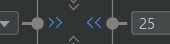

# Views

<div class="row row-cols-md-2"><div>

Each activity or fragment is associated with **one** layout file. It's an [XML](/programming-languages/others/data/xml.md) file stored in **app/res/layout**. Inside there is a [layout](#layouts) with children [views](#views) defining the appearance of the user interface.

```
<?xml version="1.0" encoding="utf-8"?>
<XXXLayout xmlns:android="http://schemas.android.com/apk/res/android"
             xmlns:app="http://schemas.android.com/apk/res-auto"
             xmlns:tools="http://schemas.android.com/tools"
             android:layout_width="match_parent"
             android:layout_height="match_parent"
             tools:context=".MainActivity" >
  <!-- NESTED TAGS -->
</XXXLayout>
```
</div><div>

`XXXLayout` is called the `root`. `<XXXLayout>...</XXXLayout>` is called a tag. They can have attributes such as `<XXX attribute='value'>` and may contain nested tags, which could be [views](#views) or [layouts](#layouts).

<p class="text-center">A few things to know</p>

⚒️ `tools:context` point to the associated Fragment/Activity in YOUR code, so you must give it an appropriate value.

✨ `xmlns:` are very important. You can't use `android:` if you didn't add the matching `xmlns:android`. They are added to the **root**.

🚀 Layouts are usually populated using the [Layout Editor](../tools/and/index.md) as doing so manually can be complicated.
</div></div>

<hr class="sep-both">

## Layouts

<div class="row row-cols-md-2"><div>

Layouts are a category of **ViewGroups**. They are [Views](#views) with predefined settings to arrange children views.
For instance, a `GridLayout` will arrange its nested views in a grid-like format.

They are also convenient to apply a style. For instance, to add some margin to the left, you may group elements in a layout, and apply the margin to the layout instead of each view.

#### LinearLayout: Horizontal/Vertical

[Documentation](https://developer.android.com/develop/ui/views/layout/linear)

```
<LinearLayout
    ...
    android:orientation="vertical"
    android:orientation="horizontal"
    >
      <!-- optional weight (responsive width/height) -->
      <XXXView
           android:layout_weight="1"
           />
</LinearLayout>
```

#### FrameLayout: a layout with only one child.

[Documentation](https://developer.android.com/reference/android/widget/FrameLayout)

```
<FrameLayout ...>
  <!-- usually a recycler view, or a fragment container -->
</FrameLayout>
```
</div><div>


#### ConstraintLayout: a flexible way to design views

[Documentation](https://developer.android.com/develop/ui/views/layout/constraint-layout)
```
implementation 'androidx.constraintlayout:constraintlayout:2.1.4'
```

A constraint layout is rendering elements relatively to another component <small>(which could be the screen)</small>. You will set margins which are the gap with the other component.


On a screen of 226px, if you define that the component should have a margin-left of 140, and a margin-right of 26. The component will be centered within the 60 remaining px called **free space**.

To change the behavior of how the free space is handled, simply edit the layout width/height OR you can use a shortcut by clicking on arrows such as ">>" right where you added margins.


</div></div>

<hr class="sep-both">

## Views

<div class="row row-cols-md-2"><div>

In Android, every component such as an Image is called a **View**. Every view must have at least these two attributes

* **android:layout_width**: wrap, match_parent, a fixed width
* **android:layout_height**: wrap, match_parent, a fixed height

And these attributes are available on any View

* **android:padding**: internal gap <small>(ex: 10dp)</small>
* **android:layout_margin**: external gap <small>(ex: 10dp)</small>
* **android:visibility**: View.VISIBLE / View.INVISIBLE / View.GONE

##### TextView: display a text

[TextView extends View](https://developer.android.com/reference/android/widget/TextView).

```xml
<TextView
    android:text="Shown in the app"
    tools:text="Shown in the DesignView"
    />
```

##### Button: a button

[Button extends TextView](https://developer.android.com/reference/android/widget/Button).
</div><div>

##### ImageView: display an image

[ImageView extends View](https://developer.android.com/reference/android/widget/ImageView)

```
<!-- scaleType="centerCrop" is used for 9patches scaling -->
<ImageView 
    tools:srcCompat="YOUR_IMAGE"
    android:scaleType="centerCrop"
    />
```

##### EditText: an input field

[EditText extends TextView](https://developer.android.com/reference/android/widget/EditText). See also [InputType](https://developer.android.com/develop/ui/views/touch-and-input/keyboard-input/style) and [Autofill](https://developer.android.com/guide/topics/text/autofill-optimize).

```
<EditText
    android:inputType="text"
    android:autofillHints="username"
    android:hint="Placeholder in the app"
    tools:hint="Placeholder in the DesignView"
    />
```

##### Switch: check or uncheck

[Switch extends Button](https://developer.android.com/reference/android/widget/Switch) <small>(indirectly)</small> and [SwitchCompat](https://developer.android.com/reference/androidx/appcompat/widget/SwitchCompat).

```
<Switch android:checked="true" />
<!-- ✅ better -->
<androidx.appcompat.widget.SwitchCompat
    android:checked="true" />
```
</div></div>


<hr class="sep-both">

## 🔗 Get access to a view from the code 🖇️

<div class="row row-cols-md-2"><div>

You can then use `findViewById(some_id)` to get a view.

```diff
<SomeViewHere
+        android:id="@+id/someUniqIdHere"
```

```kotlin
// ➡️ In Activity#onCreate
val x = findViewById<SomeViewHere>(R.id.someUniqIdHere)
// ➡️ In Fragment#onViewCreated
val x = view.findViewById<SomeViewHere>(R.id.someUniqIdHere)
val x = requireView().findViewById<SomeViewHere>(R.id.someUniqIdHere)
```

#### TextView

```kotlin
var t = findViewById<TextView>(...)
t.text = "Some text"
t.setText(R.string.some_string)
```

#### Button

```kotlin
val b = findViewById<Button>(...)
b.setOnClickListener {
    println("Clicked on myButton")
}
```
</div><div>

#### ImageView

```kotlin
var i = findViewById<ImageView>(...)
// set image from the code
i.setImageResource(R.drawable.some_drawable_here)
```

#### EditText

```kotlin
val e = findViewById<EditText>(...)
// handle key events
e.setOnKeyListener { v, keyCode, keyEvent ->
    if (keyCode == KeyEvent.KEYCODE_A) {
        return@setOnKeyListener true
    }
    return@setOnKeyListener false
}
```

#### Switch/SwitchCompact

```kotlin
var s = findViewById<SwitchCompact>(...)
if(s.isChecked) {}
```
</div></div>


<hr class="sep-both">

## ✨ View Binding ✨

<div class="row row-cols-md-2"><div>

ViewBinding is a new alternative to `findViewById`.

Ids declared in **activity_main.xml** will be available via a generated class called **ActivityMainBinding** <small>(matching the XML filename)</small>.

First, add the viewBinding build feature.

```diff
android {
    ...

+    buildFeatures {
+        viewBinding = true
+    }
}
```

</div><div>

Assume that we have an XML file with

```xml
<SomeViewHere
    android:id="@+id/someUniqIdHere"
    ...
/>
```

This is how you could adapt your previous code with `findViewById`.

<details class="details-e">
<summary>Ex: activity_main.xml in an Activity</summary>

```diff
class MainActivity : AppCompatActivity() {
+    private lateinit var binding: ActivityMainBinding

    override fun onCreate(savedInstanceState: Bundle?) {
        super.onCreate(savedInstanceState)
+        binding = ActivityMainBinding.inflate(layoutInflater)

-        setContentView(R.layout.activity_main)
+        setContentView(binding.root)

-        val x = findViewById<SomeViewHere>(R.id.someUniqIdHere)
+        val x = binding.someUniqIdHere
    }
}
```
</details>

<details class="details-e">
<summary>Ex: fragment_blank.xml in a Fragment</summary>

```diff
class BlankFragment : Fragment() {
+    private lateinit var binding: FragmentBlankBinding

    override fun onCreateView(...): View? {
-        return inflater.inflate(R.layout.fragment_blank, container, false)
+        binding = FragmentBlankBinding.inflate(layoutInflater, container, false)
+        return binding.root
    }

    override fun onViewCreated(view: View, savedInstanceState: Bundle?) {
        super.onViewCreated(view, savedInstanceState)
+        val x = binding.someUniqIdHere
    }
}
```
</details>
</div></div>

<hr class="sep-both">

## 👻 To-do 👻

Stuff that I found, but never read/used yet.

<div class="row row-cols-md-2"><div>

* [RadioButton](https://developer.android.com/reference/android/widget/RadioButton), and [RadioGroup](https://developer.android.com/reference/android/widget/RadioGroup)
    * RadioGroup#`checkedButton`
    * RadioGroup#`setOnCheckedChangeListener`: parameters are radio group, and the Id of the checked button.
</div><div>

* `tools:visibility` and the icon in the Design View to swap
</div></div>