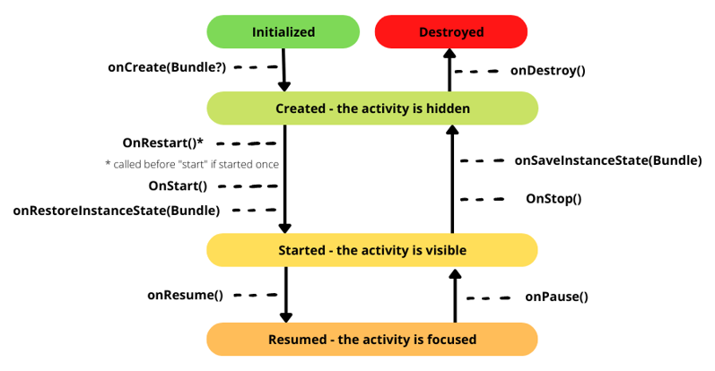

# Android development

**[Updates notes](index.md)**

There are multiple ways to develop apps for Android devices. This course will focus on Android apps written in **Kotlin**, using **Android Studio**. Kotlin which is recommended by Google since 2018, replacing Java which was mainly used until then. Switching from Kotlin to Java, and from Java to Kotlin is quite easy, Android Studio can even do the conversion for you.

> Android Studio (Google) is based on IntelliJ Community (JetBrains) 😎❤️

<hr class="sl">

## Android studio

<div class="row row-cols-md-2"><div>

Life-saving shortcuts

* <kbd>CTRL+P</kbd>: in `method(<here>)`, show the arguments of a method
* <kbd>CTRL+SPACE</kbd>: manually trigger autocompletion
* <kbd>SHIFT+SHIFT</kbd>: search for a method/class/...
* Your usual <kbd>CTRL+C</kbd> (copy), <kbd>CTRL+V</kbd> (paste), <kbd>CTRL+A</kbd> (select all), <kbd>CTRL+F</kbd> (search)
* <kbd>CTRL+D</kbd>: shortcut to duplicate a line, or the selection if any
* <kbd>TAB</kbd>: in a context of autocompletion, trigger to use of the selected autocompletion fragment
* <kbd>CTRL+(MOUSE LEFT)</kbd>: on a method, move to where this method is declared
* <kbd>ALT+ENTER</kbd> ⭐: Android Studio will highlight in red, yellow, grey, or underline in green some things. Either hover the highlighted "things" to see why, or use this shortcut on it.
  * **red**: an error
  * **yellow**: a warning
  * **grey**: something useless that should be removed
  * **underlined green**: a typo
</div><div>

<details class="details-n">
<summary><b>Local History</b>: automatic backup of your files</summary>

You can right-click on a file/folder, and use Local History to see any changes made on this folder/file. It useful if, at some point, you removed something, but can't go back...


</details>

<details class="details-n">
<summary><b>Project view</b>: why some files aren't shown, or the file structure is not how it is on the disk?</summary>

Android Studio use file structures, in order to show a project in a simplified, nicer, way. If you are looking for some file that aren't shown, simply change the file structure.


</details>

<details class="details-n">
<summary><b>Gradle scripts</b>: add dependencies</summary>

In the Android view, below all your files, there is your **build.gradle (module)**. This is the file in which you will add dependencies later. Every time you can it, a message on top of the file will pop up asking you to "sync" the project, just do it.


</details>

<details class="details-n">
<summary><b>Device Emulator</b>: emulate an android device</summary>

<div class="row"><div class="col-md-3">


</div><div class="col-md-9">

You can create a new virtual device in the device manager.

As the bottom of the right-panel, there is a vertical tab "Emulator" in which your running emulated device will be shown.
</div></div>

Right-above this tab, there is a tab to browse the files on your device. You may have to right-click on a folder > refresh, if you don't see changes that were made by your application recently.

In the Top-Right corner, there is a tab "Layout inspector", allowing, as the name imply, to inspect the views, and the layout, of your running application.

You can control your device use these buttons, if there is a need. Note that the "..." menu is useful if you need to do things such as setting your phone state as "charging", or things like that.


For applications loaded on a device with an API of 26, or higher, you can also inspect workers, the database, etc. See the tab "App inspection".
</details>

> **Note**: you will usually resize windows, such as resizing your emulator window, as sometimes you want to have it side-by-side, and some other time, you want to have it taking the whole screen. It doesn't work everytime, but by double-clicking on the top bar on a window, will expand/reduce it's size, as it does with other windows (app/file explorer/...).
</div></div>

One last very useful thing, is that you can press <kbd>CTRL+Q</kbd>, or hover a method, to see its documentation. Unfortunately, by default, sources aren't downloaded, so you will basically see nothing useful. To download sources, the easiest way is using <kbd>CTRL+(MOUSE LEFT)</kbd> on a method/class from the Android SDK, to navigate to its source. Then, on the top of the file, you will be prompted to download sources as they are missing. Just do it, and you are ready for an enhanced experience aboard IntelliJ-based IDE: Android Studio.

<hr class="sr">

## Application Architecture

<div class="row row-cols-md-2"><div>

**MVVM**: Model-View-ViewModel, is an architecture by opposition to the MVC architecture, in which the ViewModel is updating the view, when the Model changed. In Android,

The Controller is responsible for rendering the UI, and listening to events. Using the full application of MVVM

* A LiveData is a variable storing a value, and calling an observer when this value changed
* A repository is a class that is fetching data from an API, or a local database (see Room)
* A ViewModel is a class providing access to the LiveData to other classes. It will use the repository to update the value stored in a LiveData

Then, using **Data binding**, you can directly use your LiveData in your XML, the file in which you create your view, and if the LiveData value is updated, so will your view.
</div><div>

...
</div></div>

<hr class="sl">

## XML

<div class="row row-cols-md-2"><div>

Aside from your code, almost every file is a XML file. This is a sort of HTML with tags `<MyTag></MyTag>`, or `<MyTag />`, in which you can add attributes  `<ImageView src="/path/to/my/image" />`.

```xml
<?xml version="1.0" encoding="utf-8"?>
<FrameLayout xmlns:android="http://schemas.android.com/apk/res/android"
             xmlns:app="http://schemas.android.com/apk/res-auto"
             xmlns:tools="http://schemas.android.com/tools"
             android:layout_width="match_parent"
             android:layout_height="match_parent"
             tools:context=".controller.MainActivity" >

  <!-- comment -->
</FrameLayout>
```

> **The root tag** is the one in which every other will be. It's noticeable because of the additional attributes "xmlns:", and "tools:context".

</div><div>

* Every tag must have the attributes `android:layout_width`, and `android:layout_height`.

* Attributes are coming from a namespace, which needs to be imported. If you are using the LayoutEditor, this is done behind the scene for you. Anyway, if you want to use `android:`, then the root tag must have the attribute `xmlns:android="http://schemas.android.com/apk/res/android"`.

* The `tools:context` is pointing to the class which will use this layout.

<hr>

The file **AndroidManifest.xml** is used to make your application. It is storing 

* the permissions given to your app, 
* the features requested,
* the list of activities = the screens of your app,
* the main activity,
* the services used,
* ...

</div></div>

<hr class="sr">

## Activities, and Intents

<div class="row row-cols-md-2 mx-0"><div>

Each screen of your application is an **Activity**. The "main" screen is usually called "Main Activity". Each activity is made of two files

* **MainActivity.kt** for the code handling the view
* **activity_main.xml** for the view

<details class="details-e">
<summary>Base code for an Activity</summary>

```kotlin
import androidx.appcompat.app.AppCompatActivity
import android.os.Bundle

class MainActivity : AppCompatActivity() {
    override fun onCreate(savedInstanceState: Bundle?) {
        super.onCreate(savedInstanceState)
        // set the view: activity_main.xml
        setContentView(R.layout.activity_main)
        // add your code here
    }
}
```

This code can be shortened to

```kotlin
class MainActivity : AppCompatActivity(R.layout.activity_main) {
}
```
</details>

> An activity has an attribute `title` to change the title of the current window/frame.
</div><div>

An [**intent**](https://developer.android.com/guide/components/intents-filters) is an object representing some action to be performed, such as navigating to another activity. There are two kinds of intents

* **Explicit**: related to your app <small>(ex: launch one of your activities)</small>
* **Implicit**: you request another application, or the system, to do the wanted action <small>(ex: open link, share something)</small>

<details class="details-e">
<summary>Explicit intent: Start another activity</summary>

```kotlin
val intent = Intent(context, MainActivity::class.java)
// optional, you can add extra parameters
intent.putExtra("param", holder.myButton.text.toString())
context.startActivity(intent)
```

In the new activity, you may load some parameters using

```kotlin
val someParam = intent?.extras?.getString("param").toString()
```

**Note**: `"param"` should be a constant string.
</details>

<details class="details-e">
<summary>Implicit intent: Start another activity / Share / ...</summary>

[There is a lot of Intents here](https://developer.android.com/reference/android/content/Intent).

**ACTION_VIEW** is used with a URL (`https:`), a mail (`mailto:`), or a telephone (`tel:`). For instance, given a URL, it will try to open it in a browser...

```kotlin
val intent = Intent(Intent.ACTION_VIEW, Uri.parse("???"))
```

**Share**

```kotlin
val shareIntent = ShareCompat.IntentBuilder.from(this)
                .setText("...")
                .setType("text/plain")
                .intent
```

**Send an email**

```kotlin
val intent = Intent(Intent.ACTION_SEND)
    .setType("text/plain")
    .putExtra(Intent.EXTRA_SUBJECT, "xxx")
    .putExtra(Intent.EXTRA_TEXT, "yyy")
    .putExtra(Intent.EXTRA_EMAIL, "a@b.c")
```

**Run an intent**

```kotlin
// context.startActivity(intent)
startActivity(intent)
```

But, as this may fail, you would better use a try-catch

```kotlin
try {
    startActivity(intent)
} catch (ex: ActivityNotFoundException) {
    // use a toast / ...
}
```

Or, you may check if your intent can be started, before starting it

```kotlin
if (packageManager.resolveActivity(intent, 0) != null) {
    startActivity(intent)
}
```
</details>

> Nowadays, you should use Jetpack navigation component.
</div></div>

<hr class="sl">

## Application life-cycle

<div class="row row-cols-md-2 mt-4"><div>



> Activities are started by the Application, which is the class that the user may implement, for instance, if there is a need to run code when the application starts/stop.

> The Android/Activity **back-stack** refer to the fact that each new activity in you application is put on top of a stack. The activity at the top is the one displayed. If you press "back", then you will pop this activity from the stack, and move to the new head of the stack. If the stack is empty, then you go back to the home.
</div><div>

Android life-cycle is a bit complex. When starting an app, you go from Initialized, to Created, then Started, then Resumed.

If the app is partially visible <small>(ex: click on share/...)</small>, then you go back to "Started".

If you press the home button, your app will go back to Created, until you start it again.

If Android need resources, then your app may be destroyed. If there are a lot of changes <small>(ex: language changed, rotation...)</small>, then android will most likely destroy, and re-create the app.

You can use `onCreate(Bundle?)`, `onRestoreInstanceState(Bundle)`, to load saved data, and `onSaveInstanceState(Bundle)` to save data. A "bundle" is a **small, in-memory** dictionary, in which you can save a bit of data, that will be reloaded when the app is created, or started again.

Code in `onPause()` must be lightweight, because it will delay the other application that is showing up in the front screen.

> **Note**: it should be highlighted, that rotating your devices will destroy, and create again your activity. In Android Studio, don't forget to enable device rotation to try it out.
</div></div>

<hr class="sr">

## Views

<div class="row row-cols-md-2 mx-0"><div>

Everything displayed on the screen is a **View**. `View` doesn't mean that this is only a something displayed, it be also be something clickable/editable...

Each View has attributes, or properties, for instance, you can define the text shown in TextView using the attribute `text`. As some views are sharing common properties, they are **inheriting** others views, which means that they have the attributes of the view that they are inheriting, along with their own attributes.

<details class="details-e">
<summary>View: the base class of all views</summary>

* `padding`: gap between the border and the content outside (ex: 10dp)
* `layout_margin`: gap with the outside (ex: 10dp)
* `visibility`: View.VISIBLE / <s>View.INVISIBLE</s> / View.GONE

**Accessibility (attributes)**

* `contentDescription`: what's the purpose of this element
* `importantForAccessibility`: if this element is just decorative, you can set it to no
</details>

The layout, the arrangement of the views, is handled by a **ViewGroup**. Layouts are edited using the layout editor. They are located in `.../res/layout/xxx.xml`.

* [**ConstraintLayout**](layouts/ConstraintLayout.md): arrange elements in a flexible way
* [**RecyclerView**](layouts/RecyclerView.md): not a ViewGroup, but an efficient way of displaying a flexible list of elements.
* **FrameLayout**: if a view has ONE child, then this single child view, is the MOST appropriate view.
* **LinearLayout**: arrange elements horizontally/vertically <small>(see layout_weight on each item, and layout_orientation)</small>

</div><div>

<details class="details-e">
<summary>Display a text with <code>TextView</code></summary>

* **Inheritance**: TextView extends View
* **Documentation**: [TextView](https://developer.android.com/reference/android/widget/TextView)

**Useful attributes**

* `text`
*  (settings) `text`: this text is only shown when editing. <small>It's useful when a text should be empty by default, but you want to see what it will look like once filed.</small>

**useful methods**

* `setText(stringId)`: there is also `setText(string)`, but that's better to use `text` in such case.

</details>

<details class="details-e">
<summary>Display an image with <code>ImageView</code></summary>

* **Inheritance**: ImageView extends View
* **Documentation**: [ImageView](https://developer.android.com/reference/android/widget/ImageView)

**Useful attributes**

* `scaleType`: use "centerCrop" to scale without distorting (9patches)
* `srcCompat`: set image

**useful methods**

* `setImageResource(drawable_id)`: set image in the code. <small>Don't forget to update `contentDescription`, or any accessibility-related attributes, if needed.</small>
</details>

<details class="details-e">
<summary>Display a button with <code>Button</code></summary>

* **Inheritance**: Button extends TextView
* **Documentation**: [Button](https://developer.android.com/reference/android/widget/Button)

**Useful attributes**

* ...

**useful methods**

* `setOnClickListener`
</details>

<details class="details-e">
<summary>Display a RadioButton  with <code>RadioButton+RadioGroup</code></summary>

* **Inheritance**: RadioButton extends Button <small>(CompoundButton to be fair)</small>, RadioGroup extends LinearLayout
* **Documentation**: [RadioButton](https://developer.android.com/reference/android/widget/RadioButton), and [RadioGroup](https://developer.android.com/reference/android/widget/RadioGroup)

RadioGroup is a ViewGroup used to ensure that only one RadioButton can be selected at a time.

**Useful attributes**

* RadioGroup#`checkedButton`

**useful methods**

* RadioGroup#`setOnCheckedChangeListener`: parameters are radio group, and the Id of the checked button.
</details>

<details class="details-e">
<summary>Display a switch  with <code>Switch</code></summary>

* **Inheritance**: Switch extends Button <small>(CompoundButton to be fair)</small>
* **Documentation**: [Switch](https://developer.android.com/reference/android/widget/Switch)

**Useful attributes**

* `checked`

**useful methods**

* `isChecked`
</details>

<details class="details-e">
<summary>Display a text field  with <code>EditText</code></summary>

* **Inheritance**: EditText extends TextView
* **Documentation**: [EditText](https://developer.android.com/reference/android/widget/EditText)

**Useful attributes**

* `inputType`: determine the [keyboard](https://developer.android.com/develop/ui/views/touch-and-input/keyboard-input/style). Can use multiple types.
* `hint`: placeholder

**useful methods**

* ...
</details>
</div></div>

<hr class="sl">

## Layout Editor

<div class="row row-cols-md-2 mx-0"><div class="align-self-center">

<ol style="list-style-type: lower-alpha">
<li><b>Mode</b>: you can switch to code/layout editor here</li>
<li><b>Palette</b>: a library of views that you can drag and drop to the design view</li>
<li><b>Design view</b>: what the user will see</li>
<li><b>BluePrint view</b>: everything is shown on it, included hidden elements</li>
<li><b>Component tree</b>: list of all views of your screen</li>
<li><b>Attributes</b>: edit the properties of a view</li>

</ol>
</div><div>


</div></div>

**TIP**: you should rely on <kbd>CTRL+F</kbd> to search for attributes, or by clicking on the search icon at the top of the "Attributes" window.

**TIP**: you will most likely have a time when you want to replace a view with another view. In the component tree, right-click on a view, and use "convert view". You could also manually get the job done by directly editing the `.xml`.

<hr class="sr">

## Material Design

Material design is a library of pre-made components. Google recommends to use Material UI components as much as possible.
The list [of Material components for Android can be found here](https://material.io/components?platform=android).

* Text field: `TextInputLayout` (see [text field](https://material.io/components/text-fields/android#using-text-fields))
* Switch: `SwitchMaterial` (create a switch, change the type in the .xml)
* EditText: `TextInputLayout`. There is a builtin feature to display errors (see `error`, and `isErrorEnabled`)

<hr class="sl">

## Resources

<div class="row row-cols-md-2 mx-0"><div>

Images, texts, views, basically everything that is not a Kotlin file, is a resource. They are all stored in the  **📂res** folder

* **drawables**: images
* **layouts**: views
* **mipmap**: icons
* **values**: colors+theme, and strings
* ...

<details class="details-e">
<summary>Resources Manager</summary>

You can access the Resources Manager, which track every resource in `res`, and allow you to add new ones

* from the Left side, right under "project")
* with View > Tools Windows > Resources Manager


</details>

<details class="details-e">
<summary>Add a new "drawable" (image)</summary>

* Go to Drawables tab in the Resources Manager
* Click on "+"
* Import drawables

You can drag, and drop it in the design view (or select it when creating a new imageview).
</details>

<details class="details-e">
<summary>Icons</summary>

* Open the resources manager
* "+" > new vector asset
* click on the android icon for "clip art"
* select an icon

For Android 20, or older versions, you need to add `vectorDrawables.useSupportLibrary = true` in build.gradle > Android > defaultConfig.

</details>

Every folder in `res` may have multiples "copies" for different devices/languages. For instance, if there is a view for large screen devices, it will be used instead of the view made of "every" device.

* [strings.xml](values/strings.md): how to properly handle texts, and localization
* [arrays.xml](values/arrays.md): handle arrays of strings/integers

</div><div>

**Access resources in the code**

<details class="details-e">
<summary>Access resource's (view...) Id in the code</summary>

Each resource may have an id. The main class `R` is managing every id trough subclasses such as `drawable`. If you want a drawable with the id `ic_launcher_foreground` do:

```kotlin
val drawableId : Int = R.drawable.myDrawable
val viewId : Int = R.id.hello_world
```
</details>

<details class="details-e">
<summary>findViewById</summary>

You can then use `findViewById(some_id)` to get a view.

```kotlin
val myButton: Button = findViewById(R.id.myButton)
```
</details>

<details class="details-e">
<summary>[new] view A (alternative to findViewById)</summary>

You first need to add `viewBinding` in build.gradle, in the bloc "Android", and reload the project. It will create an object that reference all views with an id. 

```gradle
buildFeatures {
    viewBinding = true
}
```

Then, create an attribute `binding`, and you will be able to access every view from it.

<details class="details-e">
<summary>Android MainActivity base code with Binding</summary>

```kotlin
import androidx.appcompat.app.AppCompatActivity
import android.os.Bundle
import com.samples.google.cone.databinding.ActivityMainBinding

class MainActivity : AppCompatActivity() {
    lateinit var binding: ActivityMainBinding
    
    override fun onCreate(savedInstanceState: Bundle?) {
        super.onCreate(savedInstanceState)
        binding = ActivityMainBinding.inflate(layoutInflater)
        setContentView(binding.root)
    }
}
```
</details>
</details>

If you write in your code a method taking an id, then you can check if this id has the "right" type using annotation, as every id is an int. Add `@StringRes`, `@DrawableRes`, or `@LayoutRes` before a variable, a parameter, or an attribute.

```kotlin
fun loadIcon(@DrawableRes drawableId: Int) {
    val drawable = AppCompatResources.getDrawable(this, drawableId)
}
```
</div></div>

<hr class="sr">

## Useful stuff

<div class="row row-cols-md-2 mt-4"><div>

<details class="details-e">
<summary>Toasts (sort of non-aggressive popups)</summary>

A toast is something like this, usually at the bottom of the screen:


And, the code is as simple as that

```kotlin
// create
// LENGTH_SHORT (=short duration) LENGTH_LONG (=long duration)
val toast = Toast.makeText(this, "Some message", Toast.LENGTH_SHORT)
// show
toast.show()
```
</details>

<details class="details-e">
<summary>Keyboard</summary>

You can get an `` which is handling the input of the application with

```kotlin
val inputMethodManager = getSystemService(Context.INPUT_METHOD_SERVICE) as InputMethodManager
```

**Hide keyboard** (given a view)

```kotlin
inputMethodManager.hideSoftInputFromWindow(view.windowToken, 0)
```

</details>

<details class="details-e">
<summary>Dialogs (Popups)</summary>

Dialogs are made of a title (optional), a message, and some buttons (accept/close). Clicking on any button will close the popup.

```kotlin
 MaterialAlertDialogBuilder(this)
    .setTitle("XXX")
    .setMessage("YYY")
    // by default, pressing "back" closes the popup
    .setCancelable(false)
    .setNegativeButton("Button1") { _, _ ->
    }
    .setPositiveButton("Button2") { _, _ ->
    }
    .show()
```

</details>

<details class="details-e">
<summary>Menus</summary>

* Resources manager | Menus
* Create a new one

It will generate a new layout, in which you can add menu items. You should give each an `id`, a `title`, and maybe an `icon`. Finally, you might have noticed that your menus are shown in "...". You can modify this behavior with `showAsAction` such as `always` which means that the menu will never be in the "..." (overflow).

In your Activity

```kotlin
override fun onCreateOptionsMenu(menu: Menu?): Boolean {
    menuInflater.inflate(R.menu.refresh_menu, menu)
    // you may use
    // menu?.findItem(R.id.some_menu_item)
    // to setup your menu items
    return true
}

override fun onOptionsItemSelected(item: MenuItem): Boolean {
    return when (item.itemId) {
        R.id.xxx -> {
            // ... code if the user click on this menu item ...
            true
        }
        else -> super.onOptionsItemSelected(item)
    }
}
```
</details>
<details class="details-e">
<summary>Menu Provider : reusable menus</summary>

This is an extension to menus allowing us to reuse the same menu in multiple activities, or fragments. You will simply move the code you coded for menus inside a MenuProvider.

```kotlin
class XXXMenuProvider : MenuProvider {
    override fun onCreateMenu(menu: Menu, menuInflater: MenuInflater) {
        menuInflater.inflate(R.menu.xxx, menu)
    }

    override fun onMenuItemSelected(menuItem: MenuItem): Boolean {
        return when (menuItem.itemId) {
            R.id.xxx -> {
                // ... code if the user click on this menu item ...
                true
            }
            else -> false
        }
    }
}
```

Then, in any fragment, or activity using this menu 

```kotlin
// FOR A FRAGMENT
activity?.addMenuProvider(RefreshMenuProvider(), viewLifecycleOwner, Lifecycle.State.RESUMED)
// FOR AN ACTIVITY
addMenuProvider(RefreshMenuProvider(), this, Lifecycle.State.RESUMED)
```
</details>
</div><div>

As in Java, you have listeners which are called when an event is triggered (ex: `click on a button`).

<details class="details-e">
<summary>OnClickListener (click on a button)</summary>

Example for "OnClickListener", a listener added on a button, that is called when a user click on it.

```kotlin
val myButton: Button = findViewById(R.id.myButton)
myButton.setOnClickListener {
    println("Clicked on myButton")
}
```
</details>

<details class="details-e">
<summary>OnKeyListener (click on a key)</summary>

Example for "OnKeyListener", a listener added on a input field, that is called when a user press a key. The function takes a view, a keycode, and a keyEvent, and returns true if the event was handled.

```kotlin
val myEditText: EditText = findViewById(R.id.myEditText)
myEditText.setOnKeyListener { v, keyCode, keyEvent ->
    // if A pressed
    if (keyCode == KeyEvent.KEYCODE_A) {
        // ...
        return@setOnKeyListener true
    }
    return@setOnKeyListener false
}
```
</details>
</div></div>

<hr class="sl">

## Debugging

<div class="row row-cols-md-2 mt-4"><div>

In Android project, you should use the logger instead of the standard output (ex: println). Each logging function is taking a "tag" used to "sort" logs. Later, you can search for all logs having this tag, among the great amount of logs, so it's pretty useful.

```kotlin
// proper
private const val TAG = "MainActivity"
Log.v(TAG, "message")
// improper
Log.v("tag", "message")
```
</div><div>

There are 5 levels of logs. You can view your logs in the tab "logat", in which you can also change the Log settings, or create filtering rules for your tags.

* `Log.v`: verbose
* `Log.d`: debug
* `Log.i`: info
* `Log.w`: warn
* `Log.e`: error
</div></div>

<hr class="sr">

## Multitasking

<div class="row row-cols-md-2"><div>

Most android applications runs on one "main" thread usually called "UI Thread", which is the one handling rendering the view, processing events, and so on.

To run long operations, you can't use this thread, and have to use background threads, as you can't render the view/respond to events, if the main thread is busy.

While you can use threads to run background tasks, you should use [**coroutines**](https://developer.android.com/kotlin/coroutines) which are a modern, and more efficient way of doing that. A coroutine is doing a job, that can be halted/resumed. They are created from a **CoroutineScope**, while the **Dispatcher** is the one telling on which thread a coroutine will execute.

Dispatchers are **Main** (main thread), Default, IO, or Unconfined.

Scopes are

* **GlobalScope**: executed as long as the app is running.
* **viewModelScope**: only inside a viewModel, canceled if the view model is cleared.
</div><div>

On each scope, you can call

* `launch {}`: the most used one, simply lunch a coroutine with some code
* `runBlocking {}`: block the running thread to execute some code
* `async {}` which generate a Deferred (=Promise) that can be "await".

Some code may be paused/resumed. If you use such a function, marked `suspend`, then you must make your own function `suspend`.

```kotlin
viewModelScope.launch {
    // lunch is suspend, we can call a suspend function
    waitFiveSeconds()
}

private suspend fun waitFiveSeconds() {
    // delay is a suspend function
    // we can call it, waitFiveSeconds is suspend too
    delay(5000)
}
```

</div></div>

<hr class="sl">

## ViewModel

<div class="row row-cols-md-2"><div>

ViewModel is a Jetpack component that existing **since the application is created, until the application is destroyed** (`ViewModel#onCleared()`). It is used to store data. Unlike methods such as `onXXXInstanceState` using a bundle, it's not limited in size, nor requiring additional code.

```gradle
implementation 'androidx.lifecycle:lifecycle-viewmodel-ktx:2.5.1'
// ACTIVITY-ONLY
implementation "androidx.activity:activity-ktx:1.6.0"
// FRAGMENTS-ONLY
implementation "androidx.fragment:fragment-ktx:1.5.3"
```

> Architectural note: this class should handle the data, along decision-making logic about that data, and helpers.

* Handling errors

If an error occurred when fetching the API, you could create a LiveData that will be observed by others, so that they can show an error messages.

* Handle loading/...

Do the same as you would when handling errors. You should use an enum class with a status, such as "LOADING", "SUCCESS", "FAILED"..
</div><div>

* Create a view model class

```kotlin
// always use a backing-field (private, var)
// and expose a public val
class XXXViewModel : ViewModel() {

    private var _list = listOf(5)

    val list: List<Int>
        get() = _list
}
```

* In your Activity, add a viewModel controlled by "viewModels". By doing that, you will ensure that "viewModel" is always filled with the same instance, instead of creating a new one using the constructor.

```kotlin
private val viewModel: XXXViewModel by viewModels()

// or
// using lateinit, and
// viewModel = ViewModelProvider(this).get(MatchSummaryViewModel::class.java)
```
</div></div>

<hr class="sr">

## LiveData

<div class="row row-cols-md-2"><div>

LiveData is a Jetpack component <small>(bundled with ViewModel)</small> which is creating observables, and life-cycle aware variables. By being observables, a listener is called every time the value is changed, and by being life-cycle aware, such listener is only called if the application is "Started", or "Resumed".

Instead of having a lot of calls to "xxx.text = value", or such calls to update the view when the data change, we will only update the view when the variable changed.

You can use `LiveData<T>`, and `MutableLiveData<T>`.

```kotlin
class XXXViewModel : ViewModel() {

    private var _list = MutableLiveData(listOf(5))

    val list: LiveData<List<Int>>
        get() = _list
}
```

To access your nested value, use `xx.value`, or `xx.value!!`.

```kotlin
viewModel.list.observe(this) { p ->
   // p is a List<Int>!
}
```

<details class="details-e">
<summary>LiveData Transformations</summary>

You can apply a transformation on a LiveData, such as sorting/filtering the LiveData, formatting something, or calculate something.

```kotlin
val list: LiveData<List<Int>> = Transformations.map(_list) {
    // do something
    it
}
```

</details>

<details class="details-e">
<summary>Merge/Connect LiveData using MediatorLiveData</summary>

The example on this [StackOverflow Thread](https://stackoverflow.com/questions/47572913/livedata-transformations-map-with-multiple-arguments#answer-53628300) is most likely better than what I do. Anyway, the solution is to use `MediatorLiveData` which can have multiple livedata as source. If a source is modified, then it may, according to each listener your will code for each source, propagate to the `MediatorLiveData`. It means that observers should observe the `MediatorLiveData`.

```kotlin
private val mediator = MediatorLiveData<Int>()
// only expose xxx, which is actually a mediator
val xxx : LiveData<Int> = mediator
    
init {
    mediator.addSource(yyy) {
        // write what to do when "yyy" is updated
        mediator.value = it
    }
    mediator.addSource(zzz) {
    // write what to do when "zzz" is updated
        mediator.value = it
    }
}
```

</details>
</div><div>

**Data binding** can be used to get rid of observers, and directly connect the model with the view, inside the .xml.

```kotlin
buildFeatures {
    dataBinding = true
}
```

Then, you must manually edit the `.xml` using data binding, by wrapping its content in a `layout`. You will also add a section `data` with `variables`. Variables are set from the code, are instances of a class, and can be used in the rest of the `.xml`.

<details class="details-e">
<summary>See the XML</summary>

```xml
<?xml version="1.0" encoding="utf-8"?>
<layout>
    <data>
        <variable name="viewModel" type="xxx" />
    </data>

    <!-- then, you can use it in your tags, -->
    <!-- and you can even write some code -->
    <tag
        android:text="@{viewModel.xxx}"
        android:text="@{@string/xxx(yyy)}"
        android:text='@{viewModel.boolean ? "x" : "y" }'
        android:text='@{viewModel.boolean ? @string/toto : "" }'
        android:checked="@{viewModel.xxx.equals(yyy)}"
        android:onClick="@{() -> viewModel.xxx()}"
    />
</layout>
```
</details>

In the code, get the binding, and set variables

<details class="details-e">
<summary>Load Data Bound XML</summary>

If you are using it on an `activity_main.xml`

```kotlin
private lateinit var binding: XXXBinding

binding = DataBindingUtil.setContentView(this, R.layout.activity_main)
// optional, mandatory if using LiveData
binding.lifecycleOwner = this
```

If you are using it on an `fragment.xml`

```kotlin
private lateinit var binding: XXXBinding

binding = DataBindingUtil.inflate(inflater, R.layout.fragment, container, false)
// optional, mandatory if using LiveData
// in "onViewCreated"
binding.lifecycleOwner = viewLifecycleOwner
```
</details>

If you added variables, you need to set them. If you are in a Fragment, then DON'T forget that you must do this on `onViewCreated()`.

```kotlin
// set variables
binding.viewModel = ...
```

<details class="details-e">
<summary>Data binding for attributes needing formatting</summary>

You may have to pass an attribute that need to be formatted before being shown to the view. If you can't do it like in the examples shown in the XML above, such as a ternary operator (`condition ? "token" : "another token"`) which isn't available in data binding braces, then you can try a little workaround

```gradle
plugins {
    // add kapt
    id 'kotlin-kapt'
}
```

You could add this code wherever you want, such as in the associated Fragment. `xxx` is the name of the new attribute we will create. `TextView` is the one we will give the attribute `xxx`. `value` is the value we will pass, coming from a Data Binding, and `Type` is the type of the value we will pass. The code of this method can be everything you want, so you can do your formatting here.

```kotlin
companion object {
    @BindingAdapter("app:xxx") @JvmStatic
    fun bindXXXText(textView: TextView, value: Type) {
        textView.text = ...
    }

    @BindingAdapter("app:data")
    fun bindRecyclerView(recyclerView: RecyclerView, data: List<XXX>?) {
        val adapter = recyclerView.adapter as XXXAdapter
        adapter.submitList(data)
    }

    // optional, usually not needed
    @InverseBindingAdapter(attribute = "app:xxx", event = "android:textAttrChanged")
    @JvmStatic
    fun getText(textView: TextView) = textView.text.toString()
}
```

In your XML, you will use this newly created attribute, that is taking your value that you could "display as if", execute the code you wrote, which should display the value you couldn't before.

```xml
<TextView
    app:xxx="@{viewModel.aNotDisplayableValue}"
    />
```
</details>
</div></div>

<hr class="sr">

## Fragments, and navigation component

*[Navigation component (guide)](https://developer.android.com/guide/navigation/navigation-getting-started)*

<div class="row row-cols-md-2 mt-4"><div>

Fragments are recyclable views that can be reused in multiple activities, and they can't exist outside an activity. A simple example could be a navbar component. A fragment has its own lifecycle, which is pretty similar to the activity lifecycle.


**To create a new fragment**: File > new > fragment > ... You can actually right-click on any folder, and create one from the "new" menu.

Differences with activities

* `findViewById` should only be called in **onViewCreated**!
* `requireContext()` can be used, if there are some methods not available in a Fragment, that were available in an Activity, or simply for methods requiring a context
* use `activity?.intent?` instead of `intent` in Fragments
* `menus`: you must use a menu provider.
* use `viewLifecycleOwner` instead of `this`, when an owner is required
* **Instead of `viewModels()`** which is not shared between fragments of one activity, you can use `activityViewModels()`.

<details class="details-e">
<summary>Fragment + ViewBinding</summary>

```kotlin
class XXXFragment : Fragment() {
    private lateinit var binding: FragmentXXXBinding

    override fun onCreateView(
        inflater: LayoutInflater, container: ViewGroup?,
        savedInstanceState: Bundle?
    ): View {
        binding = FragmentXXXBinding.inflate(layoutInflater, container, false)
        return binding.root
    }

    override fun onViewCreated(view: View, savedInstanceState: Bundle?) {
        val xxx = binding.xxx
        // ...
    }
}
```
</details>
</div><div>

The **navigation component** is a collection of libs simplifying android navigation. For instance, for a bottom navigation, you would want to click on icons, and move from one screen to another. In such case, the navigation component would handle for you stuff like highlighting the current menu.

```gradle
// At the top of your build.gradle
buildscript {
    dependencies {
        classpath "androidx.navigation:navigation-safe-args-gradle-plugin:2.5.2"
    }
}

// after plugin { ... }
apply plugin: 'androidx.navigation.safeargs.kotlin'

// then as usual
implementation "androidx.navigation:navigation-fragment-ktx:2.5.2"
implementation "androidx.navigation:navigation-ui-ktx:2.5.2":2.5.2"
```

<details class="details-e">
<summary>NavHost: view where fragments are displayed</summary>

The **NavHost** is a container that you will put in your activity.xml, that will be filled with the current fragment being displayed.

It will be linked to a **Navigation graph**, which will handle filling the container with the right fragment. If you are familiar with Java, this is the same as a CardLayout. 

Open your `activity.xml`

* Add a **NavHostFragment**
* Create a **Navigation Graph** (ex: nav_graph)
* You are done, move to the Navigation Graph section

> **defaultNavHost** is an attribute when true, which is the default value, allows the host to interact with the navigation hierarchy, meaning that for instance, when "back" is pressed, then the Navigation Graph will go back to the previous screen.
</details>

<details class="details-e">
<summary>Navigation graph: navigation between fragments</summary>

This is a file, with an editor, allowing to link fragments, and define what **action** make the user move to another fragment, and what parameters are added... Each fragment/screen is called **destination**.

* Resource manager | Navigation | New
* Click on the phone with a +
* Add your fragments
* Use arrows to link your screens
* Click on a screen to define arguments that are passed
* Select the initial screen, and click on the "Home button" (Assign start destination). You can also right-click on a screen, as use "set as start destination".

> **Note**: if you want the name shown in the navbar to match the current fragment, edit the property `label` of each fragment with something else than `@string/app_name`.
</details>

<details class="details-e">
<summary>NavController: ...</summary>

```kotlin
private lateinit var navController: NavController

override fun onCreate(savedInstanceState: Bundle?) {
    // ... code ...
    val navHostFragment = supportFragmentManager
        .findFragmentById(R.id.fragmentContainerView) as NavHostFragment
    navController = navHostFragment.navController
    // show menus
    setupActionBarWithNavController(navController)
}

// handle "up" button, to go back if pressed
override fun onSupportNavigateUp(): Boolean {
    return navController.navigateUp() || super.onSupportNavigateUp()
}
```
</details>

<details class="details-e">
<summary>Navigate to another fragment</summary>

Use the function `navigate` on the nav controller

```kotlin
// in a Fragment
findNavController().navigate(action)
// or, if your action do not take any parameters
findNavController().navigate(action_id)
```

You need to provide an action. If you are inside `XXX`, then the action will be available as a static method of `XXXDirections`. You may have to build the project, as these classes are created for you by the SafeArgs plugin, when you connected two fragments.

```kotlin
// the name of the action is the one of your link
// between the two fragments.
// hint: use autocompletion with CTRL+SPACE
val action = XXXDirections.actionSomeName()
// if you defined parameters to your action
val action = XXXDirections.actionSomeName(param = value)
```

In the other fragment, let's say, `YYY`, you will have a class `YYYArgs` that will be generated. Then, you can do this to get "`arg`"

```kotlin
val args by navArgs<XXXArgs>()
val arg = args.arg
```
</details>

<details class="details-e">
<summary>Navigation UI</summary>

A set of UI components to do "Options Menus, bottom nav, nav view, nav drawer, action bar, toolbars, and collapsed toolbars". For instance, for a bottom navigation menu, 

* Create a BottomNavigationView,
* Process as you do for menus
* And, in the code,

```kotlin
val bottomNavigationView = binding.bottomNavigationView
bottomNavigationView?.setupWithNavController(findNavController())
```
</details>

<details class="details-e">
<summary>Navigation back-stack</summary>

As much as an Application has a "back" stack with Activity, each Activity has a "back" stack for every fragment. As for activities, the top fragment is the one shown, and pressing back will pop up this fragment, and load the new top fragment. If this was the last, then the activity will be pop-up instead.

Within the Navigation Graph, there are attributes "popUpTo", and "popUpToInclusive". They are used to manually pop up fragments when moving to another fragment. It could be useful if you are going back to your starting fragment, and you want to pop up every fragment on the way, so that the user can't press "back", and cancel its action of moving to the starting fragment.

* Imagine a stack of fragments `ABCDE`, with `E` on top
* `E` navigate to `A` would be that we will have `ABCDEA`
* Pressing "back", the user will be back on `E`
* Instead, you may want to pop up every fragment, until "A": **popUpTo: A**
* Now, `E` navigate to `A` would be that we will have `AA`
* The job was done, but since `A` isn't included in the "pop up" operation, there is two '`A`'. You could fix that with `popUpToInclusive=true`
* Now, `E` navigate to `A` would be that we will only have `A`
</details>
</div></div>

<hr class="sl">

## WorkManager

<div class="row row-cols-md-2"><div>

The WorkManager is an Android Jetpack component providing a modern way to launch long, periodic, or battery intensive tasks. Unlike previous APIs, you are guaranteed that you job will be executed, even if the app is closed, or the phone restart.

```gradle
implementation "androidx.work:work-runtime-ktx:2.7.1"
```

* **Worker**: a class extending a worker, with the code that the work manager will execute

```kotlin
class XXXWorker(c: Context, args: WorkerParameters) : Worker(c, args) {
    override fun doWork(): Result {
        return try {
            // get a context: applicationContext
            // ...
            // ok
            Result.success()
        } catch (e: Exception) {
            // error
            Result.failure()
        }
    }
}
```

In Kotlin, you can use a [CoroutineWorker](https://developer.android.com/topic/libraries/architecture/workmanager/advanced/coroutineworker) to run async tasks.

```Kotlin
class XXXWorker(c: Context, args: WorkerParameters) : CoroutineWorker(c, args) {
    override suspend fun doWork(): Result {
        return Result.success()
    }
}
``` 

</div><div>

* **WorkerRequest**: this is the request send to the work manager, with both the worker, and the **constraints** that may be applied

<details class="details-e">
<summary>You may use the following constraints</summary>

```kotlin
val constraints = Constraints.Builder()
    .setRequiresCharging(true)
    .setRequiresBatteryNotLow(true)
    .setRequiresStorageNotLow(true)
    .setRequiresDeviceIdle(true)
    .setRequiredNetworkType(NetworkType.CONNECTED)
    .build()
```
</details>

<details class="details-e">
<summary>Create a request</summary>

We will use `OneTimeWorkRequest` to run requests once, and the worker `XXXWorker`. For a request without any constraints

```kotlin
val request = OneTimeWorkRequest.from(XXXWorker::class.java)
```

And, for a request with constraints

```kotlin
val request = OneTimeWorkRequestBuilder<XXXWorker>()
    .setConstraints(constraints)
    .build()
```
</details>

<br>

* **WorkManager**: take your request, and handle them

<details class="details-e">
<summary>Get access to the work manager</summary>

You can call static methods

```kotlin
WorkManager.xxx()
```

But, you may also fetch the workManager instance, and call methods on it using `WorkManager.getInstance(context)`. Here, is an example in a ViewModel

```kotlin
class XXXViewModel(context: Context) : ViewModel() {
    private val workManager = WorkManager.getInstance(context)
}
class XXXViewModelFactory(private val context: Context) : ViewModelProvider.Factory {
    @Suppress("UNCHECKED_CAST")
    override fun <T : ViewModel> create(modelClass: Class<T>): T {
        return MatchListViewModel(context) as T
    }
}

// and
private val viewModel: MatchListViewModel by activityViewModels { MatchListViewModelFactory(requireContext()) }
```
</details>

<details class="details-e">
<summary>Enqueue: process the request</summary>

```kotlin
// example with a non-static work manager
workManager.enqueue(request)
```
</details>

<details class="details-e">
<summary>Sequential execution of requests / Chaining requests</summary>

```kotlin
workManager
    .beginWith(request)
    .then(request)
    // ... chen as much then as you want ...
    .build()
```
</details>

<details class="details-e">
<summary>Input, pass, and output data</summary>

Cases are 

* passing data from your code to a worker
* passing data from a worker to another
* access the result/output of a worker

A request may take data, and if chaining requests, it this data may be modified, and will be passed to the next ones. You may observe the worker too (explained later), and fetch the output of a worker.

First, define what is the dictionary=data that will be passed to a worker

```kotlin
// example are with strings
// but, the type is <String, *>
val data = Data.Builder()
    // "key" should be a const, not hard-coded
    .putString("key", "value")
    .build()
// or,
val data = workDataOf("key" to "value", "key2" to "value2")
```

When creating a request, use the Builder, with `setInputData`

```kotlin
val request = OneTimeWorkRequestBuilder<XXXWorker>()
    .setInputData(data)
    .build()
```

In your workers, you can use `inputData` to access the dictionary

```kotlin
inputData.getString(key)
```

And, you can pass a new dictionary upon exit, that will be merged with the existing `inputData` dictionary! New workers will have this updated dictionary as `inputData`. **Observers will have access to it too**.

```kotlin
Result.success(workDataOf(key to value))
```
</details>

<details class="details-e">
<summary>Unique work chains</summary>

A unique work chain is identified by an `ID`, and there will only be ONE work chain with this `ID` at a time.

* `enqueue(request)` $\to$ `enqueueUniqueWork(ID, policy, request)`
* `begin(request)` $\to$ `beginUniqueWork(ID, policy, request)`

Policies are

* **ExistingWorkPolicy.REPLACE**: cancel previous work (if any), and start this one
* **ExistingWorkPolicy.KEEP**: if there is a pending work, do not start this one
* **ExistingWorkPolicy.APPEND**: chain to existing if any, otherwise start a new chain

> **Note**: `TAG` should definitely be a `const`.
</details>

<details class="details-e">
<summary>Observe worker</summary>

```kotlin
private val _work : LiveData<List<WorkInfo>>

_work = workManager.getWorkInfosForUniqueWorkLiveData(ID)
_work = workManager.getWorkInfoByIdLiveData(uuid)
// you can add a tag to a request
// with .addTag(TAG)
_work = workManager.getWorkInfosByTagLiveData(tag)
```

You may have noticed, but these functions return a list of WorkInfo. In the code below, we only have one job that was started, as we haven't chained jobs, so we will only be interested in the first index. We will use a Transformations, listening for changes on `_work`, and serving an appropriate value to your LiveData, if any.

```kotlin
// only one job, no need for a list to be public
val work: LiveData<WorkInfo>

// NOTE: this must be called after
// _work = ...
// as _work must have been initialized
work = Transformations.map(_work) {
    // not yet
    if (it.isNullOrEmpty()) {
        return@map null
    }
    // ensure that the job if finished
    return@map if (it[0].state.isFinished) it[0] else null
}
```

Then, do as usual

```kotlin
viewModel.work.observe(viewLifecycleOwner) {
    // ...
    // maybe you will use it.outputData
    // which is the dictionnary that is passed
    // between workers
}
```
</details>

<details class="details-e">
<summary>Cancel work</summary>

```kotlin
workManager.cancelAllWork()
workManager.cancelUniqueWork(ID)
workManager.cancelWorkById(uuid)
// you can add a tag to a request
// with .addTag(TAG)
workManager.cancelAllWorkByTag(TAG)
```

</details>

<details class="details-e">
<summary>Periodic Request</summary>

Everything is the same as a OneTimeRequest, except that they can take an interval which is the amount of time between two requests, that the work manager will try to enforce. **This interval should be at least 15 minutes**, for tasks less than 15 minutes, you should look for other alternatives such as "periodic" coroutines/flows, and services.

```kotlin
// every 15 hours
val request = 
    PeriodicWorkRequestBuilder<XXXWorker>(15, TimeUnit.HOURS)
    .build()
workManager.enqueueUniquePeriodicWork(UNIQUE_WORK_ID, ExistingPeriodicWorkPolicy.REPLACE, request)
```

</details>
</div></div>

<hr class="sr">

## Notifications

<div class="row row-cols-md-2"><div>

Notification are used to for application to send something to the user usually when the application isn't running. To trigger a notification, you need a **channel**, **an icon**, a **title**, a **message**, and [**a priority**](https://developer.android.com/reference/androidx/core/app/NotificationCompat.Builder#setPriority(int)).

```kotlin
val builder = NotificationCompat.Builder(applicationContext, channel_id)
    .setSmallIcon(icon_id)
    .setContentTitle(title)
    .setContentText(body)
    .setPriority(NotificationCompat.PRIORITY_DEFAULT)
```

You must have the permission to send notifications (AndroidManifest.xml)

```xml
<uses-permission android:name="android.permission.POST_NOTIFICATIONS" />
```

<details class="details-e mt-3">
<summary>Create a channel</summary>

You must create a channel, which is a sort of group, in which all notification of your app will be stored, for devices running ANDROID 8 or higher.

The code sample to create a channel is in the [documentation](https://developer.android.com/develop/ui/views/notifications/build-notification), while the location of the given `createNotificationChannel()` method isn't set in stone:

> According to the documentation: "Because you must create the notification channel before posting any notifications on Android 8.0 and higher, you should execute this code as soon as your app starts."

We will put it in a class `MainApplication`, the name do not matter, extending `Application`, and this will ensure that this code is **executed once** <small>(although the code itself can be run multiple times, it's not optimal)</small> **when the application is created**.

<details class="details-e">
<summary>MainApplication</summary>

```kotlin
class MainApplication : Application() {

    override fun onCreate() {
        super.onCreate()
        createNotificationChannel()
    }

    private fun createNotificationChannel() {
        // Create the NotificationChannel, but only on API 26+ because
        // the NotificationChannel class is new and not in the support library
        if (Build.VERSION.SDK_INT >= Build.VERSION_CODES.O) {
            val name = getString(R.string.channel_name)
            val descriptionText = getString(R.string.channel_description)
            val importance = NotificationManager.IMPORTANCE_DEFAULT
            val channel = NotificationChannel(CHANNEL_ID, name, importance).apply {
                description = descriptionText
            }
            // Register the channel with the system
            val notificationManager: NotificationManager =
                getSystemService(NOTIFICATION_SERVICE) as NotificationManager
            notificationManager.createNotificationChannel(channel)
        }
    }

    companion object {
        const val CHANNEL_ID = "SOME_ID"
    }
}
```
</details>

Then, you must indicate that you create an extension of application in your AndroidManifest

```xml
<!-- add Android:name pointing to your MainApplication -->
<!-- use CTRL+SPACE / auto-completion -->
<application
        android:name=".xxx.MainApplication"
        />
```

> **Note**: a channel is created with an [**importance**](https://developer.android.com/develop/ui/views/notifications/channels#importance). The attribute **priority** of the notification is ignored on Android 8.0.

</details>
</div><div>

Send

```kotlin
// unique id
private val notificationId = 0

with(NotificationManagerCompat.from(context)) {
    notify(notificationId, builder.build())
}
```

* [Create multi-lines notifications, or add images/...](https://developer.android.com/develop/ui/views/notifications/expanded)
* [Do something if the user click on the notification](https://developer.android.com/develop/ui/views/notifications/navigation)
</div></div>

<hr class="sl">

## Nice, or bad notes

**Disclaimer**: this section is the result of my own research for hours, without finding any better way to do what I had to do, so you should try to look for more suitable alternatives, if any.

<div class="row row-cols-md-2"><div>

* I had to update my view **every 60 seconds** after fetching the API, in an architecture MVVM, so in which I use a viewModel, **livedata** with DataBinding, AND this update had to be run only if the app is on the **foreground**

<details class="details-e">
<summary>Trying using flows (fail)</summary>

*[See the flow documentation](https://developer.android.com/kotlin/flow)*

Flows are methods that may return more than one result, something like a method having multiple returns, and each time you call it, the method will resume itself until the next return, if any. **A flow returns every time `emit(data)` is called.

```kotlin
fun periodicRefreshFlow() = flow {
    emit(1)
    delay(5000) // wait 5 seconds
    emit(2)
    // ...
}
```

You would, according to StackOverflow, do something like that to run a flow every 60 seconds. While it works, and the result is a LiveData, so we can do as we always do, a flow would be cancelled everytime the app is put to the background, or simply by rotating the screen. We could patch that by giving a timeout to "asLiveData", but by doing that, the flow will continue to be run while the app is in the background, until the timeout that is, but a service would be more appropriate if that was the goal.

```kotlin
// implementation "androidx.lifecycle:lifecycle-livedata-ktx:2.5.1"
val myLiveData : LiveData<Int> = flow {
    while (true) {
        val data : Int = 0 /* fetch from the api some data */
        emit(data) // send
        delay(60000) // wait 60 seconds
    }
}.asLiveData()
```
</details>

<details class="details-e">
<summary>Using coroutines (success)</summary>

After failing successfully with flows, I through of applying the "while(true)" inside a coroutine. This was a failure too, because the coroutine was still executed while the app was in the background.

But, I found a solution by extract the "while", and the logic of automatic refresh from the view model. First, do a method "refreshXXX" as usual.

```kotlin
fun refreshXXX() {
        viewModelScope.launch {
            // do your job as usual
            val data = // fetch from the api
            myLiveData.value = data
        }
}
```

Then, the caller will have to call `refreshXXX()` every 60 seconds. If this code is inside your main activity, then the update loop will be executed only if the activity is started ([source](https://stackoverflow.com/questions/60672406/how-to-use-coroutine-in-kotlin-to-call-a-function-every-second#answer-60673320)).

```kotlin
lifecycleScope.launch {
    repeatOnLifecycle(Lifecycle.State.STARTED) {
        while (true) {
            viewModel.refreshXXX()
            delay(60000)
        }
    }
}
```
</details>

I didn't manage to do it with services because it did not seem possible, nor intended to, that services could communicate with a viewModel. There was also the fact that any solution was also using an "update loop with a while/delay", but none were shorter than the solution I found... Especially, as I had to run the code only in the foreground.
</div><div>

* I had to run some **code every 10 seconds**, **only when the app is in the background** (not closed, nor in the foreground), fetching data from the API, and showing notifications if any

I used a sort of trick/workaround that is starting a Worker when the application is on the background, and stopping the worker when the application is back on the foreground.

<details class="details-e">
<summary>Starting the worker when the app is on the background</summary>

Create a file (ex: MainApplication). This class, once linked to the AndroidManifest, will override the default application, which is the one starting activities, and stuff. By using a listener on its methods onStart, onStop, you have a more reliable way of knowing that the app is in the foreground/background ([source](https://stackoverflow.com/questions/3667022/checking-if-an-android-application-is-running-in-the-background#answer-48767617
)).

> If you did that in an activity, such methods are called every time the screen rotate... as per android activity lifecycle.

```kotlin
class MainApplication : Application(), DefaultLifecycleObserver {
    private lateinit var workManager : WorkManager

    override fun onCreate() {
        super<Application>.onCreate()
        ProcessLifecycleOwner.get().lifecycle.addObserver(this)
        workManager = WorkManager.getInstance(applicationContext)
    }

    override fun onStart(owner: LifecycleOwner) {
        // App in foreground
        Log.d("YOUR_TAG", "in foreground")
        workManager.cancelUniqueWork(UNIQUE_WORK_NAME)
    }

    override fun onStop(owner: LifecycleOwner) {
        //App in background
        Log.d("YOUR_TAG", "in background")
        workManager.enqueueUniqueWork(
            UNIQUE_WORK_NAME,
            ExistingWorkPolicy.REPLACE,
            OneTimeWorkRequest.from(XXXWorker::class.java)
        )
    }
    
    companion object {
        const val UNIQUE_WORK_NAME = "toto"
    }
}
```

Edit AndroidManifest to indicate the app to use your application

```xml
<!-- add android:name linking to your newly create file -->
<activity
    android:name=".MainActivity"
/>
```
</details>

<details class="details-e">
<summary>XXXWorker</summary>

I used a CoroutineWorker to run async tasks, in an update loop. As the worker is cancelled when the app go back to the foreground, there is no need for a return/break.

```Kotlin
class XXXWorker(c: Context, args: WorkerParameters) : CoroutineWorker(c, args) {
    override suspend fun doWork(): Result {
        while (true) {
            // do task
            // every 10 seconds
            delay(10000)
        }
    }
}
```

</details>
</div></div>

<hr class="sr">

## References

<div class="row row-cols-md-2"><div>

* [Android Basics in Kotlin](https://developer.android.com/courses/android-basics-kotlin/course)
* [Android docs](https://developer.android.com/docs)
* [Android teach](https://developer.android.com/teach)
* [Android guides](https://developer.android.com/guide)
* [Android UI](https://developer.android.com/develop/ui)
* [Android CodeLabs](https://codelabs.developers.google.com/?cat=Android)

**Todo**

* [Android compose](https://developer.android.com/courses/android-basics-compose/course)
* [Android Basics: Room](https://developer.android.com/courses/android-basics-kotlin/unit-5)
* [Android Basics: Adaptive Layouts](https://developer.android.com/codelabs/basic-android-kotlin-training-adaptive-layouts), [twopane](https://developer.android.com/develop/ui/views/layout/twopane), [cardview](https://developer.android.com/develop/ui/views/layout/cardview)
* [Android coroutines](https://developer.android.com/courses/pathways/android-coroutines)
* [Jetpack Compose](https://developer.android.com/courses/jetpack-compose/course)
* [Android architecture](https://developer.android.com/courses/pathways/android-architecture)
</div><div>

Other topics not covered

* Modern Android Development (MAD)
* Android Tests + Advanced testing
* Deep Link
* Talkback
* Tint/Dark mode
* Advanced Data Binding, Recommanded App architecture
</div></div>