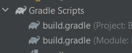

# Android development

<div class="row row-cols-md-2"><div>

You can develop Android apps with many frameworks such as React Native or Electron which uses JavaScript/HTML. This course is about **Android development in Kotlin** while you could use Java too.

> Google recommends using Kotlin over Java since 2019.

**References**

* [Android Courses](https://developer.android.com/courses/) + [CodeLabs](https://codelabs.developers.google.com/?cat=Android) (official, free)
* [Android Docs](https://developer.android.com/docs)
* [Android Teach](https://developer.android.com/teach) (see the slides at the bottom)
* [Android Guides](https://developer.android.com/guide) and [Android UI](https://developer.android.com/develop/ui)

</div><div>

Android Studio <small>(Google)</small> is the IDE you will use. It's based on IntelliJ Community <small>(JetBrains)</small> 😎❤️. There are a few life-saving shortcuts

* <kbd>CTRL+P</kbd>: in `method(<here>)`, show the arguments of a method
* <kbd>CTRL+SPACE</kbd>: manually trigger autocompletion <small>(then use <kbd>TAB</kbd>)</small>
* <kbd>SHIFT+SHIFT</kbd>: search for a method/class/...
* <kbd>ALT+ENTER</kbd>/**hover something** highlighted in red, yellow, grey... to see quick fixes/details.

<details class="details-e">
<summary>Configure in-editor documentation</summary>

To see the documentation of a method, use <kbd>CTRL+Q</kbd> or hover a method. By default, you won't see anything interesting.

* Navigate to the source of any Android class. As a remainder, you can use <kbd>CTRL+(MOUSE LEFT)</kbd> like in VSCode/...
* Click on "Download sources"
* Done
</details>
</div></div>

<hr class="sep-both">

## 📱 Android Studio 📱

*You should refer to IntelliJ notes if you want to master Android Studio.*

<div class="row row-cols-md-2"><div>

#### Gradle

In the Project tab, at the bottom, you got a section "Gradle Scripts". You will have to edit the second `build.gradle (Module: XXX)`.

<div class="text-center">


</div>

Inside `dependencies {}`, you will add new libraries. You need to click on "sync" (when prompted) each time you add a new dependency.

<br>

#### app/manifests/AndroidManifest.xml

This is a file that describes

* What is the main activity <small>(~=screen)</small>?
* What activities <small>(~=screens)</small> you defined?
* What are the permissions that your application needs?
* If your application defining services <small>(~=tasks)</small>?
* ...

<br>

#### app/java/com.xxx.yyy

This is where your classes will be store.
</div><div>

#### app/res

This is where the resources of your application will be stored.

* Drawables <small>(images, icons...)</small>
* Layouts <small>(the layout of each screen)</small>
* Menu
* Values <small>(translations, colors/themes...)</small>
* XML <small>(preferences...)</small>

<br>

#### Device Emulator

The device emulator allow you to create a virtual device or connect yours. You may (or most likely will) use

<div class="row mx-0"><div class="col-9">

* **Device File Explorer**: device's file system
* **Layout Inspector**: running app layout
* **App inspection**: to see workers/tasks/...
* **Logcat**: to see logged messages

**Note**: you may have to refresh the virtual file system manually if you don't see recent changes.

**Note (2)**: on virtual devices, use "..." to manually change settings (location...).
</div><div class="col-3">


</div></div>

</div></div>

<hr class="sep-both">

## 🐛 Debugging 🐛 

<div class="row row-cols-md-2 mt-4"><div>

Use the Logger instead of print/println to keep track of what your application is doing (=logs).

You must give a tag to your log. You will be able to filter messages by tag in the Logcat tab.

```kotlin
// ❌ improper, but easier
Log.v("SOME_TAG_NAME", "message")
```

There are 5 levels of logs. You can increase/decrease the level of logs inside Logcat or by editing the log settings.

* `Log.v`: verbose
* `Log.d`: debug
* `Log.i`: info
* `Log.w`: warn
* `Log.e`: error

If the level of log is **debug**, then all below are included, meaning that only verbose logs won't be shown/logged.

</div><div>

```kotlin
// ✅ proper logging
class XXX : YYY() {
    companion object {
        private const val TAG = "SOME_TAG_NAME"
    }
    
    fun xxx() {
        Log.v(TAG, "verbose message")
    }
}
```

OR, with the TAG outside, and not inside a companion object

```kotlin
// ✅ proper logging
private const val TAG = "SOME_TAG_NAME"

class XXX : YYY() {    
    ...
}
```

</div></div>

<hr class="sep-both">

## 👻 To-do 👻

Stuff that I found, but never read/used yet.

<div class="row row-cols-md-2"><div>

* Android ProGuard
* Datastore
* File system
* Themes
* Android bottom navigation
* Services
* [Nested navigation graphs](https://developer.android.com/guide/navigation/navigation-nested-graphs)
* Room
* backups (see [autobackups](https://developer.android.com/guide/topics/data/autobackup))
* Modern Android Development (MAD)
* Android Tests + Advanced testing
* Deep Link
* Talkback
* Tint/Dark mode
* Advanced Data Binding, Recommended App architecture
* NFC

```kotlin
// https://stackoverflow.com/questions/60672406/how-to-use-coroutine-in-kotlin-to-call-a-function-every-second#answer-60673320
lifecycleScope.launch {
    repeatOnLifecycle(Lifecycle.State.STARTED) {
        while (true) {
            viewModel.refreshXXX()
            delay(60000)
        }
    }
}
```

```kotlin
// implementation "androidx.lifecycle:lifecycle-livedata-ktx:2.5.1"
val myLiveData : LiveData<Int> = flow {
    while (true) {
        val data : Int = 0 /* fetch from the api some data */
        emit(data) // send
        delay(60000) // wait 60 seconds
    }
}.asLiveData()
```

A [flow](https://developer.android.com/kotlin/flow) is canceled when the app goes to background/rotating the screen. We could patch that by giving a timeout to "asLiveData", but by doing that, the flow will continue to be run while the app is in the background, until the timeout that is.
</div><div>

* [Android compose](https://developer.android.com/courses/android-basics-compose/course)
* [Android Basics: Room](https://developer.android.com/courses/android-basics-kotlin/unit-5)
* [Android Basics: Adaptive Layouts](https://developer.android.com/codelabs/basic-android-kotlin-training-adaptive-layouts), [twopane](https://developer.android.com/develop/ui/views/layout/twopane), [cardview](https://developer.android.com/develop/ui/views/layout/cardview)
* [Android coroutines](https://developer.android.com/courses/pathways/android-coroutines)
* [Jetpack Compose](https://developer.android.com/courses/jetpack-compose/course)
* [Android architecture](https://developer.android.com/courses/pathways/android-architecture)

```kotlin
ViewModelProvider(this)[XXXViewModel::class.java]
recyclerView.apply {
    layoutManager = GridLayoutManager(requireContext(), 2)
}

val preferences: SharedPreferences = PreferenceManager.getDefaultSharedPreferences(this)
if (preferences.getBoolean("key", false)) {}

while (true) {
    // do task
    // every 10 seconds
    delay(10000)
}
```

> See also: **[Old notes](_old.md)**
</div></div>