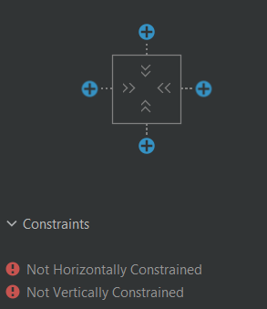
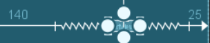
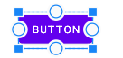
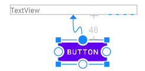

# ConstraintLayout

[Go back](..)

According to the [Constraint Layout Documentation](https://developer.android.com/reference/androidx/constraintlayout/widget/ConstraintLayout): "A ConstraintLayout is a ViewGroup which allows you to position and size widgets in a flexible way".

## Margins

Margins are one way to place an element. Using margins, you will define the horizontal, and the vertical **"free space"** that the element can take. 

Click on "+" to add a margin.

For instance, if we have a screen width of 226dp, and we are adding a margin of 140 (left), and 25 (right), we will have a 61 dp of "free space" for our element.

The part which is not linear is the "free space".

You can define what do to with the "free space". 

By default, both vertically, "layout_width", and "layout_height" are set to "**wrap_content**", so the **content is centered** in the free space.

You can set one to **0** which is a shortcut for **fill** the free space. 

You can click on the symbols next to the "+" to swap "in one click".

## Relative margins

If you click on a View, you will see some circles. A margin can be applied relatively to another View. That could be viewed as "parenting/wrapping a View inside another".

To make a View rendered relatively to another, simply connect one of its dots to another view.

Once you did, moving the "parent" will move the child.

