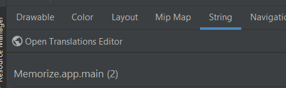

# strings.xml

[Go back](../index.md#resources)

<div class="row row-cols-md-2 mx-0"><div>

This file is used to store every text of the application. Usually programmers write text directly in the attribute `text`, but that's a bad practice generating a warning "Hardcoded Text". The file in question looks like this

```xml
<resources>
    <string name="app_name">Name of your app</string>
</resources>
```

Each row is made of

* a **name**, commonly referred as a key
* a **text**, which is actually the "default translation"

<hr>

In the code you can use that get the text for "app_name"

```kotlin
// implicit "context." (this.)
var appName = getString(R.string.app_name)
```
</div><div>

**Parameters**

You can add parameters/variables that will be later replace in the code. This is a string that will be evaluated with `String.format`, so you can basically do everything you could with functions such as `printf` in C.

```xml
<resources>
    <string name="price">Price: %s</string>
</resources>
```

<hr>

In the code you can use that get the text for "price"

```kotlin
var myText = getString(R.string.price, "$3")
```
</div></div>

<hr class="sl">

## Localization

<div class="row row-cols-md-2 mx-0"><div>

**Add/Edit translation**

1. Open Resources Manager
2. Go to "String"
3. Click on Open Translations Editor <small>(may take some time to appear)</small>



</div><div>

**Add another language**

1. Open Resources Manager
2. Go to "String"
3. Click on "+", and add new "String Resource File"
4. Enter "strings"
5. Click on "Locale" in Qualifiers, then ">>", and select your Locale
6. Directory name should have changed accordingly
7. Press "ok"

</div></div>

<hr class="sr">

## Plurals

<div class="row row-cols-md-2"><div>

```xml
<plurals name="count">
    <item quantity="zero">0</item>
    <item quantity="one">1</item>
    <item quantity="two">2</item>
    <item quantity="few">few</item>
    <item quantity="many">many</item>
    <item quantity="other">unknown</item>
</plurals>
```
</div><div>

You can define plurals, which allows you to add a "s" for instance, if there are more than one entity. Aside from the method that is "new", and an additional parameter, which is used to find which item to use, everything you could do before is still possible.

```kotlin
resources.getQuantityString(R.plurals.count, 0)
```

> **Note**: the selecting of which item ISN'T only based on the quantity, for instance in english, you would say "0 items", and "n items" if $n \gt 1$, so only **other**, and **one** will be used in english, regardless of the quantity.
</div></div>


<hr class="sl">

## Currency

<div class="row row-cols-md-2 mx-0"><div>

Given an amount (int), you can generate a string for a currency with

```kotlin
val amount = NumberFormat.getCurrencyInstance().format(1300.74)
```
</div><div>

* `$1,300.74` (USA, CA...)
* `£1,300.74` (UK)
* `1 300,74€` (FR)
* ...
</div></div>

<hr class="sr">

## Dates

<div class="row row-cols-md-2"><div>

```kotlin
val formatter = SimpleDateFormat("FORMAT", Locale.getDefault())
val calendar = Calendar.getInstance()
val xxx = formatter.format(calendar.time)
```
</div><div class="align-self-center">

See [SimpleDateFormat](https://developer.android.com/reference/java/text/SimpleDateFormat#date-and-time-patterns).

For instance: `ss`, "s" means "seconds", and because there are 2,  it means "use 2 digits" <small>(such as "01" instead of "1")</small>
</div></div>