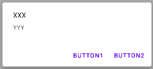

# Android Core

This section is about the core classes/features/... that you might want to use.

<hr class="sep-both">

## 🍾 Toasts 🍾

<div class="row row-cols-md-2"><div>

A toast is an ephemeral popup-like message, usually shown at the bottom of the screen. It's mostly used to show an error message, or some feedback <small>(ex: connection lost)</small>.

<div class="text-center">


</div>
</div><div>

```kotlin
// short
Toast.makeText(this, "Some message", Toast.LENGTH_SHORT).show()
// long
Toast.makeText(this, "Some message", Toast.LENGTH_LONG).show()
```
</div></div>

<hr class="sep-both">

## 🎆 Notifications 🎆

<div class="row row-cols-md-2"><div>

First, add the permission in AndroidManifest.xml

```xml
<uses-permission android:name="android.permission.POST_NOTIFICATIONS" />
```

Then, since Android O, you need to create a **channel**. Developers should group their notifications by channels. For the user, they can do operations like disabling a notification channel.

* [Create a Channel](https://developer.android.com/develop/ui/views/notifications/channels#CreateChannel)
* I pasted the code in `XXX#onCreate` <small>(XXX extends Application)</small>

See also.

* [Create multi-lines notifications, or add images/...](https://developer.android.com/develop/ui/views/notifications/expanded)
* [Do something if the user click on the notification](https://developer.android.com/develop/ui/views/notifications/navigation)
</div><div>

You also have to provide an icon, a title, a message, and [a priority](https://developer.android.com/reference/androidx/core/app/NotificationCompat.Builder#setPriority(int)).

```kotlin
// priority is ignored on Android O (Channel importance is used instead)
val builder = NotificationCompat.Builder(applicationContext, channel_id)
    .setSmallIcon(R.drawable.some_icon)
    .setContentTitle("title")
    .setContentText("body")
    .setPriority(NotificationCompat.PRIORITY_DEFAULT)
    
with(NotificationManagerCompat.from(context)) {
    // the "notificationId" is used to edit/close/...
    // this notification later. Use any value >0.
    notify(notificationId, builder.build())
}
```
</div></div>

<hr class="sep-both">

## 🪜 WorkManager 🪜

<div class="row row-cols-md-2"><div>

A WorkManager is used to run **long**, **periodic**, or **battery intensive tasks**. Unlike previous APIs, you are guaranteed that you job will be executed, even if the app is closed, or the phone restart.

```gradle
implementation "androidx.work:work-runtime-ktx:2.7.1"
```

#### Access the WorkManager

```kotlin
val workManager = WorkManager.getInstance(this)
// or, use static methods
WorkManager.someStaticMethod()
```

#### Create a worker

```kotlin
class XXXWorker(c: Context, args: WorkerParameters) : Worker(c, args) {
    // use 'applicationContext' to get back the context
    override fun doWork(): Result {
        // use Result.failure()/Result.retry() on error
        return Result.success()
    }
}
```

To create an async worker, you can use a [CoroutineWorker](https://developer.android.com/guide/background/persistent/threading/coroutineworker).

```kotlin
class XXXWorker(c: Context, args: WorkerParameters) : CoroutineWorker(c, args) {
    override suspend fun doWork(): Result {
        delay(5000) // example of async call
        return Result.success()
    }
}
```

</div><div>

#### Create a WorkRequest

If you want a job to only be performed once, you can use a **OneTimeWorkRequest**.

```kotlin
val request = OneTimeWorkRequest.from(XXXWorker::class.java)
// using the builder
val request = OneTimeWorkRequestBuilder<XXXWorker>().build()
```

See also **PeriodicWorkRequest** below.

#### Run a WorkRequest

A work manager is taking a **WorKRequest** and run it.

```
// process a request
workManager.enqueue(request)
// chain requests
workManager.beginWith(request)
    .then(request).then(request)/*...*/.build()
```

#### Additional notes

<p></p>

<details class="details-e">
<summary>Add constraints on the WorkRequest</summary>

Here is an example of every constraint you can use

```kotlin
// here examples of every constraint you can use
val constraints = Constraints.Builder()
    .setRequiresCharging(true)
    .setRequiresBatteryNotLow(true)
    .setRequiresStorageNotLow(true)
    .setRequiresDeviceIdle(true)
    .setRequiredNetworkType(NetworkType.CONNECTED)
    .build()
```

Then, you can use `setConstraints` to pass contraints. For instance, for a **OneTimeWorkRequest**, you will have

```diff
val request = OneTimeWorkRequestBuilder<XXXWorker>()
+    .setConstraints(constraints)
    .build()
```
</details>

<details class="details-e">
<summary>Add a tag to a work request</summary>

This can be used to find work requests by tag.

```kotlin
// ✅ good practice (in a companion object...)
private const val TAG = "SOME_TAG"
```

```diff
val request = OneTimeWorkRequestBuilder<XXXWorker>()
+    .addTag(TAG)
    .build()
```

</details>

<details class="details-e">
<summary>Pass data to a worker, between worker, or return a result</summary>

The data passed is a dictionary.

```kotlin
// ✅ good practice (in a companion object...)
private const val KEY = "key"
private const val KEY2 = "key2"
// ➡️ Using Data.Builder
val someData = Data.Builder()
    .putString(KEY, "value")
    .putInt(KEY2, 5000)
    .build()
// ➡️ Using workDataOf
val someData = workDataOf(KEY to "value", KEY2 to 5000)
```

To pass data to the first task, use

```diff
val request = OneTimeWorkRequestBuilder<XXXWorker>()
+    .setInputData(someData)
    .build()
```

Inside a worker, to get data, use

```kotlin
inputData.getString(key)
...
```

To pass data to the following task if any, or to any observer

```kotlin
Result.success(someData)
```

</details>

<details class="details-e">
<summary>Observe a worker</summary>

```kotlin
private val _work : LiveData<List<WorkInfo>>

_work = workManager.getWorkInfosForUniqueWorkLiveData(WID)
_work = workManager.getWorkInfoByIdLiveData(uuid)
_work = workManager.getWorkInfosByTagLiveData(TAG)
```

The LiveData contains a list of WorkInfo, one per worker.

To make thing easier, we use Transformations, and work will only be non-null when the first task (`it[0]`) in completed.

```kotlin
// only one job, no need for a list to be public
val work: LiveData<WorkInfo>

// NOTE: this must be called after
// _work = ...
// as _work must have been initialized
work = Transformations.map(_work) {
    // not yet
    if (it.isNullOrEmpty()) {
        return@map null
    }
    // ensure that the job if finished
    return@map if (it[0].state.isFinished) it[0] else null
}
```

Then, do as usual

```kotlin
viewModel.work.observe(viewLifecycleOwner) {
    // do something when the job has finished.
    // If you passed data, you can use it.outputData
}
```
</details>

<details class="details-e">
<summary>Cancel work</summary>

```kotlin
workManager.cancelAllWork()
workManager.cancelUniqueWork(WID)
workManager.cancelWorkById(uuid)
workManager.cancelAllWorkByTag(TAG)
```

</details>

<details class="details-e">
<summary>Unique WorkRequests</summary>

If you want to ensure there is **up to one** WorkRequest running at a time, you can use **unique work chains**.

```kotlin
// ✅ good practice (in a companion object...)
private const val WID = "SOME_ID"
```

```diff
// process a request
-workManager.enqueue(request)
+workManager.enqueueUniqueWork(WID, policy, request)
// chain requests
-workManager.beginWith(request)
+workManager.beginUniqueWork(WID, policy, request)
    .then(request).then(request)/*...*/.build()
```

The policy is one of these

* **ExistingWorkPolicy.REPLACE**: cancel previous job then start
* **ExistingWorkPolicy.KEEP**: only start if there is no pending job
* **ExistingWorkPolicy.APPEND**: process after the previous unique work chain is finished
</details>

<details class="details-e">
<summary>PeriodicWorkRequest</summary>

You can use **PeriodicWorkRequest** for requests that should be executed every X minutes, X being greater than 15.

```kotlin
// every 15 hours
val request = PeriodicWorkRequestBuilder<XXXWorker>(15, TimeUnit.HOURS) .build()
// and you need to use
workManager.enqueueUniquePeriodicWork(WID, ExistingPeriodicWorkPolicy.REPLACE, request)
```
</details>
</div></div>

<hr class="sep-both">

## 🪁 InputManager 🪁

<div class="row row-cols-md-2 mt-3"><div>

**Hide keyboard**

```kotlin
val inputMethodManager = getSystemService(Context.INPUT_METHOD_SERVICE) as InputMethodManager
// ➡️ Activity
inputMethodManager.hideSoftInputFromWindow(currentFocus!!.windowToken, 0)
// ➡️ Fragment
inputMethodManager.hideSoftInputFromWindow(view.windowToken, 0)
```
</div><div>

</div></div>

<hr class="sep-both">

## 📧 Dialogs 📧

<div class="row row-cols-md-2"><div>

Dialogs are made of a title (optional), a message, and some buttons (accept/close). Clicking on any button will close the popup.



```kotlin
// ➡️ Replace "this" with "requireContext()" in a Fragment
MaterialAlertDialogBuilder(this)
    .setTitle("XXX")
    .setMessage("YYY")
    .setNegativeButton("Button1") { _, _ ->
        // execute some code when Button1 is pressed
    }
    .setPositiveButton("Button2") { _, _ ->
        // execute some code when Button2 is pressed
    }
    .show()
```
</div><div>

#### Non-cancelable dialogs

It may be worth noting that users can close the dialog by using the "back" arrow, which was removed on newer devices. To prevent this:

```diff
MaterialAlertDialogBuilder(this)
    [...]
+    .setCancelable(false)
    .show()
```
</div></div>

<hr class="sep-both">

## ☕ Customize the menu bar ☕

<div class="row row-cols-md-2 mt-3"><div>

#### ➡️ Generate a XML 

* Open the "Ressources Manager"
* Click on "..."
* Select Menu
* Click on "+"
* Enter a FileName, such as "main_menu"
* Press OK

<details class="details-e">
<summary>Empty Menu File in app/res/menu</summary>

```xml
<?xml version="1.0" encoding="utf-8"?>
<menu xmlns:app="http://schemas.android.com/apk/res-auto"
    xmlns:android="http://schemas.android.com/apk/res/android"
    xmlns:tools="http://schemas.android.com/tools">
</menu>
```
</details>

<br>

#### ➡️ Adapt the XML

The process is the same as with Layouts, but with a smaller library. It's important to **give an Id to every MenuItem**.

```xml
<item
    android:id="@+id/example_menu_item"
    android:title="Shown in App"
    tools:title="Shown in DesignView"
    ...
     />
```

Note that by default, MenuItems are shown in "...". You can change this behavior by using "showAsAction". If an icon is present, it will be shown, otherwise, the title will be shown instead.

```
<item
    android:icon="@drawable/ic_launcher_foreground"
    app:showAsAction="always" />
```
</div><div>

#### Reusable menus with a MenuProvider

The recommended way to add a menu is by using a **MenuProvider**.

```kotlin
class XXXMenuProvider : MenuProvider {
    // menu/main_menu.xml
    override fun onCreateMenu(menu: Menu, menuInflater: MenuInflater) {
        menuInflater.inflate(R.menu.main_menu, menu)
    }

    override fun onMenuItemSelected(menuItem: MenuItem): Boolean {
        return when (menuItem.itemId) {
            R.id.example_menu_item -> {
                // ... code if the user click on this menu item ...
                true
            }
            else -> false
        }
    }
}
```

⚠️ Note that if you add it to a fragment <small>(resp. activity)</small>, it will be removed when moving to another fragment <small>(resp. activity)</small>.

```kotlin
// ➡️ Activity
addMenuProvider(XXXMenuProvider(), this, Lifecycle.State.RESUMED)
// ➡️ Fragment
activity?.addMenuProvider(XXXMenuProvider(), viewLifecycleOwner, Lifecycle.State.RESUMED)
```

<br>

#### Additional notes

<p></p>

<details class="details-e">
<summary>Menus for an Activity without a MenuProvider</summary>

```kotlin
class MainActivity : AppCompatActivity() {
    // ...

    // menu/main_menu.xml
    override fun onCreateOptionsMenu(menu: Menu?): Boolean {
        menuInflater.inflate(R.menu.main_menu, menu)
        // you may use
        // menu?.findItem(R.id.example_menu_item)
        // to setup your menu items
        return true
    }

    override fun onOptionsItemSelected(item: MenuItem): Boolean {
        return when (item.itemId) {
            R.id.example_menu_item -> {
                // ... code if the user click on this menu item ...
                true
            }
            else -> super.onOptionsItemSelected(item)
        }
    }
}
```
</details>

</div></div>