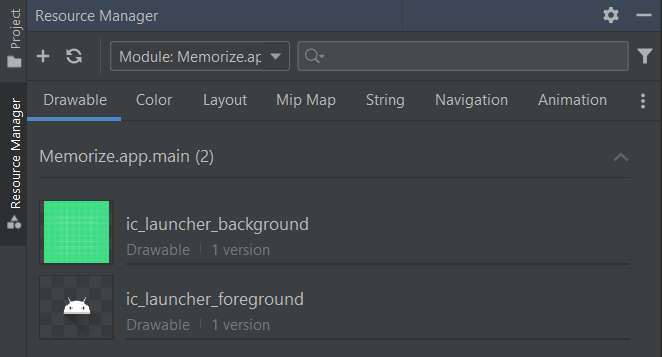
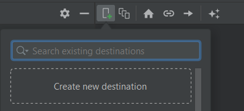

# Android Views

<div class="row row-cols-md-2"><div>

Android Views are **XML files** stored in **app/res/layout**.

```
<?xml version="1.0" encoding="utf-8"?>
<FrameLayout xmlns:android="http://schemas.android.com/apk/res/android"
             xmlns:app="http://schemas.android.com/apk/res-auto"
             xmlns:tools="http://schemas.android.com/tools"
             android:layout_width="match_parent"
             android:layout_height="match_parent"
             tools:context=".MainActivity" >
  <!-- YOUR VIEW HERE -->
</FrameLayout>
```
</div><div>

If you copy-pasted an XML, or tried to edit it manually, you must know

* 👉 FrameLayout <small>(or the parent of every other)</small> is called the **root**.
* 👉 **xmlns:** are very important. You can't use **android:** if you didn't add the matching **xmlns:android**. They are added to the **root**.
* 👉 **tools:context** point to the associated Fragment/Activity in YOUR code, so you must give it an appropriate value.

Aside from that, almost every file is an XML file. This is a sort of HTML with tags **<MyTag></MyTag>**, or **<MyTag />**, in which you can add attributes  **<ImageView src="/path/to/my/image" />**.
</div></div>

<hr class="sep-both">

## 📦 Resources 📦

<div class="row row-cols-md-2"><div>

Resources includes **strings** (texts), **colors**, **dimensions**, **drawables** (images), **mipmap** (icons), and many other things.

You can manage them from the **Resources Manager**

* From the Left side, right under "project"
* with View > Tools Windows > Resources Manager


</div><div>

##### Add a local image

Go to drawables, and click on "+" > Import.

<br>

##### Add an icon

Go to drawables, and click on "+" > Vector Asset. Then, click on the <i class="bi bi-android"></i> <small>(android icon)</small> next to "clip art".

On Android 20, or older, you need to add this in build.gradle > Android > defaultConfig: `vectorDrawables.useSupportLibrary = true`.
</div></div>

<hr class="sep-both">

## Layout Editor

Instead of editing the XML manually, you will usually use the Design mode.

<div class="row row-cols-md-2 mx-0"><div class="align-self-center">

<ol style="list-style-type: lower-alpha">
<li><b>Mode</b>: you can switch to the XML/Layout editor here</li>
<li><b>Palette</b>: views that you can drag and drop to the design view</li>
<li><b>Design view</b>: what the user will see</li>
<li><b>BluePrint view</b>: Design View, but with hidden elements too</li>
<li><b>Component tree</b>: list of all views of your screen</li>
<li><b>Attributes</b>: edit the properties of a view</li>

</ol>
</div><div>


</div></div>

**TIP**: you should rely on <kbd>CTRL+F</kbd> to search for attributes, or by clicking on the search icon at the top of the "Attributes" window.

**TIP**: you will most likely have a time when you want to replace a view with another view. In the component tree, right-click on a view, and use "convert view". You could also manually get the job done by directly editing the `.xml`.

<hr class="sep-both">

## Views

<div class="row row-cols-md-2"><div>

In Android, every component such as an Image is called a **View**. Every view must have at least these two attributes

* **android:layout_width**: wrap, match_parent, a fixed width
* **android:layout_height**: wrap, match_parent, a fixed height

And these attributes are available on any View

* **android:padding**: internal gap <small>(ex: 10dp)</small>
* **android:layout_margin**: external gap <small>(ex: 10dp)</small>
* **android:visibility**: View.VISIBLE / View.INVISIBLE / View.GONE

##### TextView: display a text

[TextView extends View](https://developer.android.com/reference/android/widget/TextView).

```xml
<TextView
    android:text="Shown in the app"
    tools:text="Shown in the DesignView"
    />
```

##### Button: a button

[Button extends TextView](https://developer.android.com/reference/android/widget/Button).
</div><div>

##### ImageView: display an image

[ImageView extends View](https://developer.android.com/reference/android/widget/ImageView)

```
<!-- scaleType="centerCrop" is used for 9patches scaling -->
<ImageView 
    tools:srcCompat="YOUR_IMAGE"
    android:scaleType="centerCrop"
    />
```

##### EditText: an input field

[EditText extends TextView](https://developer.android.com/reference/android/widget/EditText). See also [InputType](https://developer.android.com/develop/ui/views/touch-and-input/keyboard-input/style) and [Autofill](https://developer.android.com/guide/topics/text/autofill-optimize).

```
<EditText
    android:inputType="text"
    android:autofillHints="username"
    android:hint="Placeholder in the app"
    tools:hint="Placeholder in the DesignView"
    />
```

##### Switch: check or uncheck

[Switch extends Button](https://developer.android.com/reference/android/widget/Switch) <small>(indirectly)</small> and [SwitchCompat](https://developer.android.com/reference/androidx/appcompat/widget/SwitchCompat).

```
<Switch android:checked="true" />
<!-- ✅ better -->
<androidx.appcompat.widget.SwitchCompat
    android:checked="true" />
```
</div></div>

<hr class="sep-both">

## Layouts

<div class="row row-cols-md-2"><div>

There are components called **ViewGroup** to group views and apply changes/... to the group.

Layouts are ViewGroups with predefined settings. For instance, a **GridLayout** will put nested views in a grid-like format.

#### LinearLayout: Horizontal/Vertical

[Documentation](https://developer.android.com/develop/ui/views/layout/linear)

```
<LinearLayout
    ...
    android:orientation="vertical"
    android:orientation="horizontal"
    >
      <!-- optional weight (responsive width/height) -->
      <XXXView
           android:layout_weight="1"
           />
</LinearLayout>
```

#### FrameLayout: a layout with only one child.

[Documentation](https://developer.android.com/reference/android/widget/FrameLayout)

```
<FrameLayout ...>
  <!-- usually a recycler view, or a fragment container -->
</FrameLayout>
```
</div><div>

#### ConstraintLayout: a flexible way to design views

[Documentation](https://developer.android.com/develop/ui/views/layout/constraint-layout)
```
implementation 'androidx.constraintlayout:constraintlayout:2.1.4'
```

A constraint layout is rendering elements relatively to another component <small>(which could be the screen)</small>. You will set margins which are the gap with the other component.


On a screen of 226px, if you define that the component should have a margin-left of 140, and a margin-right of 26. The component will be centered within the 60 remaining px called **free space**.

To change the behavior of how the free space is handled, simply edit the layout width/height OR you can use a shortcut by clicking on arrows such as ">>" right where you added margins.


</div></div>

<hr class="sep-both">

## 🔗 Get access to a view from the code 🖇️

<div class="row row-cols-md-2"><div>

You can then use `findViewById(some_id)` to get a view.

```diff
<SomeViewHere
+        android:id="@+id/someUniqIdHere"
```

```kotlin
// ➡️ In Activity#onCreate
// ➡️ In Fragment#onViewCreated
val x = findViewById<SomeViewHere>(R.id.someUniqIdHere)
```

#### TextView

```kotlin
var t = findViewById<TextView>(...)
t.text = "Some text"
t.setText(R.string.some_string)
```

#### Button

```kotlin
val b = findViewById<Button>(...)
b.setOnClickListener {
    println("Clicked on myButton")
}
```
</div><div>

#### ImageView

```kotlin
var i = findViewById<ImageView>(...)
// set image from the code
i.setImageResource(R.drawable.some_drawable_here)
```

#### EditText

```kotlin
val e = findViewById<EditText>(...)
// handle key events
e.setOnKeyListener { v, keyCode, keyEvent ->
    if (keyCode == KeyEvent.KEYCODE_A) {
        return@setOnKeyListener true
    }
    return@setOnKeyListener false
}
```

#### Switch/SwitchCompact

```kotlin
var s = findViewById<SwitchCompact>(...)
if(s.isChecked) {}
```
</div></div>


<hr class="sep-both">

## ✨ View Binding ✨

<div class="row row-cols-md-2"><div>

ViewBinding is a new alternative to `findViewById`.

Ids declared in **activity_main.xml** will be available via a generated class called **ActivityMainBinding** <small>(matching the XML filename)</small>.

First, add the viewBinding build feature.

```diff
android {
    ...

+    buildFeatures {
+        viewBinding = true
+    }
}
```

</div><div>

Assume that we have an XML file with

```xml
<SomeViewHere
    android:id="@+id/someUniqIdHere"
    ...
/>
```

This is how you could adapt your previous code with `findViewById`.

<details class="details-e">
<summary>Ex: activity_main.xml in an Activity</summary>

```diff
class MainActivity : AppCompatActivity() {
+    private lateinit var binding: ActivityMainBinding

    override fun onCreate(savedInstanceState: Bundle?) {
        super.onCreate(savedInstanceState)
+        binding = ActivityMainBinding.inflate(layoutInflater)

-        setContentView(R.layout.activity_main)
+        setContentView(binding.root)

-        val x = findViewById<SomeViewHere>(R.id.someUniqIdHere)
+        val x = binding.someUniqIdHere
    }
}
```
</details>

<details class="details-e">
<summary>Ex: fragment_blank.xml in a Fragment</summary>

```diff
class BlankFragment : Fragment() {
+    private lateinit var binding: FragmentBlankBinding

    override fun onCreateView(...): View? {
-        return inflater.inflate(R.layout.fragment_blank, container, false)
+        binding = FragmentBlankBinding.inflate(layoutInflater, container, false)
+        return binding.root
    }

    override fun onViewCreated(view: View, savedInstanceState: Bundle?) {
        super.onViewCreated(view, savedInstanceState)
+        val x = binding.someUniqIdHere
    }
}
```
</details>
</div></div>

<hr class="sep-both">

## ⚡ Data Binding ⚡

<div class="row row-cols-md-2 mt-3"><div>

DataBinding is an extension of `ViewBinding` in which you can connect LiveData or normal variables directly to the XML. If the LiveData is modified, then the View is updated automatically.

```diff
android {
    ...

    buildFeatures {
        viewBinding = true
+        dataBinding = true
    }
}
```

DataBinding is a bit hard to set up. You need to edit your XML first. To wrap your root inside a tag **layout**. You don't have to move **xmlns:** attributes, or change anything else.

```xml
<?xml version="1.0" encoding="utf-8"?>
<layout>
<data>
</data>

<!-- Leave your previous root here (unchanged) -->
</layout>
```

➡️ Indents will be messed up. Right-click on the file > Reformat code, leave everything checked, and run it by pressing "ok".  

The code is the same as ViewBinding, with a minor change.

<details class="details-e">
<summary>Ex: activity_main.xml in an Activity</summary>

```diff
class MainActivity : AppCompatActivity() {
    private lateinit var binding: ActivityMainBinding

    override fun onCreate(savedInstanceState: Bundle?) {
        super.onCreate(savedInstanceState)
-        binding = ActivityMainBinding.inflate(layoutInflater)
+        binding = DataBindingUtil.setContentView(this, R.layout.activity_main)

        setContentView(binding.root)

        val x = binding.someUniqIdHere
    }
}
```
</details>

<details class="details-e">
<summary>Ex: fragment_blank.xml in a Fragment</summary>

```diff
class BlankFragment : Fragment() {
    private lateinit var binding: FragmentBlankBinding

    override fun onCreateView(...): View? {
-        binding = FragmentBlankBinding.inflate(layoutInflater, container, false)
+        binding = DataBindingUtil.inflate(inflater, R.layout.fragment_blank, container, false)
        return binding.root
    }

    override fun onViewCreated(view: View, savedInstanceState: Bundle?) {
        super.onViewCreated(view, savedInstanceState)
        val x = binding.someUniqIdHere
    }
}
```
</details>

🔥 It's worth mentioning that the change above is **useless** if you're using both DataBinding+ViewBinding. The ViewBinding code is working fine **even** if you changed the XML to use DataBinding. The change above is **useful** if you're only using DataBinding. 🔥
</div><div>


#### Passing data to the XML

First, you must set the Lifecycle owner.

```kotlin
// ➡️ In Activity#onCreate
binding.lifecycleOwner = this
// ➡️ OR; In Fragment#onViewCreated
binding.lifecycleOwner = viewLifecycleOwner
```

Then, you must declare variables in the XML **data** tag.

```diff
<data>
+  <variable name="viewModel" type=".YourViewModelTypeHere" />
</data>
```

Then, right below `binding.lifecycleOwner`, pass the variables.

```kotlin
binding.viewModel = GiveAValueMatchingTheType
```

Then, in your XML, you can use your variable + expression inside `@{}`. For instance, if you have a 

```xml
<example>
  <!-- user is a LiveData -->
  <TextView android:text="@{viewModel.user.username}" />
  <!-- some_key is a string taking a parameter "%s" -->
  <TextView android:text="@{@string/some_key(viewModel.string)}" />
  <!-- examples with booleans -->
  <TextView android:text='@{viewModel.boolean ? "x" : "y" }' />
  <TextView android:text='@{viewModel.boolean ? @string/toto : "" }' />
  <!-- state / events -->
  <Switch android:checked="@{viewModel.xxx.equals(yyy)}" />
  <Button android:onClick="@{() -> viewModel.xxx()}" />
</example>
```

You can't do complex calculations. For instance, you can't convert an Int to a String. Instead, either use **BindingAdapters**, or add a function, for instance, in User, returning an appropriate value.

<details class="details-e">
<summary>BindingAdapters: complex, but powerful</summary>

```diff
plugins {
+    id 'kotlin-kapt'
}
```

Either create a specific class, or use a companion object.

```kotlin
companion object {
  // ➡️ Add an attribute "app:xxx" on a TextView
  //  taking a value of type "Type"
  @BindingAdapter("app:xxx") @JvmStatic
  fun bindXXXText(textView: TextView, value: Type) {
     // do what you want the attribute to do
  }

  // 👻, never used this
  @InverseBindingAdapter(attribute = "app:xxx", event = "android:textAttrChanged") @JvmStatic
  fun getText(textView: TextView) = textView.text.toString()
}
```

You can use the attribute as long as `app` was imported <small>(see the appropriate `xmlns:` at the top of this page if needed)</small>.

```xml
<TextView
    app:xxx="@{viewModel.aValueMatchingTheSelectedType}"
    />
```
</details>

</div></div>

<hr class="sep-both">

## 🧭 Navigation Component 🧭 

<div class="row row-cols-md-2"><div>

The [navigation component](https://developer.android.com/guide/navigation/navigation-getting-started) is a Jetpack component to handle the navigation between fragments.

```gradle
dependencies {
  implementation "androidx.navigation:navigation-fragment-ktx:2.5.3"
  implementation "androidx.navigation:navigation-ui-ktx:2.5.3"
}
```

<br>

#### Create a navigation graph

From the resource manager, go to "navigation", then add a new navigation. For instance, "example_navigation". The generated **example_navigation.xml** is the following

```xml
<?xml version="1.0" encoding="utf-8"?>
<navigation xmlns:android="http://schemas.android.com/apk/res/android"
    xmlns:app="http://schemas.android.com/apk/res-auto"
    android:id="@+id/example_navigation">
</navigation>
```

<br>

#### Add destinations

<div class="row row-cols-md-2"><div>

Switch to the Design View. Create or import your Fragments by clicking on the phone with the plus/add icon.
</div><div>


</div></div>

➡️ To change the "home" fragment, select a fragment, and click on the home icon. The home fragment is the one loaded by default.
</div><div>

#### Create a NavHost

Now, you need to create a container. This container will host your navigation graph. It will load the default fragment, and show another fragment when prompted.

```xml
<androidx.fragment.app.FragmentContainerView
  android:id="@+id/nav_host_fragment"
  android:name="androidx.navigation.fragment.NavHostFragment"

  app:defaultNavHost="true"
  app:navGraph="@navigation/example_navigation" />
```

➡️On old devices, there is an arrow to go "back". If defaultNavHost is set to true, then "back" will go back to the previous fragment.

#### Navigation

Inside **example_navigation.xml**, each fragment should have an Id.

```kotlin
findNavController().navigate(R.id.DESTINATION_ID)
```

You can also create an action (=link), by linking two destinations. Then, use the action's Id

```kotlin
findNavController().navigate(R.id.action_xxx_to_yyy)
```

#### Additional notes

<p></p>

<details class="details-e">
<summary>Setup the navbar to follow a NavHost</summary>

This will set the "label" of a fragment <small>(see the navigation file)</small> as the title of the screen. Moreover, this will add a button "back" to go back to the previous fragment.


```kotlin
class MainActivity : AppCompatActivity() {
    private lateinit var navController: NavController

    override fun onCreate(savedInstanceState: Bundle?) {
        super.onCreate(savedInstanceState)
        setContentView(R.layout.activity_main)

        val navHostFragment = supportFragmentManager.findFragmentById(R.id.nav_host_fragment) as NavHostFragment
        navController = navHostFragment.navController
        // show the label in the menu bar
        // and the icon "back" when needed
        setupActionBarWithNavController(navController)
    }

    // pressing "back" in the menu, will go back
    override fun onSupportNavigateUp(): Boolean {
        return navController.navigateUp() || super.onSupportNavigateUp()
    }
}
```
</details>

<details class="details-e">
<summary>Pass arguments to another fragment</summary>

For that, you must create an action. Then, click on the screen that must receive the parameter. In the section, add arguments.

```kotlin
findNavController().navigate(R.id.action_first_to_second, Bundle().apply {
  // Ex: passing a string
  putString("key", "value")
})
```

in the fragment receiving the arguments, use

```kotlin
val value = arguments?.getString("key")
```

👉 The problem with that, is that there is no verification of the argument being passed or stuff like that. So, we use **SafeArgs** when we want to do things safely.

```gradle
// At the top of your build.gradle
buildscript {
    dependencies {
        classpath "androidx.navigation:navigation-safe-args-gradle-plugin:2.5.3"
    }
}

// after plugin { ... }
apply plugin: 'androidx.navigation.safeargs.kotlin'
```

SafeArgs will generate a class **XXXDirections** with XXX the name of the current class.

```diff
-findNavController().navigate(R.id.action_first_to_second, Bundle().apply {
-  putString("key", "value")
-})
+val destination = FirstDirections.actionFirstToSecond(key = "value")
+findNavController().navigate(destination)
```

Again, SafeArgs will generate a class **XXXArgs** with XXX the name of the current class.

```diff
-val value = arguments?.getString("key")
+val args by navArgs<XXXArgs>()
+val value = args.key
```
</details>

<details class="details-e">
<summary>Navigation back stack</summary>

The idea is the same as for [Activities](../activities/index.md#application-back-stack), but **each Activity has a back stack of fragments**.

* Remove every fragment until the previous one is either null or a fragment with the Id "**DESTINATION_ID**".

```diff
<action
+  app:popUpTo="@id/DESTINATION_ID"
  />
```

* Remove every fragment until the previous one is either null or the fragment BEFORE a fragment with the Id "**DESTINATION_ID**".

```diff
<action
  app:popUpTo="@id/first"
+  app:popUpToInclusive="true"
  />
```

* You can call methods from the code too

```kotlin
findNavController().popBackStack()
```
</details>

</div></div>

<hr class="sep-both">

## 👻 To-do 👻

Stuff that I found, but never read/used yet.

<div class="row row-cols-md-2"><div>

* [RadioButton](https://developer.android.com/reference/android/widget/RadioButton), and [RadioGroup](https://developer.android.com/reference/android/widget/RadioGroup)
  * RadioGroup#`checkedButton`
  * RadioGroup#`setOnCheckedChangeListener`: parameters are radio group, and the Id of the checked button.
</div><div>

* `tools:visibility` and the icon in the Design View to swap
</div></div>