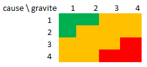

# Risks

[Go back](../index.md#specifications)

**YOU CAN'T SKIP THIS PART**. So don't even try. A lot of people are forgetting about it, but that's the most important one.

> <q>80% de projets, informatiques ou non, sont commencés mais ne sont jamais terminés.</q> \- my teacher

## Some ideas

As a student, I thought about these risks

* **team**
  * a student isn't working
    * not motivated
    * nothing he/she can do
      * lack of knowledge?
      * lack of tasks?
  * a student can't work
    * technical problems
    * personal problems
  * a student's computer is dead
  * a student don't listen to the group
* **tools**
  * git isn't working anymore
  * the source code online got deleted
  * Trello (if you are using it) is unavailable
  * a tool doesn't seem to work
  * a tool is too hard to use
  * there is a minor/major bug in a software that we are using
* **code**
  * a part of our architecture needs to be changed, breaking all the project
  * we want/need to add a breaking functionality
* **resources**
  * we are needing unexpected assets (sounds, ...)
  * the creation of your assets (sounds, images, ...) got delayed
  * something is missing
* **general**
  * something to delayed/postponed
  * security problems

## Ranking the risks (equation)

You may use the following function $r$ to quantify a risk given a cause $c$

@
r(c) = P(X = c) * severity(c)
@

This is the probability of the cause happening by the severity of the cause. Generally, we are giving an arbitrary value: $0,\ 0.25,\ 0.50,\ 0.75,\ 1.0$ for both $P(X = c)$ and $severity(c)$.

**edit 28/08/2021**: it seems to have a name: [Probabilistic risk assessment](https://en.wikipedia.org/wiki/Probabilistic_risk_assessment).

## Ranking the risks (matrix)

Sort your risks with the "1 2 3 4 notation" (not MoSCoW).

* `4`: critical
* `3`: important
* `2`: low risk
* `1`: do not care

You will get something like this, and you have to put your risks in a box. Deal with the risks in red first, then the orange ones, and then the green ones.

**edit 16/08/2021**: I was looking for "**risk matrix**" on [Wikipedia](https://en.wikipedia.org/wiki/Risk_matrix) and found a matrix that looks ways better than what I learned.