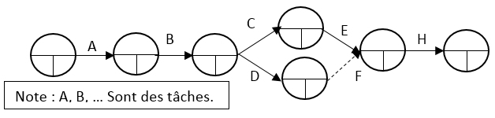

# P.E.R.T.

[Go back](../index.md#organize-your-project)

P.E.R.T., which is properly introduced in [the graph theory course](../../../maths/graph/scheduling/pert.md), is a method to solve scheduling problems (critical paths, margins). What we will use below is a simplified version of P.E.R.T., without margins, and paths.

In this simplified version of PERT, the initial node is the project, and we are using arrows to move from one state to another state of our project after doing a task. We use `------` to represent a task that will take longer than the other one.

To summarize, this will helps us because we will be able to visually see which tasks we can delay, and which ones we cannot. In this simplified version, you will see the dependencies between tasks, and it well helps when making the GanTT.

