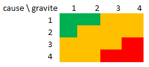

# Risks

**YOU CAN'T SKIP THIS PART**. So don't even try.

> « 80% de projets, informatiques ou non, sont commencés mais ne sont jamais terminés. »

The idea would be to think about risks, when you are doing some small
project, that's hard...

* a student isn't working
* a student can't work
* a student computer is dead
* git isn't working anymore / the source code online got deleted
* trello (if you are using it) is unavailable
* a tool don't seems to work or making the project with it is too hard
* a student don't listen to the group
* some part of our architecture need to be changed, breaking all the project
* you want/need to add a breaking functionality
* there is a minor/major bug in a software that you are using
* you are needing some graphics but you don't have them, or they got delayed
* something is missing
* something to delayed/postponed
* something got canceled because someone have other plans / don't want to do it
* someone has problems (personal/...) and can't work anymore
* some security problem
* ...

Then when you got them, sort them !

cause (% of possibility) trigger a consequence/effect (% degree of severity).

Generally, we are theses values for % : 0, 25, 50, 75, 100. Then
simply evaluate **(% of possibility) * (% degree of severity)** to sort
your risks.

**Using a matrix**

Sort your risks with 1 2 3 4 notation (not MoSCoW).

* `4`: critical
* `3`: important
* `2`: low risk
* `1`: do not care

You will got something like this and put your risks in the 
right box. Deal with the risks in red first, then the orange
one and then the green ones.