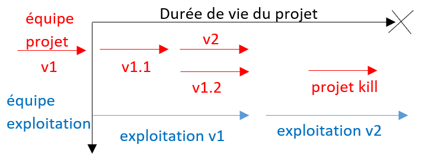
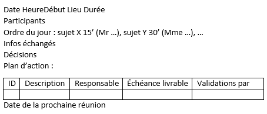

# What's in this course

Honestly, this is a boring theoretical yet interesting
course. You will learn a lot of things, but they may
be a lot of vocabulary. I will try to make things in a
useful way so that you will enjoy the course.

* Write Specifications (CDC)
* Project Structure
* Reporting

## Vocabulary (words are in french)

* ``Besoin``: what the client wants
* ``Livrables``: what you will give to the client
* ``Jalons``: important dates of your project
* ``Périmètre``: tasks, livrables, budget, ... everything
related to the project.
* ``HJ``: "Homme-Jour", an indicator of how many resources
a task will require
* ``Maitre d’ouvrage``: interactions with the client
* ``Maitre d’oeuvre``: interactions with programmers/technical staff

## Project Structure

There are usually 2 teams

* ``build-team`` or `project-team` : create the first version
* ``run-team`` or `exploitation-team` : keep the project
running, make upgrades, ...
  

It's usually like this.

## Specifications

You will need to write a document (Cahier des charges
in French) after thinking a lot about a lot of things.

**Functional Specifications**

Make a list of all tasks. You need for each task

* amount of time (HJ) and money
* a priority, see [MoSCoW](tools/moscow.md)
* maybe a mockup so that you can help
the devs know exactly what they need to do
* write some sentences about what each task
will involve (ex: register means sending a mail...
but we may not see that on the mockup so write
it). Still do not write too much, we don't like boring
stuff.
* you can make a group of tasks to sort them
* you should write the POC (proof of concept)
meaning you should check if something can be done!
sometimes your client will request something that can't
be done either because of time, knowledge, technology,
manpower or costs.

**Technical specifications**

* methods : Agile-Scrum, Kanban, ... ?
* tools
    * software: mariadb ? mysql ? postgresql ? java ? C++ ? ...
    * os: on which OS the project should be working on ?
    * version (that may be important)
* language
* what's used to store the data ? (database ? file ?)
* restrictions ?
* additional software/tools/components/... required ?

> You can find the full version [here](cdc/index.md).

**AND** that's something a lot of people are forgetting
but you need a part about the [risks](cdc/risks.md)!

## Organize your project

You would usually write a Gantt project to organize your tasks,
even in an Agile-project (though it will have less content).

* [Writing your Gantt for Specs](tools/gantt.md)

Then work on the project and don't forget

* update your Gantt
* communicate with your team
* do some meetings, properly
* some **tests**
* and maybe some **documentation**

And please take not of **that**

> YOU MUST ALWAYS HAVE A WORKING VERSION
> OF YOUR SOFTWARE. At any time of the development,
> the software can be run and, the client or whoever
> can test it.

## Reporting

There are usually

* periodic meetings: with the rest of the team,
  to summarize what's done and what's need to be done
* steering meeting (réunion de pilotage) : with the client,
usually, each month to check what you are doing.
  
For a meeting, you will usually have to write or read
a CR (Compte Rendu or report) looking like this.

The "Ordre du jour" (agenda) is who will talk in the meeting,
and we have a time set for each one.

## Bugs

If you are on a small project, you can use
a file to store information about your bugs

* give them an id
* a description of what you did
* a description of what you were expecting
* a description of what you got
* notes like the software version/tool version/...
* a priority
* an assignee/some reviewers
* a boolean with true/false if solved.

but you should consider using online solutions
using the keyword "issues" like with Github issues
or Jetbrains space issues tracker.

## Sources

* <https://www.codeur.com/blog/gestion-de-projet-diagramme-pert/>