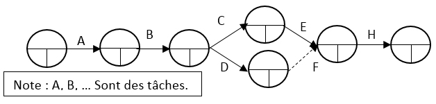

# P.E.R.T.

[Go back](../index.md#organize-your-project)

P.E.R.T. is properly introduced in the graph theory course,
in the scheduling problem section.
You will learn about the notion of critical paths
and margins which are exploiting the P.E.R.T. diagram.

This is a simplified version of PERT
where the initial node is the project, and we use a
``------`` to represent a task that will take a lot
longer than the other one.

To summarize, this will helps us because we will be
able to visually see which tasks we can delay, 
and which ones we cannot.

