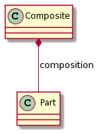

# Compositions

[Go back](../index.md)

A composition is even stronger than an aggregation. The composite is a class that will create, manage, and destroy the subclasses.

The subclasses can't exist if the composite class got destroyed.

