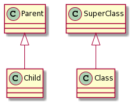

# Generalization

[Go back](../index.md)

Generalization also called ``Generalisation`` or
``Specialisation`` is a UML name for the inheritance
concept.

When a class "B" is generalizing a class "A", then the
class B will have

* the public attributes / operations declared in A
* the protected attributes / operations declared in A
* attributes / operations declared in B

**IT IS NOT RECOMMENDED** for a class to generalize
more than one class so don't do it (C can generalize
A but B can't generalize both A and C).

**Note**: "Class" is inheriting the properties
inside the "SuperClass". We can also say that
"Class" is generalizing "SuperClass".